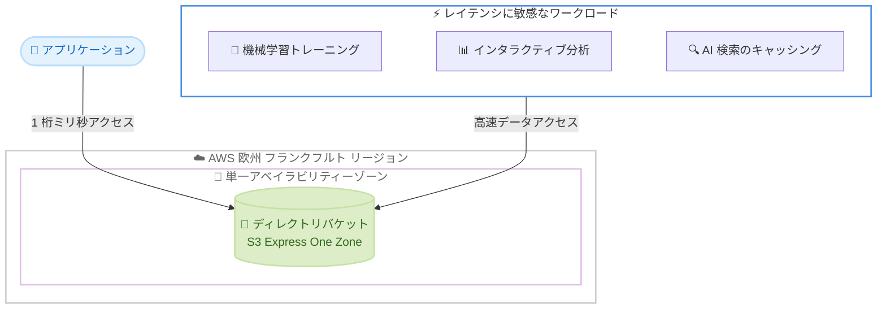

# Amazon S3 - S3 Express One Zone が欧州 (フランクフルト) リージョンで利用可能に

**リリース日**: 2026 年 7 月 7 日
**サービス**: Amazon S3
**機能**: S3 Express One Zone ストレージクラス

📊 [このアップデートのインフォグラフィックを見る](https://takech9203.github.io/aws-news-summary/20260707-s3-express-one-zone-europe-frankfurt.html)

## 概要

Amazon S3 Express One Zone ストレージクラスが、AWS 欧州 (フランクフルト) リージョンで利用可能になりました。S3 Express One Zone は、単一のアベイラビリティーゾーン (AZ) に特化した高性能ストレージクラスであり、最も頻繁にアクセスされるデータやレイテンシに敏感なアプリケーションに対して、一貫した 1 桁ミリ秒のデータアクセスを実現するように設計されています。

S3 Express One Zone は、S3 Standard と比較してデータアクセス速度が最大 10 倍高速で、リクエストコストが最大 80% 低くなります。これにより、機械学習トレーニング、インタラクティブ分析、AI 検索エンジンにおけるキーバリューキャッシングといったワークロードで、高い耐久性と可用性を維持しながら高速なデータアクセスを実現できます。

今回のフランクフルトリージョンへの拡大により、S3 Express One Zone は合計 8 つの AWS リージョンで利用可能になりました。欧州でデータレジデンシー要件を持つお客様が、低レイテンシかつ低コストのストレージを利用できる選択肢が広がります。

**アップデート前の課題**

- 欧州 (フランクフルト) リージョンでは S3 Express One Zone が利用できず、レイテンシに敏感なワークロードを S3 Standard で運用する必要があった
- ドイツ国内でのデータレジデンシー要件を満たしながら、1 桁ミリ秒のアクセスを実現する低コストなストレージ選択肢が限られていた
- 高頻度アクセスのワークロードにおいて、S3 Standard のリクエストコストが運用コストの増加要因となっていた

**アップデート後の改善**

- 欧州 (フランクフルト) リージョンで S3 Express One Zone のディレクトリバケットを作成し、1 桁ミリ秒の一貫したデータアクセスを利用できるようになった
- フランクフルトリージョン内でデータレジデンシー要件を満たしつつ、S3 Standard と比較してリクエストコストを最大 80% 削減できるようになった
- 機械学習トレーニングやインタラクティブ分析などのワークロードを、より低レイテンシかつ低コストで実行できるようになった

## アーキテクチャ図



S3 Express One Zone は単一の AZ 内にデータを保存することで、コンピュートリソースとの近接性を高め、一貫した低レイテンシアクセスを実現します。

## サービスアップデートの詳細

### 主要機能

1. **単一 AZ の高性能ストレージクラス**
   - データを単一のアベイラビリティーゾーンに保存し、コンピュートリソースとの物理的な近接性を確保
   - 一貫した 1 桁ミリ秒のデータアクセスレイテンシを提供
   - ディレクトリバケットという専用のバケットタイプを使用

2. **高速かつ低コストなアクセス**
   - S3 Standard と比較してデータアクセス速度が最大 10 倍高速
   - S3 Standard と比較してリクエストコストが最大 80% 低い
   - 高頻度アクセスのワークロードにおいてコスト効率が高い

3. **フランクフルトリージョンでの提供開始**
   - 欧州 (フランクフルト) リージョンで利用可能に
   - 今回の拡大により合計 8 つの AWS リージョンで利用可能
   - 欧州でのデータレジデンシー要件に対応

## 技術仕様

### S3 Express One Zone の特徴

| 項目 | 詳細 |
|------|------|
| ストレージクラス名 | S3 Express One Zone |
| バケットタイプ | ディレクトリバケット |
| 冗長性 | 単一アベイラビリティーゾーン |
| アクセスレイテンシ | 一貫した 1 桁ミリ秒 |
| データアクセス速度 | S3 Standard 比で最大 10 倍高速 |
| リクエストコスト | S3 Standard 比で最大 80% 低い |
| 対象ワークロード | 機械学習トレーニング、インタラクティブ分析、キーバリューキャッシング |

## 設定方法

### 前提条件

1. 欧州 (フランクフルト) リージョン (eu-central-1) で操作を行う AWS アカウント
2. S3 のバケット作成およびオブジェクト操作に必要な IAM 権限
3. AWS CLI または AWS SDK の設定

### 手順

#### ステップ1: ディレクトリバケットの作成

```bash
aws s3api create-bucket \
    --bucket my-bucket-base-name--eu-central-1-az1--x-s3 \
    --region eu-central-1 \
    --create-bucket-configuration \
    'Location={Type=AvailabilityZone,Name=eucentral1-az1},Bucket={DataRedundancy=SingleAvailabilityZone,Type=Directory}'
```

S3 Express One Zone のディレクトリバケットを作成します。バケット名は `base-name--azid--x-s3` の形式に従う必要があり、`Location` で対象の AZ を、`Bucket` でディレクトリバケットタイプと単一 AZ の冗長性を指定します。

#### ステップ2: オブジェクトのアップロード

```bash
aws s3api put-object \
    --bucket my-bucket-base-name--eu-central-1-az1--x-s3 \
    --key my-object \
    --body ./local-file
```

作成したディレクトリバケットにオブジェクトをアップロードします。以降のアクセスでは一貫した 1 桁ミリ秒のレイテンシでオブジェクトを取得できます。

## メリット

### ビジネス面

- **コスト削減**: S3 Standard と比較してリクエストコストを最大 80% 削減でき、高頻度アクセスのワークロードで運用コストを抑制できる
- **データレジデンシー対応**: フランクフルトリージョン内でデータを保持しながら高性能ストレージを利用できる
- **パフォーマンス向上によるビジネス価値**: 低レイテンシによりインタラクティブなユーザー体験や高速な分析処理を実現

### 技術面

- **一貫した低レイテンシ**: 1 桁ミリ秒の一貫したアクセスにより、レイテンシに敏感なアプリケーションのパフォーマンスを最大化
- **高速データアクセス**: S3 Standard 比で最大 10 倍高速なデータアクセス
- **コンピュートとの近接性**: 単一 AZ 内での配置によりコンピュートリソースとの近接性を高め、スループットを向上

## デメリット・制約事項

### 制限事項

- データは単一のアベイラビリティーゾーンに保存されるため、複数 AZ にまたがる S3 Standard と比較して AZ 障害時の可用性設計に注意が必要
- ディレクトリバケットという専用バケットタイプを使用するため、汎用バケットとは異なる命名規則や API の考慮が必要
- ストレージ料金は S3 Standard より高く設定されているため、アクセス頻度が低いデータには適さない

### 考慮すべき点

- 単一 AZ 構成のため、重要なデータについては別リージョンや別ストレージクラスへのバックアップ戦略を検討する
- コスト最適化の観点では、アクセス頻度が高くレイテンシが重要なデータに限定して利用する
- 対象ワークロードの特性 (高頻度アクセス、低レイテンシ要求) を評価してから採用を判断する

## ユースケース

### ユースケース1: 機械学習トレーニングの高速化

**シナリオ**: フランクフルトリージョンで大規模なデータセットを用いた機械学習トレーニングを実行しており、トレーニングジョブがストレージ I/O によって律速されている。

**効果**: S3 Express One Zone にトレーニングデータを配置することで、1 桁ミリ秒の高速アクセスによりデータローディングのボトルネックを解消し、トレーニング時間を短縮できます。

### ユースケース2: インタラクティブ分析

**シナリオ**: データアナリストが欧州のデータに対してインタラクティブなクエリを実行しており、レスポンスの遅延が分析効率に影響している。

**効果**: 頻繁にアクセスされるデータを S3 Express One Zone に配置することで、クエリのレイテンシを低減し、インタラクティブな分析体験を向上させます。

### ユースケース3: AI 検索エンジンのキーバリューキャッシング

**シナリオ**: AI 検索エンジンで低レイテンシのキーバリューキャッシングが必要であり、リクエスト数が多いためコストが課題となっている。

**効果**: S3 Express One Zone を利用することで、低レイテンシアクセスとリクエストコストの最大 80% 削減を両立し、大量リクエストを効率的に処理できます。

## 料金

S3 Express One Zone は、ストレージ料金、リクエスト料金、データ転送料金で構成されます。リクエストコストは S3 Standard と比較して最大 80% 低くなりますが、ストレージ料金は S3 Standard より高く設定されています。詳細な料金は、リージョンごとに異なるため公式の料金ページを参照してください。

## 利用可能リージョン

今回の拡大により、S3 Express One Zone は欧州 (フランクフルト) リージョンを含む合計 8 つの AWS リージョンで利用可能になりました。最新の対応リージョン一覧は、公式ドキュメントの S3 Express エンドポイント一覧を参照してください。

## 関連サービス・機能

- **Amazon S3 Standard**: 複数 AZ にまたがる汎用ストレージクラス。可用性を重視する用途で併用
- **Amazon SageMaker**: 機械学習トレーニングにおいて S3 Express One Zone を高速データソースとして活用可能
- **Amazon Athena / EMR**: インタラクティブ分析やビッグデータ処理で低レイテンシのデータアクセスを実現

## 参考リンク

- 📊 [インフォグラフィック](https://takech9203.github.io/aws-news-summary/20260707-s3-express-one-zone-europe-frankfurt.html)
- [公式発表 (What's New)](https://aws.amazon.com/about-aws/whats-new/2026/07/s3-express-one-zone-europe-frankfurt/)
- [S3 Express One Zone 製品ページ](https://aws.amazon.com/s3/storage-classes/express-one-zone/)
- [ディレクトリバケットのドキュメント](https://docs.aws.amazon.com/AmazonS3/latest/userguide/directory-buckets-overview.html)
- [S3 Express エンドポイントとリージョン](https://docs.aws.amazon.com/AmazonS3/latest/userguide/s3-express-Endpoints.html)
- [Amazon S3 料金ページ](https://aws.amazon.com/s3/pricing/)

## まとめ

S3 Express One Zone の欧州 (フランクフルト) リージョンへの拡大により、ドイツ国内でのデータレジデンシー要件を持つお客様も、1 桁ミリ秒の一貫したアクセスと最大 80% 低いリクエストコストを享受できるようになりました。機械学習トレーニングやインタラクティブ分析など、高頻度アクセスかつレイテンシに敏感なワークロードを運用している場合は、対象データを S3 Express One Zone へ移行することでパフォーマンスとコストの両面での改善を検討する価値があります。
