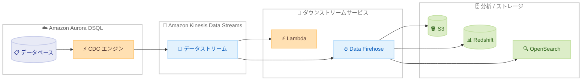

# Amazon Aurora DSQL - Change Data Capture (CDC) 一般提供開始

**リリース日**: 2026年7月8日
**サービス**: Amazon Aurora DSQL
**機能**: Change Data Capture (CDC) ストリーミング

📊 [このアップデートのインフォグラフィックを見る](https://takech9203.github.io/aws-news-summary/20260708-amazon-aurora-dsql-cdc-ga.html)

## 概要

Amazon Aurora DSQL の Change Data Capture (CDC) が一般提供 (GA) を開始した。この機能により、データベースのリアルタイム変更を Amazon Kinesis Data Streams にストリーミングし、イベント駆動型アーキテクチャやデータ統合ワークフローを構築できる。2026 年 5 月のプレビュー提供を経て、今回本番ワークロードで利用可能となった。

Aurora DSQL CDC は、INSERT、UPDATE、DELETE 操作の結果を変更イベントとして自動的にキャプチャし、管理するインフラストラクチャなしで Kinesis Data Streams に配信する。キャプチャした変更は、マイクロサービス間のデータ同期、AWS Lambda 関数のトリガー、または Amazon Data Firehose 経由での Amazon S3、Amazon Redshift、Amazon OpenSearch Service への配信に利用できる。CDC ストリーミングはデータベースのワークロードパフォーマンスに影響を与えないよう設計されている。

Aurora DSQL は分散型 SQL データベースであり、マルチリージョンでの強整合性を提供するサーバーレスデータベースサービスである。今回の GA により、リアルタイム分析パイプラインの実装やシステム間のデータ同期を、本番環境で安心して構築できるようになった。

**アップデート前の課題**

- プレビュー段階のため、本番ワークロードでの CDC 利用が推奨されていなかった
- Aurora DSQL からリアルタイムにデータ変更をキャプチャするには、カスタムストリーミングパイプラインの構築が必要だった
- マイクロサービス間のデータ同期やイベント駆動処理に独自の仕組みを実装する必要があった

**アップデート後の改善**

- CDC が GA となり、本番ワークロードで利用可能になった
- INSERT、UPDATE、DELETE 操作が自動的に変更イベントとしてキャプチャされ、Kinesis Data Streams へ直接ストリーミングされる
- 管理するインフラストラクチャがなく、フルマネージドでイベント駆動アーキテクチャを実現できる
- データベースワークロードへの影響がゼロ設計で、スループットやレイテンシに影響を与えずにストリーミングできる

## アーキテクチャ図



Aurora DSQL の CDC エンジンがデータベースの変更を自動キャプチャし、Kinesis Data Streams を経由して各ダウンストリームサービスにリアルタイムで配信するアーキテクチャを示す。

## サービスアップデートの詳細

### 主要機能

1. **リアルタイム変更キャプチャ**
   - INSERT、UPDATE、DELETE 操作を自動的に変更イベントとしてキャプチャ
   - Kinesis Data Streams に配信
   - データベースワークロードのパフォーマンスへの影響ゼロ設計

2. **フルマネージドストリーミング**
   - 管理するインフラストラクチャなし
   - カスタムストリーミングパイプラインの構築・保守が不要
   - ストリームのライフサイクル管理用 API を提供

3. **柔軟なダウンストリーム連携**
   - AWS Lambda によるイベント駆動処理
   - Amazon Data Firehose 経由で S3、Redshift、OpenSearch に配信
   - マイクロサービス間のデータ同期に活用可能

## 技術仕様

### API 操作

| API メソッド | 説明 |
|------|------|
| `CreateStream` | CDC ストリームを作成し、Kinesis Data Streams への配信を設定 |
| `GetStream` | ストリームの詳細情報を取得 |
| `ListStreams` | クラスターに関連付けられたストリーム一覧を取得 |
| `DeleteStream` | CDC ストリームを削除 |

### ストリーム設定パラメータ

| 項目 | 詳細 |
|------|------|
| ターゲット | Amazon Kinesis Data Streams |
| データ形式 | JSON |
| 順序保証 | UNORDERED |
| ステータス | CREATING / ACTIVE / DELETING / DELETED / FAILED / IMPAIRED |

### CreateStream リクエスト例

```python
client.create_stream(
    clusterIdentifier='my-dsql-cluster',
    targetDefinition={
        'kinesis': {
            'streamArn': 'arn:aws:kinesis:us-east-1:123456789012:stream/my-cdc-stream',
            'roleArn': 'arn:aws:iam::123456789012:role/dsql-cdc-kinesis-role'
        }
    },
    ordering='UNORDERED',
    format='JSON',
    tags={
        'Environment': 'Production'
    }
)
```

### エラーハンドリング

GetStream API のレスポンスには `statusReason` フィールドがあり、以下のエラータイプが定義されている。

| エラータイプ | 説明 |
|------|------|
| `KINESIS_THROUGHPUT_EXCEEDED` | Kinesis ストリームのスループット超過 |
| `KINESIS_STREAM_NOT_FOUND` | 指定された Kinesis ストリームが見つからない |
| `ROLE_ACCESS_DENIED` | IAM ロールのアクセス権限不足 |
| `KINESIS_ACCESS_DENIED` | Kinesis へのアクセス権限不足 |
| `KINESIS_KMS_ACCESS_DENIED` | Kinesis KMS キーへのアクセス権限不足 |
| `KINESIS_OVERSIZE_RECORD` | レコードサイズが Kinesis の上限を超過 |
| `CLUSTER_CMK_INACCESSIBLE` | クラスターの CMK にアクセスできない |
| `INTERNAL_ERROR` | 内部エラー |

## 設定方法

### 前提条件

1. Amazon Aurora DSQL クラスターが作成済みであること
2. Amazon Kinesis Data Streams のストリームが作成済みであること
3. DSQL から Kinesis へのアクセスを許可する IAM ロールが設定されていること

### 手順

#### ステップ 1: Kinesis Data Streams の作成

```bash
aws kinesis create-stream \
    --stream-name my-dsql-cdc-stream \
    --shard-count 2
```

CDC データを受信するための Kinesis Data Streams を作成する。シャード数はデータ変更量に応じて調整する。

#### ステップ 2: IAM ロールの作成

```json
{
    "Version": "2012-10-17",
    "Statement": [
        {
            "Effect": "Allow",
            "Action": [
                "kinesis:PutRecord",
                "kinesis:PutRecords",
                "kinesis:DescribeStream"
            ],
            "Resource": "arn:aws:kinesis:us-east-1:123456789012:stream/my-dsql-cdc-stream"
        }
    ]
}
```

Aurora DSQL が Kinesis Data Streams にレコードを書き込むために必要な権限を持つ IAM ロールを作成する。信頼ポリシーで DSQL サービスからの AssumeRole を許可する必要がある。

#### ステップ 3: CDC ストリームの作成

```bash
aws dsql create-stream \
    --cluster-identifier my-dsql-cluster \
    --target-definition '{
        "kinesis": {
            "streamArn": "arn:aws:kinesis:us-east-1:123456789012:stream/my-dsql-cdc-stream",
            "roleArn": "arn:aws:iam::123456789012:role/dsql-cdc-kinesis-role"
        }
    }' \
    --ordering UNORDERED \
    --format JSON
```

Aurora DSQL クラスターに対して CDC ストリームを作成する。ターゲットとして Kinesis Data Streams の ARN と配信に使用する IAM ロールの ARN を指定する。

#### ステップ 4: ストリームのステータス確認

```bash
aws dsql get-stream \
    --cluster-identifier my-dsql-cluster \
    --stream-identifier <stream-id>
```

ストリームのステータスが `ACTIVE` になったことを確認する。`FAILED` や `IMPAIRED` の場合は `statusReason` を確認して対処する。

## メリット

### ビジネス面

- **本番利用の解禁**: GA により本番ワークロードでの CDC 利用が可能になり、リアルタイムデータ連携を安心して展開できる
- **開発コスト削減**: カスタムストリーミングパイプラインの構築・保守が不要になり、開発リソースをビジネスロジックに集中できる
- **運用負荷軽減**: フルマネージド機能としてインフラ管理が不要で、運用チームの負担を削減

### 技術面

- **ゼロインパクト設計**: CDC ストリーミングがデータベースのスループットやレイテンシに影響を与えない
- **イベント駆動アーキテクチャの実現**: INSERT / UPDATE / DELETE イベントをトリガーとした非同期処理パターンを容易に実装可能
- **エコシステム連携**: Kinesis を中心としたストリーミング処理エコシステム全体と統合可能

## デメリット・制約事項

### 制限事項

- 順序保証は `UNORDERED` のみ対応で、厳密な順序が必要なユースケースでは追加の考慮が必要
- データ形式は JSON のみ対応
- Kinesis Data Streams のレコードサイズ上限 (1 MB) を超えるレコードはエラーとなる

### 考慮すべき点

- CDC ストリーミングの課金と Kinesis Data Streams の課金が別途発生するため、コスト見積もりに注意が必要
- Kinesis のスループット超過時にはストリームが `IMPAIRED` 状態になるため、適切なシャード数の設計が重要
- IAM ロールの権限設定が正しくない場合、ストリームが `FAILED` 状態になるため事前の検証が必要

## ユースケース

### ユースケース 1: マイクロサービス間のデータ同期

**シナリオ**: 注文管理システムで、注文テーブルの変更をリアルタイムに在庫管理サービスや通知サービスに同期する必要がある。

**実装例**:
```python
# Lambda 関数で Kinesis イベントを処理
import json

def handler(event, context):
    for record in event['Records']:
        payload = json.loads(record['kinesis']['data'])
        operation = payload['operation']  # INSERT, UPDATE, DELETE
        table_name = payload['table']

        if table_name == 'orders' and operation == 'INSERT':
            # 在庫管理サービスに通知
            notify_inventory_service(payload['new_values'])
        elif table_name == 'orders' and operation == 'UPDATE':
            # ステータス変更を通知サービスに送信
            notify_status_change(payload['old_values'], payload['new_values'])
```

**効果**: カスタムポーリング処理を排除し、ミリ秒単位のデータ同期を実現。サービス間の結合度を下げつつ、データ整合性を維持できる。

### ユースケース 2: リアルタイム分析パイプライン

**シナリオ**: EC サイトのトランザクションデータをリアルタイムで分析基盤に取り込み、ダッシュボードで即時可視化したい。

**実装例**:
```bash
# Data Firehose で Redshift に配信する設定
aws firehose create-delivery-stream \
    --delivery-stream-name dsql-to-redshift \
    --redshift-destination-configuration '{
        "RoleARN": "arn:aws:iam::123456789012:role/firehose-redshift-role",
        "ClusterJDBCURL": "jdbc:redshift://...",
        "CopyCommand": {
            "DataTableName": "cdc_events",
            "CopyOptions": "json '\''auto'\''"
        },
        "S3Configuration": {
            "RoleARN": "arn:aws:iam::123456789012:role/firehose-s3-role",
            "BucketARN": "arn:aws:s3:::my-cdc-backup"
        }
    }'
```

**効果**: バッチ ETL では数時間かかっていたデータ取り込みが準リアルタイムになり、ビジネスの意思決定速度が向上する。

### ユースケース 3: 監査ログと変更追跡

**シナリオ**: 規制要件に基づき、データベースのすべての変更操作を S3 に永続化し、監査証跡として保持する。

**実装例**:
```bash
# Data Firehose で S3 に配信（パーティション付き）
aws firehose create-delivery-stream \
    --delivery-stream-name dsql-audit-log \
    --extended-s3-destination-configuration '{
        "RoleARN": "arn:aws:iam::123456789012:role/firehose-s3-role",
        "BucketARN": "arn:aws:s3:::audit-logs-bucket",
        "Prefix": "dsql-cdc/year=!{timestamp:yyyy}/month=!{timestamp:MM}/day=!{timestamp:dd}/",
        "BufferingHints": {
            "SizeInMBs": 64,
            "IntervalInSeconds": 300
        }
    }'
```

**効果**: データベースワークロードに影響を与えることなく、すべての変更操作を自動的に永続化。コンプライアンス要件を満たしながら、後からの調査や分析も容易になる。

## 料金

CDC ストリーミングでキャプチャされたデータ量に応じた課金に加え、配信先の Kinesis Data Streams および利用する場合の Amazon Data Firehose の料金が別途発生する。

### 料金構成

| 項目 | 課金方式 |
|------|----------|
| CDC ストリーミング | キャプチャされたデータ量に応じた従量課金 |
| Kinesis Data Streams | 標準の Kinesis 料金 (シャード時間 + PUT ペイロードユニット) |
| Data Firehose (利用時) | 標準の Data Firehose 料金 |

**注意**: Aurora DSQL は AWS 無料利用枠でも開始できる。最新かつ正確な料金は公式料金ページを確認すること。

## 利用可能リージョン

Aurora DSQL が利用可能なすべての AWS リージョンで CDC ストリーミングが利用可能。

## 関連サービス・機能

- **Amazon Kinesis Data Streams**: CDC イベントの受信先として使用。リアルタイムデータストリーミング基盤
- **Amazon Data Firehose**: Kinesis からの配信先として S3、Redshift、OpenSearch への変換・配信を担当
- **AWS Lambda**: CDC イベントをトリガーとしたサーバーレス処理の実行基盤
- **Amazon Aurora DSQL**: 分散型サーバーレス SQL データベース。マルチリージョン強整合性を提供
- **Amazon DynamoDB Streams**: DynamoDB における同様の CDC 機能。テーブルの変更をストリーミング

## 参考リンク

- 📊 [インフォグラフィック](https://takech9203.github.io/aws-news-summary/20260708-amazon-aurora-dsql-cdc-ga.html)
- [公式発表 (What's New)](https://aws.amazon.com/about-aws/whats-new/2026/07/amazon-aurora-dsql-cdc-ga/)
- [Aurora DSQL ドキュメント](https://docs.aws.amazon.com/aurora-dsql/latest/userguide/)
- [Amazon Aurora DSQL 料金](https://aws.amazon.com/rds/aurora/dsql/pricing/)
- [Amazon Kinesis Data Streams 料金](https://aws.amazon.com/kinesis/data-streams/pricing/)
- [CDC プレビュー時のレポート](https://aws.amazon.com/about-aws/whats-new/2026/05/amazon-aurora-dsql-change-data-capture-preview/)

## まとめ

Amazon Aurora DSQL の CDC が GA となり、分散型データベースからのリアルタイム変更ストリーミングを本番ワークロードでフルマネージドに実現できるようになった。インフラ管理不要かつデータベースへの影響ゼロという設計は、イベント駆動アーキテクチャやリアルタイム分析パイプラインの採用を加速させる。マイクロサービス間のデータ同期やデータ統合ワークフローを検討している場合、本番環境への導入を積極的に検討することを推奨する。
