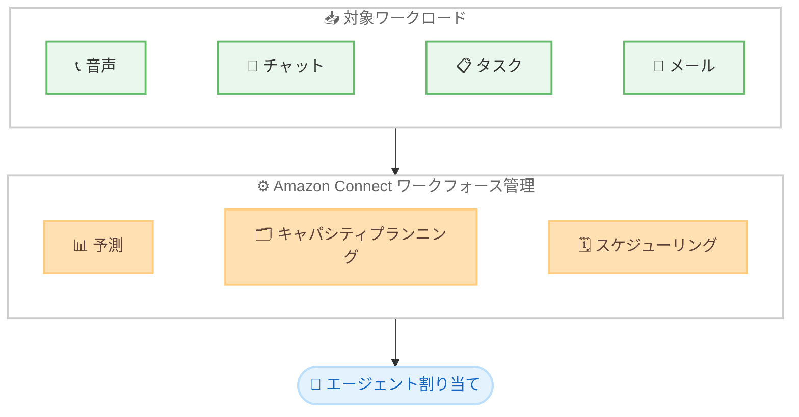

# Amazon Connect - タスクとメール向けの予測、計画、スケジューリング

**リリース日**: 2026 年 7 月 8 日
**サービス**: Amazon Connect (Connect Customer)
**機能**: タスクとメールの予測、キャパシティプランニング、スケジューリング

📊 [このアップデートのインフォグラフィックを見る](https://takech9203.github.io/aws-news-summary/20260708-amazon-connect-customer-agent-scheduling-tasks.html)
<!-- INFOGRAPHIC_BASE_URL は環境変数から取得 -->

## 概要

Amazon Connect Customer が、タスクとメールに対する予測 (forecasting)、キャパシティプランニング (capacity planning)、スケジューリング (scheduling) をサポートしました。これにより、音声、チャット、タスク、メールというすべてのワークロードにわたってワークフォースを計画し、最適化できるようになりました。

Connect Customer は各チャネルの固有の特性を考慮します。具体的には、同時作業の処理 (concurrent work handling)、数分から数か月に及ぶ作業時間、そしてチャネルごとに異なるサービスレベル要件などです。たとえば、エージェントが音声通話と並行してメールの問い合わせやケース処理などのタスクを処理する場合、これらすべてのワークロードを考慮した統合的な予測を生成し、複数チャネル間でエージェントを効率的に割り当てるスケジュールを作成できます。

この機能により、単一のソリューション内でエンドツーエンドのワークフォース最適化を実現しながら、一貫したサービスレベルを維持できます。対象ユーザーは、複数チャネルを運用するコンタクトセンターの管理者やワークフォースプランナーです。

**アップデート前の課題**

- 予測、キャパシティプランニング、スケジューリングは音声とチャットが中心で、タスクとメールを含めた統合的な計画ができなかった
- タスクやメールは作業時間が数分から数か月と幅広く、同時処理やサービスレベル要件も異なるため、音声と同じ枠組みでは正確に計画できなかった
- チャネルごとに個別に人員計画を行う必要があり、エージェントを横断的に効率配置することが難しかった

**アップデート後の改善**

- 音声、チャット、タスク、メールの 4 つのワークロードすべてを対象とした統合的な予測を生成できるようになった
- 各チャネルの同時作業処理、作業時間、サービスレベル要件の違いを考慮したキャパシティプランニングが可能になった
- 複数チャネルにわたってエージェントを効率的に割り当てるスケジュールを、単一のソリューションで作成できるようになった

## アーキテクチャ図

4 つのワークロードを 1 つのワークフォース管理プロセスに取り込み、統合的な予測から横断的なエージェント割り当てまでを実現します。

## サービスアップデートの詳細

### 主要機能

1. **統合予測 (Forecasting)**
   - 音声、チャット、タスク、メールを含む全ワークロードを対象とした統合的な需要予測を生成
   - 各チャネルの作業量特性を踏まえた予測により、必要な人員規模を把握

2. **キャパシティプランニング (Capacity Planning)**
   - 同時作業の処理、数分から数か月に及ぶ作業時間、チャネルごとに異なるサービスレベル要件を考慮
   - チャネル横断で必要なキャパシティを計画

3. **スケジューリング (Scheduling)**
   - 複数チャネルにわたってエージェントを効率的に割り当てるスケジュールを作成
   - 一貫したサービスレベルを維持しながらワークフォースを最適化

## 技術仕様

### チャネルごとの特性

| 項目 | 詳細 |
|------|------|
| 対象ワークロード | 音声、チャット、タスク、メール |
| 同時作業処理 | チャネルごとに異なる同時処理特性を考慮 |
| 作業時間 | 数分から数か月に及ぶ幅広い作業時間に対応 |
| サービスレベル要件 | チャネルごとに異なるサービスレベル要件を反映 |

## 設定方法

### 前提条件

1. Amazon Connect インスタンスを利用していること
2. Amazon Connect Customer のエージェントスケジューリングが利用可能なリージョンであること
3. 予測、キャパシティプランニング、スケジューリングの利用に必要な権限が付与されていること

### 手順

タスクとメールを含む予測、キャパシティプランニング、スケジューリングは、Amazon Connect の管理者ガイドに記載された手順に沿って設定します。詳細な操作手順は公式ドキュメントを参照してください。

## メリット

### ビジネス面

- **一貫したサービスレベルの維持**: チャネル横断で計画することで、各チャネルのサービスレベルを一貫して維持できる
- **運用効率の向上**: 単一のソリューションでエンドツーエンドのワークフォース最適化を実現できる
- **計画精度の向上**: 全ワークロードを考慮した統合予測により、人員計画の精度が高まる

### 技術面

- **チャネル特性の反映**: 同時作業処理、作業時間、サービスレベル要件の違いを考慮した計画が可能
- **横断的なリソース配置**: 音声とタスク、メールを組み合わせて担当するエージェントを効率的に割り当てられる
- **統合管理**: 複数チャネルの計画を個別に行う必要がなく、統合的に管理できる

## デメリット・制約事項

### 制限事項

- Amazon Connect Customer のエージェントスケジューリングが利用可能なリージョンでのみ提供される

### 考慮すべき点

- タスクやメールは作業時間が数分から数か月と幅広いため、予測やスケジュールの前提となる作業特性を正しく設定することが重要
- 既存の音声・チャット中心の運用からタスク・メールを含む統合運用へ移行する際は、サービスレベル要件の再定義が必要になる場合がある

## ユースケース

### ユースケース1: 音声とメールを兼任するエージェントの計画

**シナリオ**: エージェントが音声通話に対応しつつ、メールの問い合わせにも対応するコンタクトセンター

**効果**: 音声とメールの両方を考慮した統合予測とスケジュールにより、繁閑に合わせてエージェントを効率的に配置できる

### ユースケース2: ケース処理タスクを含むバックオフィス業務の計画

**シナリオ**: 音声対応と並行して、数時間から数日かかるケース処理タスクを担当する業務

**効果**: 長期にわたる作業時間を考慮したキャパシティプランニングにより、タスクの滞留を防ぎながら人員を配置できる

### ユースケース3: オムニチャネル運用の統合最適化

**シナリオ**: 音声、チャット、タスク、メールをすべて運用するオムニチャネルのコンタクトセンター

**効果**: 全チャネルを 1 つのソリューションで計画することで、チャネル間のばらつきを抑え、一貫したサービスレベルを維持できる

## 料金

料金については Amazon Connect の料金ページを参照してください。

## 利用可能リージョン

この機能は、Amazon Connect Customer のエージェントスケジューリングが利用可能なすべての AWS リージョンで提供されます。

## 関連サービス・機能

- **Amazon Connect**: クラウドベースのコンタクトセンターサービス。本機能はそのワークフォース管理機能の拡張
- **Amazon Connect Tasks**: エージェントが処理するタスクを管理する機能。本アップデートの予測・スケジューリング対象
- **Amazon Connect の予測、キャパシティプランニング、スケジューリング**: 従来の音声・チャット向け機能をタスク・メールに拡張

## 参考リンク

- 📊 [インフォグラフィック](https://takech9203.github.io/aws-news-summary/20260708-amazon-connect-customer-agent-scheduling-tasks.html)
- [公式発表 (What's New)](https://aws.amazon.com/about-aws/whats-new/2026/07/amazon-connect-customer-agent-scheduling-tasks/)
- [Amazon Connect 管理者ガイド (予測、キャパシティプランニング、スケジューリング)](https://docs.aws.amazon.com/connect/latest/adminguide/forecasting-capacity-planning-scheduling.html)
- [Amazon Connect 料金ページ](https://aws.amazon.com/connect/pricing/)

## まとめ

今回のアップデートにより、Amazon Connect Customer は音声とチャットに加えてタスクとメールも予測、キャパシティプランニング、スケジューリングの対象に含め、4 つのワークロードすべてを統合的に計画できるようになりました。複数チャネルを運用するコンタクトセンターでは、単一のソリューションでエージェントを横断的に最適配置し、一貫したサービスレベルを維持できます。対象リージョンで運用中の管理者は、タスクとメールを含めた統合的なワークフォース計画への移行を検討することを推奨します。
</content>
</invoke>
