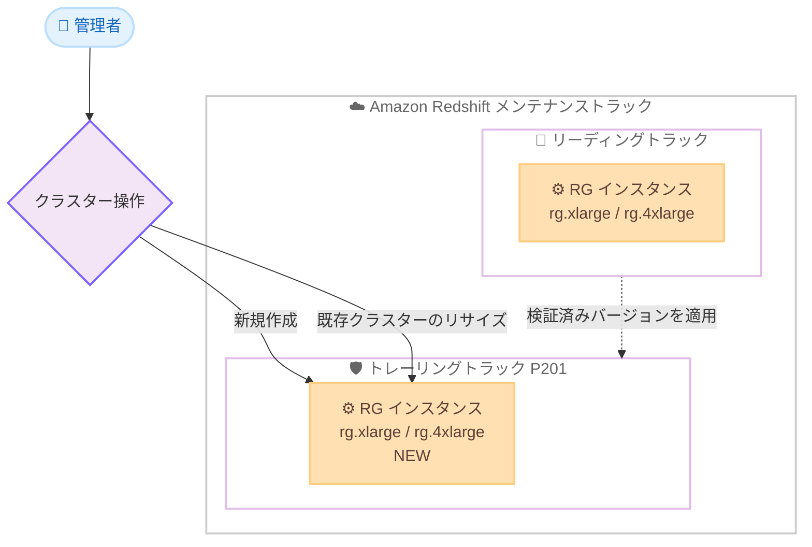

# Amazon Redshift - RG インスタンスのトレーリングトラック対応

**リリース日**: 2026 年 7 月 8 日
**サービス**: Amazon Redshift
**機能**: Graviton ベース RG インスタンスのトレーリングトラック (P201) 提供開始

📊 [このアップデートのインフォグラフィックを見る](https://takech9203.github.io/aws-news-summary/20260708-amazon-redshift-graviton-rg-instances-trailing-track.html)
<!-- INFOGRAPHIC_BASE_URL は環境変数から取得 -->

## 概要

Amazon Redshift は、AWS Graviton ベースの RG インスタンスをトレーリングトラック (trailing track) で利用できるようにしました。2026 年 7 月 7 日より、トレーリングトラック (P201) でワークロードを実行するお客様が rg.4xlarge および rg.xlarge インスタンスタイプを選択できるようになりました。

トレーリングトラックは、本番ワークロードの安定性を重視するお客様向けに設計されたメンテナンストラックです。リーディングトラック (leading track) で先行して検証済みのバージョンが適用されるため、新しいクラスターバージョンの成熟を待ってから採用したいお客様に適しています。今回のアップデートにより、RG インスタンスはリーディングトラックとトレーリングトラックの両方で利用可能となりました。

RG インスタンスは AWS Graviton によるパフォーマンスを活用でき、RA3 インスタンスと比較して最大 2.4 倍高速なクエリパフォーマンスを、vCPU あたり 30% 低い価格で提供します。安定性を優先する本番環境でも、Graviton 世代のコストパフォーマンスの恩恵を受けられるようになります。

**アップデート前の課題**

- RG インスタンスはリーディングトラックでのみ利用可能で、安定性を重視するトレーリングトラックのお客様は選択できなかった
- 本番ワークロードでバージョンの成熟を待ちたいお客様は、Graviton による性能とコストの改善を享受できず、RA3 インスタンスを継続利用する必要があった
- リーディングトラックとトレーリングトラックで選択可能なインスタンスタイプに差異があった

**アップデート後の改善**

- トレーリングトラック (P201) でも rg.4xlarge および rg.xlarge を利用可能になった
- RG インスタンスがリーディングトラックとトレーリングトラックの両方で選択可能になり、トラックによるインスタンス選択の差異が解消された
- 安定性を優先する本番ワークロードでも、RA3 比で最大 2.4 倍のクエリ性能と vCPU あたり 30% のコスト削減を実現できるようになった

## アーキテクチャ図



リーディングトラックで先行検証されたバージョンがトレーリングトラックへ適用され、両トラックで同じ RG インスタンスタイプを選択できることを示しています。

## サービスアップデートの詳細

### 主要機能

1. **トレーリングトラックでの RG インスタンス提供**
   - トレーリングトラック (P201) で rg.4xlarge および rg.xlarge を選択可能
   - 2026 年 7 月 7 日から利用開始
   - リーディングトラックとトレーリングトラックの両方で RG インスタンスが利用可能に

2. **AWS Graviton による性能とコストの両立**
   - RA3 インスタンスと比較して最大 2.4 倍高速なクエリパフォーマンス
   - vCPU あたり 30% 低い価格を実現
   - マネージドストレージにより、コンピューティングとストレージを独立してスケール・課金

3. **柔軟なプロビジョニング方法**
   - 新規クラスターの作成、または既存クラスターのリサイズで導入可能
   - AWS Management Console、AWS CLI、AWS SDK から操作可能

## 技術仕様

### メンテナンストラックとインスタンスタイプ

| 項目 | 詳細 |
|------|------|
| 対応インスタンスタイプ | rg.4xlarge、rg.xlarge |
| トラック | トレーリングトラック (P201)、リーディングトラック |
| 基盤プロセッサ | AWS Graviton |
| ストレージ | Redshift マネージドストレージ (RMS) |
| クエリ性能 | RA3 比で最大 2.4 倍高速 |
| 価格 | RA3 比で vCPU あたり 30% 低価格 |

### メンテナンストラックの考え方

Amazon Redshift はクラスターバージョンを定期的にリリースします。メンテナンストラックは、メンテナンスウィンドウ中にどのクラスターバージョンが適用されるかを決定します。

- **リーディングトラック**: 最新のクラスターバージョンが適用され、新機能や修正を最も早く利用できる
- **トレーリングトラック (P201)**: リーディングトラックで検証済みの一世代前のバージョンが適用され、本番ワークロードの安定性を優先できる

## 設定方法

### 前提条件

1. Amazon Redshift を利用可能な AWS アカウント
2. クラスターの作成・リサイズを行うための IAM 権限
3. トレーリングトラック (P201) の選択、または既存クラスターのトラック設定の確認

### 手順

#### ステップ1: 新規クラスターをトレーリングトラックで作成する

```bash
aws redshift create-cluster \
  --cluster-identifier my-rg-cluster \
  --node-type rg.4xlarge \
  --number-of-nodes 2 \
  --master-username admin \
  --master-user-password <YourSecurePassword> \
  --maintenance-track-name trailing
```

RG インスタンス (rg.4xlarge) を使用し、トレーリングトラックで新しいクラスターを作成します。`--maintenance-track-name` にトレーリングトラックを指定することで、検証済みバージョンが適用されます。

#### ステップ2: 既存クラスターを RG インスタンスへリサイズする

```bash
aws redshift resize-cluster \
  --cluster-identifier my-existing-cluster \
  --node-type rg.4xlarge \
  --number-of-nodes 2 \
  --classic
```

既存クラスターを RG インスタンスタイプへリサイズします。既存の RA3 クラスターから RG へ移行することで、Graviton による性能とコストの改善を得られます。

#### ステップ3: メンテナンストラックを確認する

```bash
aws redshift describe-clusters \
  --cluster-identifier my-rg-cluster \
  --query "Clusters[0].MaintenanceTrackName"
```

対象クラスターに適用されているメンテナンストラックを確認します。P201 (トレーリングトラック) が設定されていることを確認します。

## メリット

### ビジネス面

- **コスト削減**: RA3 インスタンス比で vCPU あたり 30% 低価格となり、データウェアハウスの運用コストを削減できる
- **安定性の確保**: トレーリングトラックにより、検証済みバージョンで本番ワークロードを安定運用できる
- **投資効率の向上**: 同一予算でより高いクエリ性能を得られ、分析基盤の投資対効果が高まる

### 技術面

- **高速なクエリ処理**: RA3 比で最大 2.4 倍のクエリパフォーマンスを実現
- **トラック間の一貫性**: リーディング・トレーリング両トラックで同じ RG インスタンスを利用でき、環境間の構成差異を減らせる
- **柔軟な移行**: 新規作成またはリサイズで RG インスタンスへ移行可能

## デメリット・制約事項

### 制限事項

- 現時点で提供されるトレーリングトラック対応の RG インスタンスタイプは rg.4xlarge と rg.xlarge の 2 種類
- トレーリングトラックは一世代前の検証済みバージョンが適用されるため、最新機能の利用はリーディングトラックより遅れる

### 考慮すべき点

- 既存の RA3 クラスターから RG へ移行する場合は、リサイズ時間やワークロードへの影響を事前に評価する
- リージョンごとの提供状況を AWS Management Console や料金ページで確認する

## ユースケース

### ユースケース1: 安定性重視の本番データウェアハウス

**シナリオ**: 基幹となる BI レポート基盤を運用しており、頻繁なバージョン更新よりも安定性を優先したい。

**効果**: トレーリングトラック (P201) で RG インスタンスを利用することで、検証済みバージョンの安定性を保ちつつ、RA3 比で最大 2.4 倍のクエリ性能とコスト削減を享受できます。

### ユースケース2: RA3 からのコスト最適化移行

**シナリオ**: 既存の RA3 クラスターを運用中で、性能を維持または向上させながらコストを削減したい。

**効果**: 既存クラスターを rg.4xlarge へリサイズすることで、vCPU あたり 30% 低価格の Graviton 世代へ移行し、運用コストを削減できます。

### ユースケース3: 複数環境でのインスタンス構成統一

**シナリオ**: 開発環境をリーディングトラック、本番環境をトレーリングトラックで運用しており、環境間で同じインスタンスタイプを使いたい。

**効果**: 両トラックで RG インスタンスが利用可能になったため、環境間のインスタンス構成を統一でき、移行やテストの一貫性が向上します。

## 料金

RG インスタンスはオンデマンド料金およびリザーブドインスタンスで提供され、コンピューティングとマネージドストレージを独立して課金します。RA3 インスタンス比で vCPU あたり 30% 低い価格が設定されています。

### 料金例

| インスタンスタイプ | オンデマンド料金 (概算) |
|--------|------------------|
| rg.4xlarge | 約 $3.04267 USD / 時間 |
| ra3.4xlarge (参考) | 約 $3.26 USD / 時間 |

※ 料金はリージョンや契約形態により異なります。最新の料金は公式料金ページを確認してください。

## 利用可能リージョン

トレーリングトラック (P201) 対応の RG インスタンスは 2026 年 7 月 7 日より提供が開始されています。提供リージョンの詳細は AWS Management Console および Amazon Redshift 料金ページで確認してください。

## 関連サービス・機能

- **AWS Graviton**: RG インスタンスの基盤となる AWS 設計のプロセッサ。高いコストパフォーマンスを実現
- **Amazon Redshift マネージドストレージ (RMS)**: コンピューティングとストレージを独立してスケール・課金できるストレージ層
- **RA3 インスタンス**: 従来世代のインスタンスタイプ。RG インスタンスは RA3 比で性能とコストが改善

## 参考リンク

- 📊 [インフォグラフィック](https://takech9203.github.io/aws-news-summary/20260708-amazon-redshift-graviton-rg-instances-trailing-track.html)
- [公式発表 (What's New)](https://aws.amazon.com/about-aws/whats-new/2026/07/amazon-redshift-graviton-rg-instances-trailing-track)
- [Amazon Redshift ドキュメント](https://docs.aws.amazon.com/redshift/latest/mgmt/welcome.html)
- [Amazon Redshift 料金ページ](https://aws.amazon.com/redshift/pricing/)

## まとめ

RG インスタンスがトレーリングトラック (P201) でも利用可能になったことで、安定性を重視する本番ワークロードでも Graviton による最大 2.4 倍の性能と vCPU あたり 30% のコスト削減を実現できるようになりました。RA3 クラスターを運用中のお客様は、rg.4xlarge または rg.xlarge へのリサイズによるコスト最適化を検討する価値があります。まずは対象リージョンでの提供状況を確認し、開発環境での検証から移行を進めることを推奨します。
