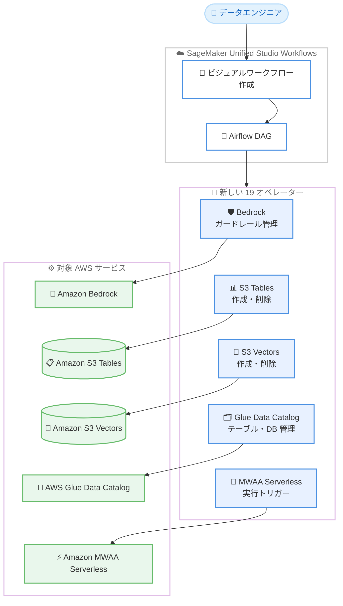

# Amazon SageMaker Unified Studio Workflows - Bedrock、S3 Tables、S3 Vectors、Glue Catalog 向けオペレーターのサポート

**リリース日**: 2026 年 7 月 8 日
**サービス**: Amazon SageMaker Unified Studio
**機能**: Apache Airflow Operators for Bedrock, S3 Tables, S3 Vectors, Glue Data Catalog, MWAA Serverless

📊 [このアップデートのインフォグラフィックを見る](https://takech9203.github.io/aws-news-summary/20260708-apache-airflow-operators-amazon-sagemaker-unified-studio-workflows.html)
<!-- INFOGRAPHIC_BASE_URL は環境変数から取得 -->

## 概要

Amazon SageMaker Unified Studio Workflows が、Amazon Bedrock、Amazon S3 Tables、Amazon S3 Vectors、AWS Glue Data Catalog、Amazon MWAA Serverless の 5 つの AWS サービスを対象とした 19 個の新しいオペレーターをサポートしました。これらのオペレーターを利用することで、ビジュアルワークフロー作成機能から新しいタスクを追加し、カスタムの統合コードを記述することなくこれらのサービスをオーケストレーションできます。

SageMaker Unified Studio Workflows は Apache Airflow を基盤としたワークフローオーケストレーション機能で、Amazon MWAA (Managed Workflows for Apache Airflow) を活用しています。今回追加されたオペレーターにより、データワーカーやビルダーは Bedrock ガードレールの管理、S3 Tables および S3 Vectors リソースのプロビジョニングと削除、Glue Data Catalog のテーブルとデータベースの管理、MWAA Serverless ワークフロー実行のトリガーを、ワークフロー内のタスクとして直接定義できるようになりました。

このアップデートは、SageMaker Unified Studio Workflows からオーケストレーションできる AWS サービスの幅を広げるものです。コンソール間の切り替えやカスタムの DAG (Directed Acyclic Graph) コードの記述が不要になり、生成 AI アプリケーション、データレイク、ベクトル検索を組み合わせたパイプラインを一元的に構築するデータエンジニアや ML 実務者を主な対象としています。

**アップデート前の課題**

- Bedrock ガードレールや S3 Tables、S3 Vectors、Glue Data Catalog を操作するには、コンソール間を切り替えて手動で操作するか、カスタムの DAG コードを記述する必要があった
- ビジュアルワークフロー作成機能でこれらのサービスを直接オーケストレーションする手段がなく、統合コードの保守負担が発生していた
- 複数の MWAA Serverless ワークフローを連携させる場合、ワークフロー実行のトリガーを別途実装する必要があった

**アップデート後の改善**

- 19 個の新しいオペレーターにより、ビジュアルワークフロー作成機能から Bedrock、S3 Tables、S3 Vectors、Glue Data Catalog、MWAA Serverless のタスクを追加できるようになった
- カスタムの統合コードや DAG コードを記述することなく、これらのサービスをオーケストレーションできるようになった
- 別のワークフローを MWAA Serverless オペレーターからトリガーでき、ワークフロー間の連携が容易になった

## アーキテクチャ図

ビジュアルワークフロー作成機能で追加したオペレーターが Airflow DAG のタスクとして実行され、各対象 AWS サービスをオーケストレーションする流れを示しています。

## サービスアップデートの詳細

### 主要機能

1. **Amazon Bedrock オペレーター**
   - Bedrock ガードレールの管理タスクをワークフローに追加できる
   - 生成 AI アプリケーションの安全性制御をパイプラインの一部として自動化できる

2. **Amazon S3 Tables オペレーター**
   - S3 Tables リソースのプロビジョニングと削除をワークフローから実行できる
   - Apache Iceberg 形式のテーブルストレージのライフサイクル管理を自動化できる

3. **Amazon S3 Vectors オペレーター**
   - S3 Vectors リソースのプロビジョニングと削除をワークフローから実行できる
   - ベクトル検索基盤のセットアップとクリーンアップをパイプラインに組み込める

4. **AWS Glue Data Catalog オペレーター**
   - Glue Data Catalog のテーブルとデータベースの管理タスクをワークフローに追加できる
   - データカタログのメタデータ管理をオーケストレーションできる

5. **Amazon MWAA Serverless オペレーター**
   - MWAA Serverless ワークフローの実行をトリガーできる
   - 複数のワークフローを連携させたオーケストレーションを構築できる

## 技術仕様

### 追加されたオペレーターの概要

| 対象サービス | 主な操作 |
|------|------|
| Amazon Bedrock | ガードレールの管理 |
| Amazon S3 Tables | リソースの作成・削除 |
| Amazon S3 Vectors | リソースの作成・削除 |
| AWS Glue Data Catalog | テーブル・データベースの管理 |
| Amazon MWAA Serverless | ワークフロー実行のトリガー |

合計 19 個の新しいオペレーターが追加されています。各サービスへのオペレーター数の内訳は公式発表では明示されていません。

## メリット

### ビジネス面

- **開発生産性の向上**: カスタムの統合コードや DAG コードの記述が不要になり、ビジュアルワークフロー作成機能でパイプラインを迅速に構築できる
- **運用効率の改善**: コンソール間の切り替えが不要になり、複数の AWS サービスを一元的にオーケストレーションできる
- **保守負担の軽減**: マネージドなオペレーターを利用するため、統合コードの保守やバージョン管理の負担が減る

### 技術面

- **サービス連携の拡大**: 生成 AI (Bedrock)、データレイク (S3 Tables、Glue Data Catalog)、ベクトル検索 (S3 Vectors) を組み合わせたパイプラインを構築できる
- **ワークフロー間連携**: MWAA Serverless オペレーターにより、ワークフローから別のワークフローをトリガーできる
- **Apache Airflow の標準機能との統合**: 既存の Airflow ベースのオーケストレーションパターンと組み合わせて利用できる

## デメリット・制約事項

### 制限事項

- 各サービスへのオペレーター数の内訳や、対応する具体的な操作 API の一覧は公式発表では明示されていない
- 利用には Amazon SageMaker Unified Studio が利用可能なリージョンである必要がある

### 考慮すべき点

- 各オペレーターが操作するサービス (Bedrock、S3 Tables、S3 Vectors、Glue、MWAA) の利用料金は別途発生する
- ワークフローの実行ロールに、対象サービスを操作するための適切な IAM 権限を付与する必要がある

## ユースケース

### ユースケース1: 生成 AI パイプラインでのガードレール管理自動化

**シナリオ**: 生成 AI アプリケーションのデータ準備からモデル呼び出しまでを一連のワークフローで管理し、Bedrock ガードレールの設定もパイプラインに組み込みたい。

**効果**: ガードレールの管理をコンソール操作から自動化し、環境ごとの安全性制御を再現可能な形で運用できる。

### ユースケース2: データレイクのライフサイクル管理

**シナリオ**: S3 Tables や Glue Data Catalog を用いたデータレイクで、分析ジョブの前後にテーブルやデータベースをプロビジョニング・削除したい。

**効果**: リソースのライフサイクルをワークフローで一元管理でき、不要なリソースの残存によるコストを抑制できる。

### ユースケース3: ベクトル検索基盤のセットアップ自動化

**シナリオ**: RAG (Retrieval-Augmented Generation) アプリケーション向けに S3 Vectors リソースを準備し、埋め込みデータの投入後にクリーンアップしたい。

**効果**: ベクトル検索基盤のセットアップとクリーンアップをパイプラインに統合し、手作業を削減できる。

## 料金

このアップデート自体による追加料金はありません。SageMaker Unified Studio Workflows および MWAA Serverless の利用料金、ならびに各オペレーターが操作する対象サービス (Amazon Bedrock、Amazon S3 Tables、Amazon S3 Vectors、AWS Glue、Amazon MWAA Serverless) の利用料金が適用されます。詳細は各サービスの料金ページを参照してください。

## 利用可能リージョン

Amazon SageMaker Unified Studio が利用可能なすべての AWS リージョンで利用できます。

## 関連サービス・機能

- **Amazon MWAA Serverless**: SageMaker Unified Studio Workflows の基盤となるサーバーレスの Apache Airflow 実行環境
- **Amazon Bedrock**: 生成 AI モデルとガードレールを提供するフルマネージドサービス
- **Amazon S3 Tables / S3 Vectors**: それぞれ Apache Iceberg 形式のテーブルストレージとベクトル検索を提供する S3 ストレージ
- **AWS Glue Data Catalog**: データレイクのメタデータを一元管理するデータカタログ

## 参考リンク

- 📊 [インフォグラフィック](https://takech9203.github.io/aws-news-summary/20260708-apache-airflow-operators-amazon-sagemaker-unified-studio-workflows.html)
- [公式発表 (What's New)](https://aws.amazon.com/about-aws/whats-new/2026/07/apache-airflow-operators-amazon-sagemaker-unified-studio-workflows/)
- [Amazon SageMaker Unified Studio ドキュメント](https://docs.aws.amazon.com/sagemaker-unified-studio/)

## まとめ

このアップデートにより、SageMaker Unified Studio Workflows から Amazon Bedrock、S3 Tables、S3 Vectors、Glue Data Catalog、MWAA Serverless を 19 個の新しいオペレーターでオーケストレーションできるようになりました。生成 AI、データレイク、ベクトル検索を組み合わせたパイプラインをビジュアルに構築したいデータエンジニアや ML 実務者は、カスタムコードの削減と運用効率の向上を目的に、これらのオペレーターの活用を検討することをおすすめします。
