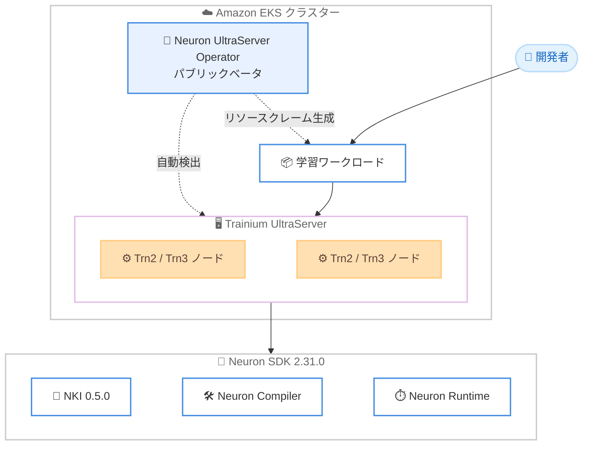

# AWS Neuron - 2.31.0 (NKI 0.5.0 と UltraServer Operator)

**リリース日**: 2026年7月8日
**サービス**: AWS Neuron
**機能**: AWS Neuron SDK 2.31.0

📊 [このアップデートのインフォグラフィックを見る](https://takech9203.github.io/aws-news-summary/20260708-aws-announce-neuron-2-31-0.html)
<!-- INFOGRAPHIC_BASE_URL は環境変数から取得 -->

## 概要

AWS Neuron 2.31.0 が一般提供を開始しました。AWS Neuron は、AWS Trainium および AWS Inferentia ベースの Amazon EC2 インスタンス (Trn1、Trn2、Trn3、Inf1、Inf2) 上で深層学習ワークロードを実行するための SDK です。コンパイラ、ランタイム、プロファイリングツール、そして NKI (Neuron Kernel Interface) などのライブラリ群で構成され、大規模なモデルの学習および推論を高性能かつ低コストで実現します。

今回のリリースでは、NKI 0.5.0 が導入され、MX FP8 スケール dtype のサポート、コンピュート演算に対するテンソルインダイレクション、ゼロコストのテンソルレイアウト変換を可能にする NkiTensor view API が追加されました。さらに、Amazon EKS 上の Trainium UltraServer ワークロードを対象とした Neuron UltraServer Operator がパブリックベータとして提供され、UltraServer の検出、ワークロードの割り当て、リソースクレームの生成を自動化します。

加えて、Neuron コンパイラには Trn2 および Trn3 でデフォルト有効となる再設計されたコード生成バックエンドが搭載され、パフォーマンスが向上しました。Neuron ランタイムには連続共有スクラッチパッドのサポートが追加され、スクラッチパッドのページサイズを手動設定する必要がなくなりました。NKI ライブラリには 14 個の新しい実験的カーネルが追加され、Neuron Explorer にはデバッグを改善する System Trace Viewer のソースコードリンク機能が追加されました。

**アップデート前の課題**

- Amazon EKS 上で Trainium UltraServer ワークロードを実行する際、init コンテナやノードラベルのマッチングを手動で設定する必要があった
- Neuron ランタイムでスクラッチパッドのページサイズを手動で設定する必要があった
- MX FP8 のスケール dtype や、コンピュート演算に対するテンソルインダイレクションが NKI でサポートされていなかった
- テンソルのレイアウト変換にコストが発生し、インデックス付きアクセスパターンで命令数が多くなっていた

**アップデート後の改善**

- UltraServer Operator により、Amazon EKS 上での UltraServer の検出とワークロード割り当てが自動化された
- 連続共有スクラッチパッドのサポートにより、スクラッチパッドのページサイズを手動設定する必要がなくなった
- NKI 0.5.0 で MX FP8 スケール dtype とテンソルインダイレクションがサポートされ、インデックス付きアクセスの命令数が削減された
- NkiTensor view API により、ゼロコストでテンソルレイアウト変換が可能になった
- Trn2 および Trn3 で再設計されたコード生成バックエンドがデフォルト有効となり、パフォーマンスが向上した

## アーキテクチャ図



Neuron UltraServer Operator が Amazon EKS 上で Trainium UltraServer を自動検出し、ワークロードへのリソース割り当てを自動化する流れを示しています。

## サービスアップデートの詳細

### 主要機能

1. **NKI 0.5.0**
   - MX FP8 スケール dtype のサポートを追加
   - コンピュート演算に対するテンソルインダイレクション (gather/scatter) をサポートし、インデックス付きアクセスパターンでの命令数を削減
   - 新しい NkiTensor view API により、ゼロコストのテンソルレイアウト変換が可能
   - `nc_matmul` の出力容量の拡張と、IDE 向けの型スタブサポートを追加

2. **Neuron UltraServer Operator (パブリックベータ)**
   - Amazon EKS 上で Trainium UltraServer ワークロード向けの Kubernetes オペレーター
   - UltraServer の検出、ワークロードの割り当て、リソースクレームの生成を自動化
   - 手動での init コンテナ設定やノードラベルのマッチングが不要

3. **Neuron Compiler (グラフコンパイラ)**
   - 再設計されたコード生成バックエンドが Trn2 および Trn3 でデフォルト有効に
   - 命令スケジューリングとメモリプリフェッチが改善され、パフォーマンスが向上
   - アテンションカーネルを含む StableHLO 複合演算のサポートを追加

4. **Neuron Runtime**
   - 連続共有スクラッチパッドのサポートにより、スクラッチパッドのページサイズの手動設定が不要に
   - テンソルリストのサポートと合体コレクティブ API によりコレクティブ通信を改善
   - 範囲外フォールト発生源のレポート、ダイごとのライブ電力モニタリング、Trn2/Trn3 でのマルチノードリング通信を追加

5. **NKI ライブラリ**
   - MoE 学習コレクティブ、deformable attention、DeepSeek MLA プロジェクション、ring attention をカバーする 14 個の新しい実験的カーネルを追加
   - PyTorch のリファレンス実装を併せて提供
   - 既存カーネルに統一精度セレクターと FP8 パック KV パスを追加

6. **Neuron Explorer**
   - System Trace Viewer にソースコードリンク機能を追加
   - デフォルトのグルーピングを更新し、ワークロードのデバッグを改善
   - `torch.compile` および eager モードのプロファイリングをサポート

## 技術仕様

### 主要コンポーネントの変更点

| 項目 | 詳細 |
|------|------|
| NKI | 0.5.0 に更新、MX FP8 スケール dtype とテンソルインダイレクションをサポート |
| Compiler | Trn2/Trn3 で新コード生成バックエンドがデフォルト有効 |
| Runtime | 連続共有スクラッチパッドをサポート |
| NKI Library | 14 個の新しい実験的カーネルを追加 |
| Neuron Explorer | System Trace Viewer にソースコードリンクを追加 |
| UltraServer Operator | Amazon EKS 向けにパブリックベータで提供 |

### ライフサイクルの変更

- `pytorch-training-neuronx` の Deep Learning Container (DLC) は公開されなくなりました
- NxD Training が DLAMI から削除されました
- 暗黙的な非同期実行モードが削除されました
- NKI ライブラリのカーネル `kv_parallel_segmented_prefill` が `attention_kv_parallel_segmented_cte` にリネームされました

## 設定方法

### 前提条件

1. AWS Trainium または AWS Inferentia ベースの Amazon EC2 インスタンス (Trn1、Trn2、Trn3、Inf1、Inf2)
2. UltraServer Operator を利用する場合は Amazon EKS クラスターと Trainium UltraServer
3. Neuron SDK 2.31.0 に対応した DLAMI または Deep Learning Container

### 手順

#### ステップ1: Neuron SDK 2.31.0 へのアップデート

```bash
# Neuron リポジトリを設定し、主要パッケージを最新版に更新
python3 -m pip install --upgrade neuronx-cc torch-neuronx
```

Neuron SDK のコンパイラおよび PyTorch 統合パッケージを 2.31.0 に更新します。既存の DLAMI や DLC を利用している場合は、SDK 2.31.0 対応のイメージに切り替えます。

#### ステップ2: 対応 DLAMI または DLC の利用

```bash
# Neuron SDK 2.31.0 対応の Deep Learning Container を取得
# （リージョンとタグは AWS ドキュメントに従って指定）
docker pull <account-id>.dkr.ecr.<region>.amazonaws.com/pytorch-inference-neuronx:2.31.0
```

Neuron SDK 2.31.0 にアップグレードされた DLAMI および Deep Learning Container を利用することで、環境構築を簡素化できます。

#### ステップ3: UltraServer Operator の導入 (Amazon EKS)

Amazon EKS 上で Trainium UltraServer ワークロードを実行する場合、Neuron UltraServer Operator をデプロイすることで、UltraServer の検出とワークロード割り当てが自動化されます。詳細な導入手順は公式ドキュメントを参照してください。

## メリット

### ビジネス面

- **運用負荷の軽減**: UltraServer Operator により、Amazon EKS 上での大規模学習環境の構築と運用が自動化され、運用工数を削減できます
- **パフォーマンス向上によるコスト最適化**: Trn2/Trn3 での新コード生成バックエンドにより、同一ワークロードをより高性能に実行でき、リソース効率が改善されます
- **最新モデルへの対応**: MoE や DeepSeek MLA、ring attention などの新カーネルにより、最新の大規模モデルの学習と推論に対応しやすくなります

### 技術面

- **開発効率の向上**: NkiTensor view API によるゼロコストのレイアウト変換や、IDE 向け型スタブにより、カーネル開発が効率化されます
- **設定の簡素化**: 連続共有スクラッチパッドにより、スクラッチパッドのページサイズを手動設定する必要がなくなります
- **デバッグの改善**: Neuron Explorer の System Trace Viewer ソースコードリンクにより、ワークロードのデバッグが容易になります

## デメリット・制約事項

### 制限事項

- Neuron UltraServer Operator はパブリックベータであり、本番環境での利用には注意が必要です
- NKI ライブラリの 14 個の新カーネルは実験的 (experimental) であり、API が変更される可能性があります
- 新しいコード生成バックエンドがデフォルト有効になるのは Trn2 および Trn3 に限られます

### 考慮すべき点

- `pytorch-training-neuronx` DLC の公開終了や NxD Training の DLAMI からの削除など、ライフサイクル変更に伴う移行が必要な場合があります
- 暗黙的な非同期実行モードが削除されたため、既存コードの見直しが必要になる可能性があります
- カーネル `kv_parallel_segmented_prefill` のリネームに伴うコード修正が必要です

## ユースケース

### ユースケース1: Amazon EKS での大規模モデル学習

**シナリオ**: Kubernetes 上で Trainium UltraServer を用いた大規模言語モデルの分散学習を行いたい。

**効果**: UltraServer Operator が UltraServer の検出とリソース割り当てを自動化し、init コンテナやノードラベル設定の手間を省いて、学習ジョブのデプロイを迅速化できます。

### ユースケース2: MoE モデルの学習

**シナリオ**: Mixture of Experts (MoE) アーキテクチャのモデルを Trainium 上で効率的に学習したい。

**効果**: NKI ライブラリの新しい MoE 学習コレクティブカーネルと PyTorch リファレンス実装を活用し、MoE 特有の通信パターンを最適化できます。

### ユースケース3: カスタムカーネルの開発

**シナリオ**: 特定の演算に最適化されたカスタムカーネルを NKI で開発したい。

**効果**: NkiTensor view API によるゼロコストのレイアウト変換と、テンソルインダイレクションによる命令数削減により、高性能なカーネルを効率的に開発できます。

## 料金

AWS Neuron SDK 自体は無償で提供されます。利用にあたっては、AWS Trainium および AWS Inferentia ベースの Amazon EC2 インスタンス (Trn1、Trn2、Trn3、Inf1、Inf2) の利用料金、および Amazon EKS を利用する場合はそのクラスター料金が発生します。詳細な料金は各サービスの料金ページを参照してください。

## 利用可能リージョン

AWS Neuron 2.31.0 は、EC2 Trn1、Trn2、Trn3、Inf1、Inf2 インスタンスが利用可能なすべての AWS リージョンで利用できます。

## 関連サービス・機能

- **AWS Trainium**: 深層学習の学習ワークロード向けに設計された AWS の機械学習アクセラレーターで、Neuron SDK の主要対象です
- **AWS Inferentia**: 推論ワークロード向けの機械学習アクセラレーターで、Inf1/Inf2 インスタンスで利用されます
- **Amazon EKS**: UltraServer Operator により、Kubernetes 上での Trainium UltraServer ワークロード運用を自動化します
- **PyTorch**: NKI ライブラリの新カーネルにはリファレンス実装が提供され、PyTorch との統合が強化されています

## 参考リンク

- 📊 [インフォグラフィック](https://takech9203.github.io/aws-news-summary/20260708-aws-announce-neuron-2-31-0.html)
- [公式発表 (What's New)](https://aws.amazon.com/about-aws/whats-new/2026/07/aws-announce-neuron-2-31-0)
- [AWS Neuron 2.31.0 What's New / リリースノート](https://awsdocs-neuron.readthedocs-hosted.com/en/latest/about-neuron/whats-new.html)
- [NKI ドキュメント](https://awsdocs-neuron.readthedocs-hosted.com/en/latest/nki/index.html)
- [AWS Neuron 開発者ガイド](https://aws.amazon.com/ai/machine-learning/neuron/)

## まとめ

AWS Neuron 2.31.0 は、NKI 0.5.0 による開発体験の向上、UltraServer Operator による Amazon EKS 運用の自動化、コンパイラとランタイムのパフォーマンス改善を含む重要なアップデートです。Trainium や Inferentia を用いた大規模な学習・推論ワークロードを運用しているユーザーは、対応 DLAMI または DLC への移行を検討し、ライフサイクル変更に伴う影響を確認することが推奨されます。
