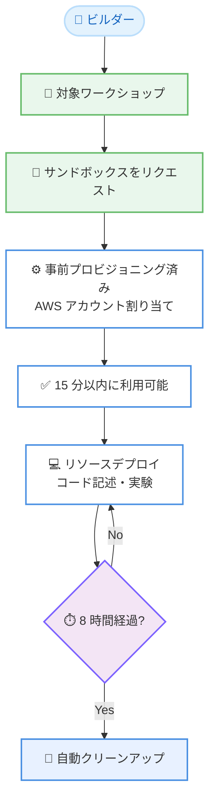

# AWS Builder Center - 無料サンドボックス環境

**リリース日**: 2026 年 7 月 8 日
**サービス**: AWS Builder Center
**機能**: 無料サンドボックス環境 (Free Sandbox Environments)

📊 [このアップデートのインフォグラフィックを見る](https://takech9203.github.io/aws-news-summary/20260708-aws-builder-center-sandbox.html)
<!-- INFOGRAPHIC_BASE_URL は環境変数から取得 -->

## 概要

AWS Builder Center は、対象となるワークショップから直接、無料で時間制限付きのサンドボックス環境をリクエストできる機能を提供開始しました。これにより、個人の AWS アカウント、クレジットカード、予期しない課金への懸念が不要になります。ビルダーは、事前にプロビジョニングされた AWS アカウント内で、安全にリソースをデプロイし、コードを記述し、実験できます。

従来、ワークショップはビルダー自身の AWS アカウントを使用してのみ完了できました。今回のアップデートにより、スキルレベルを問わずすべてのビルダーが、アカウントのセットアップや課金の心配なしに、実践的な AWS 体験を得られるようになります。

各サンドボックスはアクティベーションから 8 時間のアクセスを提供し、その後は自動的にクリーンアップされます。ビルダーは 1 週間に 1 つのサンドボックスをリクエストでき (毎週日曜日にリセット)、ほとんどの環境は 15 分以内に利用可能になります。ローンチ時点では一部のワークショップで利用可能で、今後より多くのワークショップで順次有効化されます。

**アップデート前の課題**

このアップデート以前は、AWS のワークショップを実践するために以下の準備や懸念事項がありました。

- ワークショップを完了するには、ビルダー自身の AWS アカウントが必要だった
- アカウント作成にクレジットカードの登録が求められ、初学者にとって障壁となっていた
- ワークショップ中にデプロイしたリソースの消し忘れなどにより、予期しない課金が発生する懸念があった

**アップデート後の改善**

今回のアップデートにより、以下が可能になりました。

- 対象ワークショップから直接、無料のサンドボックス環境をリクエストできるようになった
- 個人の AWS アカウントやクレジットカードが不要になった
- 8 時間の利用後に自動クリーンアップが行われ、予期しない課金の心配が不要になった

## アーキテクチャ図

ビルダーが対象ワークショップからサンドボックスをリクエストすると、事前プロビジョニング済みの AWS アカウントが割り当てられ、8 時間の利用後に自動的にクリーンアップされる流れを示しています。

## サービスアップデートの詳細

### 主要機能

1. **事前プロビジョニング済みサンドボックス環境**
   - 対象ワークショップから直接リクエストできる、無料で時間制限付きの AWS 環境
   - 個人の AWS アカウント、クレジットカードが不要
   - スキルレベルを問わず、安全にリソースをデプロイし、コードを記述し、実験可能

2. **時間制限と自動クリーンアップ**
   - 各サンドボックスはアクティベーションから 8 時間のアクセスを提供
   - 利用終了後は自動的にクリーンアップされ、予期しない課金の心配が不要
   - ほとんどの環境は 15 分以内に利用可能になる

3. **利用回数の制限**
   - 1 週間に 1 つのサンドボックスをリクエスト可能
   - 制限は毎週日曜日にリセットされる

4. **段階的な提供拡大**
   - ローンチ時点では一部のワークショップで利用可能
   - 今後、より多くのワークショップで順次有効化される予定

## 技術仕様

### サンドボックス環境の仕様

| 項目 | 詳細 |
|------|------|
| 利用料金 | 無料 |
| アクセス時間 | アクティベーションから 8 時間 |
| プロビジョニング時間 | ほとんどの場合 15 分以内 |
| 利用回数制限 | 1 週間に 1 つ (毎週日曜日にリセット) |
| クリーンアップ | 利用終了後に自動実行 |
| 前提条件 | 個人の AWS アカウント・クレジットカード不要 |
| 提供範囲 | 対象ワークショップのみ (順次拡大) |

## 設定方法

### 前提条件

1. AWS Builder Center のアカウント (AWS Builder ID)
2. 対象ワークショップへのアクセス
3. 個人の AWS アカウントやクレジットカードは不要

### 手順

#### ステップ1: ワークショップにアクセス

AWS Builder Center のワークショップページ (https://builder.aws.com/workshops) にアクセスし、サンドボックスに対応した対象ワークショップを選択します。

#### ステップ2: サンドボックスをリクエスト

ワークショップ内から直接サンドボックス環境をリクエストします。リクエスト後、ほとんどの環境は 15 分以内に準備が完了します。

#### ステップ3: ワークショップを実施

割り当てられた事前プロビジョニング済みの AWS アカウントで、リソースのデプロイ、コードの記述、実験を行います。アクティベーションから 8 時間経過すると自動的にクリーンアップされます。

## メリット

### ビジネス面

- **学習の障壁低減**: 個人の AWS アカウントやクレジットカードが不要になり、初学者でもすぐに実践的な学習を開始できる
- **コスト懸念の解消**: 無料かつ自動クリーンアップにより、予期しない課金のリスクがなくなる
- **オンボーディングの促進**: 新しいメンバーやパートナーが AWS のスキルを安全に習得しやすくなる

### 技術面

- **安全な実験環境**: 隔離された事前プロビジョニング済み環境で、本番環境に影響を与えずにリソースをデプロイできる
- **迅速な準備**: ほとんどの環境が 15 分以内に利用可能になり、待ち時間が少ない
- **自動リソース管理**: 8 時間後の自動クリーンアップにより、リソースの消し忘れを防止

## デメリット・制約事項

### 制限事項

- 1 週間に 1 つのサンドボックスのみリクエスト可能 (毎週日曜日にリセット)
- 各サンドボックスの利用時間はアクティベーションから 8 時間に制限される
- ローンチ時点では対象ワークショップが一部に限られる

### 考慮すべき点

- 8 時間経過後に自動クリーンアップされるため、継続的な作業や長期的なプロジェクトには適さない
- サンドボックスは学習・実験目的であり、本番ワークロードの実行には利用できない
- 対象ワークショップは順次拡大されるため、利用したいワークショップが対応しているか事前確認が必要

## ユースケース

### ユースケース1: AWS 初学者のハンズオン学習

**シナリオ**: AWS を初めて利用する学習者が、クレジットカードを登録せずにハンズオンワークショップを実践したい。

**効果**: アカウント作成や課金の懸念なしに、すぐに実践的な AWS 体験を開始できます。

### ユースケース2: 社内トレーニングやワークショップイベント

**シナリオ**: 企業やコミュニティが、参加者に統一された環境を提供して AWS トレーニングを実施したい。

**効果**: 参加者ごとにアカウントを準備する手間が省け、事前プロビジョニング済みの一貫した環境でスムーズにトレーニングを進められます。

### ユースケース3: 新機能やサービスの安全な試用

**シナリオ**: エンジニアが本番アカウントに影響を与えずに、新しい AWS サービスや機能を試したい。

**効果**: 隔離されたサンドボックス環境で安全に実験でき、8 時間後の自動クリーンアップによりリソースの後片付けも不要です。

## 料金

サンドボックス環境の利用は無料です。個人の AWS アカウントやクレジットカードは不要で、サンドボックス内でデプロイしたリソースに対する課金も発生しません。

## 利用可能リージョン

AWS Builder Center はグローバルに提供されるサービスです。サンドボックス環境が利用可能なワークショップはローンチ時点では一部に限られ、今後順次拡大されます。

## 関連サービス・機能

- **AWS Builder Center**: ビルダー向けの学習コンテンツ、ワークショップ、コミュニティを提供するプラットフォーム
- **Workshops on AWS Builder Center**: サンドボックスをリクエストできる対象ワークショップの提供場所
- **AWS Builder ID**: AWS Builder Center のコンテンツにアクセスするための ID

## 参考リンク

- 📊 [インフォグラフィック](https://takech9203.github.io/aws-news-summary/20260708-aws-builder-center-sandbox.html)
- [公式発表 (What's New)](https://aws.amazon.com/about-aws/whats-new/2026/07/aws-builder-center-sandbox/)
- [Workshops on AWS Builder Center](https://builder.aws.com/workshops)

## まとめ

AWS Builder Center の無料サンドボックス環境は、個人の AWS アカウントやクレジットカードを準備することなく、安全に AWS を学習・実験できる環境を提供します。学習の障壁と予期しない課金の懸念を解消するこの機能は、初学者から経験者まで幅広いビルダーにとって有用です。まずは対象ワークショップで実際にサンドボックスをリクエストし、その利便性を体験することをおすすめします。
