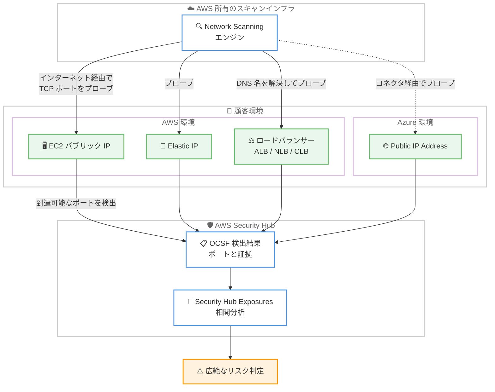

# AWS Security Hub - Network Scanning

**リリース日**: 2026 年 7 月 8 日
**サービス**: AWS Security Hub
**機能**: Network Scanning (ネットワークスキャン)

📊 [このアップデートのインフォグラフィックを見る](https://takech9203.github.io/aws-news-summary/20260708-aws-security-hub-network-scanning.html)

## 概要

AWS Security Hub は、パブリックインターネットから到達可能なリソースを特定する新機能 Network Scanning を発表しました。この機能は、セキュリティグループのルールやルートテーブルの設定から「到達可能になり得る」リソースを推測するのではなく、実際にインターネット側からリソースをプローブして「実際に到達可能かどうか」を検出します。

Network Scanning は、AWS 環境と Azure 環境の両方にわたって、パブリック IP アドレス、仮想マシン、ロードバランサーを検出します。到達可能なポートを特定し、その背後で稼働しているサービスを判別します。検出された到達可能なポートごとに、ポートとサービスの証拠を含む Security Hub の検出結果 (finding) が生成されます。さらに Security Hub Exposures が、これらの検出結果を他の検出結果やリソース設定と自動的に相関分析し、より広範なリスクを判定します。

この機能は、既存のネットワーク到達可能性 (network reachability) の検出結果を補完するものです。従来のコントロールプレーン分析が「設定上到達可能になり得るか」を評価するのに対し、Network Scanning は AWS 所有の IP アドレスから実際にプローブを行い、外部からの実際の到達状況を検証します。

**アップデート前の課題**

- 従来はセキュリティグループ、ネットワーク ACL、ルートテーブルの設定分析に基づき「到達可能になり得る」リソースを推測するのみで、実際にインターネットから到達できるかは確認できなかった
- 設定上は開放されていても実際にはサービスが稼働していないポートと、実際に外部から接続可能なポートを区別できなかった
- 公開リソースの背後でどのサービスが稼働しているかを、外部視点で把握する手段が限られていた

**アップデート後の改善**

- AWS 所有の IP アドレスから実際にプローブを実行し、インターネットから実際に到達可能なリソースとポートを検出できるようになった
- 到達可能なポートごとに、稼働中のサービスの証拠 (TCP バナー、HTTP メタデータ、TLS 証明書情報など) を含む検出結果が得られるようになった
- Security Hub Exposures による相関分析で、実際の到達可能性を含めた広範なリスク評価が可能になった

## アーキテクチャ図



Network Scanning は AWS 所有のインフラからインターネット経由で顧客リソースの TCP ポートをプローブし、到達可能なポートを OCSF 形式の検出結果として発行します。その結果を Security Hub Exposures が相関分析してリスクを判定します。

## サービスアップデートの詳細

### 主要機能

1. **実際の到達可能性の検出**
   - コントロールプレーン分析 (セキュリティグループ、NACL、ルートテーブル) では「到達可能になり得るか」を評価するのに対し、Network Scanning は「実際に到達可能か」を検証する
   - すべてのスキャンは AWS 所有の IP アドレスから実行され、顧客の VPC やアカウント内では動作しない
   - 「このリソースはインターネットから到達可能か」「到達可能な場合、何が稼働しているか」の 2 点を明らかにする

2. **到達可能なポートとサービスの特定**
   - 到達可能なポートごとに 1 つの検出結果を生成し、ポートとリソース、アドレスの組み合わせを表す
   - スキャンは TCP のみ (UDP は対象外) で、よく知られた TCP ポートのサブセットをスキャンする
   - 検出結果は OCSF 形式 (AWS OCSF Extension を使用) で発行され、他の Security Hub 検出結果と並んで表示される

3. **スキャン証拠の収集**
   - TCP バナー (接続時にサービスが送信する初期バイト。SSH バージョン文字列など)
   - HTTP メタデータ (レスポンスヘッダーと HTTP ステータスコード)
   - TLS 証明書 (コモンネーム、発行者、有効期限、自己署名の有無)
   - サービス検出 (ポート上で稼働しているアプリケーションまたはプロトコルの識別)

4. **Security Hub Exposures との連携**
   - Network Scanning の検出結果を他の検出結果やリソース設定と自動的に相関分析する
   - 実際の到達可能性を踏まえた、より広範なリスク判定を実現する

5. **マルチクラウド対応**
   - AWS 環境に加えて Azure の Public IP アドレスもスキャン対象とする
   - Azure リソースをスキャンするには、Security Hub コネクタを Azure 環境に作成する
   - Azure リソースのスキャン動作、証拠、検出結果は AWS リソースと同一

## 技術仕様

### サポートされるリソースタイプ

| クラウドプロバイダー | リソースタイプ |
|------|------|
| AWS | EC2 インスタンス (パブリック IP 付き) |
| AWS | Elastic IP (EIP) |
| AWS | Network Load Balancer (NLB) |
| AWS | Application Load Balancer (ALB) |
| AWS | Classic Load Balancer (CLB) |
| Azure | Public IP Address |

ロードバランサーについては DNS 名を解決してスキャンします。ロードバランサー背後の個々の EC2 インスタンスは、自身のパブリック IP または EIP を持つ場合のみスキャンされます。

### スキャンのタイミング

| 項目 | 詳細 |
|------|------|
| 既存リソースの初回スキャン | 機能有効化から約 24 時間以内 |
| 新規リソースのスキャン | Security Hub がリソース作成通知を受信した直後 |
| 再スキャン (設定変更時) | スキャン対象リソースに特定のコントロールプレーン変更が加わった時 |
| 定期再スキャン | アクティブなリソースを約 12 時間ごと |

短命なリソースは、終了前にスキャンされない場合があります。

### 検出結果の例 (OCSF `port_scan_result_list`)

```json
"port_scan_result_list": [
    {
      "port_info": {
        "port": 6379,
        "protocol_name": "tcp",
        "protocol_num": 6
      },
      "status": "Open",
      "status_id": 1,
      "svc_name": "redis"
    }
]
```

到達可能なリソースが検出されない場合、検出結果は生成されません。検出結果が存在しないことは、スキャンインフラからそのリソースがインターネット到達不可であることを示します。

## 設定方法

### 前提条件

1. 対象アカウントで Security Hub が有効化されていること
2. Network Scanning の有効化により、AWS 環境および Azure 環境のリソースに対するアクティブスキャン (TCP ポート接続試行、アプリケーションおよびプロトコルの識別、サービスバナー、HTTP ヘッダー、TLS 証明書メタデータの収集) を承認すること
3. Azure リソースをスキャンする場合は、Security Hub コネクタを Azure 環境に作成すること

### 手順

#### ステップ 1: 組織全体で有効化する (推奨)

設定ポリシー (configuration policy) を作成または編集し、組織のアカウントとリージョン全体で Network Scanning を有効化します。設定ポリシー経由で有効化した場合、メンバーアカウントはこの機能を無効化できません。

#### ステップ 2: 個別アカウントで有効化する

設定ポリシーで管理されていないアカウントでは、AWS CLI で以下のコマンドを実行して有効化します。

```bash
aws securityhub enable-security-hub-feature-v2 --feature-name NETWORK_SCANNING
```

このコマンドは、対象アカウントで Network Scanning 機能を有効化します。コンソールからは [General settings] の [Network Scanning] セクションで [Enable] を選択し、アクティブスキャンの承認を確認して有効化することもできます。API の場合は `EnableSecurityHubFeatureV2` を機能名 `NETWORK_SCANNING` で呼び出します。

#### ステップ 3: 特定リソースをスキャン対象から除外する

スキャン対象から除外したいリソースには、タグキー `SecurityHubNetworkScanExclusion` を付与します。タグ値は任意の値または空で構いません。

- EC2 インスタンスにアタッチされた EIP の場合: EC2 インスタンスではなく EIP にタグを付与する
- パブリック IP のみを持つ EC2 インスタンス (EIP なし) の場合: EC2 インスタンスにタグを付与する
- ロードバランサーの場合: ロードバランサーと、個別のパブリック IP を持つターゲットにタグを付与する

除外タグを追加すると、将来のスキャンが停止され、そのリソースのアクティブな検出結果はクローズされます。タグを削除すると再びスキャン対象になります。

## メリット

### ビジネス面

- **実態に基づくリスク把握**: 設定上の推測ではなく、実際にインターネットから到達可能なリソースを可視化し、優先度の高い露出リスクに集中できる
- **マルチクラウド対応**: AWS と Azure の公開リソースを単一の Security Hub ビューで管理でき、クラウド横断の攻撃対象領域を把握できる
- **追加コスト不要**: Security Hub Essentials に含まれ、追加料金なしで利用できる

### 技術面

- **外部視点の検証**: AWS 所有のインフラから顧客の VPC 外部でスキャンを実行するため、実際の攻撃者視点に近い到達可能性を検証できる
- **豊富な証拠**: TCP バナー、HTTP メタデータ、TLS 証明書、サービス検出情報により、公開ポートの背後で何が稼働しているかを具体的に把握できる
- **Exposures との自動相関**: 到達可能性の検出結果が他の検出結果やリソース設定と自動相関され、広範なリスク判定に活用される

## デメリット・制約事項

### 制限事項

- スキャンは TCP のみで、UDP は対象外。またスキャン対象はよく知られた TCP ポートのサブセットに限られ、対象ポートは今後変化する可能性がある
- 短命なリソースは、終了前にスキャンされない場合がある
- ロードバランサー背後の EC2 インスタンスは、自身のパブリック IP または EIP を持つ場合のみスキャンされる
- コマーシャル AWS リージョンのうち、Security Hub が利用可能なリージョンでのみ利用可能

### 考慮すべき点

- Network Scanning を無効化しても、既存の検出結果は即座にはクローズされず、通常の Security Hub 検出結果ライフサイクルに従ってエイジアウトするまで表示され続ける
- 機能有効化により、自リソースに対するアクティブスキャン (ポート接続試行やバナー収集など) を承認することになるため、社内のセキュリティポリシーとの整合を確認する必要がある
- ポートが断続的にしか到達できない場合、検出結果はスキャン時点の実在する証拠に基づいて生成される

## ユースケース

### ユースケース 1: 意図しない公開リソースの検出

**シナリオ**: セキュリティグループの設定ミスにより、本来内部利用のみのはずのデータベース (例: Redis のポート 6379) がインターネットに公開されている状態を検出したい。

**効果**: Network Scanning が実際に到達可能なポート 6379 を検出し、`svc_name: redis` の証拠付きで検出結果を生成する。設定分析だけでは見落としがちな「実際に到達可能な露出」を確実に把握できる。

### ユースケース 2: マルチクラウド環境の攻撃対象領域管理

**シナリオ**: AWS と Azure の両方でワークロードを運用しており、両環境の公開リソースを一元的に把握したい。

**効果**: Azure 環境に Security Hub コネクタを作成することで、Azure の Public IP アドレスも AWS リソースと同一の方式でスキャンされ、両クラウドの検出結果を Security Hub 上で統合的に管理できる。

### ユースケース 3: 公開ロードバランサー背後のサービス確認

**シナリオ**: 公開中のロードバランサーが想定外のポートやサービスを外部に露出していないか確認したい。

**効果**: Network Scanning がロードバランサーの DNS 名を解決してスキャンし、到達可能なポートと HTTP メタデータ (Server ヘッダーなど) や TLS 証明書情報を収集する。露出しているサービスとその構成を外部視点で確認できる。

## 料金

Network Scanning は Security Hub Essentials に含まれ、追加料金なしで利用できます。

## 利用可能リージョン

Security Hub が利用可能なすべてのコマーシャル AWS リージョンで利用可能です。既存顧客はアカウント / リージョン単位、または設定ポリシーによる組織全体で有効化できます。新規の Security Hub 顧客の場合はデフォルトで有効化されます。

## 関連サービス・機能

- **Security Hub Exposures**: Network Scanning の検出結果を他の検出結果やリソース設定と相関分析し、広範なリスクを判定する
- **ネットワーク到達可能性 (network reachability) の検出結果**: セキュリティグループや NACL、ルートテーブルの設定分析に基づく従来の到達可能性評価。Network Scanning はこれを実際の到達検証で補完する
- **Amazon EC2 / Elastic IP / Elastic Load Balancing**: スキャン対象となる主要な AWS リソース
- **Microsoft Azure 統合**: Security Hub コネクタを介した Azure Public IP のスキャンに対応

## 参考リンク

- 📊 [インフォグラフィック](https://takech9203.github.io/aws-news-summary/20260708-aws-security-hub-network-scanning.html)
- [公式発表 (What's New)](https://aws.amazon.com/about-aws/whats-new/2026/07/aws-security-hub-network-scanning/)
- [ドキュメント (Network Scanning in Security Hub)](https://docs.aws.amazon.com/securityhub/latest/userguide/securityhub-v2-network-scanning.html)
- [AWS Security Hub 製品ページ](https://aws.amazon.com/security-hub/)

## まとめ

Network Scanning は、設定上の推測にとどまらず実際にインターネットから到達可能なリソースとサービスを検証する、Security Hub の新たな露出検出機能です。追加料金なしで AWS と Azure の公開リソースを外部視点で可視化できるため、意図しない公開リソースの早期発見に有効です。Security Hub Essentials を利用中の環境では、設定ポリシーによる組織全体での有効化を検討し、除外タグの運用方針とあわせて導入を進めることを推奨します。
