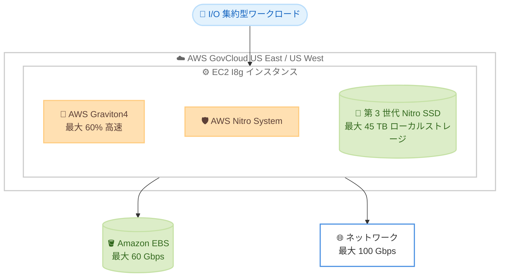

# Amazon EC2 - I8g インスタンス

**リリース日**: 2026 年 7 月 9 日
**サービス**: Amazon EC2
**機能**: ストレージ最適化 I8g インスタンス (AWS GovCloud (US) リージョン対応)

📊 [このアップデートのインフォグラフィックを見る](https://takech9203.github.io/aws-news-summary/20260709-amazon-ec2-i8g-instances-aws-govcloud-us-regions.html)
<!-- INFOGRAPHIC_BASE_URL は環境変数から取得 -->

## 概要

AWS は、ストレージ最適化された Amazon EC2 I8g インスタンスを AWS GovCloud (US East、US West) リージョンで一般提供 (GA) 開始しました。I8g インスタンスは、ストレージを多用するワークロードにおいて EC2 で最高のパフォーマンスを提供するように設計されています。

I8g インスタンスは AWS Graviton4 プロセッサを搭載しており、前世代の I4g インスタンスと比較して最大 60% 高いコンピューティングパフォーマンスを実現します。また、第 3 世代の AWS Nitro SSD を採用することで、TB あたりのリアルタイムストレージパフォーマンスが最大 65% 向上し、ストレージ I/O レイテンシは最大 50% 低減、レイテンシの変動は最大 60% 低減します。これらのインスタンスは AWS Nitro System 上に構築されています。

今回の GovCloud (US) リージョン対応により、米国政府機関やその関連組織、規制対象ワークロードを扱うお客様も、トランザクション処理、リアルタイム分散データベース、リアルタイム分析、データレイクハウス、AI/LLM 前処理などの I/O 集約型ワークロードで I8g インスタンスの高いパフォーマンスを活用できるようになりました。

**アップデート前の課題**

- GovCloud (US) リージョンでは、最新世代のストレージ最適化インスタンスである I8g を利用できなかった
- ストレージ集約型ワークロードでは、前世代の I4g インスタンスを使用する必要があり、コンピューティングおよびストレージ性能に制約があった
- 規制対象ワークロードにおいて、最新の Graviton4 と第 3 世代 Nitro SSD による性能向上を享受できなかった

**アップデート後の改善**

- GovCloud (US East、US West) リージョンで I8g インスタンスが利用可能になった
- Graviton4 により I4g 比で最大 60% 高いコンピューティングパフォーマンスを実現
- 第 3 世代 Nitro SSD により、ストレージパフォーマンスとレイテンシが大幅に改善された

## アーキテクチャ図

Graviton4 プロセッサと第 3 世代 Nitro SSD を組み合わせた I8g インスタンスが、GovCloud (US) リージョンで I/O 集約型ワークロードに高いストレージ性能を提供する構成を示しています。

## サービスアップデートの詳細

### 主要機能

1. **AWS Graviton4 プロセッサ**
   - 前世代の I4g インスタンスと比較して最大 60% 高いコンピューティングパフォーマンスを実現
   - Arm ベースのアーキテクチャによる高い電力効率とコストパフォーマンス

2. **第 3 世代 AWS Nitro SSD**
   - TB あたりのリアルタイムストレージパフォーマンスが最大 65% 向上
   - ストレージ I/O レイテンシが最大 50% 低減
   - ストレージ I/O レイテンシの変動が最大 60% 低減

3. **AWS Nitro System による構築**
   - CPU の仮想化、ストレージ、ネットワーク機能を専用のハードウェアとソフトウェアにオフロード
   - ホストリソースのほぼすべてをワークロードに割り当て可能

4. **豊富なインスタンスサイズ**
   - 最大 48xlarge まで 11 種類のサイズを提供 (メタルサイズ 1 種類を含む)
   - 最大 1.5 TiB のメモリ、最大 45 TB のローカルインスタンスストレージ

## 技術仕様

### インスタンスの主要スペック

| 項目 | 詳細 |
|------|------|
| プロセッサ | AWS Graviton4 |
| インスタンスサイズ | 11 サイズ (最大 48xlarge、メタル 1 種類を含む) |
| 最大メモリ | 1.5 TiB |
| 最大ローカルストレージ | 45 TB (第 3 世代 Nitro SSD) |
| 最大ネットワーク帯域幅 | 100 Gbps |
| 最大 EBS 帯域幅 | 60 Gbps |
| コンピューティング性能向上 | I4g 比で最大 60% |
| ストレージ性能向上 (TB あたり) | 最大 65% |
| ストレージ I/O レイテンシ低減 | 最大 50% |
| レイテンシ変動低減 | 最大 60% |

## メリット

### ビジネス面

- **規制対象ワークロードでの最新インスタンス活用**: GovCloud (US) を利用する政府機関や規制対象組織が、最新世代の I8g インスタンスを利用できるようになった
- **コストパフォーマンスの向上**: Graviton4 の高い電力効率により、ストレージ集約型ワークロードのコスト最適化が期待できる
- **柔軟なサイジング**: 11 種類のサイズにより、小規模から大規模まで幅広いワークロード要件に対応

### 技術面

- **高いストレージパフォーマンス**: 第 3 世代 Nitro SSD により、TB あたりのリアルタイムストレージ性能が最大 65% 向上
- **低レイテンシと安定性**: I/O レイテンシとその変動が大幅に低減し、レイテンシに敏感なアプリケーションに適する
- **高い計算性能**: Graviton4 により I4g 比で最大 60% 高いコンピューティングパフォーマンスを実現

## デメリット・制約事項

### 制限事項

- 利用可能なリージョンは AWS GovCloud (US East、US West) に限定される (今回の GA 時点)
- Arm ベースの Graviton4 アーキテクチャのため、x86 向けにビルドされたアプリケーションは Arm 対応のビルドまたは互換性確認が必要

### 考慮すべき点

- ローカル NVMe ストレージは揮発性であり、インスタンスの停止や終了時にデータが失われるため、永続化が必要なデータは Amazon EBS や Amazon S3 などに保存する必要がある
- 既存の x86 ベースワークロードから移行する場合は、依存ライブラリやコンテナイメージの Arm 対応状況を事前に確認する

## ユースケース

### ユースケース1: リアルタイム分散データベース

**シナリオ**: MySQL、PostgreSQL、Hbase、Aerospike、MongoDB、ClickHouse、Apache Druid などのトランザクション処理やリアルタイム分散データベースを運用する。

**効果**: 第 3 世代 Nitro SSD の低レイテンシと高スループットにより、大量のトランザクションやクエリを高速に処理できる。

### ユースケース2: リアルタイム分析とデータレイクハウス

**シナリオ**: Apache Spark などを用いたリアルタイム分析処理や、データレイクハウス基盤を構築する。

**効果**: 高いストレージ性能とネットワーク帯域幅により、大規模データセットの高速な読み書きと分析が可能になる。

### ユースケース3: AI/LLM の前処理

**シナリオ**: 大規模言語モデル (LLM) のトレーニングに向けたデータ前処理を実施する。

**効果**: ローカル NVMe ストレージへの高速アクセスにより、大量のトレーニングデータの前処理を効率化できる。

## 料金

I8g インスタンスは、オンデマンド、リザーブドインスタンス、Savings Plans、スポットインスタンスなどの EC2 の各種購入オプションで利用できます。具体的な料金はインスタンスサイズおよびリージョンによって異なるため、最新の料金は Amazon EC2 の料金ページを参照してください。

## 利用可能リージョン

AWS GovCloud (US East、US West) リージョンで一般提供 (GA) 開始しました。

## 関連サービス・機能

- **AWS Graviton4**: I8g インスタンスが搭載する最新世代の Arm ベースプロセッサ
- **AWS Nitro System**: I8g の基盤となる仮想化基盤。第 3 世代 Nitro SSD を含む
- **Amazon EBS**: I8g インスタンスにアタッチして永続ストレージとして利用可能 (最大 60 Gbps)

## 参考リンク

- 📊 [インフォグラフィック](https://takech9203.github.io/aws-news-summary/20260709-amazon-ec2-i8g-instances-aws-govcloud-us-regions.html)
- [公式発表 (What's New)](https://aws.amazon.com/about-aws/whats-new/2026/07/amazon-ec2-i8g-instances-aws-govcloud-us-regions/)
- [Amazon EC2 I8g インスタンス](https://aws.amazon.com/ec2/instance-types/i8g/)
- [AWS Graviton プロセッサ](https://aws.amazon.com/ec2/graviton/)
- [Amazon EC2 料金ページ](https://aws.amazon.com/ec2/pricing/)

## まとめ

Amazon EC2 I8g インスタンスの AWS GovCloud (US) リージョン対応により、政府機関や規制対象組織も、Graviton4 と第 3 世代 Nitro SSD による最高クラスのストレージ性能を活用できるようになりました。リアルタイムデータベース、リアルタイム分析、AI/LLM 前処理などの I/O 集約型ワークロードを GovCloud で運用しているお客様は、I8g への移行によるパフォーマンス向上とコスト最適化を検討することを推奨します。
