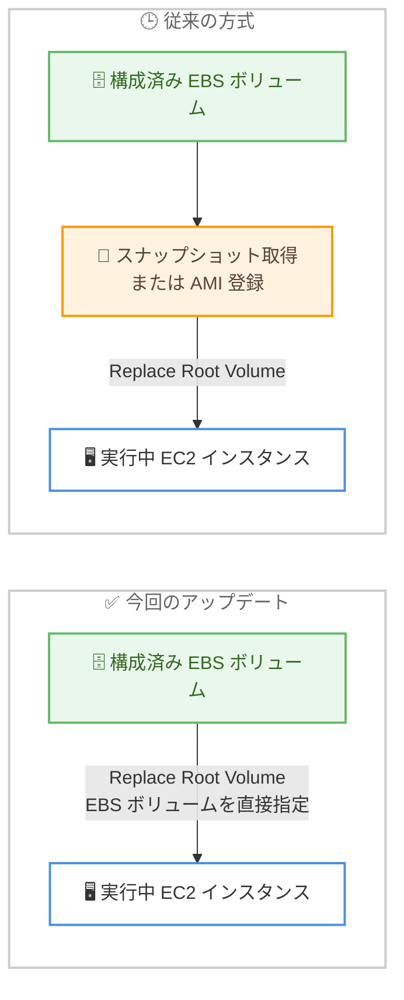

# Amazon EC2 - EBS ボリュームを使用したルートボリュームの置き換え

**リリース日**: 2026 年 7 月 9 日
**サービス**: Amazon EC2
**機能**: Replace Root Volume (EBS ボリュームの利用)

📊 [このアップデートのインフォグラフィックを見る](https://takech9203.github.io/aws-news-summary/20260709-amazon-ec2-replace-root-volume-ebs-volume.html)
<!-- INFOGRAPHIC_BASE_URL は環境変数から取得 -->

## 概要

Amazon EC2 は、実行中の EC2 インスタンスのルートボリュームを置き換える際に、既存の EBS ボリュームを置き換え先として利用できるようになりました。従来から提供されているスナップショットまたは AMI からの置き換えに加わる、新しい選択肢です。

Replace Root Volume は、インスタンスを停止することなく、OS パッチや構成変更をルートボリュームに適用するための機能として、多くのお客様にすでに利用されています。今回のアップデートにより、アプリケーションの起動前にルートボリュームへ特定のメタデータやソフトウェアを配置する必要があるステートフルなワークロードにおいて、事前にスナップショットの取得や AMI の登録を行うことなく、構成済みの EBS ボリュームを直接ルートボリュームとして適用できます。

これにより、スナップショットや AMI を作成する中間ステップが不要となり、運用上のオーバーヘッドが削減されるとともに、ルートボリュームへのパッチ適用が高速化されます。ダウンタイムのコストが高いステートフルなワークロードにとって、特に有効な改善です。この機能は、すべての商用 AWS リージョンおよび AWS GovCloud (US) リージョンで利用可能です。

**アップデート前の課題**

- 以前は、構成済みのボリュームでルートボリュームを置き換えるために、まずスナップショットを取得するか AMI を登録する必要があった
- 以前は、スナップショットや AMI を作成する中間ステップが時間と運用上のオーバーヘッドを増加させていた
- 以前は、ルートボリュームへのパッチ適用サイクルにおいて、中間成果物の管理が必要だった

**アップデート後の改善**

- 今回のアップデートにより、構成済みの EBS ボリュームを直接、新しいルートボリュームとして指定できるようになった
- 今回のアップデートにより、スナップショットや AMI を作成する中間ステップが不要になった
- 今回のアップデートにより、ルートボリュームへのパッチ適用が高速化され、運用上のオーバーヘッドが削減された

## アーキテクチャ図



従来はスナップショットや AMI の作成という中間ステップが必要でしたが、今回のアップデートにより構成済みの EBS ボリュームを直接ルートボリュームとして指定できるようになりました。

## サービスアップデートの詳細

### 主要機能

1. **EBS ボリュームによるルートボリューム置き換え**
   - 実行中の EC2 インスタンスのルートボリュームを、既存の EBS ボリュームで置き換えられる
   - スナップショットや AMI からの置き換えと並ぶ、第 3 の選択肢として提供される
   - インスタンスを停止せずにルートボリュームを差し替えられる

2. **中間ステップの排除**
   - スナップショットの取得や AMI の登録といった事前準備が不要になる
   - 構成済みの EBS ボリュームを準備すれば、そのまま新しいルートボリュームとして適用できる
   - 中間成果物の作成・管理・削除にかかる時間とコストを削減できる

3. **ステートフルワークロードへの最適化**
   - アプリケーションの起動前に、特定のメタデータやソフトウェアをルートボリュームに配置するユースケースに対応
   - ダウンタイムのコストが高いワークロードにおいて、パッチ適用や構成変更を迅速に実施できる

## 技術仕様

### Replace Root Volume の置き換えソース

| 置き換えソース | 説明 | 中間ステップ |
|------|------|------|
| スナップショット | 指定した EBS スナップショットからルートボリュームを再作成 | スナップショットの取得が必要 |
| AMI | 指定した AMI のルートボリュームで置き換え | AMI の登録が必要 |
| 元の起動状態 | インスタンス起動時の初期状態にルートボリュームをリセット | 不要 |
| EBS ボリューム (今回追加) | 構成済みの既存 EBS ボリュームを直接ルートボリュームとして利用 | 不要 |

### 前提となる動作

Replace Root Volume では、置き換えタスクの実行中に新しいルートボリュームがプロビジョニングされ、インスタンスは自動的に再起動して新しいルートボリュームから起動します。EBS ボリュームを利用する場合、指定するボリュームは置き換え対象のインスタンスと同じアベイラビリティーゾーンに存在する必要があります。

## 設定方法

### 前提条件

1. 対象の EC2 インスタンスと同じアベイラビリティーゾーンに、新しいルートボリュームとして使用する EBS ボリュームが存在すること
2. EBS ボリュームに、アプリケーション起動前に必要なメタデータやソフトウェアが構成済みであること
3. `ec2:CreateReplaceRootVolumeTask` などのルートボリューム置き換えに必要な IAM 権限を保有していること

### 手順

#### ステップ1: 置き換え用の EBS ボリュームを準備

置き換え先として利用する EBS ボリュームを、対象インスタンスと同じアベイラビリティーゾーンに用意し、必要なパッチや構成を適用します。

#### ステップ2: ルートボリューム置き換えタスクを作成

```bash
aws ec2 create-replace-root-volume-task \
    --instance-id i-1234567890abcdef0 \
    --volume-id vol-0abcd1234efgh5678
```

`--volume-id` に構成済みの EBS ボリューム ID を指定してルートボリューム置き換えタスクを作成します。これにより、スナップショットや AMI を経由せずに、指定した EBS ボリュームが新しいルートボリュームとして適用されます。

#### ステップ3: タスクの進行状況を確認

```bash
aws ec2 describe-replace-root-volume-tasks \
    --filters Name=instance-id,Values=i-1234567890abcdef0
```

置き換えタスクのステータスを確認し、`succeeded` になったことを確認します。タスク完了後、インスタンスは新しいルートボリュームから起動します。

## メリット

### ビジネス面

- **運用オーバーヘッドの削減**: スナップショットや AMI の作成・管理という中間作業が不要になり、運用工数を削減できる
- **ダウンタイムコストの低減**: インスタンスを停止せずにルートボリュームを差し替えられるため、ステートフルワークロードの可用性を維持できる
- **パッチ適用の迅速化**: 構成済みボリュームを直接適用することで、パッチ適用サイクルを短縮できる

### 技術面

- **中間成果物の排除**: スナップショットや AMI という中間オブジェクトを保持・削除する必要がなくなる
- **柔軟な構成管理**: あらかじめメタデータやソフトウェアを構成した EBS ボリュームを準備し、そのまま起動元として利用できる
- **既存ワークフローとの互換性**: 従来のスナップショット / AMI による方式と並存するため、既存の運用を維持しながら選択的に導入できる

## デメリット・制約事項

### 制限事項

- 指定する EBS ボリュームは、対象の EC2 インスタンスと同じアベイラビリティーゾーンに存在する必要がある
- ルートボリューム置き換え中はインスタンスが再起動されるため、瞬間的な処理の中断が発生する

### 考慮すべき点

- 置き換えに使用する EBS ボリュームの構成 (パッチ、ソフトウェア、メタデータ) を事前に正しく整備しておく必要がある
- ボリュームの管理方針 (再利用、破棄、バージョン管理) を運用ルールとして定めておくことが望ましい

## ユースケース

### ユースケース1: ステートフルワークロードのパッチ適用

**シナリオ**: データを保持したまま稼働し続ける必要があるステートフルなアプリケーションに対し、OS パッチを適用する。

**実装例**:
```
1. 最新パッチを適用した EBS ボリュームを事前に準備
2. create-replace-root-volume-task で --volume-id を指定
3. インスタンスが新しいルートボリュームから再起動
```

**効果**: スナップショットや AMI を経由せずにパッチ適用でき、ダウンタイムと運用工数を最小化できる。

### ユースケース2: 起動前に特定ソフトウェアを必要とするアプリケーション

**シナリオ**: アプリケーションが起動する前に、特定のメタデータやエージェントソフトウェアがルートボリュームに配置されている必要がある。

**実装例**:
```
1. 必要なソフトウェアとメタデータを含む EBS ボリュームを構成
2. 対象インスタンスと同じ AZ に配置
3. ルートボリューム置き換えタスクで直接適用
```

**効果**: AMI の再登録なしに、要件を満たす構成済みボリュームを迅速に反映できる。

### ユースケース3: 構成のロールバックと切り替え

**シナリオ**: 検証済みの構成を保持した複数の EBS ボリュームを用意し、必要に応じてルートボリュームを切り替える。

**実装例**:
```
1. 検証済み構成の EBS ボリュームを保持
2. 問題発生時に既知の正常なボリュームで置き換え
3. インスタンスを停止せずに構成を復元
```

**効果**: 中間成果物を作成することなく、既知の正常な状態へ迅速に切り替えられる。

## 料金

Replace Root Volume 機能自体に追加料金はかかりません。使用する EBS ボリュームおよびスナップショット (利用する場合) に対して、標準の Amazon EBS 料金が適用されます。詳細は Amazon EBS の料金ページを参照してください。

## 利用可能リージョン

すべての商用 AWS リージョンおよび AWS GovCloud (US) リージョンで利用可能です。

## 関連サービス・機能

- **Amazon EBS**: 新しいルートボリュームとして利用する永続ストレージボリュームを提供する
- **Amazon EC2**: ルートボリューム置き換えの対象となるコンピューティングインスタンスを提供する
- **AWS Systems Manager**: パッチ適用や構成管理を自動化し、Replace Root Volume と組み合わせた運用自動化を実現できる

## 参考リンク

- 📊 [インフォグラフィック](https://takech9203.github.io/aws-news-summary/20260709-amazon-ec2-replace-root-volume-ebs-volume.html)
- [公式発表 (What's New)](https://aws.amazon.com/about-aws/whats-new/2026/07/amazon-ec2-replace-root-volume-ebs-volume/)
- [ドキュメント (Replace an EC2 instance root volume)](https://docs.aws.amazon.com/AWSEC2/latest/UserGuide/replace-root.html)
- [料金ページ (Amazon EBS Pricing)](https://aws.amazon.com/ebs/pricing/)

## まとめ

今回のアップデートにより、構成済みの EBS ボリュームを直接ルートボリュームとして適用できるようになり、スナップショットや AMI の作成という中間ステップが不要になりました。ダウンタイムのコストが高いステートフルワークロードのパッチ適用や構成切り替えを検討している場合は、この新しい選択肢を運用フローに取り入れることで、運用オーバーヘッドの削減とパッチ適用の高速化を実現できます。
</content>
</invoke>
