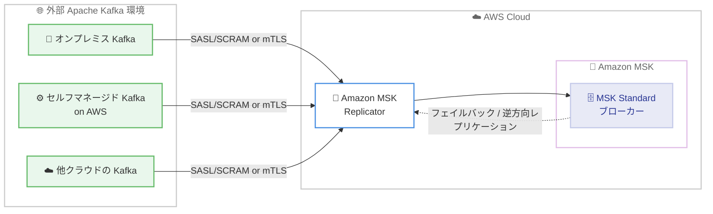

# Amazon MSK Replicator - 外部 Apache Kafka クラスターから MSK Standard ブローカーへのレプリケーション

**リリース日**: 2026年7月9日
**サービス**: Amazon Managed Streaming for Apache Kafka (Amazon MSK)
**機能**: MSK Replicator による外部 Kafka クラスターから MSK Standard ブローカーへのレプリケーション

📊 [このアップデートのインフォグラフィックを見る](https://takech9203.github.io/aws-news-summary/20260709-amazon-msk-replicator-external-kafka-standard-broker-support.html)
<!-- INFOGRAPHIC_BASE_URL は環境変数から取得 -->

## 概要

Amazon MSK Replicator が、外部の Apache Kafka クラスターから Amazon MSK Standard ブローカーへのデータレプリケーションをサポートするようになりました。外部クラスターには、オンプレミス環境、AWS 上のセルフマネージド環境、他のクラウドプロバイダー上のクラスターが含まれます。これまで MSK Express ブローカーへのレプリケーションはサポートされていましたが、今回のアップデートにより MSK Standard ブローカーもレプリケーション先として利用できるようになりました。

MSK Replicator は Amazon MSK のネイティブ機能であり、クラスター間のレプリケーションを自動化します。カスタムのインフラストラクチャを構築したり、オープンソースのツールを設定したりする必要がありません。外部クラスターへの接続には SASL/SCRAM または相互 TLS (mTLS) 認証を利用できます。また、MSK Standard ブローカーから外部 Kafka クラスターへの逆方向のレプリケーションもサポートしており、フェイルバックやマルチクラウドでのデータ分散にも対応します。

この機能は、ワークロードの MSK Standard ブローカーへの移行、MSK クラスターをフェイルオーバー / バックアップ先とする災害対策 (DR)、ハイブリッドおよびマルチクラウド環境でのデータ分散といったユースケースに適しています。

**アップデート前の課題**

- 外部 Apache Kafka クラスターからのレプリケーション先は MSK Express ブローカーに限定されており、MSK Standard ブローカーへは MSK Replicator を直接利用できなかった
- MSK Standard ブローカーへの移行や DR 構成を実現するには、カスタムツールやオープンソースの MirrorMaker などを自前で構築・運用する必要があった
- トピック名の維持や無限レプリケーションループの回避、コンシューマーグループオフセットの同期を自前で実装する必要があった

**アップデート後の改善**

- 外部 Kafka クラスターから MSK Standard ブローカーへ、MSK Replicator のマネージド機能で直接レプリケーションできるようになった
- SASL/SCRAM または mTLS 認証を利用して外部クラスターへ安全に接続できるようになった
- 元の Kafka トピック名を維持したまま、無限レプリケーションループを自動的に回避しながらレプリケーションできるようになった
- コンシューマーグループオフセットが双方向に同期され、プロデューサーとコンシューマーをクラスター間で独立かつ任意の順序で移行できるようになった

## アーキテクチャ図

MSK Replicator が外部 Kafka クラスターからのデータを認証付きで受信し、MSK Standard ブローカーへレプリケーションします。逆方向のレプリケーションにも対応するため、フェイルバックやマルチクラウドでのデータ分散が可能です。

## サービスアップデートの詳細

### 主要機能

1. **MSK Standard ブローカーへのレプリケーション対応**
   - 外部 Apache Kafka クラスター (オンプレミス、AWS 上のセルフマネージド、他クラウド) から MSK Standard ブローカーへレプリケーション可能
   - 既存の MSK Express ブローカーへのサポートに加えて、MSK Standard ブローカーもレプリケーション先として選択可能

2. **双方向レプリケーション**
   - MSK Standard ブローカーから外部 Kafka クラスターへの逆方向レプリケーションにも対応
   - フェイルバックやマルチクラウドでのデータ分散シナリオを実現

3. **認証方式**
   - 外部クラスターへの接続に SASL/SCRAM 認証をサポート
   - 相互 TLS (mTLS) 認証をサポート

4. **運用を簡素化するマネージド機能**
   - 元の Kafka トピック名をレプリケーション中も維持
   - 無限レプリケーションループを自動的に回避
   - コンシューマーグループオフセットを双方向に同期し、プロデューサーとコンシューマーを調整の制約やデータ損失のリスクなく任意の順序で移行可能

## 技術仕様

### レプリケーション対応構成

| 項目 | 詳細 |
|------|------|
| レプリケーション元 | 外部 Apache Kafka クラスター (オンプレミス / AWS 上のセルフマネージド / 他クラウド)、または MSK Standard ブローカー |
| レプリケーション先 | MSK Standard ブローカー、MSK Express ブローカー、または外部 Kafka クラスター |
| 認証方式 | SASL/SCRAM、相互 TLS (mTLS) |
| トピック名 | 元のトピック名を維持 |
| ループ防止 | 無限レプリケーションループを自動回避 |
| オフセット同期 | コンシューマーグループオフセットを双方向に同期 |

### 前提条件と設定の考え方

MSK Replicator は Amazon MSK のマネージド機能として、レプリケーションを実行します。外部クラスターをソースとする場合、外部クラスターへのネットワーク接続と、SASL/SCRAM または mTLS による認証情報の設定が必要です。認証情報は AWS Secrets Manager などを通じて安全に管理します。

## メリット

### ビジネス面

- **移行の容易化**: 外部 Kafka ワークロードを MSK Standard ブローカーへスムーズに移行でき、既存の Kafka 資産を活用しながらマネージドサービスへ移行できる
- **事業継続性の向上**: MSK クラスターをフェイルオーバー / バックアップ先とする DR 構成を、マネージド機能で実現できる
- **運用負荷の削減**: カスタムインフラやオープンソースツールの構築・運用が不要になり、レプリケーション基盤の運用コストを削減できる

### 技術面

- **柔軟なレプリケーション構成**: MSK Standard と MSK Express の両方のブローカータイプに対応し、双方向レプリケーションも可能
- **安全な接続**: SASL/SCRAM および mTLS による認証で、外部クラスターとの通信を保護できる
- **データ整合性の確保**: 無限ループの回避とコンシューマーグループオフセットの双方向同期により、データ損失のリスクを抑えながら移行できる

## デメリット・制約事項

### 考慮すべき点

- 外部クラスターとの接続には、適切なネットワーク経路 (VPN、AWS Direct Connect、ピアリングなど) の設定が必要となる
- 認証方式は SASL/SCRAM または mTLS に対応するため、外部クラスター側での認証設定との整合を確認する必要がある
- MSK Replicator の利用には料金が発生するため、レプリケーションするデータ量に応じたコストを事前に見積もる必要がある

## ユースケース

### ユースケース1: MSK Standard ブローカーへの移行

**シナリオ**: オンプレミスでセルフマネージドの Apache Kafka クラスターを運用している組織が、運用負荷を軽減するため Amazon MSK Standard ブローカーへ移行したい。

**効果**: MSK Replicator でトピックとデータを MSK Standard ブローカーへレプリケーションし、コンシューマーグループオフセットを同期することで、プロデューサーとコンシューマーを段階的に移行できます。ダウンタイムとデータ損失のリスクを最小化できます。

### ユースケース2: MSK クラスターをフェイルオーバー先とする災害対策

**シナリオ**: 他クラウド上で稼働する本番 Kafka クラスターに対し、AWS 上の MSK Standard ブローカーをバックアップ / フェイルオーバー先として構成したい。

**効果**: 外部クラスターから MSK Standard ブローカーへ継続的にレプリケーションすることで、障害発生時に MSK クラスターへフェイルオーバーできます。逆方向レプリケーションにより、復旧後のフェイルバックにも対応します。

### ユースケース3: ハイブリッド / マルチクラウドでのデータ分散

**シナリオ**: 複数のクラウドとオンプレミスにまたがってデータを利用するアプリケーションに、一貫したストリーミングデータを配信したい。

**効果**: MSK Standard ブローカーを中心に据えて、外部クラスターとの間で双方向にデータを分散できます。トピック名を維持したまま各環境でデータを利用できます。

## 料金

MSK Replicator の利用には、レプリケーションされるデータ量などに基づく料金が発生します。詳細は Amazon MSK の料金ページを参照してください。

## 利用可能リージョン

Amazon MSK Replicator が利用可能なすべての AWS リージョンで利用できます。

## 関連サービス・機能

- **Amazon MSK (Standard / Express ブローカー)**: レプリケーション先および元となるマネージド Kafka サービス
- **AWS Secrets Manager**: SASL/SCRAM の認証情報を安全に管理するために利用
- **AWS Direct Connect / AWS Site-to-Site VPN**: 外部クラスターとのネットワーク接続を確立するために利用

## 参考リンク

- 📊 [インフォグラフィック](https://takech9203.github.io/aws-news-summary/20260709-amazon-msk-replicator-external-kafka-standard-broker-support.html)
- [公式発表 (What's New)](https://aws.amazon.com/about-aws/whats-new/2026/07/amazon-msk-replicator-external-kafka-standard-broker-support)
- [AWS Blog: Migrate third-party and self-managed Apache Kafka clusters to Amazon MSK Express brokers with Amazon MSK Replicator](https://aws.amazon.com/blogs/big-data/migrate-third-party-and-self-managed-apache-kafka-clusters-to-amazon-msk-express-brokers-with-amazon-msk-replicator/)
- [Amazon MSK ドキュメント](https://docs.aws.amazon.com/msk/)
- [Amazon MSK 料金ページ](https://aws.amazon.com/msk/pricing/)

## まとめ

今回のアップデートにより、外部 Apache Kafka クラスターから Amazon MSK Standard ブローカーへのマネージドなレプリケーションが可能になりました。移行、災害対策、ハイブリッド / マルチクラウドでのデータ分散といった幅広いユースケースを、カスタムインフラを構築せずに実現できます。オンプレミスや他クラウドの Kafka ワークロードを Amazon MSK へ移行 / 連携する計画がある場合は、MSK Replicator の利用を検討することを推奨します。
