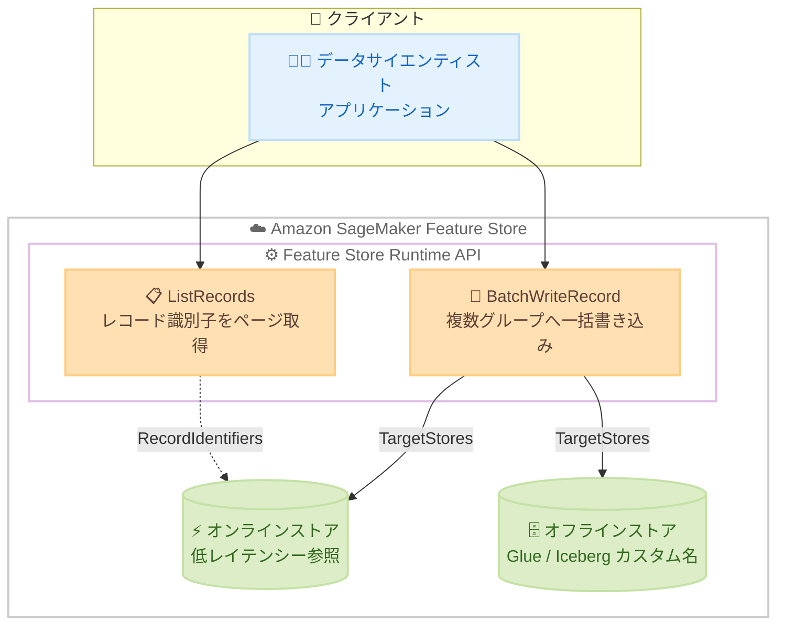

# Amazon SageMaker Feature Store - バッチ書き込みとレコード一覧

**リリース日**: 2026 年 7 月 9 日
**サービス**: Amazon SageMaker Feature Store
**機能**: BatchWriteRecord、ListRecords、オフラインストアのカスタムカタログ

📊 [このアップデートのインフォグラフィックを見る](https://takech9203.github.io/aws-news-summary/20260709-amzn-sgm-feature-store-batch-write-list.html)
<!-- INFOGRAPHIC_BASE_URL は環境変数から取得 -->

## 概要

Amazon SageMaker Feature Store が、高スループットな特徴量の取り込み、レコードの検出、オフラインストアのカタログ作成に対応しました。今回のアップデートにより、データサイエンティストは複数の特徴量グループにまたがる複数レコードを 1 回のリクエストで書き込み、レコード識別子を事前に把握していなくても特徴量グループ内のレコードを一覧表示し、オフラインストアでカスタム名のテーブルやデータベースを作成できるようになりました。

新たに追加された `BatchWriteRecord` は、オンラインストア、オフラインストア、またはその両方を対象に、1 件ずつ書き込むよりも少ない API 呼び出しと低いレイテンシーで特徴量データを大規模に取り込みます。個々のレコードの失敗はリクエスト全体を失敗させることなく個別に返却され、TTL (有効期限) をレコード単位、リクエスト単位、特徴量グループ単位で設定できます。

`ListRecords` は特徴量グループに格納されたレコード識別子をページ単位で取得します。これにより、特徴量グループの内容の参照や監査、レコード識別子の復元、レコードのライフサイクル管理といったユースケースに対応できます。加えて、オフラインストアの構成時に Glue テーブルと Iceberg テーブルをカスタム名で作成できるようになり、独自のツールを構築することなく大規模な特徴量の取り込みとレコード管理が可能になりました。

**アップデート前の課題**

- 特徴量の取り込みは `PutRecord` による 1 件ずつの書き込みが基本で、大量のレコードを取り込む際に多数の API 呼び出しが必要となり、レイテンシーとオーバーヘッドが大きかった
- 特徴量グループに格納されたレコードを参照するには、各レコードの識別子を事前に把握している必要があり、内容の参照や監査が困難だった
- オフラインストアのテーブルやデータベースの名前を任意に指定できず、データカタログの命名規則に合わせた管理が難しかった

**アップデート後の改善**

- `BatchWriteRecord` により、複数の特徴量グループにまたがる複数レコードを 1 回のリクエストで書き込めるようになり、API 呼び出し数とレイテンシーを削減できる
- `ListRecords` により、レコード識別子を事前に知らなくても特徴量グループ内のレコードをページ単位で列挙できるようになった
- オフラインストアで Glue および Iceberg のテーブル名、データベース名をカスタム名で作成できるようになった

## アーキテクチャ図



クライアントアプリケーションは `BatchWriteRecord` でオンライン/オフラインストアの両方または一方へ一括書き込みを行い、`ListRecords` で格納済みレコードの識別子をページ単位で取得します。

## サービスアップデートの詳細

### 主要機能

1. **BatchWriteRecord (バッチ書き込み)**
   - 複数の特徴量グループにまたがる複数レコードを 1 回のリクエストで書き込む
   - `TargetStores` でオンラインストア、オフラインストア、またはその両方を対象に指定できる
   - 個々のレコードの失敗はリクエスト全体を失敗させず、`Errors` および `UnprocessedEntries` として個別に返却される
   - TTL (有効期限) をレコード単位、リクエスト単位、特徴量グループ単位で設定できる

2. **ListRecords (レコード一覧)**
   - 特徴量グループ内のレコード識別子をページ単位 (`MaxResults` と `NextToken`) で取得する
   - `IncludeSoftDeletedRecords` によりソフト削除されたレコードを含めるかどうかを制御できる
   - 特徴量グループの内容の参照・監査、レコード識別子の復元、ライフサイクル管理に活用できる

3. **オフラインストアのカスタムカタログ**
   - オフラインストアの構成時に Glue テーブルおよび Iceberg テーブルをカスタム名で作成できる
   - データベース名も任意に指定でき、既存のデータカタログの命名規則に合わせた管理が可能になる

## 技術仕様

### API パラメーター概要

| 項目 | 詳細 |
|------|------|
| BatchWriteRecord | `Entries` に特徴量グループごとのレコードを指定。各エントリで `TargetStores` と `TtlDuration` を個別指定可能 |
| TTL 設定単位 | `Seconds` / `Minutes` / `Hours` / `Days` / `Weeks` |
| ListRecords | `FeatureGroupName`、`MaxResults`、`NextToken`、`IncludeSoftDeletedRecords` を指定 |
| 対象ストア | `OnlineStore`、`OfflineStore` (両方指定可能) |

### API 変更履歴

| 日付 | サービス | 変更内容 |
|------|----------|----------|
| 2026/06/29 | [featurestore-runtime.sagemaker](https://awsapichanges.com/archive/changes/4839f1-featurestore-runtime.sagemaker.html) | 2 new api methods - Feature Store に `ListRecords` と `BatchWriteRecord` API を追加 |

### BatchWriteRecord リクエスト例

```json
{
  "Entries": [
    {
      "FeatureGroupName": "customer-features",
      "Record": [
        { "FeatureName": "customer_id", "ValueAsString": "C-1001" },
        { "FeatureName": "purchase_amount", "ValueAsString": "129.99" }
      ],
      "TargetStores": ["OnlineStore", "OfflineStore"],
      "TtlDuration": { "Unit": "Days", "Value": 30 }
    }
  ],
  "TtlDuration": { "Unit": "Weeks", "Value": 4 }
}
```

## 設定方法

### 前提条件

1. Amazon SageMaker Feature Store で特徴量グループが作成済みであること
2. AWS SDK または AWS CLI が最新バージョンに更新されていること (2026 年 6 月 29 日以降の SDK 更新で対応)
3. Feature Store Runtime に対する適切な IAM 権限 (`sagemaker:BatchPutRecord`、`sagemaker:ListRecords` など) が付与されていること

### 手順

#### ステップ1: バッチ書き込みの実行

```bash
aws sagemaker-featurestore-runtime batch-write-record \
  --entries '[{"FeatureGroupName":"customer-features","Record":[{"FeatureName":"customer_id","ValueAsString":"C-1001"},{"FeatureName":"purchase_amount","ValueAsString":"129.99"}],"TargetStores":["OnlineStore","OfflineStore"]}]'
```

複数の特徴量グループのレコードを 1 回のリクエストで書き込みます。レスポンスの `Errors` と `UnprocessedEntries` を確認し、失敗したレコードのみ再送します。

#### ステップ2: レコード識別子の一覧取得

```bash
aws sagemaker-featurestore-runtime list-records \
  --feature-group-name customer-features \
  --max-results 100
```

特徴量グループ内のレコード識別子をページ単位で取得します。`NextToken` が返る場合は次ページを続けて取得します。

#### ステップ3: オフラインストアのカスタムテーブル名の指定

特徴量グループ作成時のオフラインストア構成で、Glue または Iceberg のテーブル名とデータベース名をカスタム名として指定します。既存のデータカタログの命名規則に合わせて設定してください。

## メリット

### ビジネス面

- **運用コストの削減**: 独自の一括取り込みツールやレコード列挙の仕組みを構築する必要がなくなる
- **データガバナンスの向上**: `ListRecords` によりレコードの参照・監査が容易になり、コンプライアンス対応を支援する
- **既存資産との整合**: カスタムテーブル名により既存のデータカタログ命名規則に沿った管理が可能になる

### 技術面

- **スループット向上**: 1 回のリクエストで複数レコードを書き込むことで API 呼び出し数とレイテンシーを削減
- **耐障害性**: 個々のレコード失敗がリクエスト全体を失敗させないため、部分的な再送で対応できる
- **柔軟な有効期限管理**: TTL をレコード/リクエスト/特徴量グループの各単位で設定できる

## デメリット・制約事項

### 制限事項

- `ListRecords` はレコード識別子のみを返し、レコードの全特徴量値は返さない (別途取得が必要)
- レコード識別子はページ単位で取得するため、大量レコードでは複数回のページング処理が必要になる

### 考慮すべき点

- AWS SDK / CLI を新 API に対応したバージョンへ更新する必要がある
- バッチリクエストのサイズ上限やスロットリング制限を考慮し、リトライ処理を実装することが望ましい
- TTL を複数レベルで設定する場合、優先順位 (レコード > リクエスト > 特徴量グループ) を理解して設定する

## ユースケース

### ユースケース1: 大規模バッチ推論向けの特徴量取り込み

**シナリオ**: 日次バッチで数百万件の顧客特徴量を複数の特徴量グループへ取り込む必要がある。

**実装例**:
```
BatchWriteRecord でエントリをまとめて送信し、
Errors / UnprocessedEntries のみ再送するリトライループを実装
```

**効果**: API 呼び出し数を削減し、取り込み時間とコストを低減する。

### ユースケース2: 特徴量グループの監査

**シナリオ**: 規制対応のため、特徴量グループに格納されているレコードを棚卸ししたい。

**実装例**:
```
ListRecords を NextToken でページングしながら全レコード識別子を取得し、
IncludeSoftDeletedRecords でソフト削除済みも確認
```

**効果**: レコード識別子を事前に把握していなくても内容を網羅的に監査できる。

### ユースケース3: データレイクとの命名規則統合

**シナリオ**: 既存のデータレイクの Glue カタログ命名規則にオフラインストアを合わせたい。

**実装例**:
```
オフラインストア構成で Glue / Iceberg のテーブル名・データベース名を
カスタム名として指定
```

**効果**: 既存のデータガバナンスやクエリツールと一貫した命名で運用できる。

## 料金

今回追加された API 機能自体に追加料金は発生しません。Amazon SageMaker Feature Store の通常の料金 (オンラインストアの書き込み/読み込みリクエスト、ストレージ、オフラインストアのストレージなど) が適用されます。詳細は料金ページを参照してください。

## 利用可能リージョン

Amazon SageMaker Feature Store が利用可能なすべての AWS リージョンで利用できます。

## 関連サービス・機能

- **AWS Glue Data Catalog**: オフラインストアのテーブル/データベースのカタログ管理に利用
- **Apache Iceberg**: オフラインストアのテーブルフォーマットとしてカスタム名で作成可能
- **Amazon S3**: オフラインストアのデータ保存先
- **Amazon SageMaker AI**: 特徴量を利用したモデルの学習・推論

## 参考リンク

- 📊 [インフォグラフィック](https://takech9203.github.io/aws-news-summary/20260709-amzn-sgm-feature-store-batch-write-list.html)
- [公式発表 (What's New)](https://aws.amazon.com/about-aws/whats-new/2026/07/amzn-sgm-feature-store-batch-write-list/)
- [API 変更履歴 (awsapichanges.com)](https://awsapichanges.com/archive/changes/4839f1-featurestore-runtime.sagemaker.html)
- [Amazon SageMaker Feature Store ドキュメント](https://docs.aws.amazon.com/sagemaker/latest/dg/feature-store.html)
- [Amazon SageMaker 料金ページ](https://aws.amazon.com/sagemaker/pricing/)

## まとめ

今回のアップデートにより、Amazon SageMaker Feature Store は大規模な特徴量取り込み (`BatchWriteRecord`)、レコードの検出・監査 (`ListRecords`)、オフラインストアのカスタムカタログに対応し、独自ツールの構築なしに特徴量ライフサイクルを管理できるようになりました。バッチ取り込みやレコード監査を行っているチームは、既存の `PutRecord` ベースの処理を `BatchWriteRecord` へ置き換え、SDK / CLI を最新版へ更新することを検討してください。
