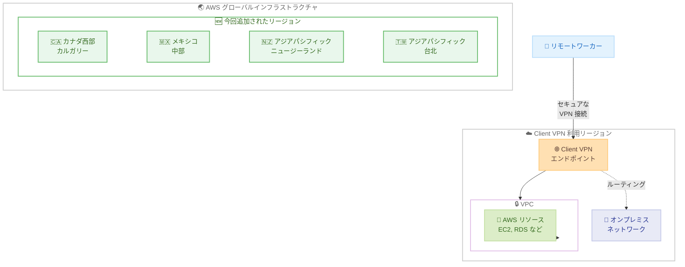

# AWS Client VPN - 4 つの追加リージョンへの提供拡大

**リリース日**: 2026年7月9日
**サービス**: AWS Client VPN
**機能**: 4 つの追加リージョンでの提供開始

📊 [このアップデートのインフォグラフィックを見る](https://takech9203.github.io/aws-news-summary/20260709-aws-client-vpn-four-additional-regions.html)
<!-- INFOGRAPHIC_BASE_URL は環境変数から取得 -->

## 概要

AWS は、AWS Client VPN を新たに 4 つの AWS リージョンで利用可能にしました。今回追加されたリージョンは、カナダ西部 (カルガリー)、メキシコ (中部)、アジアパシフィック (ニュージーランド)、アジアパシフィック (台北) です。これにより、これらのリージョンで運用するお客様は、リモートワーカーを AWS リソースやオンプレミスネットワークにより低いレイテンシーで安全に接続できるようになります。

AWS Client VPN は、リモートワーカーを AWS リソースやオンプレミスネットワークに安全に接続するためのフルマネージド型サービスです。従量課金モデルにより、ハードウェア VPN アプライアンスや複雑な運用管理を不要にします。お客様は、単一のコンソールを通じて VPN 接続の管理とモニタリングを実行できます。

データレジデンシー要件がある地域や、これまで最寄りのリージョンで Client VPN を利用できなかった地域のお客様にとって、今回の拡大はコンプライアンス対応とパフォーマンス向上の両面で価値があります。

**アップデート前の課題**

- カナダ西部 (カルガリー)、メキシコ (中部)、アジアパシフィック (ニュージーランド)、アジアパシフィック (台北) のリージョンでは AWS Client VPN を利用できなかった
- これらの地域のユーザーは、離れたリージョンの Client VPN エンドポイントを利用する必要があり、レイテンシーが増加していた
- データレジデンシー要件により、地域内でのセキュアなリモートアクセス構築が難しい場合があった

**アップデート後の改善**

- 上記 4 つのリージョンで AWS Client VPN を直接利用できるようになった
- ユーザーに近いリージョンにエンドポイントを配置でき、接続レイテンシーが低減される
- 地域内でのデータ処理により、データレジデンシー要件への対応が容易になった

## アーキテクチャ図



リモートワーカーが最寄りのリージョンに配置された Client VPN エンドポイントを通じて、VPC 内の AWS リソースやオンプレミスネットワークに安全に接続する構成を示しています。今回の拡大により、4 つの新しいリージョンでこの構成が利用可能になりました。

## サービスアップデートの詳細

### 主要機能

1. **4 つの追加リージョンでの提供開始**
   - カナダ西部 (カルガリー)
   - メキシコ (中部)
   - アジアパシフィック (ニュージーランド)
   - アジアパシフィック (台北)

2. **フルマネージド型のリモートアクセス**
   - リモートワーカーを AWS リソースやオンプレミスネットワークに安全に接続
   - ハードウェア VPN アプライアンスが不要
   - 複雑な運用管理を AWS が代行

3. **従量課金モデル**
   - 初期投資なしで利用開始できる料金体系
   - 使用したエンドポイント関連付け時間と接続時間に応じた課金
   - 需要に応じたスケーリングが容易

4. **単一コンソールでの管理とモニタリング**
   - VPN 接続の管理とモニタリングを一元的に実施
   - 運用の可視性と制御を向上

## 技術仕様

### 今回追加されたリージョン

| リージョン名 | リージョンコード |
|------|------|
| カナダ西部 (カルガリー) | ca-west-1 |
| メキシコ (中部) | mx-central-1 |
| アジアパシフィック (ニュージーランド) | ap-southeast-6 |
| アジアパシフィック (台北) | ap-east-2 |

<!-- リージョンコードは AWS の一般的な命名規則に基づく参考値です。正確なコードは公式ドキュメントで確認してください -->

### AWS Client VPN の主な認証方式

| 認証方式 | 説明 |
|------|------|
| 相互認証 (証明書ベース) | クライアント証明書とサーバー証明書を使用した認証 |
| Active Directory 認証 | AWS Directory Service を利用したユーザーベースの認証 |
| SAML ベースのフェデレーション認証 | IdP と連携したシングルサインオン |

## 設定方法

### 前提条件

1. AWS アカウントと Client VPN エンドポイントを作成するための IAM 権限
2. 対象リージョンに作成された VPC とサブネット
3. AWS Certificate Manager に登録されたサーバー証明書 (相互認証の場合)

### 手順

#### ステップ1: 対象リージョンを選択

AWS マネジメントコンソールにサインインし、今回追加された 4 つのリージョンのいずれか (例: アジアパシフィック (ニュージーランド)) を選択します。

#### ステップ2: Client VPN エンドポイントを作成

VPC コンソールの Client VPN セクションから、新しいエンドポイントを作成します。以下は AWS CLI での作成例です。

```bash
aws ec2 create-client-vpn-endpoint \
  --region ap-southeast-6 \
  --client-cidr-block 10.0.0.0/22 \
  --server-certificate-arn arn:aws:acm:ap-southeast-6:123456789012:certificate/xxxxx \
  --authentication-options Type=certificate-authentication,MutualAuthentication={ClientRootCertificateChainArn=arn:aws:acm:ap-southeast-6:123456789012:certificate/xxxxx} \
  --connection-log-options Enabled=false
```

このコマンドは、対象リージョンにクライアント CIDR ブロックとサーバー証明書を指定して Client VPN エンドポイントを作成します。`--region` で今回追加されたリージョンを指定します。

#### ステップ3: ターゲットネットワークの関連付けとクライアント設定の配布

作成したエンドポイントにサブネットを関連付け、承認ルールを設定した後、クライアント設定ファイル (.ovpn) をダウンロードしてエンドユーザーに配布します。ユーザーは AWS VPN クライアントまたは互換性のある OpenVPN ベースのクライアントで接続します。

## メリット

### ビジネス面

- **データレジデンシー対応**: 地域内でのデータ処理により、コンプライアンス要件への対応が容易になる
- **初期投資の削減**: 従量課金モデルにより、ハードウェア調達なしでリモートアクセス環境を構築できる
- **地域展開の加速**: 対象地域のお客様が現地リージョンでセキュアなリモートアクセスを迅速に構築できる

### 技術面

- **レイテンシーの低減**: ユーザーに近いリージョンにエンドポイントを配置でき、接続品質が向上する
- **運用負荷の軽減**: フルマネージド型サービスのため、VPN アプライアンスの保守が不要
- **一元管理**: 単一コンソールで VPN 接続の管理とモニタリングを実施できる

## デメリット・制約事項

### 制限事項

- 今回のアップデートはリージョンの提供拡大であり、機能自体の変更は含まれない
- リージョンによって利用可能な関連サービス (認証バックエンドなど) が異なる場合がある

### 考慮すべき点

- リージョンコードや対応状況は変更される可能性があるため、実際の利用前に公式ドキュメントで最新情報を確認することを推奨
- クロスリージョンでの利用が必要な場合は、レイテンシーやデータ転送料金を考慮する

## ユースケース

### ユースケース1: ニュージーランドの企業によるリモートワーク環境

**シナリオ**: ニュージーランドを拠点とする企業が、国内のデータレジデンシー要件を満たしながらリモートワーカーに VPC リソースへのアクセスを提供したい場合

**実装例**:
アジアパシフィック (ニュージーランド) リージョンに Client VPN エンドポイントを作成し、社内ユーザーにクライアント設定ファイルを配布。

**効果**: 現地リージョンでの処理により、低レイテンシーかつコンプライアンスに準拠したリモートアクセスを実現できる

### ユースケース2: メキシコ拠点のオンプレミス連携

**シナリオ**: メキシコに拠点を持つ組織が、オンプレミスネットワークと AWS リソースの両方にリモートアクセスする必要がある場合

**実装例**:
メキシコ (中部) リージョンに Client VPN エンドポイントを作成し、VPC とオンプレミスへのルーティングを設定。

**効果**: 単一の VPN 接続から AWS とオンプレミスの双方に安全にアクセスでき、運用が簡素化される

### ユースケース3: 台北でのテスト環境への迅速なアクセス

**シナリオ**: 台北の開発チームが VPC 内のテスト環境に迅速かつ安全にアクセスしたい場合

**実装例**:
アジアパシフィック (台北) リージョンに Client VPN エンドポイントを作成し、開発チームメンバーに接続を提供。

**効果**: 現地リージョンでの低レイテンシー接続により、開発イテレーションが効率化される

## 料金

AWS Client VPN の料金は、Client VPN エンドポイントの時間単位の関連付け料金と、接続時間単位の料金で構成されます。従量課金モデルのため、初期費用や最低利用料金はありません。リージョンごとに料金が異なる場合があるため、詳細は料金ページで確認してください。

詳細な料金については、[AWS Client VPN 料金ページ](https://aws.amazon.com/vpn/pricing/)を参照してください。

## 利用可能リージョン

今回のアップデートにより、AWS Client VPN は以下の 4 つのリージョンで新たに利用可能になりました。

- カナダ西部 (カルガリー)
- メキシコ (中部)
- アジアパシフィック (ニュージーランド)
- アジアパシフィック (台北)

これらのリージョンを含め、AWS Client VPN は多数の AWS リージョンで利用できます。全リージョンの一覧については、AWS のリージョン別サービス一覧を参照してください。

## 関連サービス・機能

- **Amazon VPC**: Client VPN エンドポイントを関連付けるネットワーク環境
- **AWS Certificate Manager (ACM)**: サーバー証明書とクライアント証明書の管理
- **AWS Directory Service**: Active Directory 認証を使用する場合の認証バックエンド
- **AWS Site-to-Site VPN**: サイト間の常時接続 VPN が必要な場合の関連サービス

## 参考リンク

- 📊 [インフォグラフィック](https://takech9203.github.io/aws-news-summary/20260709-aws-client-vpn-four-additional-regions.html)
- [公式発表 (What's New)](https://aws.amazon.com/about-aws/whats-new/2026/07/aws-client-vpn-four-additional-regions/)
- [AWS Client VPN 製品ページ](https://aws.amazon.com/vpn/)
- [AWS Client VPN ドキュメント](https://docs.aws.amazon.com/vpn/latest/clientvpn-admin/what-is.html)
- [料金ページ](https://aws.amazon.com/vpn/pricing/)

## まとめ

AWS Client VPN が、カナダ西部 (カルガリー)、メキシコ (中部)、アジアパシフィック (ニュージーランド)、アジアパシフィック (台北) の 4 つのリージョンに拡大しました。これにより、対象地域のお客様は、より低いレイテンシーでデータレジデンシー要件を満たしながら、セキュアなリモートアクセス環境を構築できます。これらの地域で事業を展開している場合は、現地リージョンでの Client VPN エンドポイント構築を検討することをお勧めします。
</content>
</invoke>
