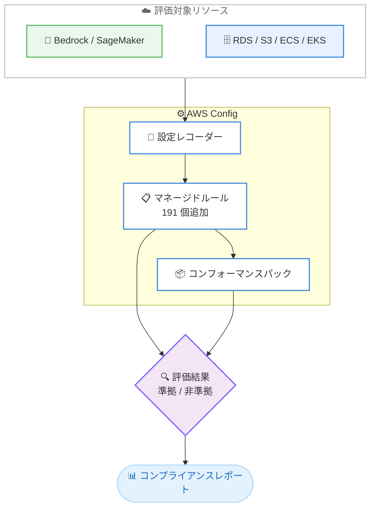

# AWS Config - 191 個の新しいマネージドルールの追加

**リリース日**: 2026 年 7 月 9 日
**サービス**: AWS Config
**機能**: 191 個の追加マネージドルール

📊 [このアップデートのインフォグラフィックを見る](https://takech9203.github.io/aws-news-summary/20260709-aws-config-additional-managed-rules.html)
<!-- INFOGRAPHIC_BASE_URL は環境変数から取得 -->

## 概要

AWS Config は、191 個の新しいマネージドルールを追加しました。今回追加されたルールは、Amazon Bedrock、Amazon SageMaker、Amazon ECS、Amazon EKS、Amazon RDS、Amazon Redshift、Amazon S3、Amazon CloudTrail などの主要サービスをカバーしています。これにより、AI ワークロードとコアとなるクラウドインフラストラクチャの両方にわたって、組み込みのガバナンスカバレッジが大幅に拡大しました。

新しいルールは、暗号化、ロギング、パブリックアクセス、ネットワークセキュリティ、データ保護、その他の運用のベストプラクティスの観点から、リソース設定を評価します。特に、Amazon Bedrock AgentCore や Amazon Cognito などの比較的新しい AI・認証系サービスのルールが追加され、生成 AI ワークロードに対するガバナンスが強化された点が注目されます。

これらのルールは、個別にデプロイすることも、コンフォーマンスパックの一部としてまとめてデプロイすることもできます。対応する AWS サービスが利用可能な AWS リージョンで利用できます。既存のマネージドルールと同様に、カスタムコードを記述することなく、コンプライアンス評価を自動化できます。

**アップデート前の課題**

- 新しいサービスや機能に対するコンプライアンス評価には、Lambda を用いたカスタム Config ルールを自作する必要があった
- Amazon Bedrock AgentCore などの新しい AI 系サービスに対する組み込みのガバナンスルールが不足していた
- 暗号化やネットワーク分離などのベストプラクティスを、サービスごとに手動で確認・監査する必要があった

**アップデート後の改善**

- 191 個の追加マネージドルールにより、幅広いサービスのコンプライアンス評価をコードなしで自動化できるようになった
- Bedrock AgentCore、Cognito、GuardDuty、Neptune、SageMaker、RDS などに対する組み込みルールが利用可能になった
- 個別デプロイまたはコンフォーマンスパックによる一括デプロイで、ガバナンス体制を迅速に構築できるようになった

## アーキテクチャ図



AWS Config が記録したリソース設定に対して、追加されたマネージドルールを個別またはコンフォーマンスパックとして適用し、準拠状態を継続的に評価する流れを示しています。

## サービスアップデートの詳細

### 主要機能

1. **AI ワークロード向けの新ルール (Bedrock AgentCore)**
   - ブラウザのネットワークモードやレコーディング、コードインタープリターに関するルール
   - ゲートウェイの認可・暗号化に関するルール
   - ランタイムのプライベートネットワーキング、メモリの暗号化・イベント有効期限に関するルール
   - 生成 AI エージェント基盤に対するセキュリティガバナンスを組み込みで実現

2. **認証・脅威検知系の新ルール (Cognito / GuardDuty)**
   - Cognito: 高度なセキュリティ、MFA の有効化、パスワードポリシー、未認証 ID プールアクセス、カスタム認証の脅威保護
   - GuardDuty: ECS ランタイム、EKS 監査、Lambda、マルウェア、ランタイムモニタリング、S3 保護の 6 つの保護プランルール

3. **データベース・ストレージ系の新ルール (Neptune / RDS / S3)**
   - Neptune: バックアップ保持、削除保護、クラスター/スナップショットの暗号化、IAM データベース認証、マルチ AZ、スナップショットの公開禁止など 8 ルール
   - RDS: 監査ログ、転送時暗号化 (MariaDB、MySQL、PostgreSQL、SQL Server)、デフォルト管理者チェック、CloudWatch ログ発行、プロキシ TLS など 17 ルール
   - S3: アクセスポイントの VPC 限定アクセス、パブリックアクセスブロック、ACL 禁止、クロスリージョンレプリケーション、MFA 削除、ライフサイクルポリシー

4. **機械学習基盤の新ルール (SageMaker)**
   - エンドポイント/フィーチャーグループの KMS 暗号化
   - ノートブックの VPC 配置、ルートアクセスチェック、ネットワーク分離、プライベートレジストリの要求など 13 ルール

## 技術仕様

### 主なルールカテゴリと評価観点

| カテゴリ | 評価観点の例 |
|------|------|
| 暗号化 | 保管時・転送時の暗号化、KMS キーの利用 |
| ロギング | 監査ログ、CloudWatch ログ発行、レコーディング設定 |
| パブリックアクセス | パブリックアクセスブロック、スナップショット公開禁止 |
| ネットワークセキュリティ | VPC 配置、ネットワーク分離、プライベートネットワーキング |
| データ保護 | バックアップ保持、削除保護、レプリケーション |
| 運用のベストプラクティス | マルチ AZ、MFA 有効化、パスワードポリシー |

### 対象サービス (抜粋)

今回のルール追加は、上記の主要サービスに加えて以下のサービスもカバーしています。

- ACM、API Gateway、AppSync、Athena、Aurora、CloudFormation、CloudTrail、CloudWatch
- CodeBuild、DataSync、DMS、DocumentDB、DynamoDB、EC2、Auto Scaling、ECR、EFS
- Elastic Beanstalk、ElastiCache、ELB、EMR、EventBridge、FSx、Glue、IAM、Kendra
- Kinesis、KMS、Lambda、Network Firewall、OpenSearch、SNS、SQS、Systems Manager
- Transfer Family、VPC、WAF

### コンフォーマンスパックでのデプロイ例

```yaml
# コンフォーマンスパックのテンプレート例 (抜粋)
Resources:
  RdsEncryptionInTransit:
    Type: AWS::Config::ConfigRule
    Properties:
      ConfigRuleName: rds-postgresql-in-transit-encryption-enabled
      Source:
        Owner: AWS
        SourceIdentifier: RDS_POSTGRESQL_IN_TRANSIT_ENCRYPTION_ENABLED
  SageMakerEndpointKmsEncryption:
    Type: AWS::Config::ConfigRule
    Properties:
      ConfigRuleName: sagemaker-endpoint-config-kms-key-configured
      Source:
        Owner: AWS
        SourceIdentifier: SAGEMAKER_ENDPOINT_CONFIGURATION_KMS_KEY_CONFIGURED
```

上記は、複数のマネージドルールをコンフォーマンスパックとして一括管理する際のテンプレート構成の一例です。実際のルール識別子は AWS Config のドキュメントで確認してください。

## 設定方法

### 前提条件

1. AWS Config が有効化され、設定レコーダーが対象リソースを記録していること
2. 対象サービスが利用可能な AWS リージョンであること
3. ルール適用に必要な IAM 権限 (config:PutConfigRule など) を保持していること

### 手順

#### ステップ1: 個別ルールの追加

```bash
aws configservice put-config-rule \
  --config-rule '{
    "ConfigRuleName": "rds-mysql-in-transit-encryption-enabled",
    "Source": {
      "Owner": "AWS",
      "SourceIdentifier": "RDS_MYSQL_IN_TRANSIT_ENCRYPTION_ENABLED"
    }
  }'
```

このコマンドは、RDS for MySQL の転送時暗号化を評価するマネージドルールを 1 つ追加します。

#### ステップ2: コンフォーマンスパックによる一括デプロイ

```bash
aws configservice put-conformance-pack \
  --conformance-pack-name ai-workload-governance \
  --template-s3-uri s3://my-bucket/conformance-packs/ai-governance.yaml
```

このコマンドは、複数の関連ルールをまとめたコンフォーマンスパックを一括でデプロイし、AI ワークロード向けのガバナンス体制を構築します。

#### ステップ3: 評価結果の確認

AWS Config コンソールまたは `get-compliance-details-by-config-rule` API を使用して、各リソースの準拠・非準拠状態を確認し、必要に応じて修復アクションを設定します。

## メリット

### ビジネス面

- **ガバナンス範囲の拡大**: AI ワークロードを含む幅広いサービスをカバーし、統制強化を迅速に実現できる
- **開発工数の削減**: カスタムルールを自作せずに組み込みルールを活用でき、監査対応のコストを抑えられる
- **コンプライアンス対応の迅速化**: コンフォーマンスパックにより、規制要件に沿ったルールセットを短期間で導入できる

### 技術面

- **コード不要の自動評価**: Lambda 実装なしでリソース設定を継続的に評価できる
- **AI 基盤のセキュリティ強化**: Bedrock AgentCore や SageMaker の暗号化・分離設定を組み込みで検証できる
- **統一的な管理**: 個別ルールとコンフォーマンスパックの両方で柔軟にデプロイできる

## デメリット・制約事項

### 制限事項

- ルールは対応する AWS サービスが利用可能なリージョンでのみ利用できる
- マネージドルールの評価には AWS Config の利用料金が発生する
- 一部のルールは特定のリソースタイプや設定にのみ適用される

### 考慮すべき点

- 多数のルールを一括適用すると、Config ルール評価の課金が増加する可能性がある
- 既存環境に適用すると多数の非準拠リソースが検出される場合があり、修復計画の事前検討が必要
- ルールの識別子や適用条件は、事前に公式ドキュメントで確認することが望ましい

## ユースケース

### ユースケース1: 生成 AI ワークロードのガバナンス

**シナリオ**: Amazon Bedrock AgentCore を用いた AI エージェント基盤で、暗号化やプライベートネットワーキングの設定漏れを防ぎたい

**実装例**:
```
Bedrock AgentCore のランタイム/メモリ暗号化・ゲートウェイ認可ルールを
コンフォーマンスパックとして適用
```

**効果**: AI 基盤のセキュリティ設定を継続的に検証し、設定ミスを早期に検出できる

### ユースケース2: データベースの転送時暗号化の徹底

**シナリオ**: 複数の RDS エンジンを運用しており、すべてで転送時暗号化を強制したい

**実装例**:
```
RDS の MariaDB/MySQL/PostgreSQL/SQL Server 向け
in-transit encryption ルールをまとめて適用
```

**効果**: エンジン横断で暗号化ポリシーの準拠状態を一元的に監視できる

### ユースケース3: ストレージのパブリックアクセス防止

**シナリオ**: S3 とそのアクセスポイントで意図しないパブリック公開を防止したい

**実装例**:
```
S3 アクセスポイントの VPC 限定アクセス・パブリックアクセスブロック
ルールを適用
```

**効果**: データ漏洩リスクの高い公開設定を自動的に検出・是正できる

## 料金

AWS Config の料金体系に基づき、マネージドルールの評価に対して従量課金が発生します。ルール評価は、リソース設定が変化したタイミングで実行されたルール評価の回数に応じて課金されます。今回の追加ルール自体に追加料金はありませんが、適用するルール数と評価回数の増加に伴い、AWS Config の利用料金が変動します。正確な料金は AWS Config の料金ページを確認してください。

## 利用可能リージョン

対応する AWS サービスが利用可能なすべての AWS リージョンで利用できます。ルールごとに対象サービスの提供状況が異なるため、各リージョンでの提供状況を確認してください。

## 関連サービス・機能

- **AWS Security Hub**: Config ルールの評価結果を集約し、セキュリティ体制を横断的に可視化する
- **AWS Systems Manager (自動修復)**: 非準拠リソースに対する修復アクションを自動実行する
- **AWS Organizations**: 組織全体にコンフォーマンスパックを展開し、マルチアカウントのガバナンスを実現する

## 参考リンク

- 📊 [インフォグラフィック](https://takech9203.github.io/aws-news-summary/20260709-aws-config-additional-managed-rules.html)
- [公式発表 (What's New)](https://aws.amazon.com/about-aws/whats-new/2026/07/aws-config-additional-managed-rules)
- [AWS Config マネージドルール一覧 (ドキュメント)](https://docs.aws.amazon.com/config/latest/developerguide/managed-rules-by-aws-config.html)
- [AWS Config 料金ページ](https://aws.amazon.com/config/pricing/)

## まとめ

今回の 191 個のマネージドルール追加により、AWS Config は AI ワークロードからコアインフラまで、幅広いサービスに対する組み込みガバナンスを大幅に強化しました。特に Bedrock AgentCore や SageMaker などの AI 系サービスへの対応は、生成 AI 活用が進む環境で重要な意味を持ちます。まずは自社の重点サービスに関連するルールをコンフォーマンスパックとして試験的に適用し、非準拠リソースの棚卸しと修復計画の策定を進めることを推奨します。
