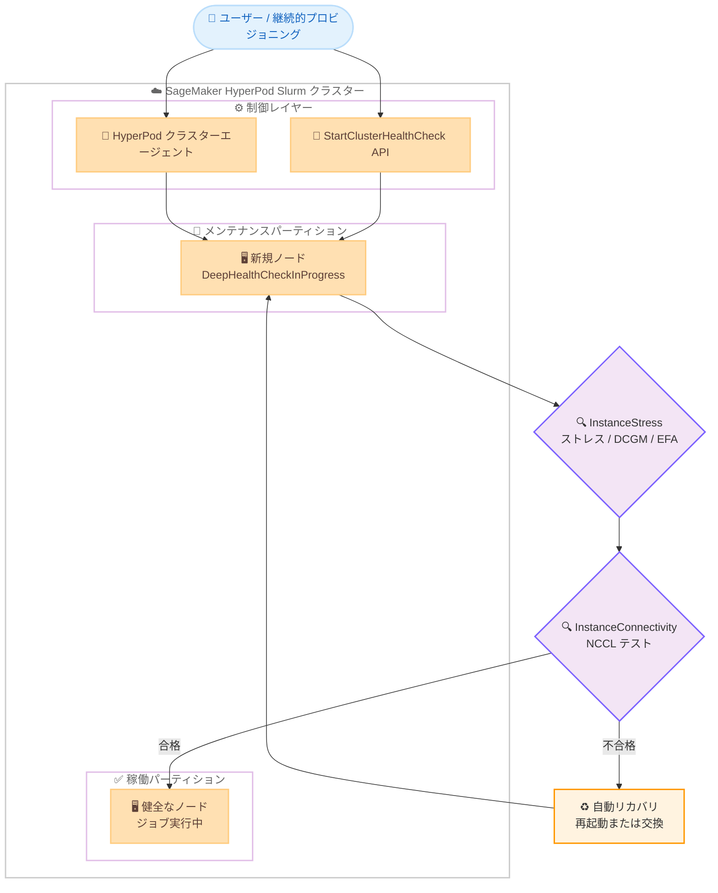

# Amazon SageMaker HyperPod - 継続的プロビジョニングを使用した Slurm クラスターのディープヘルスチェック対応

**リリース日**: 2026 年 7 月 9 日
**サービス**: Amazon SageMaker HyperPod
**機能**: 継続的プロビジョニング (Continuous Provisioning) を使用した Slurm クラスターのディープヘルスチェック

📊 [このアップデートのインフォグラフィックを見る](https://takech9203.github.io/aws-news-summary/20260709-deep-health-check-continuous-slurm.html)
<!-- INFOGRAPHIC_BASE_URL は環境変数から取得 -->

## 概要

Amazon SageMaker HyperPod は、継続的プロビジョニング (Continuous Provisioning) で作成された Slurm オーケストレーションクラスターにおいて、ディープヘルスチェック (Deep Health Checks) をサポートしました。この機能により、稼働中のインスタンスに対して、任意のタイミングで GPU アクセラレーターのヘルス状態を事前に検証できます。大規模な機械学習トレーニングでは、たった 1 台の不健全なノードが数時間分の計算リソースを無駄にし、重要なワークロードを遅延させる可能性があります。ディープヘルスチェックは、こうした問題を事前に検出することを目的としています。

継続的プロビジョニングは、トレーニングを迅速に開始し、インスタンスグループを非同期にスケールできる仕組みです。従来の「全ノードが揃わなければ起動できない」というオールオアナッシング (all-or-nothing) 型の障害を回避します。今回のアップデートにより、この柔軟なプロビジョニング方式と、インスタンスが利用可能になったタイミングでの徹底的なハードウェア検証を組み合わせられるようになりました。

ディープヘルスチェックは、インスタンスグループ全体または特定のインスタンスを対象に、ハードウェアストレステストと接続性テストを実行します。ワーカーノードは容量が確保でき次第、非同期に追加されるため、新しいノードがオンラインになるたびにチェックを実行し、ジョブスケジューリングの前にハードウェアを検証できます。この検証は、すでに稼働中の健全なノードには影響を与えません。この機能は、Amazon SageMaker HyperPod が利用可能なすべてのリージョンで提供されます。

**アップデート前の課題**

- 継続的プロビジョニングで作成した Slurm クラスターでは、稼働中のインスタンスに対して任意のタイミングで GPU アクセラレーターのヘルス状態を事前検証する手段がなかった
- 不健全なノードがジョブに割り当てられると、数時間分の計算リソースが無駄になり、重要なワークロードが遅延するリスクがあった
- ノード単位のハードウェア検証とマルチノード間の通信性能検証を、スケジューリング前に体系的に実行することが難しかった

**アップデート後の改善**

- 継続的プロビジョニングで作成した Slurm クラスターに対して、ハードウェアストレステストと接続性テストを実行し、計算リソースを割り当てる前にノードの健全性を検証できるようになった
- 新しいノードがオンラインになるたびに自動 (on-start) またはオンデマンド (on-demand) でチェックを実行でき、稼働中の健全なノードには影響を与えない
- チェック中のインスタンスはスケジューリングから自動的に隔離され、合格後にサービスへ復帰する。自動ノードリカバリと組み合わせることで、不合格のインスタンスは自動的に再起動または交換される

## アーキテクチャ図



新規ノードはメンテナンスパーティションで隔離され、InstanceStress と InstanceConnectivity のチェックを通過すると稼働パーティションに追加されます。不合格のノードは自動リカバリで再起動または交換されます。

## サービスアップデートの詳細

### 主要機能

1. **ディープヘルスチェックの 2 つの実行方式**
   - **On-start (自動)**: クラスター作成時や `UpdateCluster` によるノード追加時に、インスタンスグループ設定の `OnStartDeepHealthChecks` パラメータで有効化。すべてのノードがワークロードを受け入れる前にハードウェア検証を通過する
   - **On-demand (オンデマンド)**: `StartClusterHealthCheck` API を使用して、既存のクラスターノードに対して任意のタイミングで検証を実行。定期的なヘルスチェックやハードウェア障害が疑われる場合に有用

2. **2 種類のチェックカテゴリ**
   - **InstanceStress**: インスタンスレベルのテスト。CPU、メモリ、ディスクのストレステスト、GPU / PCI デバイス数の検証、DCGM GPU 診断 (レベル 4)、EFA ループバック接続性テストを実行
   - **InstanceConnectivity**: クラスターレベルのテスト。複数ノード間で NCCL (NVIDIA Collective Communications Library) の `all_reduce` 性能テストを実行し、ノード間 GPU 通信のバンド幅を検証。マルチノード GPU 通信機能を持つインスタンスでのみサポート

3. **ノードの隔離と自動リカバリ**
   - チェック中のノードは Slurm のメンテナンス予約 (`hyperpod-deep-health-check`) に配置され、`hyperpod-system-maintenance` パーティションに追加される。これによりテスト中のノードにジョブがスケジュールされることを防ぐ
   - すべてのチェックに合格するとノードは予約から解放され、割り当てられたパーティションで利用可能になる
   - 不合格の場合、ノードは隔離されたまま、自動ノードリカバリにより自動的に再起動または交換され、交換ノードで再度ディープヘルスチェックが実行される

4. **可視性とモニタリング**
   - 進捗と結果は、インスタンスグループレベルおよびインスタンスレベルで、SageMaker AI コンソールと API から確認できる
   - GPU のヘルス状態、ネットワーク接続性、マルチノード通信性能を把握できる
   - `list-cluster-nodes` API や Slurm コマンド (`sinfo`、`scontrol show reservations`、`squeue`) でステータスを確認可能

## 技術仕様

### ディープヘルスチェックの一覧

| カテゴリ | ユーティリティ | 対象 | 説明 | 目安時間 |
|------|------|------|------|------|
| InstanceStress | HARDWARE_CHECK | GPU | `stress-ng` による CPU / メモリ / ディスクのストレステストと GPU / PCI デバイス数の検証 | 約 1-2 分 |
| InstanceStress | DCGM 診断 レベル 4 | GPU | NVIDIA DCGM 診断をレベル 4 で実行 (追加のメモリテストを含む) | 約 45-90 分 (GPU 数による) |
| InstanceStress | EFA | GPU | 接続された EFA デバイスに対するループバックのバンド幅とレイテンシーテスト | 約 2-5 分 |
| InstanceConnectivity | NCCL テスト | GPU | 複数ノード間で NCCL `all_reduce` 性能テストを実行し、ノード間 GPU 通信バンド幅を検証 | 約 5-15 分 (ノード数による) |

### API 変更履歴

| 日付 | サービス | 変更内容 |
|------|----------|----------|
| 2026/07/09 | Amazon SageMaker | `StartClusterHealthCheck` API によるオンデマンドディープヘルスチェックのトリガーに対応。`CreateCluster` / `UpdateCluster` のインスタンスグループ設定に `OnStartDeepHealthChecks` パラメータを追加 |

<!-- 本アップデートに対応する API 変更は awsapichanges.com の当該期間のフィードには未掲載のため、AWS API リファレンスを参照 -->

### 設定 (On-start 有効化)

```json
{
  "InstanceGroupName": "worker-group",
  "InstanceType": "ml.p4d.24xlarge",
  "InstanceCount": 4,
  "ExecutionRole": "arn:aws:iam::111122223333:role/my-role",
  "ThreadsPerCore": 1,
  "OnStartDeepHealthChecks": ["InstanceStress", "InstanceConnectivity"]
}
```

インスタンスグループ設定に `OnStartDeepHealthChecks` を指定することで、ノードの起動時に自動でディープヘルスチェックが実行されます。

## 設定方法

### 前提条件

1. Amazon SageMaker HyperPod の Slurm オーケストレーションクラスターが継続的プロビジョニングで構成されていること
2. **最新の AMI バージョンへの更新が必須**。`UpdateClusterSoftware` を実行して最新の AMI に更新する (古い AMI ではディープヘルスチェックが正しく動作しない可能性がある)
3. 対象インスタンスがアクセラレーテッドインスタンスファミリー (g5、p4、p5 など) であること。非アクセラレーテッドインスタンスは自動的にスキップされる

### 手順

#### ステップ 1: クラスターソフトウェアの更新

```bash
aws sagemaker update-cluster-software \
  --cluster-name my-slurm-cluster
```

最新の AMI バージョンに更新し、ディープヘルスチェック機能を利用可能にします。

#### ステップ 2: On-start ディープヘルスチェックの有効化

```bash
aws sagemaker update-cluster \
  --cluster-name my-slurm-cluster \
  --instance-groups '[
    {
      "InstanceGroupName": "worker-group",
      "InstanceType": "ml.p4d.24xlarge",
      "InstanceCount": 8,
      "ExecutionRole": "arn:aws:iam::111122223333:role/my-role",
      "ThreadsPerCore": 1,
      "OnStartDeepHealthChecks": ["InstanceStress", "InstanceConnectivity"]
    }
  ]'
```

ワーカーグループに `OnStartDeepHealthChecks` を設定することで、スケールアップ時に追加される新規ノードが自動的にディープヘルスチェックを通過してからワークロードを受け入れるようになります。既存ノードと実行中のジョブには影響しません。

#### ステップ 3: On-demand ディープヘルスチェックの実行

```bash
aws sagemaker start-cluster-health-check \
  --cluster-name my-slurm-cluster \
  --deep-health-check-configurations '[
    {
      "InstanceGroupName": "worker-group",
      "DeepHealthChecks": ["InstanceStress", "InstanceConnectivity"]
    }
  ]'
```

既存のクラスターノードに対して、任意のタイミングでディープヘルスチェックを実行します。1 つのクラスターにつき、同時にアクティブにできるオンデマンドリクエストは 1 つのみです。

#### ステップ 4: ステータスのモニタリング

```bash
aws sagemaker list-cluster-nodes \
  --cluster-name my-slurm-cluster
```

ディープヘルスチェック実行中のノードは、`InstanceStatus.Status` が `DeepHealthCheckInProgress` と表示されます。コントローラーノードでは `sinfo -a -N -l` や `scontrol show reservations` で Slurm 側の状態を確認できます。

## メリット

### ビジネス面

- **計算リソースの無駄削減**: 不健全なノードを事前に検出することで、数時間分の計算リソースの浪費や重要なワークロードの遅延を防止できる
- **トレーニングの迅速な開始**: 継続的プロビジョニングにより、全ノードが揃うのを待たずにトレーニングを開始し、非同期にスケールできる
- **運用負荷の軽減**: 自動ノードリカバリと組み合わせることで、障害ノードの再起動や交換が自動化され、手動対応が不要になる

### 技術面

- **包括的なハードウェア検証**: CPU、メモリ、ディスク、GPU、EFA、そしてマルチノード間の NCCL 通信まで、階層的に検証できる
- **非破壊的な検証**: チェック中のノードはメンテナンス予約で隔離されるため、稼働中の健全なノードや実行中のジョブに影響を与えない
- **自動リカバリとの連携**: auto-resume との組み合わせでは、交換ノードのチェック完了を待たずに、他の利用可能なノードでジョブを再開できる

## デメリット・制約事項

### 制限事項

- ディープヘルスチェックには最新の AMI バージョンが必須。事前に `UpdateClusterSoftware` の実行が必要
- ディープヘルスチェックはワーカーノードのみが対象。コントローラーノードとログインノードは対象外
- 1 つのクラスターにつき、同時にアクティブにできるオンデマンドリクエストは 1 つのみ
- `InstanceConnectivity` は、マルチノード GPU 通信機能を持つインスタンスでのみサポート
- オンデマンドチェックでノードの再起動や交換が発生した場合、交換ノードでのディープヘルスチェックの再実行は、そのインスタンスグループで `OnStartDeepHealthChecks` が有効な場合のみ行われる

### 考慮すべき点

- DCGM 診断 (レベル 4) は GPU 数によって約 45-90 分かかるため、チェック中はインスタンスがワークロードで利用できない時間が生じる
- オンデマンドチェックは実行中のジョブを中断しないが、ジョブが 10 分以内に完了しない場合、そのノードはチェックからスキップされる
- ディープヘルスチェック有効時は、交換ノードが全チェックに合格するまで利用可能にならないため、追加容量を必要とするジョブは待機する場合がある

## ユースケース

### ユースケース 1: 大規模分散トレーニング開始前の一括検証

**シナリオ**: 数百 GPU 規模の分散トレーニングを開始する前に、すべてのワーカーノードのハードウェアとノード間通信性能を検証したい。

**実装例**:
```bash
aws sagemaker start-cluster-health-check \
  --cluster-name training-cluster \
  --deep-health-check-configurations '[
    {"InstanceGroupName": "worker-group", "DeepHealthChecks": ["InstanceStress", "InstanceConnectivity"]}
  ]'
```

**効果**: NCCL 通信バンド幅の低下や GPU 障害を事前に検出し、トレーニング途中での失敗による計算リソースの浪費を回避できる。

### ユースケース 2: 継続的プロビジョニングによるスケールアップ時の自動検証

**シナリオ**: 容量が確保でき次第、ワーカーノードを非同期に追加しながらトレーニングをスケールしたい。

**実装例**:
```json
{
  "InstanceGroupName": "worker-group",
  "OnStartDeepHealthChecks": ["InstanceStress", "InstanceConnectivity"]
}
```

**効果**: 新規ノードがオンラインになるたびに自動的に検証され、健全なノードのみがジョブスケジューリングの対象になる。稼働中のノードには影響しない。

### ユースケース 3: ハードウェア障害が疑われる場合の定期検証

**シナリオ**: 長時間稼働しているクラスターで、性能低下やジョブの失敗が散発的に発生しており、特定のノードにハードウェア問題がないか確認したい。

**実装例**:
```bash
aws sagemaker start-cluster-health-check \
  --cluster-name long-running-cluster \
  --deep-health-check-configurations '[
    {"InstanceGroupName": "worker-group", "DeepHealthChecks": ["InstanceStress"]}
  ]'
```

**効果**: 実行中のジョブを中断せずに検証を実行し、問題のあるノードを自動リカバリで再起動または交換することで、クラスターの健全性を維持できる。

## 料金

ディープヘルスチェック機能自体に追加料金はかかりません。ただし、ディープヘルスチェックの実行中もインスタンスは起動状態にあるため、対象インスタンスの通常の SageMaker HyperPod 利用料金が発生します。DCGM 診断など時間のかかるチェックでは、その分の実行時間に対する料金が発生する点に留意してください。詳細は Amazon SageMaker の料金ページを参照してください。

## 利用可能リージョン

Amazon SageMaker HyperPod が利用可能なすべてのリージョンで提供されます。

## 関連サービス・機能

- **AWS Slurm オーケストレーション**: HyperPod クラスターのジョブスケジューリングを担い、ディープヘルスチェック中はメンテナンス予約でノードを隔離する
- **自動ノードリカバリ (Auto Node Recovery)**: ディープヘルスチェックに不合格のノードを自動的に再起動または交換する
- **NVIDIA DCGM / NCCL / EFA**: それぞれ GPU 診断、マルチノード集合通信性能、高速ネットワーク接続性の検証に使用される
- **Amazon CloudWatch**: クラスターレベルのディープヘルスチェックログを `/aws/sagemaker/Clusters/<cluster_name>/<cluster_id>` のロググループに保存する

## 参考リンク

- 📊 [インフォグラフィック](https://takech9203.github.io/aws-news-summary/20260709-deep-health-check-continuous-slurm.html)
- [公式発表 (What's New)](https://aws.amazon.com/about-aws/whats-new/2026/07/deep-health-check-continuous-slurm/)
- [ドキュメント: ディープヘルスチェック (Slurm)](https://docs.aws.amazon.com/sagemaker/latest/dg/sagemaker-hyperpod-resiliency-slurm-deep-health-checks.html)
- [API リファレンス: StartClusterHealthCheck](https://docs.aws.amazon.com/sagemaker/latest/APIReference/API_StartClusterHealthCheck.html)
- [料金ページ (Amazon SageMaker)](https://aws.amazon.com/sagemaker/pricing/)

## まとめ

このアップデートにより、継続的プロビジョニングで作成した Slurm クラスターでも、稼働中のインスタンスに対して任意のタイミングで GPU アクセラレーターのヘルス状態を検証できるようになりました。On-start と On-demand の両方式に対応し、自動ノードリカバリと組み合わせることで、不健全なノードによる計算リソースの浪費を防ぎ、大規模トレーニングの信頼性を高められます。SageMaker HyperPod で大規模な機械学習ワークロードを運用している場合は、まず `UpdateClusterSoftware` で AMI を最新化し、重要なインスタンスグループで `OnStartDeepHealthChecks` を有効化することを推奨します。
