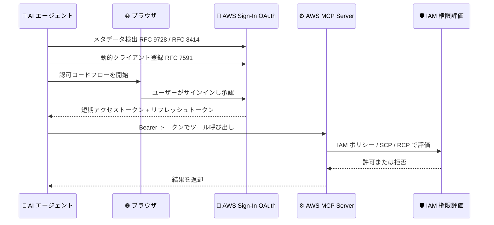

# AWS MCP Server - OAuth サポート

**リリース日**: 2026 年 7 月 9 日
**サービス**: AWS MCP Server (AWS Sign-In)
**機能**: OAuth support for the AWS MCP Server

📊 [このアップデートのインフォグラフィックを見る](https://takech9203.github.io/aws-news-summary/20260709-oauth-aws-mcp-server.html)
<!-- INFOGRAPHIC_BASE_URL は環境変数から取得 -->

## 概要

AWS は、AI エージェントを AWS Sign-In 経由で AWS MCP Server に直接接続できる OAuth サポートを発表しました。エージェントは業界標準の OAuth を使用して接続するため、追加の認証ソフトウェアを導入する必要がありません。既存の AWS アイデンティティ、サインイン方法、IAM 権限、ガバナンスコントロールがそのまま適用されます。

Model Context Protocol (MCP) は、AI エージェントが外部ツールやデータソースと連携するための標準プロトコルです。AWS MCP Server は、AI エージェントが AWS のサービスや情報にアクセスするための接続先を提供します。今回のアップデートにより、開発者はブラウザを用いた対話型 (interactive) 認可、またはプログラムによる非対話型 (headless) 認可のいずれかでエージェントを承認できます。管理者は、使い慣れた IAM ポリシーに加え、新しい OAuth 機能 (グローバル条件キー、トークンイントロスペクションと失効 API、動的クライアント登録、CloudTrail 監査イベント) を用いて OAuth アクセスを統制できます。

対象ユーザーは、AWS 環境で AI エージェントを開発する開発者と、そのアクセスをガバナンスする管理者です。エージェントの承認によって MCP へのアクセスが委任されますが、新しい AWS 権限が付与されるわけではなく、リクエストは引き続き既存の IAM ポリシー、SCP、RCP、権限境界に基づいて評価されます。

**アップデート前の課題**

- AI エージェントを AWS リソースに接続する際、静的な認証情報やカスタムの認証ソフトウェアを別途用意する必要があった
- エージェント接続に対して、既存の IAM ガバナンスと同等のきめ細かな制御や監査を適用しにくかった
- トークン単位での失効や状態確認といった、OAuth ベースの標準的な運用手段が利用できなかった

**アップデート後の改善**

- 業界標準の OAuth を用いて、追加の認証ソフトウェアなしで AI エージェントを AWS MCP Server に接続できるようになった
- 既存の AWS アイデンティティ、IAM 権限、ガバナンスコントロールをそのまま適用できるようになった
- グローバル条件キー、トークンイントロスペクションと失効 API、動的クライアント登録、CloudTrail 監査イベントによって、エージェントアクセスの制御と可視性が向上した

## アーキテクチャ図



上図は、AI エージェントが AWS Sign-In の OAuth エンドポイントを検出し、認可コードフローで短期トークンを取得したうえで、AWS MCP Server へのリクエストが既存の IAM 権限によって評価される流れを示しています。

## サービスアップデートの詳細

### 主要機能

1. **AWS Sign-In 経由の OAuth 接続**
   - AI エージェントが AWS Sign-In の OAuth エンドポイントを検出し、標準の認可コードフローを実行する
   - 検出には保護対象リソースメタデータ (RFC 9728)、OAuth 認可サーバーメタデータ (RFC 8414)、動的クライアント登録 (RFC 7591) の各標準を使用する
   - AWS Sign-In が短期のアクセストークンとリフレッシュトークンを発行し、トークンの自動更新を処理するため、繰り返しのサインインが不要になる

2. **対話型 (interactive) 認可**
   - 開発者向け AI エージェントのために、ブラウザを用いた認証を提供する
   - ネイティブな IAM 認証情報、IAM Identity Center、フェデレーションされたサードパーティプロバイダー (Okta、Ping Identity など) の 3 種類のサインイン方法をサポートする

3. **非対話型 (headless) 認可**
   - 既存の AWS 認証情報を持ち、ブラウザを使用しないエージェントやアプリケーション向けの認可方式
   - OAuth のクライアントクレデンシャルグラント (client credentials grant) を使用し、静的なクライアントシークレットではなく SigV4 で認証する

4. **管理者向けのガバナンス機能**
   - 使い慣れた IAM ポリシーに加え、OAuth 固有の条件キーやグローバル条件キーでアクセスを制御する
   - トークンイントロスペクションと失効 API により、トークン単位の状態確認と失効が可能
   - CloudTrail による監査イベントで、認可リクエスト、トークン発行、失効、イントロスペクションを記録する

## 技術仕様

### IAM アクションとリソース

| 項目 | 詳細 |
|------|------|
| `signin:AuthorizeOAuth2Access` | 認可コードフローによる対話型サインインを許可 |
| `signin:CreateOAuth2Token` | 認可コード、リフレッシュトークン、クライアントクレデンシャルによるトークン取得を許可 |
| `signin:IntrospectOAuth2Token` | トークンイントロスペクション API の実行を許可 |
| `signin:RevokeOAuth2Token` | トークン失効 API の実行を許可 |
| リソース ARN 例 | `arn:aws:signin:us-east-1:012345678910:service-principal/aws-mcp.amazonaws.com` |
| サポートするグラントタイプ | `authorization_code`、`refresh_token`、`client_credentials` |
| マネージドポリシー | `arn:aws:iam::aws:policy/AWSMCPSignInOAuthAccessPolicy` |

### OAuth 固有の条件キーとグローバル条件キー

| 条件キー | 詳細 |
|------|------|
| `signin:OAuthRedirectUri` | トークンの送信先 (リダイレクト URI) を制限する (例: `http://localhost:*`) |
| `signin:OAuthGrantType` | 許可するグラントタイプを制限する |
| `aws:SignInSessionArn` | グローバル条件キー。侵害された特定のセッションのみを、他のセッションに影響を与えずに拒否できる |

### IAM ポリシー例

```json
{
  "Version": "2012-10-17",
  "Statement": [
    {
      "Effect": "Allow",
      "Action": [
        "signin:AuthorizeOAuth2Access",
        "signin:CreateOAuth2Token"
      ],
      "Resource": "arn:aws:signin:us-east-1:012345678910:service-principal/aws-mcp.amazonaws.com",
      "Condition": {
        "StringLike": {
          "signin:OAuthRedirectUri": "http://localhost:*"
        },
        "StringEquals": {
          "signin:OAuthGrantType": "authorization_code"
        }
      }
    }
  ]
}
```

## 設定方法

### 前提条件

1. AWS MCP Server に接続する AI エージェントまたは MCP クライアント (例: Claude Code) を用意する
2. 対象の IAM ロールまたはユーザーに OAuth アクセス権限を付与できること
3. 非対話型認可を使用する場合、ヘッドレスサポートに対応した最新の SDK または CLI を用意すること

### 手順

#### ステップ1: マネージドポリシーのアタッチ

```bash
aws iam attach-role-policy \
  --role-name <MyRole> \
  --policy-arn arn:aws:iam::aws:policy/AWSMCPSignInOAuthAccessPolicy
```

対象の IAM ロールに、OAuth による AWS MCP Server アクセスを許可するマネージドポリシー `AWSMCPSignInOAuthAccessPolicy` をアタッチします。

#### ステップ2: MCP エンドポイントの追加

```bash
claude mcp add --transport http aws-mcp https://aws-mcp.us-east-1.api.aws/mcp
```

MCP クライアント (この例では Claude Code) に AWS MCP Server のエンドポイントを HTTP トランスポートで登録します。

#### ステップ3: 認可と検証

ブラウザで認可を承認します (既存のサインインセッションがある場合は再利用されます)。承認後、Claude Code で `/mcp` を実行して接続状態を確認し、ツールを呼び出して動作を検証します。

非対話型 (headless) の場合は、次のコマンドでトークンを取得します。

```bash
aws signin create-oauth2-token-with-iam \
  --grant-type client_credentials \
  --resource aws-mcp.amazonaws.com \
  --region us-east-1
```

このコマンドは、SigV4 認証を用いてクライアントクレデンシャルグラントでトークンを取得します。レスポンスには Bearer 形式の `accessToken` と、有効期限 `expiresIn` (3600 秒) が含まれます。

## メリット

### ビジネス面

- **導入の容易さ**: 追加の認証ソフトウェアを導入せず、業界標準の OAuth で AI エージェントを接続できる
- **既存資産の活用**: 既存の AWS アイデンティティ、サインイン方法、IAM 権限、ガバナンスをそのまま利用できる
- **監査性の向上**: CloudTrail による監査イベントで、エージェントアクセスの説明責任とコンプライアンス対応を強化できる

### 技術面

- **標準準拠**: RFC 9728、RFC 8414、RFC 7591、認可コードフローといった OAuth 標準に準拠している
- **短期トークンと自動更新**: 短期アクセストークンとリフレッシュトークンにより、静的な長期認証情報の露出を避けられる
- **きめ細かな制御**: OAuth 固有の条件キーとグローバル条件キー `aws:SignInSessionArn` により、リダイレクト URI やグラントタイプ、セッション単位での制御が可能

## デメリット・制約事項

### 制限事項

- 非対話型 (headless) 認可を利用するには、対応した最新の SDK または CLI への更新が必要になる場合がある
- トークンイントロスペクションと失効の API は、同一アカウント内にスコープされる
- アクセスは名前付きの OAuth スコープではなく、IAM 権限と条件キーによって統制される

### 考慮すべき点

- エージェントの承認は MCP へのアクセスを委任するものであり、新しい AWS 権限を付与しない。最終的なアクセス可否は IAM ポリシー、SCP、RCP、権限境界で決まる
- 侵害されたセッションへの対応として、`aws:SignInSessionArn` を用いた拒否や、リフレッシュトークンの失効の運用手順を事前に整備しておくことが望ましい

## ユースケース

### ユースケース1: 開発者の AI エージェントを対話型で接続する

**シナリオ**: 開発者が Claude Code などの AI エージェントから AWS MCP Server を利用し、AWS の情報を参照しながら開発を進めたい。

**実装例**:
```bash
claude mcp add --transport http aws-mcp https://aws-mcp.us-east-1.api.aws/mcp
# ブラウザで認可を承認後、/mcp で接続を確認
```

**効果**: ブラウザベースのサインインで、既存の IAM 認証情報や IAM Identity Center、サードパーティプロバイダーをそのまま用いてエージェントを安全に接続できる。

### ユースケース2: ヘッドレス環境の自動化エージェント

**シナリオ**: ブラウザを持たない CI/CD やバックグラウンド処理のエージェントが、既存の AWS 認証情報を用いて MCP Server にアクセスしたい。

**実装例**:
```bash
aws signin create-oauth2-token-with-iam \
  --grant-type client_credentials \
  --resource aws-mcp.amazonaws.com \
  --region us-east-1
```

**効果**: 静的なクライアントシークレットを保持することなく、SigV4 認証で短期トークンを取得し、非対話的に MCP Server へアクセスできる。

### ユースケース3: セッション侵害時の限定的な失効

**シナリオ**: 特定のエージェントセッションが侵害された疑いがあり、他のセッションに影響を与えずに該当セッションのみを無効化したい。

**実装例**:
```json
{
  "Effect": "Deny",
  "Action": "*",
  "Resource": "*",
  "Condition": {
    "StringEquals": {
      "aws:SignInSessionArn": "arn:aws:signin:us-east-1:012345678910:session/<compromised-session>"
    }
  }
}
```

**効果**: グローバル条件キー `aws:SignInSessionArn` を用いた拒否や、リフレッシュトークンの失効により、他の正常なセッションを維持したまま影響範囲を限定できる。

## 料金

公式発表および AWS Security Blog では、本機能に関する追加料金についての明示的な記載はありません。AWS MCP Server や AWS Sign-In の利用にあたっては、各サービスの料金ページで最新の情報を確認してください。

## 利用可能リージョン

公式発表ではリージョンに関する明示的な記載はありません。AWS Security Blog の手順例では `us-east-1` のエンドポイント (`https://aws-mcp.us-east-1.api.aws/mcp`) が使用されています。最新の対応リージョンは公式ドキュメントで確認してください。

## 関連サービス・機能

- **AWS Sign-In**: OAuth のエンドポイント検出、トークン発行、自動更新を担う。ネイティブ IAM、IAM Identity Center、サードパーティフェデレーションをサポート
- **AWS IAM**: OAuth アクセスの認可を IAM アクション、リソース、条件キーで制御する。SCP、RCP、権限境界も引き続き適用される
- **AWS CloudTrail**: 認可リクエスト、トークン発行、失効、イントロスペクションなどの OAuth イベントを記録し、監査に活用できる
- **Model Context Protocol (MCP)**: AI エージェントが外部ツールやデータソースと連携するための標準プロトコル

## 参考リンク

- 📊 [インフォグラフィック](https://takech9203.github.io/aws-news-summary/20260709-oauth-aws-mcp-server.html)
- [公式発表 (What's New)](https://aws.amazon.com/about-aws/whats-new/2026/07/oauth-aws-mcp-server/)
- [AWS Security Blog: Introducing OAuth support for AWS MCP Server](https://aws.amazon.com/blogs/security/introducing-oauth-support-for-aws-mcp-server/)
- [AWS Sign-In User Guide: Sign-In with OAuth 2.0](https://docs.aws.amazon.com/signin/latest/userguide/oauth-sign-in-overview.html)
- [Agent Toolkit User Guide: Setting up the AWS MCP Server](https://docs.aws.amazon.com/agent-toolkit/latest/userguide/getting-started-aws-mcp-server.html)

## まとめ

OAuth サポートにより、AI エージェントを追加の認証ソフトウェアなしで、業界標準の OAuth と既存の AWS アイデンティティ・IAM ガバナンスを用いて AWS MCP Server に接続できるようになりました。対話型と非対話型の両方の認可に対応し、条件キー、トークンイントロスペクションと失効、CloudTrail 監査により、きめ細かな制御と可視性を実現します。AI エージェントを AWS 環境で運用している場合は、`AWSMCPSignInOAuthAccessPolicy` の付与とエンドポイント設定を検証し、セッション失効の運用手順を整備することを推奨します。
