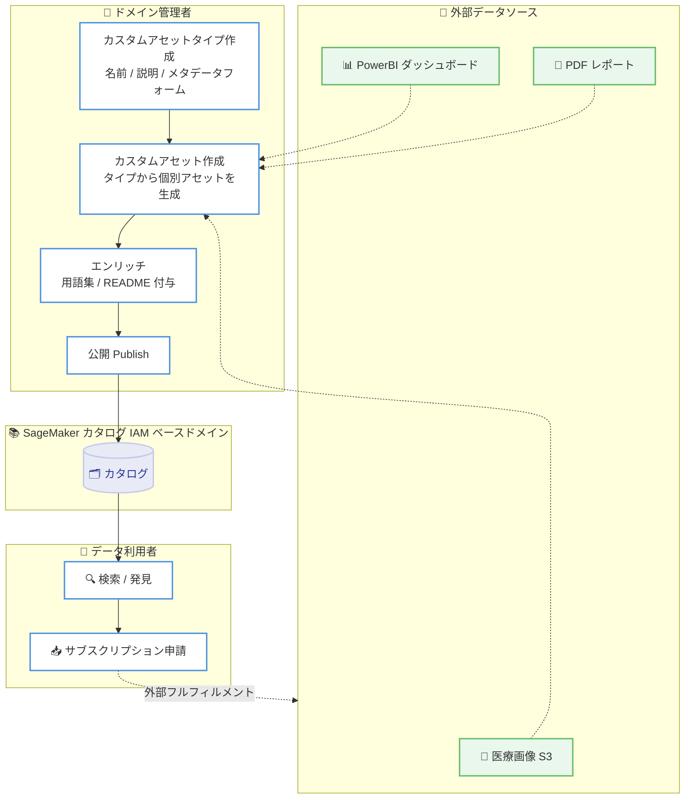

# Amazon SageMaker Unified Studio - IAM ベースドメインでのカスタムアセットタイプ

**リリース日**: 2026 年 7 月 9 日
**サービス**: Amazon SageMaker Unified Studio
**機能**: カスタムアセットタイプ (Custom Asset Types) for IAM-based domains

📊 [このアップデートのインフォグラフィックを見る](https://takech9203.github.io/aws-news-summary/20260709-smus-custom-asset-types-iam.html)
<!-- INFOGRAPHIC_BASE_URL は環境変数から取得 -->

## 概要

Amazon SageMaker Unified Studio は、IAM ベースドメインにおいてカスタムアセットタイプをサポートするようになりました。この機能により、ドメイン管理者は形式を問わずあらゆるアセットをカタログに登録できます。例えば、Amazon S3 に保存された医療画像ファイル、PowerBI で作成された収益ダッシュボード、PDF 形式のリサーチレポートなど、SageMaker Unified Studio がネイティブにサポートしていない形式のアセットも対象となります。

カスタムアセットタイプは、基盤となる形式にかかわらず、すべてのアセットを SageMaker カタログに集約します。これにより、チームは別のツールやプロセスを使うことなく、アセットの検索、発見、サブスクリプションを一元的に行えます。管理者は名前、説明、およびオプションのメタデータフォームを指定してカスタムアセットタイプを作成します。そのタイプから個々のアセットを作成し、用語集の用語 (glossary terms) や README ドキュメントで補足情報を付与したうえで、発見可能な状態として公開します。

この機能は、Amazon SageMaker Unified Studio が利用可能なすべての AWS リージョンで提供されます。

**アップデート前の課題**

- 以前は SageMaker Unified Studio がネイティブにサポートするアセット形式 (データベーステーブル、ダッシュボード、機械学習モデルなど) しかカタログに登録できなかった
- 医療画像、BI ダッシュボード、PDF レポートなど独自形式やサードパーティプラットフォームのアセットは、別のツールやプロセスで管理する必要があった
- 組織内のアセットが形式ごとに分散し、統一された検索・発見体験を提供できなかった

**アップデート後の改善**

- 今回のアップデートにより、形式を問わずあらゆるアセットをカスタムアセットタイプとしてカタログに登録できるようになった
- 独自形式やサードパーティ由来のアセットも、SageMaker Unified Studio のメタデータ管理、発見、サブスクリプションのフローをそのまま活用できるようになった
- すべての組織アセットに対して統一された発見体験とガバナンスの効いたサブスクリプションワークフローを提供できるようになった

## アーキテクチャ図

上図は、管理者がカスタムアセットタイプを定義してアセットを作成・公開し、利用者がカタログ経由で検索・サブスクリプション申請するまでの流れを示しています。実際のデータ提供 (フルフィルメント) はアセット所有者の外部メカニズムで管理されます。

## サービスアップデートの詳細

### 主要機能

1. **カスタムアセットタイプの作成**
   - ドメイン管理者は名前 (1〜128 文字、作成後は変更不可) と説明 (最大 2,048 文字) を指定してタイプを作成する
   - 各アセットが保持すべきフィールドを定義するメタデータフォームを、必須またはオプションとして関連付けできる
   - アセットタイプはバージョン管理され、更新操作のたびに新しいリビジョンが作成される

2. **カスタムアセットの作成とエンリッチ**
   - 作成したタイプから個々のカスタムアセットを生成する (名前は 1〜256 文字、必須)
   - 作成直後のアセットはドラフト状態で保存される
   - 用語集の用語や README ドキュメントを付与し、人間と AI エージェントの双方に向けたビジネスコンテキストを追加できる

3. **公開・発見・サブスクリプション**
   - エンリッチ後にアセットを公開すると、カタログ検索で発見可能になる
   - 利用者は名前、タイプ、用語集の用語、日付でアセットをフィルタリングして検索できる
   - サブスクリプション申請は他のカタログアセットと同じガバナンスの効いたワークフローで行う

## 技術仕様

### 標準アセットタイプとカスタムアセットタイプの比較

| 項目 | 標準アセットタイプ | カスタムアセットタイプ |
|------|--------------------|------------------------|
| 対象形式 | データベーステーブル、ダッシュボード、ML モデルなどネイティブ対応形式 | 形式を問わない任意のアセット |
| サブスクリプション時のアクセス付与 | Lake Formation 権限が承認時に自動付与 | 外部フルフィルメントプロセスで管理 (自前で用意) |
| メタデータ管理・発見・サブスクリプション | 利用可能 | 利用可能 |
| バージョン管理 | 対応 | 対応 (リビジョン管理) |

### カスタムアセットタイプの制約

| 項目 | 詳細 |
|------|------|
| 名前 | 1〜128 文字、作成後は変更不可 (immutable) |
| 説明 | 最大 2,048 文字、編集可能 |
| アセット名 | 1〜256 文字、必須 |
| 削除条件 | 当該タイプから作成されたアセットが 1 つも存在しない場合のみ削除可能 |

### API 変更履歴

今回のアップデートに直接対応する公開 API 変更履歴は確認できませんでした。機能はコンソール (Domain management > Custom asset types) から操作します。

## 設定方法

### 前提条件

1. Amazon SageMaker Unified Studio の IAM ベースドメインが構成されていること
2. カスタムアセットタイプを作成するドメイン管理者権限を保有していること
3. 必要に応じて、アセットに付与するメタデータフォームや用語集を事前に準備すること

### 手順

#### ステップ1: カスタムアセットタイプの作成

1. 左ナビゲーションバーで **Domain management** > **Custom asset types** に移動する
2. 右上の **Create** ドロップダウンから **Create custom asset type** を選択する
3. **Name** (一意の名前) と、必要に応じて **Description** を入力する
4. **Create custom asset type** を選択する

この操作により、任意の形式のアセットを表現するためのタイプがカタログに定義されます。作成後、必要に応じて **Add metadata forms** でメタデータフォームを必須またはオプションとして関連付けます。

#### ステップ2: カスタムアセットの作成とエンリッチ

1. 対象のカスタムアセットタイプの詳細ビューに移動する
2. **Create custom asset** を選択し、**Name** と任意の **Description** を設定する
3. 作成されたドラフト状態のアセットに、用語集の用語や README ドキュメントを付与してエンリッチする

この操作により、ビジネスコンテキストを付加した発見しやすいアセットを準備できます。

#### ステップ3: 公開と利用

エンリッチが完了したアセットを公開すると、ドメイン内の利用者がカタログ検索で発見できるようになります。利用者は名前・タイプ・用語集の用語でフィルタリングして検索し、標準のワークフローでサブスクリプションを申請します。カスタムアセットのアクセス提供は外部フルフィルメントで行う点に注意してください。

## メリット

### ビジネス面

- **サイロの解消**: 形式や保管場所が異なるアセットを単一のカタログに集約し、組織横断の統一された発見体験を実現する
- **ツールの削減**: 別々のツールやプロセスを使わずに、あらゆるアセットの検索・発見・サブスクリプションを一元化できる
- **ガバナンスの向上**: 外部フルフィルメントのアセットにも、統制の効いたサブスクリプションワークフローを適用できる

### 技術面

- **柔軟なスキーマ定義**: メタデータフォームで各アセットタイプのフィールドを標準化し、作成時にスキーマ検証を行える
- **バージョン管理**: アセットタイプはリビジョン管理され、過去のバージョンを参照できる
- **AI エージェント対応**: 用語集や README により、人間だけでなく AI エージェントが利用できるビジネスコンテキストを付与できる

## デメリット・制約事項

### 制限事項

- カスタムアセットタイプは IAM ベースドメインでのみ利用可能
- サブスクリプション時のデータアクセス提供 (フルフィルメント) は自前で用意する必要がある。標準テーブルのように Lake Formation 権限が自動付与されるわけではない
- アセットタイプの名前は作成後に変更できない
- 当該タイプから作成されたアセットが存在する場合、そのタイプは削除できない

### 考慮すべき点

- サブスクリプション承認は SageMaker Unified Studio 上で発見・メタデータへのアクセスを付与するのみで、実データの提供はアセット所有者側のメカニズムに依存する
- メタデータフォームや用語集を事前に設計することで、標準化と発見性が向上する

## ユースケース

### ユースケース1: 医療画像データのカタログ化

**シナリオ**: Amazon S3 に保存された DICOM などの医療画像ファイルを、研究チームが横断的に検索・利用できるようにしたい。

**効果**: 画像ファイルをカスタムアセットとしてカタログに登録し、用語集や README で診断部位・撮像条件などのコンテキストを付与することで、研究者が必要な画像を素早く発見できる。

### ユースケース2: BI ダッシュボードの統合発見

**シナリオ**: PowerBI で作成された収益ダッシュボードを、SageMaker Unified Studio のカタログから他のデータ資産と一緒に発見したい。

**効果**: ダッシュボードをカスタムアセットとして登録することで、データテーブルや ML モデルと同じカタログ上で検索でき、利用者は統一されたワークフローでアクセスを申請できる。

### ユースケース3: リサーチレポートのナレッジ共有

**シナリオ**: PDF 形式のリサーチレポートを組織全体のナレッジとして共有し、AI エージェントからも参照できるようにしたい。

**効果**: レポートをカスタムアセットとして登録し、README でビジネスコンテキストを付与することで、人間と AI エージェントの双方がレポートを発見・活用できる。

## 料金

カスタムアセットタイプの利用に関する追加料金の詳細は、Amazon SageMaker Unified Studio の料金ページを参照してください。カタログ機能は SageMaker Unified Studio の一部として提供されます。

## 利用可能リージョン

Amazon SageMaker Unified Studio が利用可能なすべての AWS リージョンで提供されます。

## 関連サービス・機能

- **Amazon S3**: 医療画像ファイルなど、カスタムアセットの実体が保管される代表的なストレージ
- **AWS Lake Formation**: 標準アセットのサブスクリプション時に権限を自動付与する仕組み (カスタムアセットは外部フルフィルメント)
- **メタデータフォーム / 用語集 (Glossary)**: カスタムアセットタイプのスキーマ定義とビジネスコンテキスト付与に利用

## 参考リンク

- 📊 [インフォグラフィック](https://takech9203.github.io/aws-news-summary/20260709-smus-custom-asset-types-iam.html)
- [公式発表 (What's New)](https://aws.amazon.com/about-aws/whats-new/2026/07/smus-custom-asset-types-iam/)
- [ドキュメント (Custom asset types)](https://docs.aws.amazon.com/sagemaker-unified-studio/latest/userguide/catalog-iam-custom-asset-types.html)

## まとめ

このアップデートにより、Amazon SageMaker Unified Studio の IAM ベースドメインで、形式を問わずあらゆるアセットをカタログに登録できるようになりました。医療画像や BI ダッシュボード、PDF レポートといった多様なアセットを単一のカタログに集約し、統一された発見とガバナンスの効いたサブスクリプションを実現できます。組織内にサイロ化したデータ資産を抱えるチームは、メタデータフォームや用語集の設計を進めながら、カスタムアセットタイプの活用を検討することをお勧めします。
