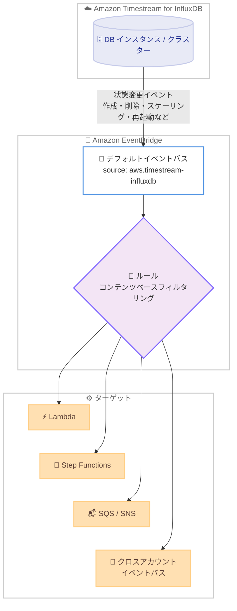

# Amazon Timestream for InfluxDB - データベース状態変更イベントの Amazon EventBridge への発行

**リリース日**: 2026 年 7 月 9 日
**サービス**: Amazon Timestream for InfluxDB
**機能**: データベース状態変更イベントの Amazon EventBridge への発行

📊 [このアップデートのインフォグラフィックを見る](https://takech9203.github.io/aws-news-summary/20260709-timestream-influxdb-eventbridge.html)
<!-- INFOGRAPHIC_BASE_URL は環境変数から取得 -->

## 概要

Amazon Timestream for InfluxDB は、データベースインスタンスまたはクラスターが状態変更を行った際に、Amazon EventBridge へイベントを発行できるようになりました。イベントは、作成、削除、コンピューティングおよびストレージのスケーリング、パラメータグループの更新、メンテナンスウィンドウ、再起動などのライフサイクル操作に対して発行され、成功時と失敗時の両方をカバーします。

これにより、お客様は API をポーリングすることなく、EventBridge ルールを使用してデータベース操作にプログラムで反応できます。イベントはソース `aws.timestream-influxdb` としてデフォルトの EventBridge イベントバスに発行され、コンテンツベースのフィルタリングと、任意の EventBridge ターゲット (Lambda、Step Functions、SQS、SNS、クロスアカウントイベントバス) へのルーティングをサポートします。

この機能は、運用の自動化、障害の即時検知、監査証跡の保持といったユースケースを、追加のポーリング処理を実装することなく実現します。Amazon Timestream for InfluxDB が利用可能なすべての AWS リージョンで提供されます。

**アップデート前の課題**

- 以前はデータベースインスタンスやクラスターの状態を把握するために、API を定期的にポーリングする必要があった
- 以前はスケーリングや再起動などの操作完了を検知する仕組みを独自に実装する必要があった
- 以前は操作の失敗を即座に検知して対応する統一的な手段がなかった

**アップデート後の改善**

- 今回のアップデートにより、状態変更をイベント駆動で受け取れるようになり、API ポーリングが不要になった
- 今回のアップデートにより、EventBridge ルールで操作の成功・失敗を条件にした自動化が可能になった
- 今回のアップデートにより、イベントを Lambda、Step Functions、SQS、SNS などへルーティングし、通知や監査証跡の保持を柔軟に構成できるようになった

## アーキテクチャ図



Amazon Timestream for InfluxDB がライフサイクル操作の状態変更を EventBridge のデフォルトイベントバスに発行し、ルールによるフィルタリングを経て各種ターゲットにルーティングされる流れを示しています。

## サービスアップデートの詳細

### 主要機能

1. **ライフサイクル操作の状態変更イベント発行**
   - データベースインスタンスおよびクラスターの状態変更時にイベントを発行
   - 対象操作は作成、削除、コンピューティングおよびストレージのスケーリング、パラメータグループの更新、メンテナンスウィンドウ、再起動
   - 操作の成功時と失敗時の両方をカバー

2. **デフォルトイベントバスへの発行とフィルタリング**
   - イベントはソース `aws.timestream-influxdb` としてデフォルトの EventBridge イベントバスに発行される
   - コンテンツベースのフィルタリングにより、特定の操作やステータスに絞ったルールを作成可能

3. **多様なターゲットへのルーティング**
   - AWS Lambda、AWS Step Functions、Amazon SQS、Amazon SNS など任意の EventBridge ターゲットにルーティング可能
   - クロスアカウントイベントバスへのルーティングにも対応
   - API のポーリングなしで、データベース操作にプログラムで反応できる

## 技術仕様

### イベントの概要

| 項目 | 詳細 |
|------|------|
| イベントソース | `aws.timestream-influxdb` |
| イベントバス | アカウントのデフォルト EventBridge イベントバス |
| 対象リソース | データベースインスタンス、クラスター |
| 対象操作 | 作成、削除、コンピューティング / ストレージスケーリング、パラメータグループ更新、メンテナンスウィンドウ、再起動 |
| イベント種別 | 操作の成功完了、失敗の両方 |
| 対応ターゲット | Lambda、Step Functions、SQS、SNS、クロスアカウントイベントバスなど |

### EventBridge ルールの例

以下は、Timestream for InfluxDB のイベントのうち、スケーリングや再起動といった特定の操作をフィルタリングするための EventBridge ルールのイベントパターン例です。

```json
{
  "source": ["aws.timestream-influxdb"],
  "detail-type": ["Timestream InfluxDB State Change"]
}
```

## 設定方法

### 前提条件

1. Amazon Timestream for InfluxDB のデータベースインスタンスまたはクラスターが存在すること
2. EventBridge ルールおよびターゲットを作成する権限があること
3. ルーティング先のターゲット (Lambda 関数、SQS キューなど) が準備されていること

### 手順

#### ステップ1: EventBridge ルールの作成

```bash
aws events put-rule \
  --name timestream-influxdb-state-change \
  --event-pattern '{"source":["aws.timestream-influxdb"]}'
```

ソース `aws.timestream-influxdb` からのイベントに一致する EventBridge ルールを、デフォルトイベントバス上に作成しています。

#### ステップ2: ターゲットの設定

```bash
aws events put-targets \
  --rule timestream-influxdb-state-change \
  --targets "Id"="1","Arn"="arn:aws:lambda:ap-northeast-1:123456789012:function:HandleDbEvent"
```

作成したルールに対して、イベント受信時に呼び出す Lambda 関数をターゲットとして登録しています。必要に応じてコンテンツベースのフィルタリングでイベントパターンを絞り込みます。

#### ステップ3: 動作確認

スケーリングや再起動などのライフサイクル操作を実行し、ターゲットにイベントが配信されることを確認します。失敗イベントも発行されるため、障害時のハンドリングも合わせてテストします。

## メリット

### ビジネス面

- **運用効率の向上**: API ポーリングが不要となり、運用の自動化を容易に構築できる
- **障害対応の迅速化**: 失敗イベントを即座に検知し、アラートや復旧処理をトリガーできる
- **監査対応の強化**: イベントを保存することで、データベース操作の監査証跡を保持できる

### 技術面

- **イベント駆動アーキテクチャの実現**: 状態変更をトリガーにしたサーバーレスワークフローを構築できる
- **柔軟なルーティング**: コンテンツベースフィルタリングで必要なイベントのみを対象ターゲットに配信できる
- **クロスアカウント連携**: クロスアカウントイベントバスへのルーティングにより、集約的な運用監視が可能

## デメリット・制約事項

### 制限事項

- イベントはデフォルトの EventBridge イベントバスに発行される
- 対象となる操作はライフサイクル操作 (作成、削除、スケーリング、パラメータグループ更新、メンテナンスウィンドウ、再起動) に限られる

### 考慮すべき点

- EventBridge のルール評価およびターゲット配信に対して、標準の EventBridge 料金が適用される
- 大量のイベントを扱う場合は、ルールのフィルタリング設計とターゲットのスループットを考慮する必要がある

## ユースケース

### ユースケース1: スケーリング完了時の自動化 (DevOps)

**シナリオ**: コンピューティングやストレージのスケーリングが完了したタイミングで、後続の設定変更や通知を自動実行したい。

**実装例**:
```json
{
  "source": ["aws.timestream-influxdb"],
  "detail": { "eventName": ["ScaleCompute", "ScaleStorage"] }
}
```

**効果**: スケーリング完了を検知して後続処理を自動化し、手動確認や API ポーリングを不要にできます。

### ユースケース2: 障害イベントの即時アラート (運用)

**シナリオ**: データベース操作の失敗を即座に検知し、運用チームへ通知したい。

**実装例**:
```
失敗イベントに一致する EventBridge ルール → Amazon SNS トピック → 運用チームへ通知
```

**効果**: 障害を即時に検知し、迅速な対応によりダウンタイムや影響範囲を最小化できます。

### ユースケース3: 監査証跡の保持 (コンプライアンス)

**シナリオ**: すべてのデータベースライフサイクル操作を記録し、監査目的で保管したい。

**実装例**:
```
EventBridge ルール → Amazon CloudWatch Logs / Amazon S3 へイベントを保存
```

**効果**: データベース操作の履歴を永続化し、コンプライアンス要件を満たす監査証跡を構築できます。

## 料金

この機能自体に追加料金はかかりません。EventBridge のルール評価およびターゲットへの配信に対して、標準の Amazon EventBridge 料金が適用されます。

## 利用可能リージョン

Amazon Timestream for InfluxDB が利用可能なすべての AWS リージョンで利用できます。

## 関連サービス・機能

- **Amazon EventBridge**: イベントの受信、フィルタリング、ターゲットへのルーティングを担うイベントバス
- **AWS Lambda / AWS Step Functions**: イベントを受けて自動処理やワークフローを実行するターゲット
- **Amazon SNS / Amazon SQS**: イベントの通知やメッセージキューイングを行うターゲット

## 参考リンク

- 📊 [インフォグラフィック](https://takech9203.github.io/aws-news-summary/20260709-timestream-influxdb-eventbridge.html)
- [公式発表 (What's New)](https://aws.amazon.com/about-aws/whats-new/2026/07/timestream-influxdb-eventbridge/)
- [Amazon Timestream for InfluxDB ドキュメント](https://docs.aws.amazon.com/timestream/latest/developerguide/timestream-for-influxdb.html)
- [Amazon EventBridge 料金ページ](https://aws.amazon.com/eventbridge/pricing/)

## まとめ

Amazon Timestream for InfluxDB の EventBridge 連携により、データベースのライフサイクル操作をイベント駆動で監視・自動化できるようになりました。API ポーリングに依存していた運用を EventBridge ルールベースの構成に置き換えることで、障害対応の迅速化や監査証跡の保持を効率的に実現できます。Timestream for InfluxDB を利用している場合は、状態変更イベントを活用した自動化ワークフローの導入を検討してください。
