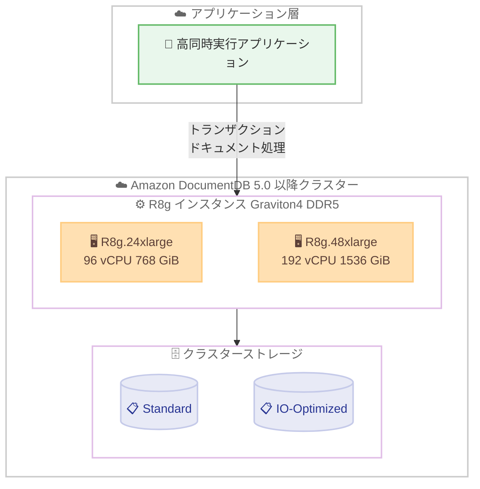

# Amazon DocumentDB - R8g.24xlarge および R8g.48xlarge インスタンスのサポート

**リリース日**: 2026 年 7 月 10 日
**サービス**: Amazon DocumentDB (with MongoDB compatibility)
**機能**: R8g.24xlarge および R8g.48xlarge データベースインスタンス

📊 [このアップデートのインフォグラフィックを見る](https://takech9203.github.io/aws-news-summary/20260710-amazon-documentdb-r8g-24xl-48xl.html)
<!-- INFOGRAPHIC_BASE_URL は環境変数から取得 -->

## 概要

Amazon DocumentDB (with MongoDB compatibility) は、AWS Graviton4 プロセッサを搭載した R8g インスタンスファミリーに、新たに R8g.24xlarge および R8g.48xlarge の 2 つの大規模インスタンスサイズのサポートを追加しました。これにより、より高い vCPU 数とメモリ容量を必要とするワークロードに対応できるようになります。

R8g インスタンスは、AWS が独自設計した Graviton4 プロセッサと DDR5 メモリを採用しており、従来世代と比較して高いスループットと、より大きなインメモリワーキングセット (メモリ上に保持できる作業データセット) をサポートします。今回追加された R8g.24xlarge は 96 vCPU と 768 GiB メモリ、R8g.48xlarge は 192 vCPU と 1,536 GiB メモリを提供します。

これらのインスタンスは、高い同時実行性を伴うトランザクションアプリケーション、大規模なドキュメント処理、メモリを集中的に使用する運用ワークロードなど、要求の厳しいユースケースを対象としています。Amazon DocumentDB 5.0 以降で、標準ストレージ (Standard) と IO-Optimized ストレージの両方の構成で利用できます。

**アップデート前の課題**

- R8g ファミリーで利用できるインスタンスサイズが限られており、極めて大規模なワークロードに対して十分な vCPU とメモリを単一インスタンスで確保しにくかった
- 大きなワーキングセットをメモリ上に保持できず、ディスク I/O が増加してパフォーマンスが制約されるケースがあった
- 高い同時実行性を伴うトランザクション処理や大規模なドキュメント処理を、より少ないインスタンス数で集約することが難しかった

**アップデート後の改善**

- R8g.24xlarge (96 vCPU / 768 GiB) と R8g.48xlarge (192 vCPU / 1,536 GiB) により、単一インスタンスで大幅に高い演算能力とメモリ容量を確保できるようになった
- DDR5 メモリと Graviton4 により、より大きなインメモリワーキングセットと高いスループットを実現できるようになった
- 標準ストレージと IO-Optimized ストレージの両方で選択でき、ワークロード特性に応じた構成が可能になった

## アーキテクチャ図



高同時実行のアプリケーションからのリクエストを、Graviton4 搭載の大規模 R8g インスタンスが処理し、標準または IO-Optimized ストレージにデータを永続化します。

## サービスアップデートの詳細

### 主要機能

1. **2 つの新しい大規模インスタンスサイズ**
   - R8g.24xlarge: 96 vCPU、768 GiB メモリ
   - R8g.48xlarge: 192 vCPU、1,536 GiB メモリ
   - 既存の R8g ファミリーに追加される最大級のサイズであり、単一インスタンスで高い集約度を実現する

2. **AWS Graviton4 プロセッサと DDR5 メモリ**
   - AWS が独自設計した Graviton4 プロセッサを搭載
   - DDR5 メモリの採用により、高いメモリ帯域幅とスループットを提供する
   - より大きなインメモリワーキングセットをサポートし、ディスク I/O への依存を低減する

3. **ストレージ構成の柔軟性**
   - 標準ストレージ (Standard) と IO-Optimized ストレージの両方で利用可能
   - I/O 使用量が多いワークロードでは IO-Optimized を選択することでコスト予測性を高められる

## 技術仕様

### インスタンススペック

| インスタンスタイプ | vCPU | メモリ | プロセッサ |
|------|------|------|------|
| R8g.24xlarge | 96 | 768 GiB | AWS Graviton4 |
| R8g.48xlarge | 192 | 1,536 GiB | AWS Graviton4 |

### 対応条件

| 項目 | 詳細 |
|------|------|
| 対応エンジンバージョン | Amazon DocumentDB 5.0 以降 |
| メモリ種別 | DDR5 |
| ストレージ構成 | Standard、IO-Optimized の両方 |
| クラスター種別 | インスタンスベースクラスター |
| 操作方法 | AWS マネジメントコンソール、AWS CLI、AWS SDK |

### API 変更履歴

| 日付 | サービス | 変更内容 |
|------|----------|----------|
| 2026/07/10 | Amazon DocumentDB | 既存の `create-db-instance` / `modify-db-instance` API の `--db-instance-class` パラメータで `db.r8g.24xlarge` および `db.r8g.48xlarge` を指定可能 (新規 API メソッドの追加なし) |

## 設定方法

### 前提条件

1. R8g.24xlarge / R8g.48xlarge が利用可能なリージョンであること
2. クラスターのエンジンバージョンが Amazon DocumentDB 5.0 以降であること
3. インスタンスの作成・変更権限を持つ IAM プリンシパルであること

### 手順

#### ステップ1: 新規インスタンスを作成する

```bash
aws docdb create-db-instance \
    --db-instance-identifier my-docdb-instance \
    --db-cluster-identifier my-docdb-cluster \
    --engine docdb \
    --db-instance-class db.r8g.24xlarge
```

`--db-instance-class` に `db.r8g.24xlarge` を指定し、既存クラスターに新しい大規模インスタンスを追加します。R8g.48xlarge を使用する場合は `db.r8g.48xlarge` を指定します。

#### ステップ2: 既存インスタンスのクラスを変更する

```bash
aws docdb modify-db-instance \
    --db-instance-identifier my-docdb-instance \
    --db-instance-class db.r8g.48xlarge \
    --apply-immediately
```

既存のインスタンスを `modify-db-instance` コマンドで R8g.48xlarge にスケールアップします。`--apply-immediately` を指定すると即時に、指定しない場合は次回メンテナンスウィンドウで適用されます。

#### ステップ3: インスタンスクラスを確認する

```bash
aws docdb describe-db-instances \
    --db-instance-identifier my-docdb-instance \
    --query "DBInstances[0].DBInstanceClass"
```

変更後のインスタンスクラスが反映されていることを確認します。AWS マネジメントコンソールの Amazon DocumentDB 画面からも同様の操作が可能です。

## メリット

### ビジネス面

- **集約によるコスト最適化**: 大規模インスタンスにワークロードを集約することで、管理対象のインスタンス数を削減できる可能性がある
- **成長への対応**: データ量やトラフィックの増加に対して、単一インスタンスでのスケールアップ余地が広がる
- **価格性能比の向上**: Graviton4 による優れた価格性能比を活用できる

### 技術面

- **大きなインメモリワーキングセット**: 最大 1,536 GiB のメモリにより、より多くの作業データをメモリ上に保持できる
- **高いスループット**: DDR5 メモリと Graviton4 により、高い同時実行性を伴うワークロードで高いスループットを発揮する
- **ストレージ選択の柔軟性**: 標準と IO-Optimized の両方を選択でき、ワークロード特性に合わせた最適化が可能

## デメリット・制約事項

### 制限事項

- Amazon DocumentDB 5.0 以降でのみ利用可能であり、それ以前のバージョンでは使用できない
- 大規模インスタンスサイズであるため、時間あたりのコストは小規模インスタンスより高くなる
- リージョンによっては提供されていない場合があるため、利用前にリージョン対応状況の確認が必要

### 考慮すべき点

- ワークロードが実際に大容量のメモリと vCPU を必要とするか、事前にサイジング評価を行うことが望ましい
- 過剰なインスタンスサイズの選択はコスト増につながるため、CloudWatch メトリクスで使用率を継続的に監視する
- I/O 使用量が多い場合は IO-Optimized ストレージの採用がコスト予測性の観点で有効な場合がある

## ユースケース

### ユースケース1: 高同時実行のトランザクションアプリケーション

**シナリオ**: 多数のユーザーが同時にアクセスする e コマースやゲームのバックエンドで、高い同時接続数と低レイテンシーが求められる。

**実装例**:
```
db.r8g.24xlarge (96 vCPU / 768 GiB) を採用
高い vCPU 数で多数の同時接続とトランザクションを処理
CloudWatch でアクティブ接続数と CPU 使用率を監視
```

**効果**: 高い同時実行性を単一インスタンスで処理でき、レイテンシーを抑えながらスケーラビリティを確保できる。

### ユースケース2: 大規模ドキュメント処理

**シナリオ**: 大量の JSON ドキュメントを対象とした集計や分析処理を、可能な限りメモリ上で完結させたい。

**実装例**:
```
db.r8g.48xlarge (192 vCPU / 1536 GiB) を採用
大きなワーキングセットをメモリ上に保持
集計パイプラインをインメモリで高速に実行
```

**効果**: 1,536 GiB のメモリにより大規模なワーキングセットを保持でき、ディスク I/O を削減して処理を高速化できる。

### ユースケース3: メモリ集約型の運用ワークロード

**シナリオ**: キャッシュ的に大量のデータをメモリ上に保持し、頻繁な読み取りに低レイテンシーで応答する必要がある。

**実装例**:
```
db.r8g.48xlarge を採用しメモリ容量を最大化
IO-Optimized ストレージで I/O コストの予測性を確保
インメモリでのホットデータアクセスを最適化
```

**効果**: 大容量メモリによりホットデータをメモリ上に保持でき、読み取りレイテンシーを低減しつつ安定した運用が可能になる。

## 料金

R8g.24xlarge および R8g.48xlarge インスタンスには、Amazon DocumentDB の通常のインスタンス料金が適用されます。料金はインスタンスタイプ、リージョン、ストレージ構成 (Standard または IO-Optimized) によって異なります。インスタンス使用料に加えて、ストレージ、I/O (Standard の場合)、バックアップなどの料金が発生します。

正確な料金は、リージョンごとの Amazon DocumentDB の料金ページを参照してください。

## 利用可能リージョン

R8g.24xlarge および R8g.48xlarge の提供リージョンは、Amazon DocumentDB の料金ページおよびドキュメントで確認できます。利用前に、対象リージョンでこれらのインスタンスタイプが提供されているかを確認してください。

## 関連サービス・機能

- **AWS Graviton4**: R8g インスタンスに搭載される AWS 独自設計のプロセッサで、優れた価格性能比を提供する
- **Amazon CloudWatch**: CPU 使用率、メモリ、接続数などを監視し、適切なインスタンスサイジングを判断する
- **Amazon DocumentDB IO-Optimized**: I/O 使用量が多いワークロードでコスト予測性を高めるストレージ構成

## 参考リンク

- 📊 [インフォグラフィック](https://takech9203.github.io/aws-news-summary/20260710-amazon-documentdb-r8g-24xl-48xl.html)
- [公式発表 (What's New)](https://aws.amazon.com/about-aws/whats-new/2026/07/amazon-documentdb-r8g-24xl-48xl/)
- [Amazon DocumentDB インスタンスクラスのドキュメント](https://docs.aws.amazon.com/documentdb/latest/developerguide/db-instance-classes.html)
- [Amazon DocumentDB Developer Guide](https://docs.aws.amazon.com/documentdb/latest/developerguide/)
- [Amazon DocumentDB 料金ページ](https://aws.amazon.com/documentdb/pricing/)

## まとめ

R8g.24xlarge および R8g.48xlarge のサポートにより、Amazon DocumentDB は Graviton4 と DDR5 メモリを活用した最大 192 vCPU / 1,536 GiB の大規模インスタンスを提供できるようになりました。高同時実行のトランザクション処理、大規模ドキュメント処理、メモリ集約型ワークロードを運用する場合は、これらのインスタンスへの移行やスケールアップを検討してください。導入にあたっては、対象リージョンでの提供状況を確認し、CloudWatch メトリクスによる使用率評価を通じて適切なサイジングを行うことを推奨します。
