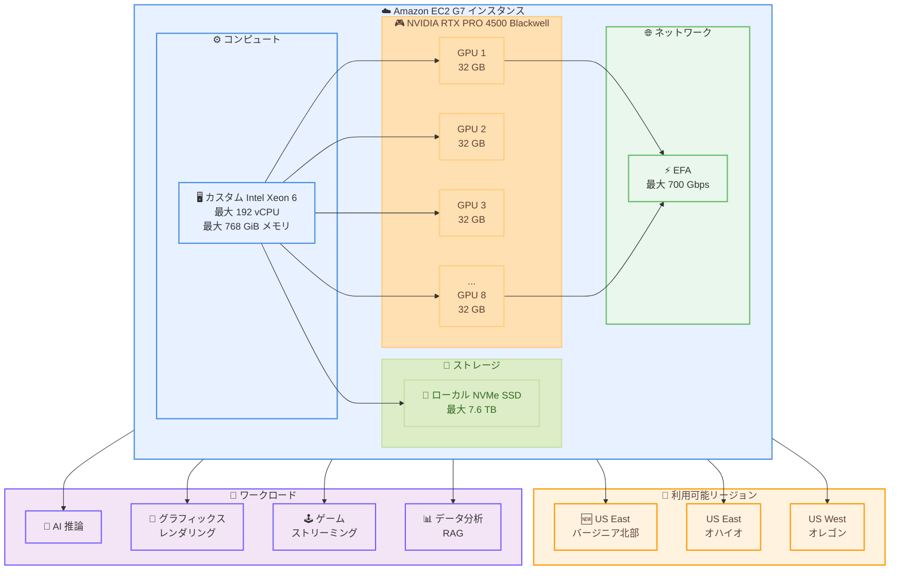

# Amazon EC2 G7 インスタンス - US East (バージニア北部) リージョンで利用可能に

**リリース日**: 2026年7月10日
**サービス**: Amazon EC2
**機能**: G7 インスタンスの US East (バージニア北部) リージョン提供開始

📊 [このアップデートのインフォグラフィックを見る](https://takech9203.github.io/aws-news-summary/20260710-amazon-ec2-g7-available-North-Virginia.html)
<!-- INFOGRAPHIC_BASE_URL は環境変数から取得 -->

## 概要

Amazon は、NVIDIA RTX PRO 4500 Blackwell Server Edition GPU を搭載した Amazon Elastic Compute Cloud (Amazon EC2) G7 インスタンスが、US East (バージニア北部) リージョンで利用可能になったことを発表しました。これにより、G7 インスタンスは US East (バージニア北部)、US East (オハイオ)、US West (オレゴン) の 3 リージョンで利用できるようになりました。

G7 インスタンスは、前世代の G6 と比較して最大 4.6 倍の AI 推論パフォーマンスと最大 2.1 倍のグラフィックスパフォーマンスを提供します。AI モデルのデプロイ、リアルタイムの映像品質グラフィックスレンダリング、ゲームストリーミング、動画トランスコーディング、空間コンピューティング、GPU アクセラレーションによるデータ分析など、幅広いワークロードに適しています。

G7 インスタンスは、最大 8 基の NVIDIA RTX PRO 4500 Blackwell Server Edition GPU (GPU あたり 32 GB のメモリ) とカスタム Intel Xeon 6 プロセッサを搭載しています。最大 192 個の仮想 CPU (vCPU)、最大 768 GiB のシステムメモリ、最大 700 Gbps の Elastic Fabric Adapter (EFA) ネットワーク帯域幅、最大 7.6 TB のローカル NVMe SSD ストレージをサポートしています。

**アップデート前の課題**

- US East (バージニア北部) リージョンでは G7 インスタンスを利用できず、このリージョンを中心に運用しているお客様は他リージョンへの展開を検討する必要があった
- 前世代の G6 インスタンスでは、大規模化する AI 推論ワークロードやグラフィックスワークロードの要求に対して性能が不足するケースがあった
- レイテンシやデータ所在地の要件から、US East (バージニア北部) での GPU リソース確保が求められていた

**アップデート後の改善**

- US East (バージニア北部) リージョンで G7 インスタンスを起動できるようになり、対応リージョンが 3 つに拡大した
- G6 と比較して最大 4.6 倍の AI 推論パフォーマンスと最大 2.1 倍のグラフィックスパフォーマンスを、バージニア北部でも利用できるようになった
- バージニア北部を中心に運用するお客様が、リージョンをまたぐ構成変更なしに最新世代の GPU インスタンスを活用できるようになった

## アーキテクチャ図



この図は、G7 インスタンスの主要なアーキテクチャコンポーネントと、今回追加された US East (バージニア北部) を含む利用可能リージョン、およびサポートされるワークロードを示しています。

## サービスアップデートの詳細

### 主要機能

1. **NVIDIA RTX PRO 4500 Blackwell Server Edition GPU**
   - 最新の NVIDIA Blackwell アーキテクチャを採用
   - GPU あたり 32 GB のメモリを搭載
   - 最大 8 基の GPU を搭載可能
   - G6 と比較して最大 4.6 倍の AI 推論パフォーマンスと最大 2.1 倍のグラフィックスパフォーマンス

2. **カスタム Intel Xeon 6 プロセッサ**
   - 最大 192 個の仮想 CPU (vCPU) をサポート
   - 最大 768 GiB のシステムメモリ
   - 高性能な CPU と GPU の組み合わせにより、複雑なワークロードに対応

3. **高速ネットワークとストレージ**
   - Elastic Fabric Adapter (EFA) で最大 700 Gbps のネットワーク帯域幅
   - 最大 7.6 TB のローカル NVMe SSD ストレージ

4. **US East (バージニア北部) リージョンでの提供**
   - US East (バージニア北部)、US East (オハイオ)、US West (オレゴン) の 3 リージョンで利用可能
   - オンデマンド、スポット、Savings Plans の購入オプションに対応

## 技術仕様

### インスタンススペック

| 項目 | 仕様 |
|------|------|
| GPU | NVIDIA RTX PRO 4500 Blackwell Server Edition (最大 8 基) |
| GPU メモリ | 32 GB/GPU |
| CPU | カスタム Intel Xeon 6 プロセッサ |
| vCPU | 最大 192 |
| システムメモリ | 最大 768 GiB |
| ネットワーク帯域幅 | 最大 700 Gbps (EFA) |
| ローカルストレージ | 最大 7.6 TB (NVMe SSD) |

### パフォーマンス比較 (G7 と G6)

| 項目 | G7 | G6 |
|------|-----|-----|
| AI 推論パフォーマンス | 最大 4.6 倍 | 基準 |
| グラフィックスパフォーマンス | 最大 2.1 倍 | 基準 |
| GPU アーキテクチャ | NVIDIA Blackwell | 前世代 |

## 設定方法

### 前提条件

1. AWS アカウントが作成されている
2. 適切な IAM 権限 (EC2 インスタンスの起動権限) が付与されている
3. G7 インスタンスが利用可能なリージョン (US East (バージニア北部)、US East (オハイオ)、US West (オレゴン)) のいずれかを使用

### 手順

#### ステップ1: AWS コンソールからインスタンスを起動

1. AWS Management Console にログイン
2. リージョンを US East (バージニア北部) に設定
3. EC2 ダッシュボードに移動
4. 「インスタンスを起動」をクリック
5. インスタンスタイプで「G7」を検索して選択
6. AMI (Amazon Machine Image) を選択 (Deep Learning AMI 推奨)
7. ネットワーク設定、セキュリティグループを構成して「インスタンスを起動」をクリック

#### ステップ2: AWS CLI からインスタンスを起動

```bash
aws ec2 run-instances \
  --region us-east-1 \
  --image-id ami-xxxxxxxxx \
  --instance-type g7.xlarge \
  --key-name your-key-pair \
  --security-group-ids sg-xxxxxxxxx \
  --subnet-id subnet-xxxxxxxxx
```

このコマンドは、US East (バージニア北部、us-east-1) リージョンで、指定した AMI、キーペア、セキュリティグループを使用して G7 インスタンスを起動します。

#### ステップ3: GPU の確認

```bash
# インスタンスにログイン後、GPU の状態を確認
nvidia-smi
```

NVIDIA System Management Interface (nvidia-smi) を使用して、GPU が正しく認識されているか確認します。

## メリット

### ビジネス面

- **バージニア北部での可用性向上**: 最大規模のリージョンである US East (バージニア北部) で最新世代の GPU インスタンスを利用でき、リージョン移行なしにワークロードを最適化できる
- **高速な AI 推論**: G6 と比較して最大 4.6 倍の推論パフォーマンスにより、エンドユーザーへのレスポンス時間が短縮され、顧客体験が向上する
- **コスト効率**: より高速な推論とグラフィックス処理により、同じワークロードをより少ないインスタンスで処理でき、コストを削減できる

### 技術面

- **多様なワークロードへの対応**: AI 推論、グラフィックスレンダリング、ゲームストリーミング、動画トランスコーディング、データ分析まで幅広く対応
- **豊富なローカルストレージ**: 最大 7.6 TB のローカル NVMe SSD により、大容量データセットへの高速アクセスが可能
- **高スループットネットワーク**: 最大 700 Gbps の EFA により、分散ワークロードでの高速なデータ転送を実現

## デメリット・制約事項

### 制限事項

- 現在、US East (バージニア北部)、US East (オハイオ)、US West (オレゴン) の 3 リージョンでのみ利用可能
- GPU メモリは 32 GB/GPU に固定されており、増減はできない
- より大きな GPU メモリ (GPU あたり 96 GB) が必要な場合は、G7e インスタンスの利用を検討する必要がある

### 考慮すべき点

- G7 インスタンスは高性能な分、コストも相応に高い (オンデマンド料金が高額)
- スポットインスタンスを使用する場合、中断のリスクがある
- Savings Plans を利用することでコストを削減できるが、長期的なコミットメントが必要
- マルチ GPU ワークロードを最大限に活用するには、アプリケーション側でのコード最適化が必要

## ユースケース

### ユースケース1: AI モデルの推論デプロイ

**シナリオ**: 言語翻訳、動画・画像分析、音声認識などの AI モデルを US East (バージニア北部) リージョンでリアルタイムに推論したい。

**実装例**:
```python
from transformers import AutoModelForSpeechSeq2Seq, AutoProcessor
import torch

# 音声認識モデルをロード
model_id = "openai/whisper-large-v3"
model = AutoModelForSpeechSeq2Seq.from_pretrained(
    model_id,
    torch_dtype=torch.float16,
    device_map="auto"  # 複数 GPU に自動分散
)
processor = AutoProcessor.from_pretrained(model_id)

# 推論の実行 (音声データを入力)
# inputs = processor(audio, return_tensors="pt").to("cuda")
# outputs = model.generate(**inputs)
```

**効果**: 最新の Blackwell GPU により、AI 推論を高速に実行でき、エンドユーザーへの応答時間を短縮できる。

### ユースケース2: リアルタイムグラフィックスとゲームストリーミング

**シナリオ**: クラウド上でリアルタイムの映像品質グラフィックスをレンダリングし、ゲームストリーミングとして配信したい。

**実装例**:
```bash
# NVIDIA ドライバと GPU アクセラレーションを利用したレンダリング環境を構成
# 例: NICE DCV を利用したリモートグラフィックス配信
sudo systemctl start dcvserver
dcv create-session --type virtual my-session
```

**効果**: G6 と比較して最大 2.1 倍のグラフィックスパフォーマンスにより、低レイテンシで高品質なストリーミング体験を提供できる。

### ユースケース3: GPU アクセラレーションによるデータ分析と RAG 推論

**シナリオ**: レコメンダーシステムや Retrieval Augmented Generation (RAG) 推論、リアルタイムデータパイプラインを GPU で高速化したい。

**実装例**:
```python
# RAPIDS cuDF を利用した GPU アクセラレーションによるデータ処理
import cudf

# GPU 上でデータフレームを処理
df = cudf.read_parquet("s3://your-bucket/data.parquet")
result = df.groupby("category").agg({"value": "mean"})
print(result)
```

**効果**: GPU アクセラレーションにより、大規模データの分析と RAG 推論を高速化し、リアルタイム性の高いアプリケーションを実現できる。

## 料金

G7 インスタンスの料金は、インスタンスタイプ、購入オプション、リージョンによって異なります。

### 購入オプション

| 購入オプション | 特徴 | コスト削減 |
|--------------|------|-----------|
| オンデマンドインスタンス | 柔軟性が高く、長期コミットメント不要 | なし (定価) |
| スポットインスタンス | 未使用の EC2 容量を利用、中断のリスクあり | 最大 90% 削減 |
| Savings Plans | 1 年または 3 年のコミットメント | 最大 72% 削減 |

### 料金例 (概算)

料金の詳細は [Amazon EC2 料金ページ](https://aws.amazon.com/ec2/pricing/) を参照してください。

## 利用可能リージョン

G7 インスタンスは、以下のリージョンで利用可能です。

- **US East (バージニア北部)**: us-east-1 (今回追加)
- **US East (オハイオ)**: us-east-2
- **US West (オレゴン)**: us-west-2

## 関連サービス・機能

- **Amazon EC2 G7e インスタンス**: より大きな GPU メモリ (GPU あたり 96 GB) を必要とする大規模 AI ワークロード向けの上位インスタンス
- **AWS Deep Learning AMI**: GPU インスタンス向けの事前設定された機械学習フレームワークを含む AMI
- **Amazon SageMaker**: G7 インスタンスを使用してモデルのトレーニングとデプロイを簡素化
- **Elastic Fabric Adapter (EFA)**: 高性能なネットワークインターフェース
- **NICE DCV**: リモートグラフィックス配信を実現する高性能ストリーミングプロトコル

## 参考リンク

- 📊 [インフォグラフィック](https://takech9203.github.io/aws-news-summary/20260710-amazon-ec2-g7-available-North-Virginia.html)
- [公式発表 (What's New)](https://aws.amazon.com/about-aws/whats-new/2026/07/amazon-ec2-g7-available-North-Virginia)
- [G7 インスタンス詳細ページ](https://aws.amazon.com/ec2/instance-types/g7/)
- [Amazon EC2 料金ページ](https://aws.amazon.com/ec2/pricing/)
- [AWS Management Console](https://console.aws.amazon.com/)

## まとめ

Amazon EC2 G7 インスタンスが US East (バージニア北部) リージョンで利用可能になり、対応リージョンが 3 つに拡大しました。NVIDIA RTX PRO 4500 Blackwell Server Edition GPU を搭載し、G6 と比較して最大 4.6 倍の AI 推論パフォーマンスと最大 2.1 倍のグラフィックスパフォーマンスを提供します。AI 推論、グラフィックスレンダリング、ゲームストリーミング、データ分析など幅広いワークロードに適しており、バージニア北部を中心に運用するお客様は、オンデマンド、スポット、Savings Plans の各購入オプションから選択して活用を検討することをお勧めします。
