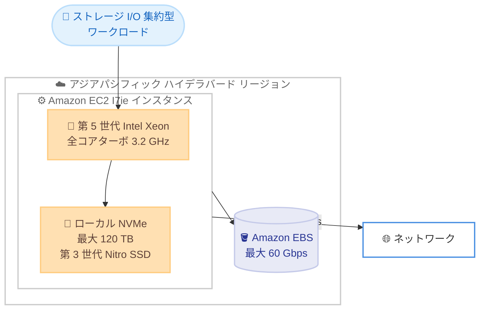

# Amazon EC2 - I7ie インスタンス (アジアパシフィック (ハイデラバード) リージョン提供開始)

**リリース日**: 2026 年 7 月 10 日
**サービス**: Amazon EC2
**機能**: I7ie ストレージ最適化インスタンス

📊 [このアップデートのインフォグラフィックを見る](https://takech9203.github.io/aws-news-summary/20260710-amazon-ec2-i7ie-instances-aws-hyd-region.html)
<!-- INFOGRAPHIC_BASE_URL は環境変数から取得 -->

## 概要

Amazon EC2 I7ie インスタンスが、アジアパシフィック (ハイデラバード) リージョンで利用可能になりました。I7ie は、大規模なストレージ I/O 集約型ワークロード向けに設計されたストレージ最適化インスタンスです。第 5 世代 Intel Xeon プロセッサ (全コアターボ周波数 3.2 GHz) を搭載し、前世代のストレージ最適化インスタンスである I3en と比較して、最大 40% 優れたコンピューティング性能と最大 20% 優れた価格性能を実現します。

I7ie は最大 120 TB のローカル NVMe ストレージ密度を備え、前世代と比較して最大 2 倍の vCPU とメモリを提供します。第 3 世代 AWS Nitro SSD を採用することで、最大 65% 優れたリアルタイムストレージ性能と最大 50% 低いストレージ I/O レイテンシーを実現し、レイテンシーのばらつきも 65% 削減されています。

このインスタンスは、高いランダム読み取り/書き込み性能を持つ高速なローカルストレージを必要とするアプリケーションや、大規模データセットへ一貫した低レイテンシーでアクセスする必要があるワークロードに適しています。関係型データベース、NoSQL データベース、検索エンジン、分散ファイルシステムなどが代表的な対象です。

**アップデート前の課題**

- アジアパシフィック (ハイデラバード) リージョンでは、最新世代のストレージ最適化インスタンス I7ie を利用できなかった
- 前世代の I3en では、ローカル NVMe ストレージの密度、コンピューティング性能、ストレージ I/O レイテンシーに制約があった
- 高いストレージ I/O 性能を求めるワークロードを当該リージョンで実行する際、性能と価格のバランスに制約があった

**アップデート後の改善**

- アジアパシフィック (ハイデラバード) リージョンで I7ie インスタンスを利用できるようになった
- I3en と比較して最大 40% のコンピューティング性能向上と最大 20% の価格性能向上を実現
- 第 3 世代 AWS Nitro SSD により、最大 65% 優れたリアルタイムストレージ性能と最大 50% 低いストレージ I/O レイテンシーを実現

## アーキテクチャ図



I7ie インスタンスは、高性能なローカル NVMe ストレージと高帯域幅のネットワーク/EBS 接続を組み合わせ、ストレージ I/O 集約型ワークロードを支えます。

## サービスアップデートの詳細

### 主要機能

1. **第 5 世代 Intel Xeon プロセッサ**
   - 全コアターボ周波数 3.2 GHz を実現
   - I3en と比較して最大 40% 優れたコンピューティング性能
   - I3en と比較して最大 20% 優れた価格性能

2. **高密度ローカル NVMe ストレージ**
   - 最大 120 TB のローカル NVMe ストレージ密度
   - 第 3 世代 AWS Nitro SSD を採用
   - 前世代と比較して最大 2 倍の vCPU とメモリ

3. **ストレージ性能の向上**
   - 最大 65% 優れたリアルタイムストレージ性能
   - 最大 50% 低いストレージ I/O レイテンシー
   - ストレージ I/O レイテンシーのばらつきを 65% 削減

4. **柔軟なインスタンスサイズとネットワーク**
   - 9 種類の仮想サイズを提供
   - 最大 100 Gbps のネットワーク帯域幅
   - 最大 60 Gbps の Amazon EBS 帯域幅

## 技術仕様

### I7ie インスタンスの主要スペック

| 項目 | 詳細 |
|------|------|
| プロセッサ | 第 5 世代 Intel Xeon (全コアターボ 3.2 GHz) |
| ローカルストレージ | 最大 120 TB ローカル NVMe (第 3 世代 AWS Nitro SSD) |
| インスタンスサイズ | 9 種類の仮想サイズ |
| ネットワーク帯域幅 | 最大 100 Gbps |
| EBS 帯域幅 | 最大 60 Gbps |
| コンピューティング性能 (対 I3en) | 最大 40% 向上 |
| 価格性能 (対 I3en) | 最大 20% 向上 |
| リアルタイムストレージ性能 | 最大 65% 向上 |
| ストレージ I/O レイテンシー | 最大 50% 低減 |

## 設定方法

### 前提条件

1. アジアパシフィック (ハイデラバード) リージョンにアクセス可能な AWS アカウント
2. EC2 インスタンスを起動するための適切な IAM 権限
3. 必要に応じて対象リージョンでのインスタンスタイプの利用制限 (Service Quotas) の確認

### 手順

#### ステップ1: 利用可能なインスタンスタイプの確認

```bash
aws ec2 describe-instance-types \
  --filters "Name=instance-type,Values=i7ie.*" \
  --region ap-south-2 \
  --query "InstanceTypes[].InstanceType"
```

このコマンドは、アジアパシフィック (ハイデラバード) リージョン (ap-south-2) で利用可能な I7ie インスタンスタイプの一覧を取得します。

#### ステップ2: I7ie インスタンスの起動

```bash
aws ec2 run-instances \
  --image-id ami-xxxxxxxxxxxxxxxxx \
  --instance-type i7ie.2xlarge \
  --region ap-south-2 \
  --key-name my-key-pair \
  --subnet-id subnet-xxxxxxxx
```

このコマンドは、指定した AMI とキーペアを使用して I7ie インスタンスを起動します。インスタンスサイズは要件に応じて 9 種類のサイズから選択します。

#### ステップ3: ローカル NVMe ストレージの設定

インスタンス起動後、ローカル NVMe ストレージ (インスタンスストア) をファイルシステムとしてマウントし、データベースやキャッシュなどのワークロードで使用します。インスタンスストアはインスタンスの停止・終了でデータが失われるため、永続化が必要なデータは Amazon EBS や Amazon S3 と組み合わせて利用します。

## メリット

### ビジネス面

- **価格性能の向上**: I3en と比較して最大 20% 優れた価格性能により、ストレージ I/O 集約型ワークロードのコスト効率を改善できる
- **地理的な選択肢の拡大**: アジアパシフィック (ハイデラバード) リージョンでの提供により、インドのユーザーがデータレジデンシー要件を満たしながら低レイテンシーで利用できる
- **統合の削減**: 高密度ストレージにより、より少ないインスタンス数でワークロードを集約できる可能性がある

### 技術面

- **高いストレージ性能**: 第 3 世代 AWS Nitro SSD により、最大 65% 優れたリアルタイムストレージ性能を実現
- **低レイテンシーと一貫性**: 最大 50% 低いストレージ I/O レイテンシーと 65% のばらつき削減により、安定した応答性能を提供
- **スケーラビリティ**: 前世代と比較して最大 2 倍の vCPU とメモリ、最大 120 TB のローカルストレージにより、大規模データセットを扱える

## デメリット・制約事項

### 制限事項

- ローカル NVMe ストレージ (インスタンスストア) は非永続的であり、インスタンスの停止・終了でデータが失われる
- 提供リージョンは順次拡大しているため、すべてのリージョンで利用できるわけではない
- 9 種類の仮想サイズに限定されるため、要件に完全に合致するサイズがない場合がある

### 考慮すべき点

- 永続的なデータ保存には Amazon EBS や Amazon S3 との併用が必要
- 高性能なインスタンスであるため、ワークロード特性に応じた適切なサイズ選定とコスト評価が重要
- ストレージ I/O 集約型でないワークロードでは、他のインスタンスファミリーの方が費用対効果が高い場合がある

## ユースケース

### ユースケース1: 大規模データベースワークロード

**シナリオ**: 高いランダム読み取り/書き込み性能を必要とする関係型データベースや NoSQL データベースを運用する。

**効果**: 高密度ローカル NVMe ストレージと低レイテンシーにより、大量のトランザクションを安定した応答性能で処理できる。

### ユースケース2: 検索エンジンと分析基盤

**シナリオ**: 大規模データセットに対する全文検索やリアルタイム分析を実行する検索エンジンを運用する。

**効果**: 最大 65% 向上したリアルタイムストレージ性能により、インデックス作成やクエリ処理のスループットを高められる。

### ユースケース3: 分散ファイルシステムとデータレイク

**シナリオ**: 大量のデータを保持する分散ファイルシステムやデータストアを構築する。

**効果**: 最大 120 TB のローカルストレージ密度と最大 100 Gbps のネットワーク帯域幅により、大規模データを効率的に格納・転送できる。

## 料金

I7ie インスタンスは、オンデマンド、リザーブドインスタンス、Savings Plans、スポットインスタンスなど、標準的な EC2 の料金モデルで利用できます。料金はインスタンスサイズとリージョンによって異なります。最新の料金はオンデマンド料金ページで確認してください。

## 利用可能リージョン

アジアパシフィック (ハイデラバード) リージョンで利用可能になりました。I7ie インスタンスは、その他のリージョンでも順次提供が拡大されています。

## 関連サービス・機能

- **Amazon EBS**: I7ie は最大 60 Gbps の EBS 帯域幅を提供し、永続ストレージとして併用できる
- **AWS Nitro System**: 第 3 世代 AWS Nitro SSD がローカルストレージ性能を支える基盤技術
- **Amazon EC2 I3en**: I7ie の前世代にあたるストレージ最適化インスタンス

## 参考リンク

- 📊 [インフォグラフィック](https://takech9203.github.io/aws-news-summary/20260710-amazon-ec2-i7ie-instances-aws-hyd-region.html)
- [公式発表 (What's New)](https://aws.amazon.com/about-aws/whats-new/2026/07/amazon-ec2-i7ie-instances-aws-hyd-region/)
- [Amazon EC2 I7ie インスタンス](https://aws.amazon.com/ec2/instance-types/i7ie/)
- [Amazon EC2 オンデマンド料金](https://aws.amazon.com/ec2/pricing/on-demand/)

## まとめ

Amazon EC2 I7ie インスタンスのアジアパシフィック (ハイデラバード) リージョンへの提供開始により、ストレージ I/O 集約型ワークロードを当該リージョンで高い価格性能と低レイテンシーで実行できるようになりました。大規模データベースや検索エンジン、分散ファイルシステムを運用するユーザーは、I3en からの移行や新規構築を検討し、ワークロード特性に応じた適切なインスタンスサイズを選定することを推奨します。
