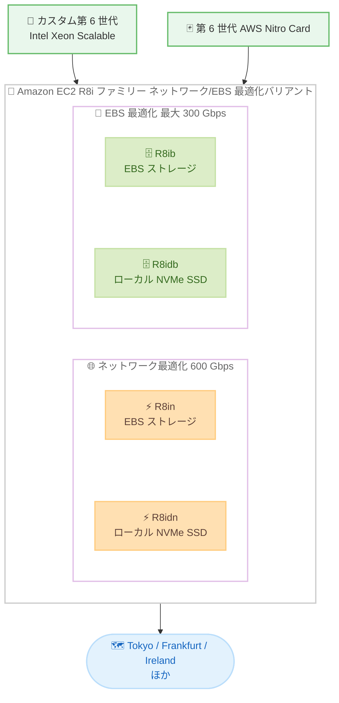

# Amazon EC2 R8in/R8ib/R8idn/R8idb インスタンス - 追加リージョンでの提供開始

**リリース日**: 2026 年 7 月 10 日
**サービス**: Amazon EC2
**機能**: R8in、R8ib、R8idn、R8idb インスタンスのリージョン拡大

📊 [このアップデートのインフォグラフィックを見る](https://takech9203.github.io/aws-news-summary/20260710-amazon-ec2-r8in-r8ib-r8idn-r8idb.html)
<!-- INFOGRAPHIC_BASE_URL は環境変数から取得 -->

## 概要

Amazon EC2 R8in、R8ib、R8idn、R8idb インスタンスが、Asia Pacific (Tokyo) および Europe (Frankfurt、Ireland) の各リージョンで新たに利用可能になりました。これらはメモリ最適化された R8i ファミリーのネットワーク最適化 / EBS 最適化バリアントで、AWS 専用のカスタム第 6 世代 Intel Xeon Scalable プロセッサを搭載しています。前世代の R6in / R6idn インスタンスと比較して、vCPU あたり最大 43% 優れたコンピューティングパフォーマンスを提供します。

R8in と R8idn は 600 Gbps のネットワーク帯域幅を提供し、これは拡張ネットワーキング対応の EC2 インスタンスの中で最高のネットワーク帯域幅です。一方、R8ib と R8idb は最大 300 Gbps の Amazon EBS 帯域幅を提供し、これは非アクセラレーテッドコンピュートの EC2 インスタンスの中で最高です。末尾に「d」が付くタイプ (R8idn、R8idb) はローカル NVMe SSD ストレージを搭載しています。

これらのインスタンスは、リアルタイムビッグデータ分析、分散型 Web スケールインメモリキャッシュ、大規模データベース、データレイク、高性能ファイルシステムなど、メモリとネットワーク / ストレージの両方を集中的に使用するワークロードに適しています。東京リージョンをはじめとする追加リージョンでの提供開始により、より多くの地域でこれらの高性能インスタンスを利用できるようになりました。

**アップデート前の課題**

- R8in、R8ib、R8idn、R8idb インスタンスは限られたリージョンでのみ利用可能だった
- 東京リージョンなどでは、メモリ最適化かつ最高クラスのネットワーク / EBS 帯域幅を備えたインスタンスタイプを利用できなかった
- データレジデンシー要件によりリージョンが制限される場合、前世代インスタンスで妥協する必要があった

**アップデート後の改善**

- Asia Pacific (Tokyo)、Europe (Frankfurt、Ireland) でも最新世代のネットワーク / EBS 最適化メモリインスタンスが利用可能になった
- 東京リージョンでレイテンシー要件やデータレジデンシー要件を満たしながら、高性能なメモリ集約型ワークロードを実行できるようになった
- グローバルなワークロード展開において、一貫したインスタンスタイプを選択できるようになった

## アーキテクチャ図

R8i ファミリーのネットワーク / EBS 最適化バリアントの構成を示しています。ネットワーク最適化タイプ (R8in / R8idn) は 600 Gbps のネットワーク帯域幅を、EBS 最適化タイプ (R8ib / R8idb) は最大 300 Gbps の EBS 帯域幅を提供します。

## サービスアップデートの詳細

### 主要機能

1. **カスタム第 6 世代 Intel Xeon Scalable プロセッサ**
   - AWS 専用に提供されるカスタム第 6 世代 Intel Xeon Scalable プロセッサを搭載
   - 前世代の R6in / R6idn インスタンスと比較して vCPU あたり最大 43% 優れたコンピューティングパフォーマンス
   - メモリ集約型ワークロードに最適化

2. **ネットワーク最適化タイプ (R8in / R8idn)**
   - 600 Gbps のネットワーク帯域幅を提供
   - 拡張ネットワーキング対応の EC2 インスタンスの中で最高のネットワーク帯域幅
   - R8idn はローカル NVMe SSD ストレージを搭載

3. **EBS 最適化タイプ (R8ib / R8idb)**
   - 最大 300 Gbps の Amazon EBS 帯域幅を提供
   - 非アクセラレーテッドコンピュートの EC2 インスタンスの中で最高の EBS 帯域幅
   - R8idb はローカル NVMe SSD ストレージを搭載

4. **Elastic Fabric Adapter (EFA) サポート**
   - 48xlarge、96xlarge、metal-48xl、metal-96xl の各サイズで EFA をサポート
   - 密結合クラスターにデプロイされたワークロードのレイテンシーを低減
   - クラスターパフォーマンスを向上

## 技術仕様

### インスタンス仕様

| 項目 | 詳細 |
|------|------|
| プロセッサ | カスタム第 6 世代 Intel Xeon Scalable (AWS 専用) |
| Nitro Card | 第 6 世代 AWS Nitro Card |
| コンピューティングパフォーマンス | R6in / R6idn 比で vCPU あたり最大 43% 向上 |
| ネットワーク帯域幅 (R8in / R8idn) | 600 Gbps |
| EBS 帯域幅 (R8ib / R8idb) | 最大 300 Gbps |
| ローカルストレージ | R8idn / R8idb はローカル NVMe SSD を搭載 |
| EFA サポート | 48xlarge、96xlarge、metal-48xl、metal-96xl |

### インスタンスタイプ別の特徴

| タイプ | 最適化対象 | ローカル NVMe | 主なユースケース |
|--------|------------|---------------|------------------|
| R8in | ネットワーク (600 Gbps) | なし | リアルタイムビッグデータ分析、分散インメモリキャッシュ、AI/ML キャッシュフリート、5G UPF |
| R8idn | ネットワーク (600 Gbps) | あり | ネットワーク集約型で高速ローカルストレージが必要なワークロード |
| R8ib | EBS (最大 300 Gbps) | なし | 高性能ファイルシステム、NoSQL データベース |
| R8idb | EBS (最大 300 Gbps) | あり | 大規模商用データベース、データレイク、NoSQL データベース |

## メリット

### ビジネス面

- **コスト最適化**: vCPU あたり最大 43% のパフォーマンス向上により、同じコストでより多くの処理を実行可能
- **グローバル展開**: 東京を含む追加リージョンでの提供により、グローバルなワークロード展開が容易に
- **柔軟な購入オプション**: オンデマンド、Savings Plans、スポットインスタンスに対応

### 技術面

- **高ネットワークスループット**: R8in / R8idn の 600 Gbps により、大量のデータ転送やネットワーク集約型処理が可能
- **高 EBS スループット**: R8ib / R8idb の最大 300 Gbps により、ストレージ集約型ワークロードのパフォーマンスを向上
- **低レイテンシー**: EFA サポートにより、密結合クラスターでの低レイテンシー通信を実現

## デメリット・制約事項

### 制限事項

- EFA サポートは 48xlarge 以上の大きなサイズに限定される
- ローカル NVMe SSD ストレージは「d」付きタイプ (R8idn / R8idb) のみに搭載される
- リージョンやインスタンスサイズによって利用可否が異なる場合がある

### 考慮すべき点

- ワークロードの特性 (ネットワーク集約型か EBS 集約型か) に応じて適切なタイプを選択する必要がある
- ローカル NVMe SSD 上のデータはインスタンス停止時に失われるため、永続化が必要なデータは EBS や別ストレージに保存する

## ユースケース

### ユースケース 1: リアルタイムビッグデータ分析

**シナリオ**: 大量のデータストリームをリアルタイムで取り込み、インメモリで処理・分析する必要がある。

**効果**: R8in の 600 Gbps ネットワーク帯域幅と大容量メモリにより、高スループットでのデータ取り込みと低レイテンシーな分析処理を実現できる。

### ユースケース 2: 大規模商用データベース

**シナリオ**: 高い EBS スループットと低レイテンシーなローカルストレージを必要とする大規模データベースを運用する。

**効果**: R8idb の最大 300 Gbps EBS 帯域幅とローカル NVMe SSD により、トランザクション処理性能を向上させながら安定したストレージパフォーマンスを提供できる。

### ユースケース 3: 分散型インメモリキャッシュ

**シナリオ**: AI/ML の学習・推論を支える大規模なインメモリキャッシュフリートを構築し、多数のノード間で高速にデータをやり取りする。

**効果**: R8in の高いメモリ容量と 600 Gbps のネットワーク帯域幅、EFA サポートにより、ノード間通信のレイテンシーを抑えつつ大規模なキャッシュ層を効率的に運用できる。

## 料金

R8in、R8ib、R8idn、R8idb インスタンスは、オンデマンドインスタンス、Savings Plans、スポットインスタンスとして購入できます。料金はリージョンとインスタンスサイズによって異なります。

詳細な料金については、[Amazon EC2 料金ページ](https://aws.amazon.com/ec2/pricing/) を参照してください。

## 利用可能リージョン

今回のアップデートにより、R8in、R8ib、R8idn、R8idb インスタンスは以下のリージョンを含む地域で利用可能になりました。

- US East (N. Virginia、Ohio)
- US West (Oregon)
- Asia Pacific (Tokyo)
- Europe (Spain、Frankfurt、Ireland)

## 関連サービス・機能

- **AWS Nitro System**: EC2 インスタンスに高パフォーマンス、高セキュリティ、高い革新性を提供する基盤
- **Elastic Fabric Adapter (EFA)**: HPC および ML アプリケーション向けの高スループット、低レイテンシーのネットワークインターフェース
- **Amazon EBS**: EC2 インスタンス向けの高性能ブロックストレージ
- **AWS Savings Plans**: 一定の使用量を確約することで EC2 の利用料金を削減できる柔軟な料金モデル

## 参考リンク

- 📊 [インフォグラフィック](https://takech9203.github.io/aws-news-summary/20260710-amazon-ec2-r8in-r8ib-r8idn-r8idb.html)
- [公式発表 (What's New)](https://aws.amazon.com/about-aws/whats-new/2026/07/amazon-ec2-r8in-r8ib-r8idn-r8idb)
- [Amazon EC2 R8i および R8i-flex インスタンス](https://aws.amazon.com/ec2/instance-types/r8i/)
- [Amazon EC2 料金ページ](https://aws.amazon.com/ec2/pricing/)

## まとめ

Amazon EC2 R8in、R8ib、R8idn、R8idb インスタンスの追加リージョンでの提供開始により、東京をはじめとする地域で最高クラスのネットワーク / EBS 帯域幅を備えたメモリ最適化インスタンスを利用できるようになりました。ネットワーク集約型またはストレージ集約型のメモリワークロードを実行している場合は、ワークロードの特性に応じた最適なタイプを選択し、パフォーマンスとコストの最適化を検討してください。
