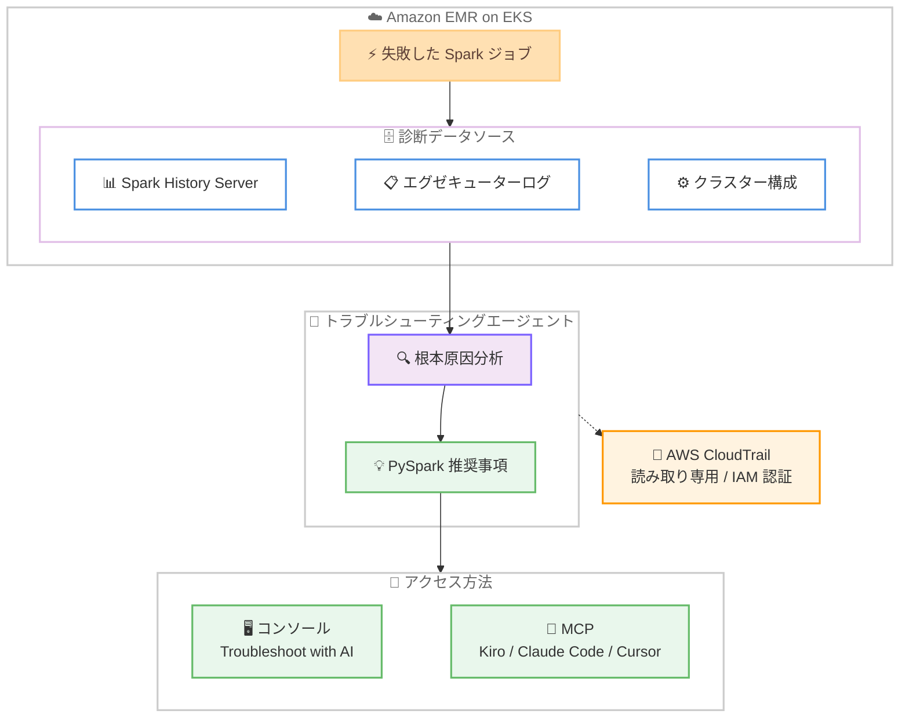

# Amazon EMR on EKS - Apache Spark トラブルシューティングエージェント

**リリース日**: 2026 年 7 月 10 日
**サービス**: Amazon EMR on EKS
**機能**: Apache Spark トラブルシューティングエージェント (Spark troubleshooting agent)

📊 [このアップデートのインフォグラフィックを見る](https://takech9203.github.io/aws-news-summary/20260710-amazon-emr-eks-spark-troubleshooting.html)
<!-- INFOGRAPHIC_BASE_URL は環境変数から取得 -->

## 概要

Amazon EMR on EKS が Apache Spark トラブルシューティングエージェントに対応しました。この機能により、データエンジニアは自然言語を使って Spark ジョブの失敗を診断できるようになります。エージェントは自動的に根本原因分析 (root cause analysis) を実行し、修正のための PySpark コードの推奨事項を提示します。

このエージェントは、Spark History Server のデータ、分散環境のエグゼキュターログ、クラスター構成を分析し、メモリエラー、データスキュー (data skew)、リソース競合、接続障害といった問題を特定します。従来は複数のログやメトリクスを手動で調査する必要があった原因究明の作業を、AI が支援することで大幅に効率化します。

今回のリリースにより、トラブルシューティングエージェントは Amazon EMR のすべてのデプロイオプション (EMR on EC2、EMR Serverless、EMR on EKS) をカバーするようになりました。EMR on EKS のコンソールに表示される [Troubleshoot with AI] から利用できるほか、Model Context Protocol (MCP) を通じて Kiro、Claude Code、Cursor などの AI コーディングエージェントからも利用できます。

**アップデート前の課題**

- 以前は、Spark ジョブが失敗した際に、分散環境に散在するエグゼキュターログや Spark History Server のデータを手動で調査する必要があった
- 以前は、メモリエラーやデータスキューなどの原因を特定するために、Spark に関する深い専門知識が求められた
- 以前は、EMR on EKS ではトラブルシューティングエージェントを利用できず、根本原因分析を自動化する手段が限られていた

**アップデート後の改善**

- 今回のアップデートにより、自然言語でジョブの失敗を診断し、自動化された根本原因分析を受け取れるようになった
- 今回のアップデートにより、メモリエラー、データスキュー、リソース競合、接続障害の特定と PySpark コードの推奨が可能になった
- 今回のアップデートにより、EMR on EC2、EMR Serverless、EMR on EKS のすべてのデプロイオプションでエージェントが利用可能になった

## アーキテクチャ図

失敗した Spark ジョブの診断データをエージェントが分析し、根本原因分析と PySpark の推奨事項を生成する流れを示しています。すべての操作は読み取り専用で IAM 認証され、AWS CloudTrail に記録されます。

## サービスアップデートの詳細

### 主要機能

1. **自然言語によるジョブ失敗の診断**
   - データエンジニアは自然言語でジョブの失敗について問い合わせできる
   - 分散ログや構成を手動で調査することなく、自動化された根本原因分析を受け取れる
   - 診断結果とあわせて修正のための PySpark コードの推奨事項が提示される

2. **複数データソースの自動分析**
   - Spark History Server のデータを分析
   - 分散環境のエグゼキューターログを分析
   - クラスター構成を分析し、メモリエラー、データスキュー、リソース競合、接続障害を特定

3. **すべての EMR デプロイオプションのサポート**
   - 今回の EMR on EKS への対応により、EMR on EC2、EMR Serverless、EMR on EKS のすべてのデプロイオプションをカバー
   - 一貫したトラブルシューティング体験を EMR 全体で提供

4. **複数のアクセス手段**
   - EMR on EKS コンソールの失敗したジョブに表示される [Troubleshoot with AI] から利用可能
   - MCP を通じて Kiro、Claude Code、Cursor などの AI コーディングエージェントから利用可能

## 技術仕様

### 分析対象と検出可能な問題

| 項目 | 詳細 |
|------|------|
| 分析データソース | Spark History Server、エグゼキューターログ、クラスター構成 |
| 検出可能な問題 | メモリエラー、データスキュー、リソース競合、接続障害 |
| 出力 | 根本原因分析、PySpark コードの推奨事項 |
| 対応デプロイオプション | EMR on EC2、EMR Serverless、EMR on EKS |

### セキュリティ

| 項目 | 詳細 |
|------|------|
| 操作モード | 読み取り専用 (read-only) |
| 認証 | IAM ロールによる認証 |
| 監査 | すべての操作を AWS CloudTrail に記録 |

## 設定方法

### 前提条件

1. Amazon EMR on EKS で Spark ジョブを実行していること
2. トラブルシューティングエージェントの利用に必要な IAM 権限が付与されていること
3. MCP 経由で利用する場合は、対応する AI コーディングエージェント (Kiro、Claude Code、Cursor など) を用意すること

### 手順

#### ステップ 1: コンソールから利用する

EMR on EKS のコンソールで、失敗したジョブを選択し、[Troubleshoot with AI] を選択します。エージェントが診断を開始し、根本原因分析と推奨される修正内容を提示します。

#### ステップ 2: MCP から利用する

利用する AI コーディングエージェント (Kiro、Claude Code、Cursor など) に MCP サーバーを設定します。設定後は、AI コーディングエージェントから自然言語で EMR on EKS のジョブ失敗について診断を依頼できます。

## メリット

### ビジネス面

- **障害復旧時間の短縮**: 根本原因分析の自動化により、ジョブ失敗の原因究明にかかる時間を削減できます
- **専門知識への依存の軽減**: 自然言語での診断により、Spark の深い専門知識がなくても問題を特定しやすくなります
- **運用の一貫性**: すべての EMR デプロイオプションで同じトラブルシューティング体験を提供します

### 技術面

- **包括的な分析**: Spark History Server、エグゼキューターログ、クラスター構成を横断的に分析します
- **実践的な推奨事項**: 診断結果とあわせて PySpark コードの推奨が得られます
- **既存ワークフローへの統合**: MCP を通じて Kiro、Claude Code、Cursor などの開発ツールから直接利用できます

## デメリット・制約事項

### 制限事項

- 利用可能リージョンは Amazon SageMaker Unified Studio が利用可能なリージョンに限られます
- エージェントは読み取り専用で動作するため、修正の適用はユーザーが手動で行う必要があります

### 考慮すべき点

- 診断精度は Spark History Server のデータやログの完全性に依存します
- MCP 経由で利用する場合は、対応する AI コーディングエージェントの準備と設定が必要です

## ユースケース

### ユースケース 1: メモリエラーの診断

**シナリオ**: EMR on EKS で実行した Spark ジョブが OutOfMemory エラーで失敗した状況です。

**効果**: エージェントがエグゼキューターログとクラスター構成を分析し、メモリエラーの原因を特定して、メモリ設定やパーティション調整に関する PySpark コードの推奨事項を提示します。

### ユースケース 2: データスキューの特定

**シナリオ**: 特定のタスクだけが極端に遅く、ジョブ全体のパフォーマンスが低下している状況です。

**効果**: エージェントが Spark History Server のデータを分析し、データスキューを検出して、パーティション再分散などの改善策を推奨します。

### ユースケース 3: AI コーディングエージェントからの診断

**シナリオ**: 開発者が Claude Code や Cursor などのツールで開発作業をしながら、EMR on EKS のジョブ失敗を確認したい状況です。

**効果**: MCP を通じて開発ツールから自然言語で診断を依頼でき、コンテキストを切り替えることなく根本原因分析と修正案を得られます。

## 料金

公式発表では、この機能に関する追加料金についての記載はありません。詳細は Amazon EMR の料金ページをご確認ください。

## 利用可能リージョン

Amazon SageMaker Unified Studio が利用可能なすべての AWS リージョンで提供されます。

## 関連サービス・機能

- **Amazon EMR on EC2 / EMR Serverless**: 同じトラブルシューティングエージェントに対応しており、すべての EMR デプロイオプションで一貫した診断が可能です
- **Model Context Protocol (MCP)**: Kiro、Claude Code、Cursor などの AI コーディングエージェントからエージェントを利用するための連携プロトコルです
- **AWS CloudTrail**: エージェントのすべての操作を記録し、監査を可能にします
- **Amazon SageMaker Unified Studio**: 本機能の利用可能リージョンの基準となるサービスです

## 参考リンク

- 📊 [インフォグラフィック](https://takech9203.github.io/aws-news-summary/20260710-amazon-emr-eks-spark-troubleshooting.html)
- [公式発表 (What's New)](https://aws.amazon.com/about-aws/whats-new/2026/07/amazon-emr-eks-spark-troubleshooting/)
- [Amazon EMR on EKS ドキュメント](https://docs.aws.amazon.com/emr/latest/EMR-on-EKS-DevelopmentGuide/emr-eks.html)
- [Amazon EMR 料金ページ](https://aws.amazon.com/emr/pricing/)

## まとめ

Apache Spark トラブルシューティングエージェントの EMR on EKS 対応により、Amazon EMR のすべてのデプロイオプションで自然言語による自動化されたジョブ診断が可能になりました。Spark ジョブの障害対応に時間を要しているチームは、コンソールの [Troubleshoot with AI] や MCP 連携を活用することで、根本原因分析と実践的な修正案を迅速に得られます。まずは失敗したジョブでエージェントを試し、既存の運用ワークフローへの組み込みを検討することをおすすめします。
