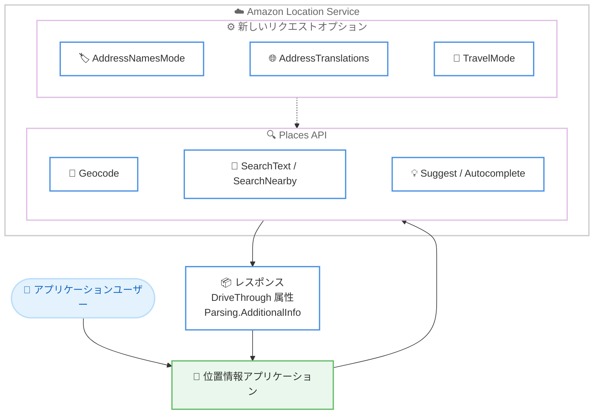

# Amazon Location Service - Places API の住所・検索オプション強化

**リリース日**: 2026 年 7 月 10 日
**サービス**: Amazon Location Service
**機能**: Places API の住所名フォーマット、多言語翻訳、移動最適化検索、ドライブスルー属性

📊 [このアップデートのインフォグラフィックを見る](https://takech9203.github.io/aws-news-summary/20260710-amazon-location-service-enhanced-address-search.html)
<!-- INFOGRAPHIC_BASE_URL は環境変数から取得 -->

## 概要

Amazon Location Service は、位置情報検索を担う Places API に複数の機能強化を追加しました。今回のアップデートでは、住所コンポーネント名の返却方法を制御する `AddressNamesMode` と `AddressNamesVariant`、50 以上の言語に対応する多言語翻訳を返す `AddressTranslations`、移動中のユーザー向けに検索結果を最適化する `TravelMode`、そしてドライブスルー対応の有無を示す `DriveThrough` 属性が導入されました。

これらの機能は、Geocode、ReverseGeocode、GetPlace、Suggest、Autocomplete、SearchNearby、SearchText の各 API にまたがって提供されます。加えて、Geocode API のレスポンスには入力住所がどのように解釈されたかの追加情報を返す `Parsing.AdditionalInfo` フィールドが追加されました。

これにより、ナビゲーション、フードデリバリー、物流、多言語対応アプリケーションなど、幅広いユースケースにおいて、開発者は住所と場所の情報をより柔軟かつ正確に扱えるようになります。本機能は東京リージョンを含む主要なリージョンで利用可能です。

**アップデート前の課題**

- 住所コンポーネント名の返却形式を制御できず、入力に忠実な表記や行政区分に基づく表記を選択できなかった
- 場所の名称を多言語で取得する標準的な手段がなく、多言語対応アプリの構築に追加開発が必要だった
- 移動中のユーザーに最適化された検索結果を得る仕組みがなく、車載やナビゲーション用途での関連性が不十分だった
- ドライブスルー対応の有無を場所の属性として取得できなかった

**アップデート後の改善**

- `AddressNamesMode` により、正規化 (normalized)、入力一致 (matched)、行政区分 (administrative) の各表記を選択可能になった
- `AddressTranslations` により、50 以上の言語で場所名の翻訳を取得できるようになった
- `TravelMode` により、Suggest と SearchText の結果を移動中のユーザー向けに最適化できるようになった
- `DriveThrough` 属性により、ドライブスルー対応の有無を判定できるようになった
- Geocode の `Parsing.AdditionalInfo` により、入力住所の解釈結果を詳細に把握できるようになった

## アーキテクチャ図



アプリケーションが Places API を呼び出す際に新しいリクエストオプションを指定することで、住所名の形式や多言語翻訳、移動最適化された検索結果、ドライブスルー情報を含むレスポンスを取得できます。

## サービスアップデートの詳細

### 主要機能

1. **住所名フォーマットの制御 (AddressNamesMode / AddressNamesVariant)**
   - `AddressNamesMode` により、住所コンポーネント名の返却方法を制御可能
   - `normalized`: 正規化された標準的な表記 (デフォルト)
   - `matched`: 入力された文字列に一致する表記
   - `administrative`: 政府の行政階層を反映した表記
   - `AddressNamesVariant` と組み合わせて、返却する住所名のバリエーションを指定可能

2. **多言語の住所翻訳 (AddressTranslations)**
   - 場所名の翻訳を 50 以上の言語で返却
   - 多言語対応アプリケーションの開発を簡素化
   - グローバル向けサービスでの表示ローカライズに活用可能

3. **移動最適化検索 (TravelMode)**
   - Suggest と SearchText の結果を移動中のユーザー向けに最適化
   - ナビゲーションや車載アプリケーションでの関連性を向上

4. **ドライブスルー属性 (DriveThrough)**
   - GetPlace、Suggest、SearchNearby、SearchText で利用可能
   - 場所がドライブスルーサービスを提供しているかを判定
   - 物流、フードデリバリー、ナビゲーションのユースケースで有用

5. **Geocode の解釈情報 (Parsing.AdditionalInfo)**
   - Geocode API のレスポンスに追加された新フィールド
   - 入力された住所がどのように解釈されたかの詳細情報を提供

## 技術仕様

### 対象 API と新機能の対応

| 機能 | 対象 API |
|------|----------|
| AddressNamesMode / AddressNamesVariant | Geocode, ReverseGeocode, GetPlace, Suggest, Autocomplete, SearchNearby, SearchText |
| AddressTranslations | Geocode, ReverseGeocode, GetPlace, Suggest, Autocomplete, SearchNearby, SearchText |
| TravelMode | Suggest, SearchText |
| DriveThrough | GetPlace, Suggest, SearchNearby, SearchText |
| Parsing.AdditionalInfo | Geocode |

### AddressNamesMode の値

| 値 | 説明 |
|------|------|
| normalized | 正規化された標準的な表記 (デフォルト) |
| matched | 入力文字列に一致する表記 |
| administrative | 行政階層を反映した表記 |

## 設定方法

### 前提条件

1. AWS アカウントと Amazon Location Service の利用設定
2. Places API を呼び出すための IAM 権限 (`geo-places:*` など)
3. AWS SDK または AWS CLI の最新バージョン

### 手順

#### ステップ1: 住所名フォーマットを指定して検索

```bash
aws geo-places search-text \
  --query-text "東京駅" \
  --additional-features '["AddressNamesMode"]' \
  --address-names-mode administrative
```

このコマンドは、SearchText API を呼び出し、行政階層に基づいた住所名を取得します。用途に応じて `normalized` や `matched` を指定できます。

#### ステップ2: 多言語翻訳を取得

```bash
aws geo-places geocode \
  --query-text "1600 Pennsylvania Ave NW, Washington DC" \
  --additional-features '["AddressTranslations"]'
```

このコマンドは Geocode API を呼び出し、場所名の多言語翻訳を含むレスポンスを取得します。

#### ステップ3: ドライブスルー対応の場所を検索

```bash
aws geo-places search-nearby \
  --query-position '[139.767, 35.681]' \
  --additional-features '["DriveThrough"]'
```

このコマンドは指定位置周辺を検索し、各場所のドライブスルー対応の有無を含む結果を返します。

## メリット

### ビジネス面

- **グローバル展開の加速**: 50 以上の言語での住所翻訳により、多言語対応アプリを迅速に構築できる
- **ユーザー体験の向上**: 移動最適化検索により、ナビゲーションや車載用途での検索精度が向上する
- **新しいユースケースの実現**: ドライブスルー属性により、フードデリバリーや物流向けの機能を提供できる

### 技術面

- **柔軟な住所表記**: 用途に応じて正規化・入力一致・行政区分の表記を選択できる
- **開発工数の削減**: 多言語翻訳や解釈情報が API から直接取得でき、追加実装が不要になる
- **デバッグの容易化**: `Parsing.AdditionalInfo` により入力住所の解釈結果を確認でき、ジオコーディングの精度検証が容易になる

## デメリット・制約事項

### 制限事項

- `TravelMode` は Suggest と SearchText のみで利用可能
- `DriveThrough` は GetPlace、Suggest、SearchNearby、SearchText のみで利用可能
- `Parsing.AdditionalInfo` は Geocode API に限定
- 一部リージョン (中国リージョンなど) では利用できない

### 考慮すべき点

- 新しい追加機能を利用する際は、対象 API がその機能に対応しているかを事前に確認する
- 多言語翻訳やドライブスルー属性の取得は追加のレスポンスデータを伴うため、レスポンスサイズやデータ利用への影響を考慮する
- 住所名モードの選択によって返却される表記が変わるため、既存アプリケーションの表示ロジックへの影響を確認する

## ユースケース

### ユースケース1: 多言語対応の配車アプリ

**シナリオ**: 訪日外国人向けの配車アプリで、目的地の名称をユーザーの言語で表示したい

**実装例**:
```
SearchText API + AddressTranslations
→ 場所名を英語・中国語・韓国語などで取得して UI に表示
```

**効果**: 追加の翻訳サービスを実装せずに、多言語での場所表示が可能になる

### ユースケース2: 車載ナビゲーションの検索

**シナリオ**: 運転中のドライバーが音声で施設を検索する際に、走行に適した候補を優先表示したい

**実装例**:
```
Suggest / SearchText API + TravelMode
→ 移動中のユーザー向けに最適化された検索結果を取得
```

**効果**: ナビゲーションシナリオでの検索関連性が向上し、運転中の操作負荷を軽減できる

### ユースケース3: フードデリバリーの店舗判定

**シナリオ**: デリバリーアプリで、ドライブスルー対応の店舗を識別してルート最適化に活用したい

**実装例**:
```
SearchNearby API + DriveThrough 属性
→ 周辺店舗のドライブスルー対応有無を取得
```

**効果**: 配達方法や店舗選定の判断材料が増え、オペレーションを効率化できる

## 料金

Amazon Location Service の Places API は、API リクエスト数に基づく従量課金です。今回追加された機能の利用に伴う課金への影響については、公式の料金ページを確認してください。

## 利用可能リージョン

以下のリージョンで利用可能です。

- 米国東部 (オハイオ)
- 米国東部 (バージニア北部)
- 米国西部 (オレゴン)
- アジアパシフィック (ムンバイ)
- アジアパシフィック (シドニー)
- アジアパシフィック (東京)
- カナダ (中部)
- 欧州 (フランクフルト)
- 欧州 (アイルランド)
- 欧州 (ロンドン)
- 欧州 (スペイン)
- 欧州 (ストックホルム)
- 南米 (サンパウロ)
- AWS GovCloud (米国西部)

## 関連サービス・機能

- **Amazon Location Service Routes**: ルート計算機能。移動最適化検索と組み合わせてナビゲーション体験を強化できる
- **Amazon Location Service Maps**: 地図表示機能。検索結果を地図上に可視化する際に利用する
- **AWS SDK / AWS CLI**: Places API を各種アプリケーションから呼び出すためのインターフェース

## 参考リンク

- 📊 [インフォグラフィック](https://takech9203.github.io/aws-news-summary/20260710-amazon-location-service-enhanced-address-search.html)
- [公式発表 (What's New)](https://aws.amazon.com/about-aws/whats-new/2026/07/amazon-location-service-enhanced-address-search)
- [Amazon Location Service ドキュメント](https://docs.aws.amazon.com/location/)
- [Amazon Location Service 料金ページ](https://aws.amazon.com/location/pricing/)

## まとめ

今回のアップデートは、Amazon Location Service の Places API に住所名フォーマット制御、多言語翻訳、移動最適化検索、ドライブスルー属性という実用的な機能を追加し、位置情報アプリケーションの開発の幅を大きく広げます。特に多言語対応やナビゲーション、フードデリバリーなどのユースケースを持つ開発者は、これらの新しい追加機能を活用することでアプリケーションの価値を高められます。東京リージョンでも利用可能なため、まずは既存の Places API 呼び出しに追加機能を組み込んで動作を確認することを推奨します。
