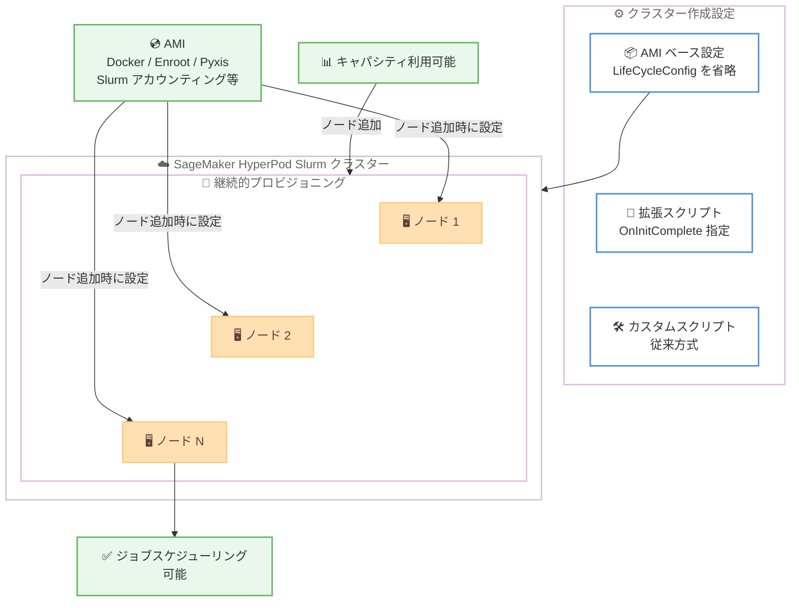

# Amazon SageMaker HyperPod - 継続的プロビジョニングでの AMI ベースのノードライフサイクル設定

**リリース日**: 2026 年 7 月 10 日
**サービス**: Amazon SageMaker HyperPod
**機能**: Slurm クラスターの継続的プロビジョニングにおける AMI ベースのノードライフサイクル設定

📊 [このアップデートのインフォグラフィックを見る](https://takech9203.github.io/aws-news-summary/20260710-ami-configuration-continuous-slurm.html)
<!-- INFOGRAPHIC_BASE_URL は環境変数から取得 -->

## 概要

Amazon SageMaker HyperPod が、継続的プロビジョニング (Continuous Provisioning) を使用する Slurm クラスターにおいて、AMI ベースの設定をサポートしました。継続的プロビジョニングは、キャパシティが利用可能になるにつれてノードをクラスターに追加するモードで、今回のリリースによりこのモードを使用するクラスターにも AMI ベースの設定が拡張されました。

これまで HyperPod の Slurm クラスターでは、ノードをセットアップするためにライフサイクル設定スクリプト (Lifecycle Configuration Scripts) をダウンロード、設定し、Amazon S3 にアップロードする必要がありました。今回のサポートにより、継続的プロビジョニングを使用するクラスターは、これらのスクリプトを管理することなく作成できるようになります。

AMI ベースの設定では、AI/ML トレーニングワークロードを実行するための本番環境対応のノードが、必要なソフトウェアと設定とともにプロビジョニングされます。これには Docker、Enroot、Pyxis といった必須ソフトウェアや、Slurm アカウンティング、SSH キー生成、ログローテーションといった設定が含まれます。継続的プロビジョニングを使用する場合、各ノードはクラスターに追加される際に AMI から設定されるため、ライフサイクル設定スクリプトを管理する必要がなく、ノードがジョブのスケジューリングに利用可能になるまでの時間が短縮されます。

**アップデート前の課題**

- 継続的プロビジョニングを使用するクラスターでは、ライフサイクル設定スクリプトのダウンロード、設定、S3 へのアップロードが必要だった
- ライフサイクル設定スクリプトの管理・メンテナンスに運用負荷がかかっていた
- ノードのセットアップにスクリプト実行が必要なため、ジョブのスケジューリングに利用可能になるまでに時間がかかっていた

**アップデート後の改善**

- 継続的プロビジョニングを使用するクラスターを、ライフサイクル設定スクリプトなしで作成できるようになった
- Docker、Enroot、Pyxis などの必須ソフトウェアと Slurm アカウンティングなどの設定が AMI から自動的にプロビジョニングされる
- 各ノードが追加時に AMI から設定されるため、ジョブのスケジューリングに利用可能になるまでの時間が短縮された

## アーキテクチャ図

キャパシティが利用可能になると継続的プロビジョニングによってノードが追加され、各ノードは AMI から必須ソフトウェアと設定を取得してプロビジョニングされます。ライフサイクル設定スクリプトの管理が不要になります。

## サービスアップデートの詳細

### 主要機能

1. **継続的プロビジョニングでの AMI ベース設定**
   - キャパシティが利用可能になるにつれてノードを追加する継続的プロビジョニングモードに対応
   - 各ノードはクラスターに追加される際に AMI から設定される
   - ライフサイクル設定スクリプトの管理が不要

2. **本番環境対応の自動プロビジョニング**
   - 必須ソフトウェア: Docker、Enroot、Pyxis
   - 設定内容: Slurm アカウンティング、SSH キー生成、ログローテーション
   - AI/ML トレーニングワークロードをすぐに実行できる状態でノードが提供される

3. **拡張スクリプトによるカスタマイズ**
   - `OnInitComplete` パラメータと `SourceS3Uri` を `LifeCycleConfig` ブロックで指定することで拡張スクリプトを追加可能
   - AMI のベースライン設定に加えて独自の設定を適用できる
   - 完全な制御が必要なユースケース向けにカスタムライフサイクル設定スクリプトも引き続き完全にサポート

## 技術仕様

### 設定方式の比較

| 設定方式 | LifeCycleConfig | 説明 |
|------|------|------|
| AMI ベース設定 | 省略 (None) | スクリプト不要で AMI から自動設定 |
| AMI ベース設定 + 拡張スクリプト | `OnInitComplete` と `SourceS3Uri` を指定 | AMI のベースラインに追加設定を適用 |
| カスタムライフサイクル設定スクリプト | 従来の設定 | プロビジョニングを完全に制御 |

### AMI に含まれるソフトウェアと設定

| 項目 | 詳細 |
|------|------|
| Docker | コンテナランタイム |
| Enroot | 非特権コンテナの実行環境 |
| Pyxis | Slurm 向けコンテナ実行プラグイン |
| Slurm アカウンティング | ジョブのリソース使用状況の記録 |
| SSH キー生成 | ノード間の SSH アクセス設定 |
| ログローテーション | ログファイルの管理 |

### API 変更履歴

継続的プロビジョニングでの AMI ベース設定を有効にするには、クラスター作成時にインスタンスグループ設定から `LifeCycleConfig` ブロックを省略します。拡張スクリプトを使用する場合は、`LifeCycleConfig` ブロック内で `OnInitComplete` パラメータと `SourceS3Uri` を指定します。

## 設定方法

### 前提条件

1. SageMaker HyperPod が利用可能なリージョンであること
2. Slurm オーケストレーションを使用する HyperPod クラスターを作成すること
3. 継続的プロビジョニングモードを使用するクラスター構成であること

### 手順

#### ステップ1: AMI ベース設定でクラスターを作成 (API)

インスタンスグループ設定から `LifeCycleConfig` ブロックを省略することで、AMI ベースの設定を有効化します。これにより、ライフサイクル設定スクリプトを準備・アップロードすることなくクラスターを作成できます。

#### ステップ2: AMI ベース設定でクラスターを作成 (コンソール)

SageMaker AI コンソールを使用する場合は、Custom setup の Lifecycle scripts で「None」を選択します。これにより、コンソール経由でも AMI ベースの設定が有効になります。

#### ステップ3: 拡張スクリプトの追加 (任意)

追加のカスタマイズが必要な場合は、`LifeCycleConfig` ブロックで `OnInitComplete` パラメータと `SourceS3Uri` を指定して拡張スクリプトを提供します。AMI のベースライン設定の上に、組織固有の設定を適用できます。

## メリット

### ビジネス面

- **運用負荷の削減**: ライフサイクル設定スクリプトのダウンロード、設定、S3 へのアップロード、メンテナンスが不要になり、運用コストを削減できる
- **市場投入までの時間短縮**: クラスターのセットアップが簡素化され、AI/ML トレーニングをより早く開始できる
- **一貫性の向上**: AMI ベースの標準化された環境により、ノード間の設定のばらつきを低減できる

### 技術面

- **ノード可用性の高速化**: 各ノードが AMI から設定されるため、ジョブスケジューリングに利用可能になるまでの時間が短縮される
- **本番環境対応**: Docker、Enroot、Pyxis などの必須ソフトウェアが事前に構成された状態で提供される
- **柔軟なカスタマイズ**: 拡張スクリプトやカスタムライフサイクル設定スクリプトにより、必要に応じて追加設定が可能

## デメリット・制約事項

### 制限事項

- 継続的プロビジョニングと AMI ベース設定は Slurm オーケストレーションを使用するクラスターが対象
- AMI に含まれるソフトウェアバージョンは AMI により決定されるため、特定バージョンが必要な場合は拡張スクリプトやカスタムスクリプトでの対応が必要

### 考慮すべき点

- プロビジョニングを完全に制御したい場合は、従来のカスタムライフサイクル設定スクリプトの使用を検討する
- AMI のベースライン設定で不足する要素がある場合は、`OnInitComplete` を用いた拡張スクリプトで補う

## ユースケース

### ユースケース1: 大規模 LLM トレーニングクラスターの迅速な構築

**シナリオ**: 大規模言語モデルのトレーニングを行うチームが、GPU キャパシティが利用可能になり次第ノードを追加していきたい。ライフサイクルスクリプトの管理に時間をかけたくない。

**効果**: 継続的プロビジョニングと AMI ベース設定により、スクリプト管理なしでノードが自動構成され、キャパシティが確保でき次第すぐにトレーニングジョブを実行できる。

### ユースケース2: 標準化された ML 環境の展開

**シナリオ**: 複数のチームが共通の ML トレーニング環境を必要としており、ノード間で一貫した設定を維持したい。

**効果**: AMI ベース設定により Docker、Enroot、Pyxis、Slurm アカウンティングなどが標準化された状態で提供され、環境のばらつきを排除できる。

### ユースケース3: 組織固有の設定を追加した環境構築

**シナリオ**: AMI の標準設定に加えて、社内のモニタリングエージェントやセキュリティ設定を各ノードに適用したい。

**効果**: `OnInitComplete` パラメータと `SourceS3Uri` を用いた拡張スクリプトにより、AMI のベースライン設定の上に組織固有の設定を追加できる。

## 料金

本機能自体に追加料金はありません。SageMaker HyperPod クラスターで使用するコンピューティングリソース (インスタンス) およびストレージなどの通常の料金が適用されます。詳細は SageMaker HyperPod の料金ページを参照してください。

## 利用可能リージョン

Amazon SageMaker HyperPod が利用可能なすべての AWS リージョンで利用できます。

## 関連サービス・機能

- **Amazon SageMaker HyperPod**: 大規模な基盤モデルのトレーニングと推論を高速化するインフラストラクチャ
- **Slurm**: HyperPod がサポートするオープンソースのジョブスケジューラおよびクラスター管理システム
- **Amazon S3**: 拡張スクリプトやカスタムライフサイクル設定スクリプトの格納先
- **Enroot / Pyxis**: HPC 環境でコンテナ化されたワークロードを Slurm 上で実行するためのツール

## 参考リンク

- 📊 [インフォグラフィック](https://takech9203.github.io/aws-news-summary/20260710-ami-configuration-continuous-slurm.html)
- [公式発表 (What's New)](https://aws.amazon.com/about-aws/whats-new/2025/06/ami-configuration-continuous-slurm/)
- [Amazon SageMaker HyperPod ドキュメント](https://docs.aws.amazon.com/sagemaker/latest/dg/sagemaker-hyperpod.html)
- [Amazon SageMaker 料金ページ](https://aws.amazon.com/sagemaker/pricing/)

## まとめ

このアップデートにより、継続的プロビジョニングを使用する SageMaker HyperPod の Slurm クラスターでも、ライフサイクル設定スクリプトの管理なしにノードを構成できるようになりました。運用負荷の削減とノード可用性の高速化により、AI/ML トレーニングワークロードの立ち上げが容易になります。継続的プロビジョニングを利用しているチームは、クラスター作成時に `LifeCycleConfig` ブロックの省略 (またはコンソールで「None」を選択) を検討することをお勧めします。
