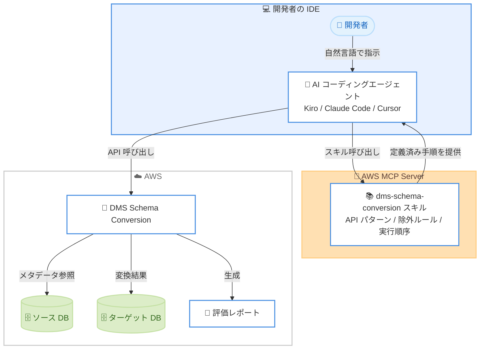

# AWS DMS Schema Conversion - AI エージェント自動化対応

**リリース日**: 2026年7月10日
**サービス**: AWS Database Migration Service (DMS)
**機能**: DMS Schema Conversion の AI エージェント自動化 (AWS MCP Server)

📊 [このアップデートのインフォグラフィックを見る](https://takech9203.github.io/aws-news-summary/20260710-aws-dms-sc-ai-agent-automation-mcp-server.html)
<!-- INFOGRAPHIC_BASE_URL は環境変数から取得 -->

## 概要

AWS Database Migration Service (DMS) の Schema Conversion 機能が、AWS MCP Server を通じた AI エージェント自動化に対応しました。このアップデートにより、開発者は AI コーディングエージェントをサービスに接続し、統合開発環境 (IDE) から自然言語でスキーマ変換の一連のワークフローを実行できるようになります。

対応する AI エージェントは Kiro、Claude Code、Cursor です。これらのエージェントは、プロジェクトの作成、ソースメタデータの参照、スキーマの変換、評価レポートの生成、結果のエクスポートまでを自律的に実行します。開発者は IDE を離れることなく、対話形式でデータベースの移行作業を進められます。

この機能の中核となるのが `dms-schema-conversion` スキルです。このスキルはオンデマンドで読み込まれ、API の利用パターン、スキーマの除外ルール、操作の実行順序といった定義済みの手順をエージェントに提供します。これにより、エージェントは一般的な知識に基づいて場当たり的に処理を進めるのではなく、確立された手順に従って動作し、試行錯誤のサイクルを削減できます。本機能は 2024 年の re:Invent で発表された生成 AI 機能を基盤として拡張されたものです。

**アップデート前の課題**

このアップデート以前は、スキーマ変換の作業に以下のような課題がありました。

- スキーマ変換のワークフローを、コンソールや個別の操作を通じて手動で進める必要があった
- AI エージェントを活用しようとしても、DMS Schema Conversion 固有の API パターンや操作手順を把握しておらず、精度の高い自動化が難しかった
- ストアドプロシージャ、関数、トリガーなど変換が困難なコードオブジェクトの対応に手間がかかっていた

**アップデート後の改善**

今回のアップデートにより、以下が可能になりました。

- IDE から自然言語で指示するだけで、プロジェクト作成からスキーマ変換、結果エクスポートまでを AI エージェントが自律的に実行できるようになった
- `dms-schema-conversion` スキルが定義済みの手順を提供することで、試行錯誤を減らし、一貫性のある変換作業が可能になった
- ストアドプロシージャ、関数、トリガーの変換支援を含め、生成 AI 機能を IDE のワークフローに統合できるようになった

## アーキテクチャ図

AI エージェントは AWS MCP Server 経由で `dms-schema-conversion` スキルの手順を取得し、DMS Schema Conversion の API を呼び出してソース DB からターゲット DB へのスキーマ変換を自律的に実行します。

## サービスアップデートの詳細

### 主要機能

1. **AWS MCP Server 経由の AI エージェント接続**
   - Model Context Protocol (MCP) を通じて AI コーディングエージェントを DMS Schema Conversion に接続する
   - 対応エージェントは Kiro、Claude Code、Cursor
   - IDE から離れることなく、自然言語でスキーマ変換ワークフローを操作できる

2. **自律的な移行ワークフローの実行**
   - プロジェクトの作成、ソースメタデータの参照、スキーマの変換、評価レポートの生成、結果のエクスポートを自律的に実行する
   - 一連の作業を対話形式で進められる

3. **dms-schema-conversion スキル**
   - オンデマンドで読み込まれるスキル
   - API の利用パターン、スキーマの除外ルール、操作の実行順序といった定義済みの手順を提供する
   - 一般的な知識に基づく場当たり的な処理を避け、試行錯誤のサイクルを削減する

4. **難易度の高いコードオブジェクトの変換支援**
   - ストアドプロシージャ、関数、トリガーの変換を支援する
   - 2024 年の re:Invent で発表された生成 AI 機能を基盤として拡張されている

## 技術仕様

### 対応エージェントと接続方式

| 項目 | 詳細 |
|------|------|
| 接続方式 | AWS MCP Server (Model Context Protocol) |
| 対応 AI エージェント | Kiro、Claude Code、Cursor |
| スキル名 | dms-schema-conversion (オンデマンド読み込み) |
| 対応エンジンペア | 既存のすべてのソース / ターゲットエンジンの組み合わせ |
| 追加料金 | なし |

## 設定方法

### 前提条件

1. AWS MCP Server を利用できる環境
2. 対応する AI コーディングエージェント (Kiro、Claude Code、Cursor のいずれか) が導入された IDE
3. DMS Schema Conversion を利用するための AWS アカウントと適切な IAM 権限

### 手順

#### ステップ1: AI エージェントを AWS MCP Server に接続する

利用している AI コーディングエージェントの設定に従い、AWS MCP Server を登録します。これにより、エージェントが DMS Schema Conversion のスキルを利用できるようになります。

#### ステップ2: 自然言語でワークフローを指示する

IDE 上でエージェントに対し、スキーマ変換の目的を自然言語で指示します。エージェントは `dms-schema-conversion` スキルをオンデマンドで読み込み、定義済みの手順に従ってプロジェクト作成やメタデータ参照を実行します。

#### ステップ3: 変換結果を確認しエクスポートする

エージェントがスキーマの変換と評価レポートの生成を完了した後、結果を確認し、必要に応じてエクスポートします。詳細は AWS 公式のスタートガイドを参照してください。

## メリット

### ビジネス面

- **移行作業の迅速化**: 手動操作を削減し、対話形式でスキーマ変換を進めることで、移行プロジェクトの立ち上げから完了までの時間を短縮できる
- **追加コストなしで利用可能**: 既存のすべてのソース / ターゲットエンジンの組み合わせに対して追加料金なしで提供される
- **専門知識の負担軽減**: 定義済みの手順により、DMS Schema Conversion に精通していない開発者でも一貫した品質で作業を進めやすい

### 技術面

- **試行錯誤の削減**: `dms-schema-conversion` スキルが API パターンや実行順序を提供するため、エージェントの場当たり的な処理を避けられる
- **IDE 内で完結するワークフロー**: 開発環境を離れずに移行作業を実行でき、開発体験が向上する
- **難易度の高いオブジェクトへの対応**: ストアドプロシージャ、関数、トリガーの変換を生成 AI が支援する

## デメリット・制約事項

### 制限事項

- 対応する AI エージェントは Kiro、Claude Code、Cursor に限られる
- 利用可能なリージョンは DMS Schema Conversion のサポートリージョンに依存する
- AWS MCP Server の設定と、対応 IDE / エージェントの導入が前提となる

### 考慮すべき点

- AI エージェントが自律的に処理を実行するため、変換結果や評価レポートの内容は人による確認が推奨される
- ストアドプロシージャなど複雑なコードオブジェクトは、変換後に動作検証を行うことが望ましい

## ユースケース

### ユースケース1: 異種データベース移行の初期評価

**シナリオ**: Oracle から Amazon Aurora PostgreSQL への移行を検討しており、変換難易度を素早く把握したい。

**効果**: IDE から自然言語で指示するだけで、エージェントがプロジェクトを作成し、スキーマ変換と評価レポートの生成を自律的に実行するため、移行の計画立案を迅速化できる。

### ユースケース2: ストアドプロシージャの変換支援

**シナリオ**: 多数のストアドプロシージャや関数を含むレガシーデータベースを移行する必要がある。

**効果**: 生成 AI がストアドプロシージャ、関数、トリガーの変換を支援し、手動での書き換え作業の負担を軽減する。

### ユースケース3: 開発ワークフローへの統合

**シナリオ**: 開発チームが日常的に利用する IDE 内でスキーマ変換作業を完結させたい。

**効果**: Kiro、Claude Code、Cursor などのエージェントを通じて IDE 内で作業できるため、コンソールと IDE を行き来する手間がなくなり、開発体験が向上する。

## 料金

本機能は、既存のすべての DMS Schema Conversion のソース / ターゲットエンジンの組み合わせに対して、追加料金なしで提供されます。DMS Schema Conversion 自体の利用に関する料金は AWS DMS の料金体系に従います。

## 利用可能リージョン

DMS Schema Conversion がサポートされているリージョンで利用できます。詳細なリージョン別の提供状況については、AWS 公式のサポートリージョンページを参照してください。

## 関連サービス・機能

- **AWS Database Migration Service (DMS)**: 本機能の基盤となるデータベース移行サービス
- **AWS MCP Server**: AI エージェントと AWS サービスを Model Context Protocol で接続する仕組み
- **Kiro**: AWS が提供する AI 搭載 IDE。対応 AI エージェントの 1 つ

## 参考リンク

- 📊 [インフォグラフィック](https://takech9203.github.io/aws-news-summary/20260710-aws-dms-sc-ai-agent-automation-mcp-server.html)
- [公式発表 (What's New)](https://aws.amazon.com/about-aws/whats-new/2026/07/aws-dms-sc-ai-agent-automation-mcp-server/)
- [AWS DMS 概要](https://aws.amazon.com/dms/)
- [スタートガイド (sc-genai-agents)](https://docs.aws.amazon.com/dms/latest/userguide/sc-genai-agents.html)
- [DMS Schema Conversion ドキュメント](https://docs.aws.amazon.com/dms/latest/userguide/CHAP_SchemaConversion.html)

## まとめ

このアップデートは、DMS Schema Conversion を AI コーディングエージェントと AWS MCP Server を通じて自動化できるようにするもので、データベース移行の生産性を大きく高めます。追加料金なしで既存のすべてのエンジンペアに対応するため、移行プロジェクトを検討している場合は、対応 IDE とエージェントの環境を整えたうえで、自然言語による自律的なワークフローを試すことをお勧めします。
