# AWS DMS Schema Conversion - SQL Server のオフライン変換対応

**リリース日**: 2026 年 7 月 10 日
**サービス**: AWS Database Migration Service (AWS DMS)
**機能**: DMS Schema Conversion オフラインソース変換 (Microsoft SQL Server)

📊 [このアップデートのインフォグラフィックを見る](https://takech9203.github.io/aws-news-summary/20260710-aws-dms-schema-conversion-offline-source.html)
<!-- INFOGRAPHIC_BASE_URL は環境変数から取得 -->

## 概要

AWS DMS Schema Conversion が、Microsoft SQL Server を対象としたオフラインソース変換に対応しました。この機能により、ソースデータベースへ直接接続することなく、スキーマとデータベースコードの変換が可能になります。データベース管理者は自身の環境で標準的なデータベースコマンドを使用してメタデータを抽出し、そのメタデータを DMS Schema Conversion にアップロードするだけで変換を実行できます。

従来のアプローチでは、DMS Schema Conversion がソースデータベースへ直接接続する必要があり、セキュリティレビュー、ファイアウォールの変更、VPN の設定といった作業が移行プロジェクトの遅延要因となっていました。オフラインソース変換では、これらの準備作業が不要になり、「コマンド実行とアップロード」というシンプルなワークフローに置き換えられます。AWS によると、オフライン方式でも接続方式と同一の変換結果が得られます。

この機能は、本番環境の SQL Server データベースへの外部ツールのアクセスをセキュリティポリシーで制限している組織にとって特に有効です。抽出に使用するコマンドと出力ファイルは人間が読める形式であるため、アップロード前にセキュリティチームがレビューでき、承認プロセスが容易になります。DMS Schema Conversion のすべての変換ターゲットに対応しており、追加の変換料金は発生しません。

**アップデート前の課題**

- ソースデータベースへの直接接続が前提であり、変換ツールに対するセキュリティレビューが必要だった
- ファイアウォールの変更や VPN の設定など、ネットワーク面の準備作業が移行プロジェクトの遅延を招いていた
- セキュリティポリシーで外部ツールのアクセスを制限している組織では、そもそも接続方式の適用が困難だった

**アップデート後の改善**

- ソースデータベースへ直接接続せずにスキーマとコードの変換が可能になった
- ファイアウォール変更や VPN 設定が不要になり、移行開始までの準備作業が大幅に削減された
- 抽出コマンドと出力を事前にレビューできるため、セキュリティチームの承認プロセスが容易になった

## アーキテクチャ図

```mermaid
flowchart LR
    subgraph OnPrem["🏢 お客様環境 制限ネットワーク"]
        DBA(["👤 DB 管理者"])
        SQL[("🗄️ SQL Server<br/>ソース DB")]
        META["📄 メタデータファイル<br/>人間が読める形式"]
    end

    subgraph Security["🔒 セキュリティレビュー"]
        REVIEW{"承認"}
    end

    subgraph AWS["☁️ AWS"]
        SC["🔄 DMS Schema Conversion"]
        TGT[("🎯 変換ターゲット<br/>Aurora / RDS")]
    end

    DBA -->|標準 DB コマンドで抽出| SQL
    SQL --> META
    META --> REVIEW
    REVIEW -->|アップロード| SC
    SC -->|変換結果を適用| TGT

    classDef onprem fill:none,stroke:#CCCCCC,stroke-width:2px,color:#666666
    classDef awscloud fill:none,stroke:#CCCCCC,stroke-width:2px,color:#666666
    classDef database fill:#E8EAF6,stroke:#C5CAE9,stroke-width:2px,color:#283593
    classDef process fill:#FFFFFF,stroke:#4A90E2,stroke-width:2px,color:#333333
    classDef input fill:#E9F7EC,stroke:#66BB6A,stroke-width:2px,color:#333333
    classDef decision fill:#F3E5F5,stroke:#7B61FF,stroke-width:2px,color:#333333
    classDef user fill:#E3F2FD,stroke:#BBDEFB,stroke-width:2px,color:#1565C0

    class OnPrem,Security,AWS onprem
    class SQL,TGT database
    class SC,META process
    class DBA user
    class REVIEW decision
```

ソースデータベースへ直接接続せず、抽出したメタデータをレビュー後にアップロードして変換を実行するオフラインワークフローを示しています。

## サービスアップデートの詳細

### 主要機能

1. **オフラインメタデータ抽出**
   - お客様自身の環境内で標準的なデータベースコマンドを使用してメタデータを抽出
   - ソースデータベースへの外部ツールの直接接続が不要
   - 抽出されるのは人間が読める形式のメタデータファイル

2. **接続方式と同一の変換結果**
   - オフラインソース変換でも、接続方式と同じ変換結果が得られる
   - スキーマおよびデータベースコードオブジェクトの変換に対応

3. **セキュリティレビューの容易化**
   - 抽出コマンドと出力ファイルをアップロード前にセキュリティチームがレビュー可能
   - 従来は数週間を要していたセキュリティレビューが、コマンド実行とアップロードのシンプルなワークフローに置き換わる

## 技術仕様

### 対応関係

| 項目 | 詳細 |
|------|------|
| 対応ソース | Microsoft SQL Server |
| 変換方式 | オフラインソース変換 (直接接続なし) |
| メタデータ抽出 | 標準的なデータベースコマンドを使用 |
| 変換ターゲット | DMS Schema Conversion がサポートするすべてのターゲット |
| 変換料金 | 追加料金なし |

DMS Schema Conversion は、OLTP データベーススキーマの Amazon RDS for MySQL または RDS for PostgreSQL への変換を自動化します。変換ターゲットの詳細は公式ドキュメントの「Supported AWS Regions」および変換対象の一覧を参照してください。

### API 変更履歴

今回のアップデートに関連する AWS API の変更は確認されていません。

## 設定方法

### 前提条件

1. AWS DMS の移行プロジェクトを利用できること
2. ソースとなる Microsoft SQL Server 環境へアクセスできること
3. 抽出したメタデータをアップロードするための権限が設定されていること

### 手順

#### ステップ1: 自身の環境でメタデータを抽出

お客様の環境内で標準的なデータベースコマンドを実行し、SQL Server のスキーマメタデータを人間が読める形式のファイルとして生成します。この段階では AWS への接続やソースデータベースへの外部ツール接続は不要です。

#### ステップ2: メタデータをレビュー

生成されたメタデータファイルと抽出に使用したコマンドを、セキュリティチームがレビューします。人間が読める形式であるため、アップロード対象の内容を事前に確認できます。

#### ステップ3: DMS Schema Conversion へアップロードして変換

レビュー済みのメタデータを DMS Schema Conversion にアップロードし、スキーマとデータベースコードの変換を実行します。変換結果は接続方式と同一であり、必要に応じてターゲットデータベースへ適用します。

## メリット

### ビジネス面

- **移行プロジェクトの加速**: セキュリティレビュー、ファイアウォール変更、VPN 設定にかかる時間を削減し、移行開始までの期間を短縮
- **追加コストなし**: すべての変換ターゲットに対して追加の変換料金が発生しない
- **コンプライアンス対応**: 外部ツールのアクセスを制限するセキュリティポリシーを持つ組織でも変換を実施可能

### 技術面

- **接続不要の変換**: ソースデータベースへの直接接続が不要で、ネットワーク構成の変更を伴わない
- **一貫した変換結果**: オフライン方式でも接続方式と同一の変換結果を保証
- **レビュー可能なワークフロー**: 人間が読めるメタデータにより、アップロード前の内容確認が可能

## デメリット・制約事項

### 制限事項

- 現時点でオフラインソース変換に対応するソースは Microsoft SQL Server
- メタデータの抽出はお客様自身の環境で実施する必要がある

### 考慮すべき点

- 抽出コマンドの実行手順と生成ファイルの取り扱いについて、社内のセキュリティレビュープロセスと整合させる必要がある
- リージョンごとの提供状況は公式の「Supported AWS Regions」ページで確認する

## ユースケース

### ユースケース1: セキュリティ制約の厳しい環境からの移行

**シナリオ**: 本番の SQL Server データベースへの外部ツールのアクセスをセキュリティポリシーで禁止している金融機関が、スキーマ変換を実施したいケース。

**効果**: ソースへ直接接続せずにメタデータを抽出・レビューしてから変換できるため、セキュリティポリシーを維持したまま移行プロジェクトを進められます。

### ユースケース2: ネットワーク準備を伴わない迅速な変換

**シナリオ**: VPN やファイアウォールの変更に社内承認が必要で、準備に時間がかかっていた組織が、変換を早期に開始したいケース。

**効果**: ネットワーク構成の変更が不要になり、コマンド実行とアップロードのみで変換を開始できるため、移行のリードタイムを短縮できます。

### ユースケース3: 段階的なアセスメントの実施

**シナリオ**: 移行の複雑度を事前に評価するため、複数の SQL Server 環境のスキーマ変換を試したいケース。

**効果**: 各環境からメタデータを抽出してアップロードするだけで変換とアセスメントが行えるため、接続設定の手間なく複数環境を評価できます。

## 料金

オフラインソース変換は、DMS Schema Conversion のすべての変換ターゲットに対して追加の変換料金なしで利用できます。料金の詳細は AWS DMS の料金ページを参照してください。

## 利用可能リージョン

提供リージョンは AWS DMS の「Supported AWS Regions」ページに記載されています。最新の対応状況は公式ドキュメントで確認してください。

## 関連サービス・機能

- **Amazon RDS for MySQL / RDS for PostgreSQL**: DMS Schema Conversion の主要な変換ターゲット
- **Amazon Aurora**: OLTP スキーマ変換の移行先として利用可能なマネージドデータベース
- **AWS DMS (データ移行)**: スキーマ変換後の実データ移行を担う機能

## 参考リンク

- 📊 [インフォグラフィック](https://takech9203.github.io/aws-news-summary/20260710-aws-dms-schema-conversion-offline-source.html)
- [公式発表 (What's New)](https://aws.amazon.com/about-aws/whats-new/2026/07/aws-dms-schema-conversion-offline-source/)
- [DMS Schema Conversion ドキュメント](https://docs.aws.amazon.com/dms/latest/userguide/schema-conversion.html)
- [AWS DMS 料金ページ](https://aws.amazon.com/dms/pricing/)

## まとめ

AWS DMS Schema Conversion の SQL Server オフラインソース変換対応により、ソースデータベースへの直接接続なしでスキーマとコードの変換が可能になりました。セキュリティレビューやネットワーク準備が移行の障壁となっていた組織にとって、移行開始までの時間を大幅に短縮できる重要なアップデートです。SQL Server からの移行を検討している場合は、オフライン方式の適用を移行計画に組み込むことを推奨します。
