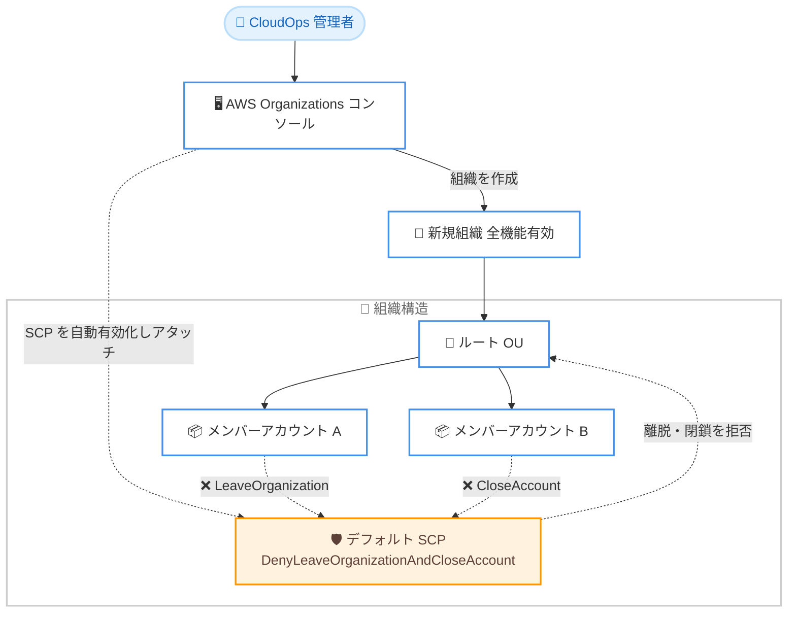

# AWS Organizations - 新規組織へのアカウント離脱防止セキュリティコントロールのデフォルト適用

**リリース日**: 2026 年 7 月 10 日
**サービス**: AWS Organizations
**機能**: コンソール経由で作成した新規組織へのデフォルトセキュリティコントロール

📊 [このアップデートのインフォグラフィックを見る](https://takech9203.github.io/aws-news-summary/20260710-aws-organizations-security-controls-new-orgs-console.html)
<!-- INFOGRAPHIC_BASE_URL は環境変数から取得 -->

## 概要

AWS Organizations は、AWS Organizations コンソール経由で新しい組織を作成する際に、セキュリティコントロールをデフォルトで自動適用するようになりました。この機能により、組織の作成時点からメンバーアカウントを保護するサービスコントロールポリシー (SCP) が自動的に有効化され、ルート組織単位 (OU) にアタッチされます。

自動適用される SCP は、メンバーアカウントが組織から離脱すること、およびメンバーアカウント自身がアカウントを閉鎖することを防止します。これにより、マルチアカウント環境において意図しないメンバーアカウントの離脱からガバナンスを保護できます。この機能は、CloudOps 管理者や中央のセキュリティチームが、深いセキュリティ専門知識を必要とせずに、初日からガバナンスのベースラインを確立することを支援します。

デフォルトのコントロールは、正当な運用を妨げることなく保護を提供できるよう、意図的に軽量に設計されています。お客様は、これらの設定をいつでも変更または無効化できる完全なコントロールを保持します。この機能は、2026 年 6 月 30 日以降にコンソール経由で作成された組織にのみ適用され、既存の組織には影響しません。

**アップデート前の課題**

- 新しい組織を作成しても、メンバーアカウントの離脱やアカウント閉鎖を防止する保護は自動的には適用されなかった
- ガバナンスのベースラインを確立するには、SCP の有効化、ポリシーの作成、アタッチを手動で実施する必要があった
- 保護設定が漏れることで、意図しないメンバーアカウントの離脱やアカウント閉鎖が発生するリスクがあった

**アップデート後の改善**

- コンソール経由での組織作成時に、離脱・閉鎖防止の SCP が自動的に有効化・アタッチされる
- セキュリティの専門知識がなくても、初日から AWS 推奨のセキュリティベースラインを確立できる
- デフォルト設定は軽量であり、必要に応じていつでも変更または無効化できる

## アーキテクチャ図



コンソールで組織を作成すると、ルート OU に離脱・閉鎖防止の SCP が自動的にアタッチされ、すべてのメンバーアカウントを保護します。

## サービスアップデートの詳細

### 主要機能

1. **SCP の自動有効化とアタッチ**
   - コンソール経由で全機能有効の組織を作成すると、SCP がポリシータイプとして有効化される
   - `DenyLeaveOrganizationAndCloseAccount` という SCP がルート OU に自動的にアタッチされる
   - すべてのメンバーアカウントに保護が適用される

2. **意図しないアカウント離脱・閉鎖の防止**
   - `organizations:LeaveOrganization` アクションを拒否し、メンバーアカウントが自身で組織から離脱することを防止
   - `account:CloseAccount` アクションを拒否し、メンバーアカウントが自身を閉鎖することを防止
   - 離脱や閉鎖は管理アカウントまたは委任管理者による操作が必要になる

3. **軽量なデフォルト設定と完全なコントロール**
   - デフォルトのコントロールは正当な運用を妨げないよう軽量に設計されている
   - お客様はこの SCP をいつでも変更、別のターゲットへのアタッチ、または無効化できる
   - AWS はすべてのメンバーアカウントを保護するため、この SCP をルートにアタッチしたまま維持することを推奨

## 技術仕様

### 適用される SCP

| 項目 | 詳細 |
|------|------|
| ポリシー名 (Sid) | DenyLeaveOrganizationAndCloseAccount |
| Effect | Deny |
| 拒否アクション | organizations:LeaveOrganization、account:CloseAccount |
| アタッチ先 | ルート OU (推奨) |
| 適用条件 | 2026 年 6 月 30 日以降にコンソールで作成された全機能有効の組織 |
| 対象外 | 既存の組織、CLI/SDK/CloudFormation で作成した組織 |

### デフォルト SCP ポリシー

```json
{
    "Version": "2012-10-17",
    "Statement": [
        {
            "Sid": "DenyLeaveOrganizationAndCloseAccount",
            "Effect": "Deny",
            "Action": [
                "organizations:LeaveOrganization",
                "account:CloseAccount"
            ],
            "Resource": "*"
        }
    ]
}
```

### 必要な権限

コンソールがデフォルトセキュリティコントロールを適用するには、組織作成時に以下の権限が追加で必要です。

```text
organizations:CreateOrganization
iam:CreateServiceLinkedRole
organizations:EnablePolicyType
organizations:CreatePolicy
organizations:AttachPolicy
```

## 設定方法

### 前提条件

1. 組織の管理アカウントで、IAM ユーザー、IAM ロールの引き受け、またはルートユーザーとしてサインインしている
2. 上記の必要な権限を保有している
3. 全機能有効 (All features) の組織を作成する

### 手順

#### ステップ1: AWS Organizations コンソールにサインイン

管理アカウントで [AWS Organizations コンソール](https://console.aws.amazon.com/organizations/v2) にサインインします。ルートユーザーでのサインインは推奨されないため、IAM ユーザーまたは IAM ロールを使用します。

#### ステップ2: 組織を作成

イントロダクションページで [Create an organization] を選択します。デフォルトでは全機能が有効な状態で組織が作成されます。この操作により、Organizations が SCP を有効化し、離脱・閉鎖防止のコントロールを含む SCP をルート OU に自動的にアタッチします。

#### ステップ3: SCP の確認と調整

作成後、必要に応じて SCP を変更したり、別のターゲットにアタッチしたりできます。AWS はすべてのメンバーアカウントを保護するため、この SCP をルートにアタッチしたまま維持することを推奨しています。既存の組織や CLI/SDK/CloudFormation で作成した組織にこのコントロールを追加する場合は、SCP を手動で構成する必要があります。

## メリット

### ビジネス面

- **初日からのガバナンス確立**: セキュリティの専門知識がなくても、組織作成時点で AWS 推奨のセキュリティベースラインを確立できる
- **運用リスクの低減**: 意図しないメンバーアカウントの離脱やアカウント閉鎖を防止し、マルチアカウント環境の安定性を高める
- **導入の容易さ**: 手動での SCP 設定作業が不要になり、初期セットアップが効率化される

### 技術面

- **自動化されたセキュリティ適用**: SCP の有効化、作成、アタッチが自動で実行される
- **柔軟なカスタマイズ**: デフォルト設定は軽量であり、要件に応じていつでも変更・無効化できる
- **明確な制御ポイント**: 離脱・閉鎖の操作は管理アカウントまたは委任管理者に集約される

## デメリット・制約事項

### 制限事項

- コンソール経由で作成した組織にのみ適用され、CLI、SDK、CloudFormation で作成した組織には自動適用されない
- 2026 年 6 月 30 日以降に作成された組織にのみ適用され、既存の組織には影響しない
- 全機能有効の組織が対象であり、一括請求 (Consolidated Billing) のみの組織では SCP を利用できない

### 考慮すべき点

- 既存の組織にこの保護を追加する場合は、SCP を手動で有効化・作成・アタッチする必要がある
- 正当なアカウント離脱や閉鎖を行う場合は、管理アカウントまたは委任管理者による操作が必要になる
- CLI/SDK による組織作成を自動化している場合、同等の保護を別途実装する必要がある

## ユースケース

### ユースケース1: 新規マルチアカウント環境の立ち上げ

**シナリオ**: 企業が新たに AWS のマルチアカウント環境を構築するために、コンソールから組織を作成する。

**効果**: 組織作成と同時に離脱・閉鎖防止の SCP が適用されるため、追加設定なしでガバナンスのベースラインが確立され、意図しないアカウント離脱を防止できる。

### ユースケース2: セキュリティ専門知識が限られたチームでの運用

**シナリオ**: CloudOps チームがセキュリティの深い専門知識を持たない状態で、組織のセットアップを担当する。

**効果**: AWS 推奨のセキュリティコントロールがデフォルトで適用されるため、専門知識がなくても安全な初期状態を確保できる。

### ユースケース3: 要件に応じた保護設定のカスタマイズ

**シナリオ**: 特定のアカウントで正当なアカウント閉鎖操作を許可する必要がある。

**実装例**:
```json
{
    "Version": "2012-10-17",
    "Statement": [
        {
            "Sid": "DenyLeaveOrganizationAndCloseAccount",
            "Effect": "Deny",
            "Action": [
                "organizations:LeaveOrganization",
                "account:CloseAccount"
            ],
            "Resource": "*"
        }
    ]
}
```

**効果**: デフォルトの SCP を基点として、対象 OU やアカウント単位でアタッチ先を調整することで、組織全体の保護を維持しつつ運用要件に対応できる。

## 料金

AWS Organizations および SCP の利用には追加料金は発生しません。今回のデフォルトセキュリティコントロールの自動適用についても追加費用はかかりません。

## 利用可能リージョン

以下のリージョンで利用可能です。

- 米国東部 (バージニア北部)
- AWS GovCloud (米国東部)
- AWS GovCloud (米国西部)
- 中国 (北京)
- 中国 (寧夏)

## 関連サービス・機能

- **サービスコントロールポリシー (SCP)**: 今回のデフォルトコントロールの中核となるガバナンス機能。組織全体でアクセス許可の上限を定義する
- **AWS Control Tower**: マルチアカウント環境のセットアップとガバナンスを自動化するサービス。Organizations と連携して統制を強化する
- **リソースコントロールポリシー (RCP)**: SCP を補完し、リソース単位でのアクセス制御を実現する組織ポリシー

## 参考リンク

- 📊 [インフォグラフィック](https://takech9203.github.io/aws-news-summary/20260710-aws-organizations-security-controls-new-orgs-console.html)
- [公式発表 (What's New)](https://aws.amazon.com/about-aws/whats-new/2026/07/aws-organizations-security-controls-new-orgs-console)
- [ドキュメント: 組織の作成](https://docs.aws.amazon.com/organizations/latest/userguide/orgs_manage_org_create.html)
- [ドキュメント: AWS Organizations のデフォルトセキュリティコントロール](https://docs.aws.amazon.com/organizations/latest/userguide/orgs_security_default_controls.html)

## まとめ

このアップデートにより、AWS Organizations コンソールで作成する新規組織に、メンバーアカウントの離脱・閉鎖を防止する SCP がデフォルトで適用されるようになりました。セキュリティの専門知識がなくても初日からガバナンスのベースラインを確立できる点が大きな価値です。既存の組織や CLI/SDK で作成した組織には自動適用されないため、それらの環境では同等の SCP を手動で構成することを検討してください。
