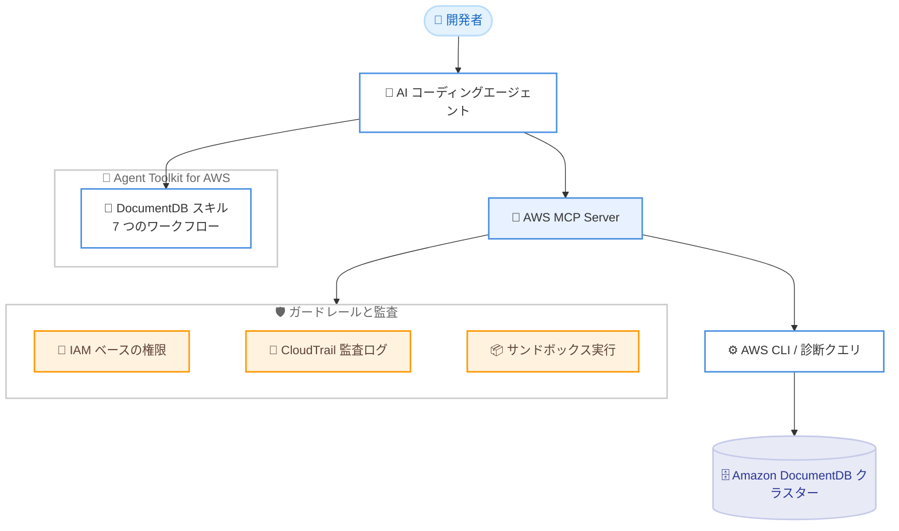

# Amazon DocumentDB - Agent Toolkit for AWS のスキルとして提供開始

**リリース日**: 2026 年 7 月 13 日
**サービス**: Amazon DocumentDB (with MongoDB compatibility)
**機能**: Agent Toolkit for AWS の専用データベーススキル

📊 [このアップデートのインフォグラフィックを見る](https://takech9203.github.io/aws-news-summary/20260713-amazon-documentdb-agent-skill.html)
<!-- INFOGRAPHIC_BASE_URL は環境変数から取得 -->

## 概要

Amazon DocumentDB (with MongoDB compatibility) が、Agent Toolkit for AWS の専用データベーススキルとして利用可能になりました。このスキルを利用することで、AI コーディングエージェントは、ステップバイステップのベストプラクティスワークフローに従って、Amazon DocumentDB クラスターのセットアップ、管理、移行、最適化、トラブルシューティングを実行できます。

このスキルは 7 つのワークフローをカバーしています。クラスターのプロビジョニング、スキーマ設計、MongoDB 互換性評価、変更データキャプチャを使用した DMS ベースの移行、パフォーマンスチューニング、41 項目のチェックからなる Well-Architected レビュー、メジャーバージョンアップグレードです。これにより、エラーを削減し、DocumentDB のガイダンスを手動で参照する手間を省くことができます。

AWS MCP Server と組み合わせて使用すると、エージェントは IAM ベースのガードレール、CloudTrail による監査ログ、サンドボックス化された実行環境のもとで、AWS CLI コマンドの実行と診断クエリの実行が可能になります。この機能は Agent Toolkit for AWS の一部として追加料金なしで利用できます。

**アップデート前の課題**

- AI コーディングエージェントに DocumentDB のベストプラクティスが組み込まれておらず、開発者が手動でドキュメントを参照しながら作業する必要があった
- クラスターのプロビジョニングや移行、パフォーマンスチューニングを場当たり的に実施すると、設定ミスやアンチパターンが発生しやすかった
- エージェントによる AWS 操作に対して、統一されたガードレールや監査の仕組みを整えるのが難しかった

**アップデート後の改善**

- 標準化された 7 つのワークフローにより、エージェントがベストプラクティスに沿って DocumentDB を操作できるようになった
- MongoDB 互換性評価や DMS ベースの移行など、複雑な作業を手順化されたガイドとして実行できるようになった
- AWS MCP Server との連携により、IAM ベースのガードレールと CloudTrail 監査、サンドボックス実行を伴った安全な操作が可能になった

## アーキテクチャ図

開発者の指示を受けた AI コーディングエージェントが、DocumentDB スキルのワークフローに従い、AWS MCP Server を通じてガードレールと監査のもとで DocumentDB クラスターを操作する流れを示しています。

## サービスアップデートの詳細

### 主要機能

1. **7 つのベストプラクティスワークフロー**
   - クラスターのプロビジョニング
   - スキーマ設計
   - MongoDB 互換性評価
   - 変更データキャプチャ (CDC) を使用した DMS ベースの移行
   - パフォーマンスチューニング
   - 41 項目のチェックからなる Well-Architected レビュー
   - メジャーバージョンアップグレード

2. **AWS MCP Server との連携**
   - AWS CLI コマンドの実行と診断クエリの実行をエージェントが自動で行える
   - IAM ベースのガードレールにより、許可された操作のみを実行
   - CloudTrail による監査ログで、エージェントの操作を追跡可能
   - サンドボックス化された実行環境により、影響範囲を限定

3. **スタンドアロン実行のサポート**
   - ローカル実行を好むチーム向けに、AWS CLI 経由でスキルを単独で利用可能
   - MCP Server を導入しなくても、ワークフローのガイダンスを活用できる

## 技術仕様

### 7 つのワークフローの概要

| ワークフロー | 内容 |
|------|------|
| クラスタープロビジョニング | ベストプラクティスに沿ったクラスターの新規作成 |
| スキーマ設計 | DocumentDB に適したドキュメントスキーマの設計支援 |
| MongoDB 互換性評価 | 既存 MongoDB ワークロードの互換性チェック |
| DMS ベース移行 | 変更データキャプチャを用いた移行手順の実行 |
| パフォーマンスチューニング | クエリやインデックスなどの最適化 |
| Well-Architected レビュー | 41 項目のチェックによる設計レビュー |
| メジャーバージョンアップグレード | 安全なバージョンアップグレードの実施 |

### セキュリティとガバナンス

| 項目 | 詳細 |
|------|------|
| アクセス制御 | IAM ベースのガードレールにより実行可能な操作を制限 |
| 監査 | CloudTrail による API 操作の記録 |
| 実行環境 | サンドボックス化された実行による影響範囲の限定 |

## 設定方法

### 前提条件

1. AI コーディングエージェント環境
2. AWS アカウントと適切な IAM 権限
3. AWS MCP Server を利用する場合は、そのセットアップ (スタンドアロン実行の場合は AWS CLI)

### 手順

#### ステップ1: Agent Toolkit for AWS の導入

Agent Toolkit for AWS のクイックスタートガイドに従って、ツールキットと DocumentDB スキルをエージェント環境に導入します。スキルは GitHub の agent-toolkit-for-aws リポジトリから入手できます。

#### ステップ2: AWS MCP Server との連携設定

AWS CLI コマンドの実行や診断クエリを行う場合は、AWS MCP Server をセットアップし、IAM 権限を構成します。これにより、ガードレールと CloudTrail 監査のもとでエージェントが AWS 操作を実行できるようになります。

#### ステップ3: ワークフローの実行

エージェントに対して、クラスタープロビジョニングや移行などの目的を指示すると、スキルが対応するワークフローを選択し、ステップバイステップで作業を進めます。ローカル実行を好む場合は、AWS CLI 経由でスタンドアロンとして利用することも可能です。

## メリット

### ビジネス面

- **開発生産性の向上**: ベストプラクティスが組み込まれたワークフローにより、ドキュメント参照や試行錯誤の時間を削減
- **追加費用なし**: Agent Toolkit for AWS の一部として追加料金なしで利用可能
- **リスク低減**: 標準化された手順により、設定ミスや移行時のトラブルを抑制

### 技術面

- **一貫性のある運用**: 7 つのワークフローにより、クラスターのライフサイクル全体を統一的に扱える
- **安全な自動化**: IAM ガードレール、CloudTrail 監査、サンドボックス実行によりエージェント操作を安全に統制
- **柔軟な実行形態**: MCP Server 連携とスタンドアロン実行の両方に対応

## デメリット・制約事項

### 制限事項

- 対象は Amazon DocumentDB (with MongoDB compatibility) のワークフローに限定される
- AWS CLI コマンドや診断クエリの自動実行には AWS MCP Server が必要
- 利用には対応した AI コーディングエージェント環境の準備が必要

### 考慮すべき点

- エージェントによる操作範囲を IAM ポリシーで適切に制限することが重要
- CloudTrail による監査ログを有効化し、操作内容を継続的に確認することが望ましい
- 本番環境への適用前に、サンドボックスやテスト環境で挙動を検証することを推奨

## ユースケース

### ユースケース1: MongoDB からの移行

**シナリオ**: 既存の自己管理型 MongoDB を Amazon DocumentDB へ移行したい。

**効果**: MongoDB 互換性評価ワークフローで移行可否を確認し、変更データキャプチャを用いた DMS ベース移行ワークフローで、ダウンタイムを抑えながら移行を進められます。

### ユースケース2: 新規クラスターの構築

**シナリオ**: ベストプラクティスに沿った DocumentDB クラスターを新規に立ち上げたい。

**効果**: クラスタープロビジョニングとスキーマ設計のワークフローにより、推奨構成に基づいたクラスターを迅速に構築できます。

### ユースケース3: 既存環境の点検と改善

**シナリオ**: 稼働中の DocumentDB クラスターの設計品質とパフォーマンスを見直したい。

**効果**: 41 項目のチェックからなる Well-Architected レビューとパフォーマンスチューニングのワークフローにより、改善点を体系的に洗い出せます。

## 料金

Agent Toolkit for AWS の一部として、追加料金なしで利用できます。DocumentDB クラスターや DMS、その他の AWS リソースの利用料金は、通常どおり各サービスの料金体系に従って発生します。

## 利用可能リージョン

Agent Toolkit for AWS のスキルとして提供されます。DocumentDB クラスターの利用可能リージョンについては、Amazon DocumentDB のリージョン提供状況を参照してください。

## 関連サービス・機能

- **AWS MCP Server**: エージェントによる AWS CLI コマンド実行や診断クエリを、ガードレールと監査のもとで実現
- **AWS Database Migration Service (DMS)**: 変更データキャプチャを用いた DocumentDB への移行ワークフローで利用
- **AWS CloudTrail**: エージェント操作の監査ログを記録
- **AWS IAM**: エージェントが実行可能な操作を制御するガードレールを提供

## 参考リンク

- 📊 [インフォグラフィック](https://takech9203.github.io/aws-news-summary/20260713-amazon-documentdb-agent-skill.html)
- [公式発表 (What's New)](https://aws.amazon.com/about-aws/whats-new/2026/07/amazon-documentdb-agent-skill)
- [Amazon DocumentDB ドキュメント](https://docs.aws.amazon.com/documentdb/)

## まとめ

Amazon DocumentDB が Agent Toolkit for AWS のスキルとして提供され、AI コーディングエージェントがベストプラクティスに沿ってクラスターの構築、移行、最適化、運用を実行できるようになりました。追加料金なしで利用でき、AWS MCP Server と組み合わせることで安全に自動化できるため、DocumentDB を利用しているチームはワークフローの導入とガードレール設定を検討することを推奨します。
