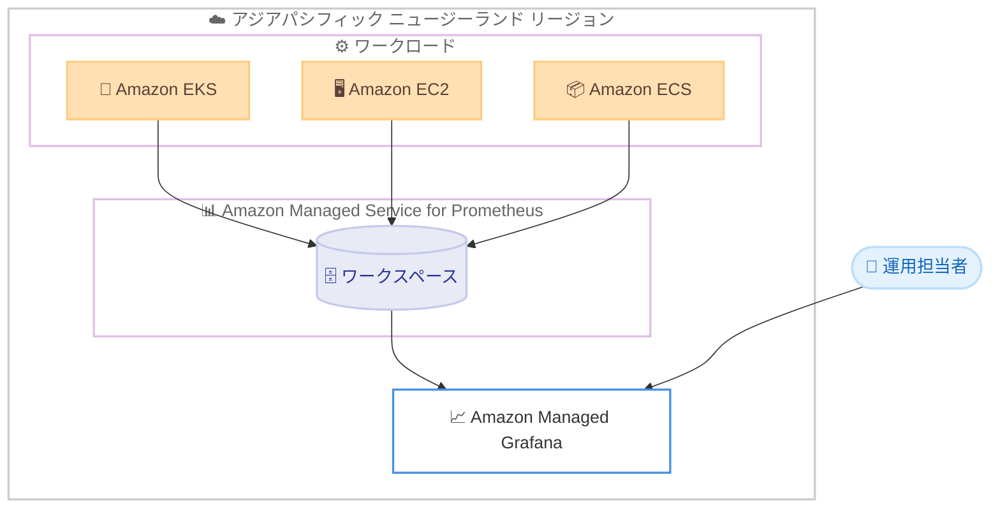

# Amazon Managed Service for Prometheus - アジアパシフィック (ニュージーランド) リージョンでの提供開始

**リリース日**: 2026 年 7 月 13 日
**サービス**: Amazon Managed Service for Prometheus
**機能**: アジアパシフィック (ニュージーランド) リージョンでの提供開始

📊 [このアップデートのインフォグラフィックを見る](https://takech9203.github.io/aws-news-summary/20260713-amazon-managed-service-prometheus-new-zealand.html)
<!-- INFOGRAPHIC_BASE_URL は環境変数から取得 -->

## 概要

Amazon Managed Service for Prometheus が、アジアパシフィック (ニュージーランド) リージョンで利用可能になりました。Amazon Managed Service for Prometheus は、Prometheus 互換のフルマネージド監視サービスであり、運用メトリクスの監視とアラートを大規模に、かつ容易に実現します。

Prometheus は、コンテナ化されたワークロードの監視に広く使用されているオープンソースの監視ツールです。Amazon Managed Service for Prometheus では、監視基盤のスケーリングや運用管理を AWS に任せることができるため、お客様はインフラストラクチャの管理から解放され、アプリケーションとサービスの監視に集中できます。1 つのワークスペースに最大 10 億のアクティブメトリクス系列を送信でき、アカウントごとに多数のワークスペースを作成できます。ワークスペースは、Prometheus メトリクスの保存とクエリを行うための論理的な専用空間です。

今回のニュージーランドリージョンでの提供開始により、当該リージョンのお客様は、データレジデンシー要件やレイテンシー要件を満たしながら、Prometheus 互換の監視環境を利用できるようになりました。

**アップデート前の課題**

- ニュージーランドリージョンでは Amazon Managed Service for Prometheus を利用できなかった
- 当該リージョンのお客様は、他リージョンのワークスペースを利用する必要があり、データレジデンシーやレイテンシーの面で制約があった
- 自前で Prometheus サーバーを運用する場合、スケーリングや可用性の管理に運用負荷が発生していた

**アップデート後の改善**

- ニュージーランドリージョン内で Amazon Managed Service for Prometheus を利用可能になった
- データをニュージーランドリージョン内に保持でき、データレジデンシー要件に対応しやすくなった
- リージョン内での監視により、メトリクス収集のレイテンシーを低減できる

## アーキテクチャ図



コンテナや EC2 などのワークロードからメトリクスを Amazon Managed Service for Prometheus のワークスペースに送信し、Amazon Managed Grafana などで可視化する構成を示しています。

## サービスアップデートの詳細

### 主要機能

1. **Prometheus 互換のフルマネージド監視**
   - オープンソースの Prometheus と互換性のある API を提供
   - PromQL によるクエリに対応
   - サーバーの構築、スケーリング、運用管理は AWS が担当

2. **大規模なメトリクス収集**
   - 1 つのワークスペースに最大 10 億のアクティブメトリクス系列を送信可能
   - 需要に応じて自動的にスケール

3. **ワークスペースによる論理的な分離**
   - アカウントごとに多数のワークスペースを作成可能
   - ワークスペースは Prometheus メトリクスの保存とクエリのための論理的な専用空間
   - 環境やチームごとにワークスペースを分離して管理可能

## 技術仕様

### 主な仕様

| 項目 | 詳細 |
|------|------|
| サービス種別 | Prometheus 互換のフルマネージド監視サービス |
| ワークスペースあたりの上限 | 最大 10 億のアクティブメトリクス系列 |
| ワークスペース数 | アカウントごとに多数作成可能 |
| クエリ言語 | PromQL |
| 今回の対象リージョン | アジアパシフィック (ニュージーランド) |

## 設定方法

### 前提条件

1. AWS アカウントへのアクセス権限
2. Amazon Managed Service for Prometheus に対する IAM 権限
3. メトリクスを送信するワークロード (Amazon EKS、Amazon ECS、Amazon EC2 など)

### 手順

#### ステップ 1: ワークスペースの作成

```bash
aws amp create-workspace \
  --alias my-monitoring-workspace \
  --region ap-southeast-6
```

このコマンドは、ニュージーランドリージョンに新しいワークスペースを作成します。作成されたワークスペースは、Prometheus メトリクスを保存し、クエリするための論理的な空間として機能します。

#### ステップ 2: メトリクスの送信設定

```bash
# 作成したワークスペースの情報を確認
aws amp describe-workspace \
  --workspace-id <workspace-id> \
  --region ap-southeast-6
```

このコマンドはワークスペースのリモート書き込みエンドポイントを含む情報を取得します。取得したエンドポイントを Prometheus サーバーや AWS Distro for OpenTelemetry (ADOT) コレクターの `remote_write` 設定に指定し、メトリクスを送信します。

#### ステップ 3: メトリクスの可視化

Amazon Managed Grafana などのツールからワークスペースをデータソースとして接続し、収集したメトリクスをダッシュボードで可視化します。

## メリット

### ビジネス面

- **データレジデンシー対応**: ニュージーランドリージョン内でメトリクスデータを保持でき、地域のデータ要件に対応しやすくなる
- **運用負荷の軽減**: 監視基盤の構築や運用管理を AWS に任せることで、運用チームの負担を削減
- **迅速な監視開始**: フルマネージドサービスのため、短期間で監視環境を立ち上げ可能

### 技術面

- **低レイテンシー**: リージョン内でメトリクスを収集することで、収集のレイテンシーを低減
- **Prometheus 互換性**: 既存の Prometheus エコシステムやツールをそのまま活用可能
- **自動スケーリング**: 最大 10 億のアクティブメトリクス系列まで自動的にスケール

## デメリット・制約事項

### 制限事項

- 1 つのワークスペースあたりのアクティブメトリクス系列は最大 10 億
- 利用可能な機能や制限は、AWS の公式ドキュメントおよびサービスクォータで最新情報を確認する必要がある

### 考慮すべき点

- メトリクスの取り込み量やクエリ量に応じて料金が発生する
- クロスリージョンでのワークスペース利用を検討する場合は、レイテンシーやデータ転送を考慮する

## ユースケース

### ユースケース 1: コンテナワークロードの監視

**シナリオ**: ニュージーランドリージョンで Amazon EKS 上のマイクロサービスを運用しており、Prometheus 形式のメトリクスを収集したい

**実装例**:
```
EKS クラスターに ADOT コレクターをデプロイし、
Amazon Managed Service for Prometheus のワークスペースへ remote_write でメトリクスを送信
```

**効果**: 自前の Prometheus サーバーを運用せずに、スケーラブルなコンテナ監視を実現

### ユースケース 2: データレジデンシー要件への対応

**シナリオ**: ニュージーランド国内でのデータ保持が求められるワークロードの運用メトリクスを監視したい

**実装例**:
```
ニュージーランドリージョンにワークスペースを作成し、
リージョン内のワークロードからメトリクスを収集
```

**効果**: データを国内リージョンに保持しながら、大規模な監視環境を利用可能

### ユースケース 3: 環境ごとのワークスペース分離

**シナリオ**: 本番環境とステージング環境のメトリクスを分離して管理したい

**実装例**:
```
環境ごとに個別のワークスペースを作成し、
アクセス権限とクエリを分離
```

**効果**: 環境間でメトリクスを明確に分離し、管理とアクセス制御を簡素化

## 料金

Amazon Managed Service for Prometheus は、取り込んだメトリクスサンプル数、保存されたメトリクス、実行したクエリのサンプル数に基づく従量課金制です。最新の料金は公式の料金ページで確認してください。

詳細は [Amazon Managed Service for Prometheus 料金ページ](https://aws.amazon.com/prometheus/pricing/) を参照してください。

## 利用可能リージョン

今回のアップデートにより、アジアパシフィック (ニュージーランド) リージョンで利用可能になりました。その他の利用可能リージョンについては、[AWS リージョン別のサービス提供状況](https://aws.amazon.com/about-aws/global-infrastructure/regional-product-services/) を参照してください。

## 関連サービス・機能

- **Amazon Managed Grafana**: Amazon Managed Service for Prometheus のメトリクスをダッシュボードで可視化
- **Amazon EKS**: コンテナ化されたワークロードのメトリクス収集元
- **AWS Distro for OpenTelemetry (ADOT)**: メトリクスの収集と Prometheus ワークスペースへの送信
- **Amazon CloudWatch**: AWS リソースの統合監視サービス

## 参考リンク

- 📊 [インフォグラフィック](https://takech9203.github.io/aws-news-summary/20260713-amazon-managed-service-prometheus-new-zealand.html)
- [公式発表 (What's New)](https://aws.amazon.com/about-aws/whats-new/2026/07/amazon-managed-service-prometheus-new-zealand/)
- [製品ページ](https://aws.amazon.com/prometheus/)
- [料金ページ](https://aws.amazon.com/prometheus/pricing/)
- [AWS リージョン別のサービス提供状況](https://aws.amazon.com/about-aws/global-infrastructure/regional-product-services/)

## まとめ

Amazon Managed Service for Prometheus がアジアパシフィック (ニュージーランド) リージョンで利用可能になったことで、当該リージョンのお客様はデータレジデンシーやレイテンシーの要件を満たしながら、Prometheus 互換の大規模な監視環境を利用できるようになりました。ニュージーランドリージョンでコンテナや EC2 などのワークロードを運用しているお客様は、フルマネージドの監視基盤への移行を検討することで、運用負荷の軽減とスケーラブルな監視を実現できます。
