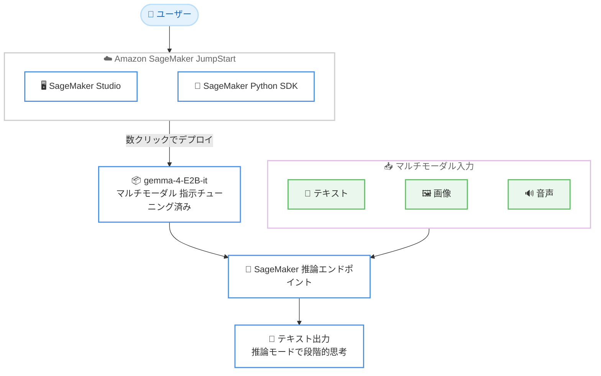

# Amazon SageMaker JumpStart - Gemma-4-E2B-it の提供開始

**リリース日**: 2026 年 7 月 13 日
**サービス**: Amazon SageMaker JumpStart
**機能**: Gemma-4-E2B-it モデルの提供

📊 [このアップデートのインフォグラフィックを見る](https://takech9203.github.io/aws-news-summary/20260713-gemma-4-e2b-on-sagemaker-jumpstart.html)
<!-- INFOGRAPHIC_BASE_URL は環境変数から取得 -->

## 概要

AWS は、Google DeepMind が開発した gemma-4-E2B-it を Amazon SageMaker JumpStart で利用できるようにしたことを発表しました。gemma-4-E2B-it は、効率的なローカル実行向けに最適化されたマルチモーダルの指示チューニング済みモデルです。テキスト、画像、音声の入力を処理し、テキスト出力を生成します。回答前に段階的に推論を行う組み込みの推論モードを備えている点が特長です。

このモデルは、物体検出、ドキュメント解析、画面や UI の理解、チャートの理解、OCR を含む画像理解に加え、動画理解にも対応します。さらに、エージェント型ワークフロー向けのネイティブな関数呼び出し (function calling)、コードの生成・補完・修正、数十言語にわたる多言語対応を提供します。

SageMaker JumpStart を通じて、SageMaker Studio または SageMaker Python SDK から数クリックでデプロイでき、独自の AWS 環境内でセキュアにモデルをホストできます。効率的なローカル実行を意識した設計のため、比較的小規模なリソースでマルチモーダルかつ推論可能なモデルを運用したいお客様に適しています。

**アップデート前の課題**

- マルチモーダル入力と推論モードを備えた効率的なモデルを、SageMaker JumpStart から手軽にデプロイする選択肢が限られていた
- テキスト、画像、音声を単一モデルで扱いつつ、OCR やチャート理解などの機能を利用するには複数のサービスやモデルを組み合わせる必要があった
- エージェント型ワークフロー向けのネイティブな関数呼び出しを備えた軽量モデルの選択肢が少なかった

**アップデート後の改善**

- 今回のアップデートにより gemma-4-E2B-it を SageMaker JumpStart から数クリックでデプロイできるようになった
- テキスト・画像・音声のマルチモーダル入力と、段階的推論モードを単一モデルで利用できるようになった
- ネイティブな関数呼び出しにより、エージェント型ワークフローへの組み込みが容易になった

## アーキテクチャ図



ユーザーが SageMaker Studio または Python SDK から gemma-4-E2B-it を数クリックでデプロイし、テキスト・画像・音声のマルチモーダル入力を推論エンドポイントで処理してテキスト出力を得る流れを示しています。

## サービスアップデートの詳細

### 主要機能

1. **マルチモーダル入力対応**
   - テキスト、画像、音声を入力として処理し、テキストを出力
   - 単一モデルで複数のモダリティを扱えるため、用途に応じた柔軟な活用が可能

2. **組み込みの推論モード**
   - 回答を生成する前に段階的に思考する推論モードを内蔵
   - 複雑なタスクにおける回答の質の向上に寄与

3. **画像理解**
   - 物体検出、ドキュメント解析、画面や UI の理解、チャートの理解、OCR に対応
   - 文書処理や視覚情報の抽出など幅広いユースケースをカバー

4. **動画理解**
   - 動画コンテンツの理解に対応

5. **ネイティブな関数呼び出し (function calling)**
   - エージェント型ワークフロー向けにモデルがネイティブに関数呼び出しをサポート
   - 外部ツールや API との連携を伴う自律的な処理に活用可能

6. **コード支援と多言語対応**
   - コードの生成、補完、修正に対応
   - 数十言語にわたる多言語対応

7. **効率的なローカル実行向けの最適化**
   - 効率的なローカル実行を意識して最適化されたモデル設計
   - 比較的小規模なリソースでの運用に適する

## 技術仕様

### モデルの概要

| 項目 | 詳細 |
|------|------|
| モデル名 | gemma-4-E2B-it |
| 開発元 | Google DeepMind |
| モデル種別 | マルチモーダル、指示チューニング済み (instruction-tuned) |
| 入力 | テキスト、画像、音声 |
| 出力 | テキスト |
| 推論モード | 組み込みの段階的推論モード |
| 主な機能 | 画像理解 (物体検出、ドキュメント解析、画面/UI 理解、チャート理解、OCR)、動画理解、ネイティブ関数呼び出し、コード生成/補完/修正、多言語対応 |
| デプロイ方法 | SageMaker Studio、SageMaker Python SDK |

## 設定方法

### 前提条件

1. Amazon SageMaker を利用可能な AWS アカウント
2. SageMaker Studio へのアクセス、または SageMaker Python SDK を利用できる実行環境
3. モデルをホストするための SageMaker 推論エンドポイントに必要な権限とインスタンス枠

### 手順

#### ステップ 1: SageMaker Studio からのデプロイ

Amazon SageMaker Studio の JumpStart から gemma-4-E2B-it を選択し、数クリックで推論エンドポイントにデプロイします。GUI 上でインスタンスタイプなどの設定を指定してデプロイを実行できます。

#### ステップ 2: SageMaker Python SDK でのデプロイ

```bash
pip install sagemaker
```

SageMaker Python SDK をインストールし、プログラムから JumpStart モデルをデプロイします。SDK を使うことで、モデルの選択からエンドポイント作成までをコードで自動化できます。

```python
from sagemaker.jumpstart.model import JumpStartModel

model = JumpStartModel(model_id="gemma-4-E2B-it")
predictor = model.deploy()
```

上記は JumpStart のモデル ID を指定してモデルをインスタンス化し、推論エンドポイントとしてデプロイするコード例です。実際のモデル ID は SageMaker Studio の JumpStart 画面で確認してください。

#### ステップ 3: 推論の実行

デプロイしたエンドポイントに対してテキスト・画像・音声などの入力を送信し、テキスト出力を取得します。推論モードを活用することで、複雑なタスクに対する段階的な回答が得られます。

## メリット

### ビジネス面

- **導入の迅速化**: 数クリックでデプロイできるため、マルチモーダルモデルの検証や本番投入を素早く開始できる
- **用途の広さ**: 画像理解、動画理解、OCR、コード支援、多言語対応など幅広い機能を単一モデルでカバーできる
- **データの管理**: 自社の AWS 環境内でモデルをホストし、データを外部に出さずに推論を実行できる

### 技術面

- **マルチモーダル処理**: テキスト・画像・音声を単一モデルで処理でき、システム構成を簡素化できる
- **推論モード**: 段階的推論により複雑なタスクの回答品質を高められる
- **エージェント連携**: ネイティブな関数呼び出しにより、ツール連携を伴うエージェント型ワークフローを構築しやすい
- **効率性**: 効率的なローカル実行向けに最適化されており、比較的小規模なリソースで運用できる

## デメリット・制約事項

### 制限事項

- 出力はテキストのみで、画像や音声の生成には対応しない
- モデルをホストする推論エンドポイントの稼働時間に応じてインフラ費用が発生する
- 利用にあたっては Gemma のモデルライセンスと利用規約への同意が必要

### 考慮すべき点

- 効率的なローカル実行向けに最適化された比較的小規模なモデルのため、大規模モデルと比べてタスクによっては精度に差が出る可能性がある
- マルチモーダル入力や推論モードを活用する際は、適切なインスタンスタイプの選定が重要
- 本番運用ではエンドポイントのスケーリングやコスト管理を計画する必要がある

## ユースケース

### ユースケース 1: ドキュメント処理と OCR

**シナリオ**: 請求書や契約書などの文書から情報を抽出し、構造化データとして活用したい。

**実装例**:
```
gemma-4-E2B-it
文書画像を入力し、OCR とドキュメント解析でテキストや項目を抽出
```

**効果**: 画像理解と OCR を組み合わせ、文書からの情報抽出を単一モデルで実現できる。

### ユースケース 2: エージェント型ワークフロー

**シナリオ**: 外部ツールや API を呼び出しながらタスクを自律的に処理するエージェントを構築したい。

**実装例**:
```
gemma-4-E2B-it + ネイティブ関数呼び出し
推論モードで手順を検討しつつ、必要に応じて関数を呼び出す
```

**効果**: ネイティブな関数呼び出しにより、ツール連携を伴うエージェント処理を実装できる。

### ユースケース 3: マルチモーダルなコンテンツ理解

**シナリオ**: 画面や UI のスクリーンショット、チャート、動画などの視覚情報を理解し、内容を説明させたい。

**実装例**:
```
gemma-4-E2B-it
画像や動画を入力し、画面/UI 理解やチャート理解、動画理解を実行
```

**効果**: 多様な視覚情報を単一モデルで理解でき、コンテンツ分析やサポート業務に活用できる。

## 料金

gemma-4-E2B-it 自体は Amazon SageMaker JumpStart を通じて提供されます。モデルの利用にあたっては、デプロイした推論エンドポイントで使用する SageMaker のインスタンス費用が発生します。料金はインスタンスタイプと稼働時間に応じて課金されます。具体的な料金は Amazon SageMaker の料金ページを参照してください。

## 利用可能リージョン

gemma-4-E2B-it は Amazon SageMaker JumpStart を通じて提供されます。利用可能なリージョンは SageMaker JumpStart および対象モデルがサポートされるリージョンに準じます。最新の対応リージョンは SageMaker JumpStart のコンソールおよび公式ドキュメントで確認してください。

## 関連サービス・機能

- **Amazon SageMaker Studio**: JumpStart からモデルを数クリックでデプロイできる統合開発環境
- **SageMaker Python SDK**: プログラムから JumpStart モデルをデプロイ・管理するための SDK
- **Amazon SageMaker 推論エンドポイント**: デプロイしたモデルをホストし推論を提供する機能
- **Gemma モデルファミリー**: Google DeepMind が開発するオープンモデルファミリー

## 参考リンク

- 📊 [インフォグラフィック](https://takech9203.github.io/aws-news-summary/20260713-gemma-4-e2b-on-sagemaker-jumpstart.html)
- [公式発表 (What's New)](https://aws.amazon.com/about-aws/whats-new/2026/07/gemma-4-e2b-on-sagemaker-jumpstart/)
- [Amazon SageMaker JumpStart ドキュメント](https://docs.aws.amazon.com/sagemaker/latest/dg/studio-jumpstart.html)
- [Amazon SageMaker 料金ページ](https://aws.amazon.com/sagemaker/pricing/)

## まとめ

今回のアップデートにより、Google DeepMind の gemma-4-E2B-it を Amazon SageMaker JumpStart から数クリックでデプロイできるようになりました。テキスト・画像・音声のマルチモーダル入力、段階的推論モード、画像/動画理解、ネイティブ関数呼び出しを単一の効率的なモデルで利用できます。マルチモーダル処理やエージェント型ワークフローを自社の AWS 環境内で構築したいお客様は、SageMaker Studio または Python SDK からのデプロイを試すことを推奨します。
