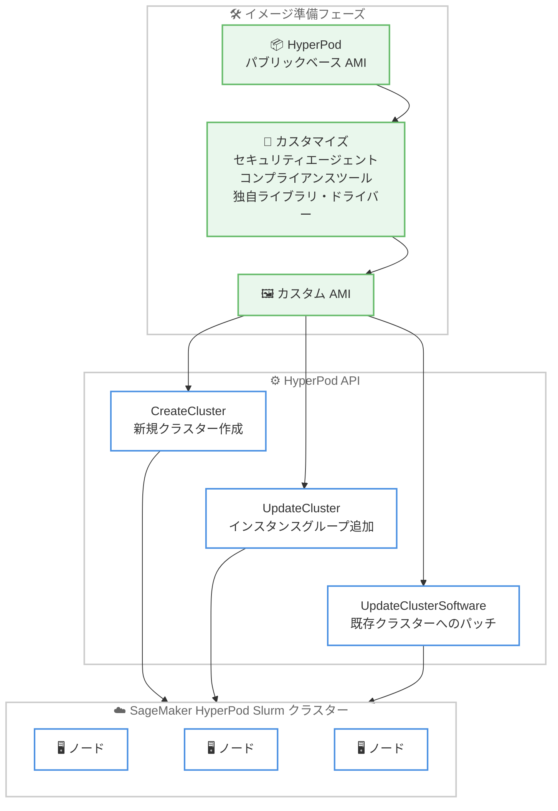

# Amazon SageMaker HyperPod - Slurm クラスター向けカスタム AMI サポート

**リリース日**: 2026 年 7 月 13 日
**サービス**: Amazon SageMaker HyperPod
**機能**: Slurm クラスター向けカスタム AMI (Amazon Machine Images) サポート

📊 [このアップデートのインフォグラフィックを見る](https://takech9203.github.io/aws-news-summary/20260713-hyperpod-custom-ami-slurm.html)
<!-- INFOGRAPHIC_BASE_URL は環境変数から取得 -->

## 概要

Amazon SageMaker HyperPod が、Slurm でオーケストレーションされるクラスターに対してカスタム AMI (Amazon Machine Images) のサポートを開始しました。これにより、組織固有の要件を満たす、事前構成済みでセキュリティ強化された環境を持つクラスターをデプロイできるようになります。

このアップデートでは、HyperPod のパフォーマンス最適化済みベース AMI をベースとしながら、カスタムセキュリティエージェント、コンプライアンスツール、独自ライブラリ、専用ドライバーをイメージに直接組み込むことができます。その結果、起動時間の短縮、信頼性の向上、セキュリティコンプライアンスの強化を実現します。セキュリティチームは組織のポリシーをベースイメージに組み込み、AI/ML チームには事前承認済みの環境を提供できるため、エンタープライズのセキュリティ基準を満たしながらトレーニング開始までの時間を短縮できます。

大規模な分散トレーニングを実行する機械学習チームや、厳格なセキュリティ要件を持つ組織が主な対象ユーザーです。カスタム AMI は、新規クラスター作成時、インスタンスグループ追加時、既存クラスターへのパッチ適用時に指定できます。

**アップデート前の課題**

このアップデート以前、HyperPod の Slurm クラスターでカスタム環境を構築するには、複雑なライフサイクル設定スクリプトに依存する必要がありました。

- 以前はカスタム環境の構築に複雑なライフサイクル設定スクリプトが必要で、デプロイが遅延していた
- 以前はライフサイクルスクリプトの実行結果がノード間で不整合を起こす可能性があった
- 以前はセキュリティエージェントやコンプライアンスツールをクラスター起動のたびに構成する必要があり、起動時間が長くなっていた

**アップデート後の改善**

今回のアップデートにより、セキュリティ強化済みのイメージをあらかじめ用意してデプロイできるようになりました。

- 今回のアップデートにより、事前構成済みのカスタム AMI を指定してクラスターをデプロイできるようになった
- 今回のアップデートにより、複雑なライフサイクルスクリプトへの依存が減り、ノード間の一貫性が向上した
- 今回のアップデートにより、セキュリティエージェントやドライバーをイメージに組み込むことで起動時間が短縮され、信頼性が向上した

## アーキテクチャ図



HyperPod のパブリックベース AMI をベースにカスタム AMI を構築し、各種 API を通じて Slurm クラスターへデプロイする流れを示しています。

## サービスアップデートの詳細

### 主要機能

1. **ベース AMI を基盤としたカスタマイズ**
   - HyperPod のパフォーマンス最適化済みベース AMI をベースとしてカスタム AMI を構築
   - カスタムセキュリティエージェント、コンプライアンスツールをイメージに直接組み込み
   - 独自ライブラリや専用ドライバーを事前にインストール可能

2. **複数の API での指定に対応**
   - `CreateCluster` API による新規 HyperPod Slurm クラスター作成時にカスタム AMI を指定
   - `UpdateCluster` API によるインスタンスグループ追加時にカスタム AMI を指定
   - `UpdateClusterSoftware` API による既存クラスターのパッチ適用時にカスタム AMI を指定

3. **セキュリティとコンプライアンスの強化**
   - セキュリティチームが組織のポリシーをベースイメージに組み込み可能
   - AI/ML チームには事前承認済みの環境を提供
   - 起動時間の短縮、信頼性の向上、セキュリティコンプライアンスの強化を実現

## 技術仕様

### カスタム AMI の要件

| 項目 | 詳細 |
|------|------|
| ベースイメージ | HyperPod のパブリックベース AMI を使用して構築する必要がある |
| 互換性 | 分散トレーニングライブラリおよびクラスター管理機能との互換性を維持 |
| オーケストレーター | Slurm でオーケストレーションされるクラスターが対象 |
| 対応 API | CreateCluster、UpdateCluster、UpdateClusterSoftware |

### API変更履歴

| 日付 | サービス | 変更内容 |
|------|----------|----------|
| 2026/07/10 | [Amazon SageMaker Service](https://awsapichanges.com/archive/changes/4249fc-api.sagemaker.html) | 10 updated methods - SageMaker HyperPod 向けの g4d、c6g、c7g、c8g インスタンスタイプのサポートに関連する更新 |

## 設定方法

### 前提条件

1. Amazon SageMaker HyperPod の Slurm クラスターを利用できること
2. HyperPod のパブリックベース AMI を基盤としてカスタム AMI を構築済みであること
3. カスタム AMI へのアクセス権限を持つ IAM ロールが構成されていること

### 手順

#### ステップ1: ベース AMI をベースにカスタム AMI を構築

HyperPod のパブリックベース AMI をベースイメージとして選択し、必要なセキュリティエージェント、コンプライアンスツール、独自ライブラリ、専用ドライバーをインストールしたうえで、カスタム AMI を作成します。ベース AMI を使用することで、分散トレーニングライブラリやクラスター管理機能との互換性が維持されます。

#### ステップ2: カスタム AMI を指定してクラスターを作成

```bash
# CreateCluster API でカスタム AMI を指定して新規クラスターを作成する例
aws sagemaker create-cluster \
  --cluster-name my-hyperpod-cluster \
  --orchestrator '{"Slurm": {}}' \
  --instance-groups '[{
    "InstanceGroupName": "worker-group",
    "InstanceType": "ml.p5.48xlarge",
    "InstanceCount": 2,
    "CustomImage": {"AmiId": "ami-xxxxxxxxxxxxxxxxx"}
  }]'
```

上記コマンドは、Slurm オーケストレーターを使用する HyperPod クラスターを作成し、インスタンスグループに構築済みのカスタム AMI を指定しています。実際のパラメータ名や指定方法は最新の公式ドキュメントを確認してください。

#### ステップ3: 既存クラスターへのパッチ適用またはインスタンスグループ追加

既存クラスターにカスタム AMI を適用する場合は `UpdateClusterSoftware` API を使用し、インスタンスグループを追加する場合は `UpdateCluster` API を使用してカスタム AMI を指定します。これにより、稼働中のクラスターに対しても更新されたイメージを適用できます。

## メリット

### ビジネス面

- **トレーニング開始までの時間短縮**: 事前承認済みの環境により、AI/ML チームがトレーニングを開始するまでの時間を短縮
- **ガバナンスの向上**: セキュリティチームが組織のポリシーをベースイメージに組み込むことで、エンタープライズのセキュリティ基準を満たしやすくなる
- **運用負荷の軽減**: 複雑なライフサイクルスクリプトへの依存が減り、運用の手間を削減

### 技術面

- **起動時間の短縮**: セキュリティエージェントやドライバーをイメージに事前組み込みすることで、クラスター起動時の処理を削減
- **一貫性の向上**: 事前構成済みイメージを使用することで、ノード間の環境の不整合を防止
- **互換性の維持**: ベース AMI を基盤とすることで、分散トレーニングライブラリやクラスター管理機能との互換性を維持

## デメリット・制約事項

### 制限事項

- カスタム AMI は HyperPod のパブリックベース AMI を使用して構築する必要がある
- Slurm でオーケストレーションされるクラスターが対象（本アップデートの範囲）
- ベース AMI から逸脱したイメージ構築は互換性を損なう可能性がある

### 考慮すべき点

- カスタム AMI のメンテナンス（ベース AMI の更新への追従、脆弱性パッチ適用など）はユーザー側の責任となる
- カスタム AMI に組み込むソフトウェアの検証やテストを事前に実施することが望ましい
- 組み込むツールやライブラリによってはイメージサイズが増大する可能性がある

## ユースケース

### ユースケース1: セキュリティ強化環境での分散トレーニング

**シナリオ**: 金融機関の AI/ML チームが、社内セキュリティポリシーに準拠したエージェントを組み込んだ環境で大規模な分散トレーニングを実行したい。

**実装例**:
```
HyperPod ベース AMI + 社内セキュリティエージェント + コンプライアンスツール
→ カスタム AMI を CreateCluster API で指定
```

**効果**: セキュリティチームが承認したイメージで統一され、コンプライアンス要件を満たしながらトレーニングを実行できる。

### ユースケース2: 専用ドライバーを必要とするワークロード

**シナリオ**: 特定のハードウェアアクセラレーターや独自ライブラリを必要とするワークロードを、起動のたびにセットアップせずに実行したい。

**実装例**:
```
HyperPod ベース AMI + 専用ドライバー + 独自ライブラリ
→ カスタム AMI をビルドしてクラスターにデプロイ
```

**効果**: ライフサイクルスクリプトでの都度インストールが不要になり、起動時間の短縮と一貫性の確保を実現できる。

### ユースケース3: 既存クラスターへのイメージ更新

**シナリオ**: 稼働中の HyperPod クラスターに対して、更新されたセキュリティパッチを含むイメージを適用したい。

**実装例**:
```
更新済みカスタム AMI をビルド
→ UpdateClusterSoftware API でパッチ適用
```

**効果**: 稼働中のクラスターに対して、承認済みの最新イメージを適用でき、セキュリティ体制を維持できる。

## 料金

カスタム AMI サポート機能自体に対する追加料金の記載はありません。SageMaker HyperPod のクラスターで使用するコンピューティングリソース (インスタンス) やストレージなどに対して通常どおり課金されます。最新かつ正確な料金は公式の料金ページを確認してください。

## 利用可能リージョン

Amazon SageMaker HyperPod がサポートされているすべての AWS リージョンで利用可能です。

## 関連サービス・機能

- **AWS Slurm オーケストレーション**: HyperPod クラスターのジョブスケジューリングを担うオーケストレーター。本機能の対象
- **Amazon EC2 (AMI)**: カスタム AMI の基盤となるマシンイメージの仕組み
- **Amazon SageMaker HyperPod**: 大規模な分散トレーニング向けのマネージドクラスター基盤

## 参考リンク

- 📊 [インフォグラフィック](https://takech9203.github.io/aws-news-summary/20260713-hyperpod-custom-ami-slurm.html)
- [公式発表 (What's New)](https://aws.amazon.com/about-aws/whats-new/2026/07/hyperpod-custom-ami-slurm/)
- [Amazon SageMaker HyperPod ドキュメント](https://docs.aws.amazon.com/sagemaker/latest/dg/sagemaker-hyperpod.html)
- [Amazon SageMaker 料金ページ](https://aws.amazon.com/sagemaker/pricing/)

## まとめ

今回のアップデートにより、SageMaker HyperPod の Slurm クラスターで、セキュリティ強化済みの事前構成環境をカスタム AMI としてデプロイできるようになりました。複雑なライフサイクルスクリプトへの依存が減り、起動時間の短縮とノード間の一貫性向上が期待できます。厳格なセキュリティ・コンプライアンス要件を持つ組織では、ベース AMI を基盤としたカスタム AMI の構築フローを検討し、社内ポリシーを組み込んだ標準イメージの整備を進めることを推奨します。
