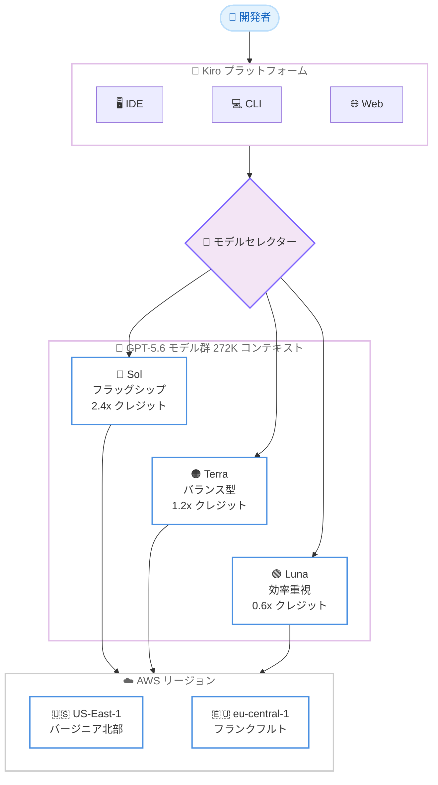

# Kiro - OpenAI GPT-5.6 Sol、Terra、Luna が利用可能に

**リリース日**: 2026 年 7 月 14 日
**サービス**: Kiro
**機能**: Kiro IDE、CLI、Web での OpenAI GPT-5.6 (Sol / Terra / Luna) 提供開始

📊 [このアップデートのインフォグラフィックを見る](https://takech9203.github.io/aws-news-summary/20260713-kiro-gpt-5-6.html)

## 概要

Kiro で OpenAI のモデルが初めて利用可能になりました。2026 年 7 月 14 日、GPT-5.6 の 3 つのバリエーションである Sol、Terra、Luna が Kiro IDE、CLI、Web の全プラットフォームで提供開始されました。このリリースは、Kiro が 2025 年 7 月 14 日にパブリックプレビューを開始してからちょうど 1 年の節目にあたります。Kiro はこの 1 年で、スペック駆動開発の IDE から、IDE、CLI、Web にまたがる本格的なエージェント型開発プラットフォームへと成長しました。今回 Anthropic のモデルに加えて OpenAI のモデルを提供することは、その進化の最新のステップです。

GPT-5.6 は「必要以上のコストをかけずに、より高い知能を提供する」というシンプルな考え方に基づいて設計されています。Sol、Terra、Luna の 3 段階により、性能とコストのトレードオフを用途に応じて直接コントロールできます。最大の能力を求める場面から、最大の効率を求める場面まで、タスクに合わせて最適なモデルを選択できます。

3 つのモデルはいずれも 272K のコンテキストウィンドウを備えています。Kiro Pro、Pro+、Pro Max、Power の各プランの利用者を対象に、実験的サポート (experimental support) として段階的にロールアウトされます。

**アップデート前の課題**

- Kiro で利用できる大規模言語モデルは Anthropic 系のモデルが中心で、OpenAI のモデルを選択できなかった
- 性能とコストのバランスを、タスクの難易度に応じて細かく調整する手段が限られていた
- 長時間にわたるエージェント型タスクを、少ない監督で最後まで完了させることが難しい場面があった

**アップデート後の改善**

- Kiro IDE、CLI、Web の全プラットフォームで OpenAI GPT-5.6 (Sol / Terra / Luna) が利用可能になった
- 3 段階のモデルにより、最大能力の Sol から最大効率の Luna まで、性能とコストのトレードオフを直接選択できるようになった
- GPT-5.6 は自律的なツール利用の効率が向上し、複雑なマルチステップタスクをより少ない監督で最後まで完了できるようになった

## アーキテクチャ図

開発者は Kiro IDE、CLI、Web のモデルセレクターから GPT-5.6 の 3 モデルを選択し、us-east-1 または eu-central-1 のリージョンでクロスリージョン推論を通じて推論を実行します。

## サービスアップデートの詳細

### 主要機能

1. **GPT-5.6 Sol (フラッグシップ)**
   - 最大の能力を提供する最上位モデル
   - Coding Agent Index で 80、Terminal-Bench 2.1 で 88.8% を記録し、両ベンチマークで Claude Fable 5 を上回る
   - 出力トークン数が半分未満、所要時間も半分未満でこの性能を達成
   - スペック駆動での実装、長期的なリファクタリング、複雑なターミナルタスクなど、最も難しいマルチステップ作業を最後まで完了させる用途に最適
   - 2.4 倍のクレジット乗数

2. **GPT-5.6 Terra (バランス型)**
   - 性能とコストのバランスに優れた選択肢
   - Coding Agent Index で 77.4 を記録し、Claude Fable 5 の 77.2 をわずかに上回る
   - フラッグシップの価格を支払わずに、日常的なエージェント型作業で高い性能を発揮
   - 1.2 倍のクレジット乗数

3. **GPT-5.6 Luna (効率重視)**
   - 最もコスト効率の高いモデル
   - Coding Agent Index で 74.6 を記録し、Claude Opus 4.8 の 72.5 を上回る
   - Sol の約 4 分の 1 のコストで動作し、より多くの実行、より多くのタスク、より高いスループットを実現
   - 0.6 倍のクレジット乗数

4. **長時間のエージェント型作業向けの設計**
   - IDE、CLI、Web のいずれでも、GPT-5.6 は監督なしでより長時間動作し、自律的なツール利用を効率的に管理
   - ツールを連携させ中間結果を処理する軽量なプログラムを自ら記述・実行することで、往復回数を削減し、不要なトークンを抑え、少ない指示で複雑なタスクを完了
   - IDE のスペック駆動ワークフローでは、ドリフトの少ない高精度な実装を実現
   - CLI と Web では、ブラウジング、ターミナル利用、複数ファイルのリファクタリングといったマルチステップタスクを、行き詰まりを減らしてより確実に完了

## 技術仕様

### GPT-5.6 モデル比較

| 項目 | GPT-5.6 Sol | GPT-5.6 Terra | GPT-5.6 Luna |
|------|-------------|---------------|--------------|
| 位置付け | フラッグシップ (最大能力) | バランス型 | 効率重視 (最大効率) |
| コンテキストウィンドウ | 272K | 272K | 272K |
| クレジット乗数 | 2.4 倍 | 1.2 倍 | 0.6 倍 |
| Coding Agent Index | 80 | 77.4 | 74.6 |
| 主な用途 | 難易度の高いマルチステップ作業、長期リファクタリング | 日常的なエージェント型作業 | 大量の実行、高スループット |

### ベンチマーク比較

Kiro が公開したベンチマーク結果は以下のとおりです。GPT-5.6 Sol は多くのベンチマークで首位を占め、SWE-Bench Pro では Claude Fable 5 が 80% で首位となっています。

| ベンチマーク | Sol | Terra | Luna | GPT-5.5 | Claude Fable 5 | Claude Opus 4.8 |
|--------------|-----|-------|------|---------|----------------|-----------------|
| Coding Agent Index v1.1 | 80 | 77.4 | 74.6 | 76.4 | 77.2 | 72.5 |
| SWE-Bench Pro | 64.6% | 63.4% | 62.7% | 59.4% | 80% | 69.2% |
| DeepSWE v1.1 | 72.7% | 69.6% | 67.2% | 67% | 69.7% | 59% |
| Terminal-Bench 2.1 | 88.8% | 87.4% | 84.7% | 85.6% | 83.1% | 78.9% |

### 隠れた思考プロセスに関する注意

GPT-5.6 のモデルは、隠れた思考の連鎖 (chain-of-thought) による推論プロセスを使用します。モデル内部の推論ステップは表示されず、最終的な出力のみが表示されます。これは想定された動作であり、出力品質には影響しません。

## 設定方法

### 前提条件

1. Kiro Pro、Pro+、Pro Max、Power のいずれかのプランを利用していること
2. Kiro IDE、CLI、Web のいずれかを利用できる環境であること
3. GPT-5.6 は実験的サポートとして段階的にロールアウトされるため、環境によってはまだ表示されない場合がある

### 手順

#### ステップ1: IDE または CLI を再起動

Kiro IDE または CLI を再起動し、最新の利用可能モデルを確認します。Web の場合はブラウザを更新することで、モデルセレクターに GPT-5.6 Sol、Terra、Luna が表示されます。

#### ステップ2: モデルセレクターから GPT-5.6 を選択

モデルセレクターを開き、GPT-5.6 Sol、Terra、Luna のいずれかを選択します。タスクの難易度とコスト要件に応じて使い分けます。

#### ステップ3: タスクに応じたモデルの使い分け

最も難しいマルチステップ作業には Sol、日常的なエージェント型作業には Terra、大量の実行や高スループットが必要な場面には Luna を選択します。

## メリット

### ビジネス面

- **モデル選択肢の拡大**: Anthropic 系モデルに加えて OpenAI GPT-5.6 が選択可能になり、用途に応じた柔軟な選択ができる
- **コスト最適化**: 0.6 倍のクレジット乗数の Luna から 2.4 倍の Sol まで、タスクの難易度に応じてコストを直接コントロールできる
- **開発生産性の向上**: 複雑なタスクを少ない監督で最後まで完了できるため、開発者の介入回数を削減できる

### 技術面

- **高いベンチマーク性能**: Sol は Coding Agent Index と Terminal-Bench 2.1 で Claude Fable 5 を上回り、出力トークンと所要時間は半分未満
- **大規模コンテキスト対応**: 3 モデルすべてが 272K のコンテキストウィンドウに対応し、大規模なコードベースやドキュメントを扱える
- **効率的なツール利用**: 軽量なプログラムを自ら記述・実行してツールを連携させ、往復回数と不要なトークンを削減

## デメリット・制約事項

### 制限事項

- GPT-5.6 は実験的サポート (experimental support) として段階的にロールアウトされるため、環境によってはまだ利用できない場合がある
- 対象プランは Kiro Pro、Pro+、Pro Max、Power に限定される
- 利用可能リージョンは us-east-1 (バージニア北部) と eu-central-1 (フランクフルト) に限定される

### 考慮すべき点

- Sol は 2.4 倍のクレジット乗数のため、利用量に応じてクレジット消費が大きくなる点を考慮する
- モデル内部の思考プロセスは表示されず、最終出力のみが確認できる
- 新モデルを表示するには、IDE または CLI の再起動、Web の場合はブラウザの更新が必要

## ユースケース

### ユースケース1: 難易度の高いスペック駆動実装

**シナリオ**: 複雑な業務ロジックを含む機能を、スペック駆動開発で最後まで実装したい。

**効果**: GPT-5.6 Sol の 272K コンテキストウィンドウと高いマルチステップ処理能力により、ドリフトの少ない高精度な実装を、少ない監督で最後まで完了できる。

### ユースケース2: 日常的なエージェント型作業のコスト最適化

**シナリオ**: 日々発生する中規模のコーディングタスクを、フラッグシップの価格を支払わずに効率的に処理したい。

**効果**: GPT-5.6 Terra を活用することで、Claude Fable 5 を上回る Coding Agent Index の性能を、フラッグシップより低いコストで得られる。

### ユースケース3: 大量タスクの高スループット処理

**シナリオ**: 反復的なリファクタリングやテスト生成タスクを、コストを抑えて大量に実行したい。

**効果**: 0.6 倍のクレジット乗数の GPT-5.6 Luna を活用することで、Sol の約 4 分の 1 のコストで、より多くの実行とより高いスループットを実現できる。

## 料金

Kiro の料金はクレジットベースで計算され、モデルごとに設定されたクレジット乗数が適用されます。

| モデル | クレジット乗数 |
|--------|----------------|
| GPT-5.6 Sol | 2.4 倍 |
| GPT-5.6 Terra | 1.2 倍 |
| GPT-5.6 Luna | 0.6 倍 |

クレジット乗数は、同一のリクエストに対するクレジット消費量に影響します。コストを重視する場合は乗数の低い Luna、能力を重視する場合は乗数の高い Sol を選択するなど、用途に応じた使い分けが推奨されます。各プランの月間クレジット数など最新の料金体系は Kiro の公式情報を参照してください。

## 利用可能リージョン

グローバルに提供されます。ただし、GPT-5.6 は実験的サポートとして、AWS US-East-1 (バージニア北部) と AWS Europe (フランクフルト、eu-central-1) のリージョンで段階的にロールアウトされ、クロスリージョン推論に対応します。

## 関連サービス・機能

- **Amazon Bedrock**: Kiro のモデル推論を支える基盤サービス
- **Anthropic Claude**: Kiro で従来提供されているモデル群。GPT-5.6 のベンチマーク比較対象 (Claude Fable 5、Claude Opus 4.8) としても参照
- **Kiro スペック駆動開発**: GPT-5.6 の高精度な実装能力が活きる Kiro の中核ワークフロー

## 参考リンク

- 📊 [インフォグラフィック](https://takech9203.github.io/aws-news-summary/20260713-kiro-gpt-5-6.html)
- [公式発表 (Kiro Blog)](https://kiro.dev/blog/gpt-5-6/)
- [Kiro Changelog](https://kiro.dev/changelog/)
- [Kiro ドキュメント](https://kiro.dev/docs/)
- [Kiro 公式サイト](https://kiro.dev/)

## まとめ

このアップデートにより、Kiro で初めて OpenAI GPT-5.6 (Sol / Terra / Luna) が利用可能になり、IDE、CLI、Web のすべてで性能とコストのトレードオフを直接選択できるようになりました。Kiro のパブリックプレビュー開始から 1 年の節目となる今回のリリースは、Anthropic 系モデルに加えて選択肢を大きく広げるものです。Kiro Pro 以上のプランを利用している場合は、IDE または CLI を再起動、あるいは Web でブラウザを更新し、タスクの難易度に応じて 3 つのモデルを試すことを推奨します。
