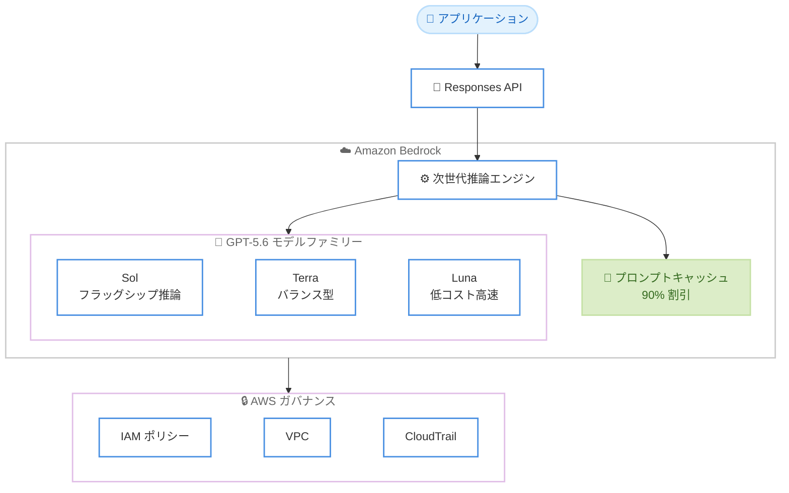

# Amazon Bedrock - OpenAI GPT-5.6 Sol / Terra / Luna の一般提供開始

**リリース日**: 2026 年 7 月 13 日
**サービス**: Amazon Bedrock
**機能**: OpenAI GPT-5.6 Sol、Terra、Luna モデルの提供

📊 [このアップデートのインフォグラフィックを見る](https://takech9203.github.io/aws-news-summary/20260713-openai-gpt-sol-terra.html)
<!-- INFOGRAPHIC_BASE_URL は環境変数から取得 -->

## 概要

AWS は、OpenAI の最新モデルファミリーである GPT-5.6 の 3 モデル、Sol、Terra、Luna を Amazon Bedrock で一般提供 (GA) したことを発表しました。これらのモデルは、パフォーマンス、セキュリティ、信頼性を重視して構築された Bedrock の次世代推論エンジンを通じて提供され、Amazon Bedrock 上の Responses API からアクセスできます。

3 つのモデルは能力の階層を形成しています。フラッグシップの推論モデルである Sol は、エージェント型コーディングのベンチマークで最先端 (SOTA) の結果を示します。バランス型の Terra は、GPT-5.5 相当のパフォーマンスを半分のコストで提供します。高速かつコスト効率に優れた Luna は、ファミリー内で最も低い価格帯で推論を提供します。用途に応じて能力とコストのバランスを選択できる構成です。

これらのモデルは、自律型コーディングエージェントの構築、長期にわたるゲノミクスや生物学の分析、高度なサイバーセキュリティ研究といったユースケースを想定しています。料金は OpenAI のファーストパーティ料金と一致し、利用量は既存の AWS コミットメントにカウントされます。また、プロンプトキャッシュ (明示的なキャッシュブレークポイント) に対応し、繰り返し利用されるコンテキストは 90% の割引で課金されます。

**アップデート前の課題**

- OpenAI の最新モデルを、IAM や VPC、CloudTrail といった AWS のセキュリティ統制の下で利用する選択肢が限られていた
- エージェント型ワークフローでは同一のコンテキストを繰り返し送信するため、スケールに伴い推論コストが増大しやすかった
- 用途ごとに能力とコストのバランスが異なるモデルを、単一のプラットフォームから選択して使い分けることが容易ではなかった

**アップデート後の改善**

- 今回のアップデートにより GPT-5.6 Sol、Terra、Luna を Amazon Bedrock の Responses API から利用できるようになった
- 明示的なキャッシュブレークポイントによるプロンプトキャッシュで、繰り返し利用するコンテキストが 90% 割引となり、スケール時のコスト増加を抑えられるようになった
- フラッグシップ (Sol)、バランス (Terra)、コスト効率 (Luna) の 3 階層から、ユースケースに応じてモデルを選択できるようになった

## アーキテクチャ図



アプリケーションが Responses API を通じて Bedrock の推論エンジンにアクセスし、GPT-5.6 の 3 モデルとプロンプトキャッシュを利用しつつ、IAM や VPC、CloudTrail による AWS のガバナンス統制の下で実行される流れを示しています。

## サービスアップデートの詳細

### 主要機能

1. **GPT-5.6 Sol (フラッグシップ推論モデル)**
   - OpenAI の最新ファミリーにおけるフラッグシップの推論モデル
   - エージェント型コーディングのベンチマークで最先端 (SOTA) の結果を示す
   - 複雑な推論やエージェント型タスクを重視するユースケースに適する

2. **GPT-5.6 Terra (バランス型モデル)**
   - GPT-5.5 相当のパフォーマンスを半分のコストで提供
   - 性能とコストのバランスを重視する一般的なワークロードに適する

3. **GPT-5.6 Luna (低コスト高速モデル)**
   - 高速かつコスト効率に優れた推論をファミリー内で最も低い価格帯で提供
   - 大量のリクエストやコスト重視のユースケースに適する

4. **プロンプトキャッシュ (明示的なキャッシュブレークポイント)**
   - 再利用するプロンプト部分にキャッシュブレークポイントを指定
   - 同一のコンテキストを共有する後続リクエストでは処理済みコンテキストが再利用され、新規部分のみが課金対象となる
   - キャッシュされた入力は 90% の割引で課金され、少なくとも 30 分間は再利用可能

5. **Responses API 経由のアクセス**
   - Amazon Bedrock の Responses API からプログラムでアクセス可能
   - ChatGPT デスクトップアプリを Bedrock 上の GPT-5.6 を利用するよう構成することも可能

6. **AWS ネイティブなセキュリティとガバナンス**
   - IAM ポリシーの下で実行され、VPC 内で動作し、CloudTrail に記録される
   - チップレベルで強制されるゼロオペレーターアクセス (ZOA) を採用

## 技術仕様

### モデルの概要

| 項目 | 詳細 |
|------|------|
| モデルファミリー | OpenAI GPT-5.6 |
| 提供モデル | Sol (フラッグシップ推論)、Terra (バランス型)、Luna (低コスト高速) |
| アクセス方法 | Amazon Bedrock の Responses API、Amazon Bedrock コンソール |
| Sol の特長 | エージェント型コーディングベンチマークで SOTA |
| Terra の特長 | GPT-5.5 相当の性能を半分のコストで提供 |
| Luna の特長 | ファミリー内で最も低い価格帯の高速推論 |
| プロンプトキャッシュ | 明示的なキャッシュブレークポイントに対応、キャッシュ入力は 90% 割引、30 分以上再利用可能 |
| セキュリティ | チップレベルで強制される ZOA、IAM、VPC、CloudTrail 対応 |

### API 変更履歴

今回のアップデートに直接対応する awsapichanges.com の公開エントリは確認できませんでした。GPT-5.6 モデルは Amazon Bedrock の Responses API を通じて提供されます。

## 設定方法

### 前提条件

1. Amazon Bedrock を利用可能な AWS アカウント
2. 対象モデルへのアクセス権限を付与する IAM ポリシー
3. Sol、Terra、Luna が提供されるリージョン (後述) の利用

### 手順

#### ステップ 1: モデルアクセスの有効化

Amazon Bedrock コンソールでモデルアクセスを設定し、GPT-5.6 Sol、Terra、Luna の利用を有効化します。IAM ポリシーで対象モデルの呼び出しを許可する必要があります。

#### ステップ 2: Responses API での呼び出し

Amazon Bedrock の Responses API を通じて、対象モデルにプログラムからリクエストを送信します。用途に応じて Sol、Terra、Luna を選択します。

#### ステップ 3: プロンプトキャッシュの活用

エージェント型ワークフローなどで繰り返し利用するコンテキストに対して明示的なキャッシュブレークポイントを指定します。これにより、後続リクエストで共有されるコンテキストが再利用され、キャッシュ部分は 90% の割引で課金されます。具体的な指定方法は Amazon Bedrock のドキュメントを参照してください。

## メリット

### ビジネス面

- **コスト最適化**: Terra は GPT-5.5 相当の性能を半分のコストで提供し、Luna は最も低い価格帯で高速推論を提供するため、用途に応じてコストを抑えられる
- **コミットメントの活用**: 利用量が既存の AWS コミットメントにカウントされるため、支出の一元管理がしやすい
- **料金の透明性**: 料金は OpenAI のファーストパーティ料金と一致する

### 技術面

- **キャッシュによるコスト抑制**: 明示的なキャッシュブレークポイントにより、繰り返しのコンテキストが 90% 割引となり、スケール時のコスト増加を抑えられる
- **用途に応じたモデル選択**: 推論重視 (Sol)、バランス (Terra)、高速低コスト (Luna) を単一プラットフォームから使い分けられる
- **AWS ネイティブなセキュリティ**: IAM、VPC、CloudTrail による統制と、チップレベルで強制される ZOA により、エンタープライズ要件に対応しやすい

## デメリット・制約事項

### 制限事項

- Sol は US East (バージニア北部) と US East (オハイオ) のみで提供され、Terra と Luna よりも対応リージョンが限定される
- 現時点では米国リージョンのみでの提供で、東京リージョンなど他リージョンでは利用できない
- 不正使用検出のため、分類器でフラグが付いたデータは最大 30 日間保持される

### 考慮すべき点

- プロンプトキャッシュの効果を得るには、再利用可能なコンテキストを設計しキャッシュブレークポイントを適切に指定する必要がある
- キャッシュされたコンテンツの再利用可能期間は少なくとも 30 分間であり、それを踏まえたワークフロー設計が求められる
- ユースケースに応じて 3 モデルのどれを使うかを、性能とコストの観点から評価する必要がある

## ユースケース

### ユースケース 1: 自律型コーディングエージェント

**シナリオ**: コード生成やリファクタリング、テストを自律的に実行するコーディングエージェントを構築したい。

**実装例**:
```
GPT-5.6 Sol + Responses API
エージェント型コーディングベンチマークで SOTA の推論能力を活用
繰り返すシステムプロンプトにキャッシュブレークポイントを指定
```

**効果**: フラッグシップの推論能力を活かしつつ、プロンプトキャッシュで反復コンテキストのコストを抑えられる。

### ユースケース 2: 長期にわたるゲノミクス・生物学の分析

**シナリオ**: ゲノミクスや生物学の分野で、長い文脈を伴う複雑な分析を実行したい。

**実装例**:
```
GPT-5.6 Sol / Terra
長期的な分析タスクに推論能力を適用
```

**効果**: 高度な推論を要する科学的分析を、AWS のガバナンス統制の下で実行できる。

### ユースケース 3: 高度なサイバーセキュリティ研究

**シナリオ**: 脅威分析や脆弱性調査など、高度なサイバーセキュリティ研究を支援したい。

**実装例**:
```
GPT-5.6 Terra / Luna
コストと性能のバランスに応じてモデルを選択
IAM、VPC、CloudTrail による統制下で実行
```

**効果**: セキュリティ要件を満たしながら、コスト効率よく研究ワークロードを実行できる。

## 料金

GPT-5.6 Sol、Terra、Luna の料金は、OpenAI のファーストパーティ料金と一致します。利用量は既存の AWS コミットメントにカウントされます。プロンプトキャッシュを利用すると、キャッシュされた入力は 90% の割引で課金されます。Terra は GPT-5.5 相当の性能を半分のコストで、Luna はファミリー内で最も低い価格帯で提供されます。具体的な料金は Amazon Bedrock の料金ページを参照してください。

## 利用可能リージョン

- **Sol**: US East (バージニア北部)、US East (オハイオ)
- **Terra**: US East (バージニア北部)、US East (オハイオ)、US West (オレゴン)
- **Luna**: US East (バージニア北部)、US East (オハイオ)、US West (オレゴン)

## 関連サービス・機能

- **Amazon Bedrock**: 基盤モデルを API 経由で利用できるフルマネージドサービス。GPT-5.6 モデルの提供基盤
- **Responses API**: Amazon Bedrock 上で GPT-5.6 モデルにアクセスするための API
- **プロンプトキャッシュ**: 繰り返し利用するコンテキストをキャッシュしコストを抑える機能
- **AWS IAM / VPC / CloudTrail**: モデル利用のアクセス制御、ネットワーク分離、監査ログを提供

## 参考リンク

- 📊 [インフォグラフィック](https://takech9203.github.io/aws-news-summary/20260713-openai-gpt-sol-terra.html)
- [公式発表 (What's New)](https://aws.amazon.com/about-aws/whats-new/2026/07/openai-gpt-sol-terra/)
- [AWS Blog](https://aws.amazon.com/blogs/machine-learning/openai-gpt-5-6-sol-terra-and-luna-are-now-generally-available-on-amazon-bedrock/)
- [Amazon Bedrock ドキュメント](https://docs.aws.amazon.com/bedrock/latest/userguide/what-is-bedrock.html)
- [Amazon Bedrock 料金ページ](https://aws.amazon.com/bedrock/pricing/)

## まとめ

今回のアップデートにより、OpenAI の最新モデルファミリー GPT-5.6 の Sol、Terra、Luna が Amazon Bedrock で一般提供されました。フラッグシップの推論 (Sol)、バランス型 (Terra)、低コスト高速 (Luna) の 3 階層から用途に応じて選択でき、90% 割引となるプロンプトキャッシュでスケール時のコストを抑えられます。自律型コーディングエージェントや科学分析、サイバーセキュリティ研究に取り組むお客様は、まず US East リージョンでモデルアクセスを有効化し、ユースケースに合ったモデルの評価を始めることを推奨します。
