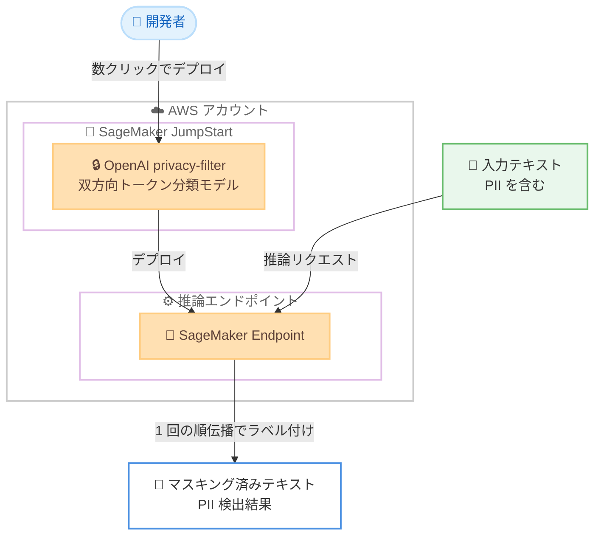

# Amazon SageMaker JumpStart - OpenAI privacy-filter による PII 検出とマスキング

**リリース日**: 2026 年 7 月 13 日
**サービス**: Amazon SageMaker JumpStart
**機能**: OpenAI privacy-filter (PII 検出・マスキングモデル)

📊 [このアップデートのインフォグラフィックを見る](https://takech9203.github.io/aws-news-summary/20260713-privacy-filter-on-sagemaker-jumpstart.html)
<!-- INFOGRAPHIC_BASE_URL は環境変数から取得 -->

## 概要

AWS は、OpenAI が提供する privacy-filter モデルを Amazon SageMaker JumpStart で利用可能にしたことを発表しました。privacy-filter は、テキスト中の個人を特定できる情報 (PII: Personally Identifiable Information) を検出してマスキングするための双方向トークン分類 (bidirectional token-classification) モデルです。これにより、データのサニタイズ (無害化) ワークフローを構築できます。

このモデルは高速かつコンテキストを考慮 (context-aware) し、チューニング可能 (tunable) であることが特徴です。高スループットのデータサニタイズワークフロー向けに設計されており、チームがオンプレミスで実行することも想定されています。入力シーケンスを 1 回の順伝播 (single forward pass) でラベル付けし、アカウント番号、住所、メールアドレス、氏名、電話番号、URL、日付、シークレットといった PII のスパンカテゴリを検出します。

privacy-filter は、Amazon SageMaker Studio の Models セクションから数クリックで、または SageMaker Python SDK を使用して、お客様の AWS アカウントに数クリックでデプロイできます。生成 AI アプリケーションやデータパイプラインにおける機密情報の取り扱いを効率化し、コンプライアンス要件への対応を支援します。

**アップデート前の課題**

privacy-filter が利用可能になる以前は、テキストデータからの PII 検出とマスキングにおいて以下のような課題がありました。

- PII 検出のために独自のモデルを構築・学習させる、または外部の SaaS ベースの API に依存する必要があり、実装や運用の負担が大きかった
- 外部サービスに機密データを送信することへの懸念があり、データ主権やコンプライアンス上の制約が発生していた
- ルールベースや正規表現による検出では、文脈を考慮できず誤検出や検出漏れが発生しやすかった

**アップデート後の改善**

今回のアップデートにより、以下が可能になりました。

- SageMaker JumpStart から事前学習済みの PII 検出モデルを数クリックでデプロイし、自社の AWS アカウント内で完結して実行できるようになった
- コンテキストを考慮した双方向トークン分類により、文脈に応じた高精度な PII 検出が可能になった
- 1 回の順伝播でシーケンス全体をラベル付けするため、高スループットなデータサニタイズワークフローを構築できるようになった

## アーキテクチャ図



SageMaker JumpStart からデプロイした privacy-filter エンドポイントに入力テキストを送信すると、PII が検出・マスキングされた結果が返される流れを示しています。

## サービスアップデートの詳細

### 主要機能

1. **双方向トークン分類による PII 検出**
   - OpenAI が提供する双方向トークン分類モデルを採用
   - 入力シーケンスを 1 回の順伝播 (single forward pass) でラベル付けし、効率的に処理
   - コンテキストを考慮した検出により、文脈に応じた高精度な判定が可能

2. **幅広い PII カテゴリの検出**
   - アカウント番号 (account numbers)
   - 住所 (addresses)
   - メールアドレス (emails)
   - 氏名 (names)
   - 電話番号 (phone numbers)
   - URL
   - 日付 (dates)
   - シークレット (secrets)

3. **高スループットなデータサニタイズワークフロー**
   - 高速かつチューニング可能な設計により、大量のテキストデータを効率的に処理
   - お客様の AWS アカウント内で完結して実行できるため、機密データを外部に送信する必要がない
   - オンプレミスでの実行も想定した設計

## 技術仕様

### モデル概要

| 項目 | 詳細 |
|------|------|
| 提供元 | OpenAI |
| モデルタイプ | 双方向トークン分類モデル (bidirectional token-classification) |
| 処理方式 | 1 回の順伝播 (single forward pass) でシーケンスをラベル付け |
| 用途 | テキスト中の PII 検出とマスキング |
| 特徴 | 高速、コンテキスト考慮、チューニング可能 |
| 検出カテゴリ | アカウント番号、住所、メール、氏名、電話番号、URL、日付、シークレット |
| デプロイ方法 | SageMaker Studio (Models セクション)、SageMaker Python SDK |

## 設定方法

### 前提条件

1. Amazon SageMaker を利用可能な AWS アカウント
2. SageMaker Studio へのアクセス、または SageMaker Python SDK を実行できる環境
3. モデルのデプロイとエンドポイント作成に必要な IAM 権限

### 手順

#### ステップ1: SageMaker Studio からモデルを選択

SageMaker Studio の Models セクションを開き、privacy-filter を検索します。モデルの詳細ページから、数クリックでデプロイを開始できます。

#### ステップ2: SageMaker Python SDK でデプロイ

```python
from sagemaker.jumpstart.model import JumpStartModel

# privacy-filter モデルを指定してデプロイ
model = JumpStartModel(model_id="<privacy-filter-model-id>")
predictor = model.deploy()
```

JumpStartModel クラスを使用して privacy-filter モデルを指定し、deploy メソッドで推論エンドポイントを作成します。実際のモデル ID は SageMaker JumpStart のドキュメントを参照してください。

#### ステップ3: 推論の実行

```python
# PII を含むテキストを送信して検出・マスキング結果を取得
response = predictor.predict({"inputs": "<PII を含むテキスト>"})
print(response)
```

デプロイしたエンドポイントに対して入力テキストを送信すると、検出された PII のスパンとカテゴリが返されます。この結果を用いてマスキング処理を実装できます。

## メリット

### ビジネス面

- **コンプライアンス対応の強化**: PII を自動検出・マスキングすることで、データ保護規制への対応を支援
- **データ主権の確保**: 自社の AWS アカウント内で処理が完結するため、機密データを外部サービスに送信する必要がない
- **導入コストの削減**: 独自の PII 検出モデルを構築・学習させる必要がなく、事前学習済みモデルを即座に利用できる

### 技術面

- **高精度な検出**: コンテキストを考慮した双方向トークン分類により、文脈に応じた検出が可能
- **高スループット処理**: 1 回の順伝播でシーケンスをラベル付けするため、大量データを効率的に処理
- **柔軟なデプロイ**: SageMaker Studio または Python SDK による数クリックでのデプロイに対応

## デメリット・制約事項

### 制限事項

- 検出できる PII カテゴリは、アカウント番号、住所、メール、氏名、電話番号、URL、日付、シークレットに限定される
- モデルのデプロイと推論エンドポイントの稼働には SageMaker の利用料金が発生する
- 利用可能リージョンなどの詳細は公式ドキュメントで確認が必要

### 考慮すべき点

- 検出精度はテキストの言語や文脈に依存するため、実運用前に自社データでの検証が推奨される
- エンドポイントを常時稼働させる場合はインスタンスの稼働時間に応じたコストが発生するため、バッチ処理やオンデマンド実行など利用パターンに応じた設計が重要

## ユースケース

### ユースケース1: 生成 AI アプリケーションの入力サニタイズ

**シナリオ**: LLM を活用したチャットアプリケーションで、ユーザー入力に含まれる PII をモデルに渡す前にマスキングしたい。

**効果**: 機密情報を含んだままプロンプトを外部モデルに送信するリスクを低減し、プライバシー保護とコンプライアンスを両立できます。

### ユースケース2: データ分析基盤のデータサニタイズ

**シナリオ**: データレイクに蓄積されたログや問い合わせ履歴から PII を除去してから分析やモデル学習に利用したい。

**効果**: 高スループット処理により大量のテキストデータを効率的にサニタイズし、匿名化されたデータセットを分析用に準備できます。

### ユースケース3: ドキュメント共有前の機密情報マスキング

**シナリオ**: 社内外で共有するドキュメントから氏名や電話番号などの PII を自動的に検出・マスキングしたい。

**効果**: 手作業による確認の負担を軽減し、情報漏洩リスクを低減できます。

## 料金

privacy-filter は Amazon SageMaker JumpStart を通じて提供されるモデルです。料金は、モデルをデプロイする SageMaker 推論エンドポイントのインスタンスタイプと稼働時間に基づいて発生します。詳細な料金は Amazon SageMaker の料金ページを参照してください。

## 利用可能リージョン

利用可能リージョンの詳細は、公式発表および Amazon SageMaker JumpStart のドキュメントで確認してください。

## 関連サービス・機能

- **Amazon SageMaker JumpStart**: 事前学習済みモデルを数クリックでデプロイできる機能。privacy-filter もここから提供される
- **Amazon SageMaker Studio**: モデルの検索・デプロイ・管理を行う統合開発環境
- **Amazon Comprehend**: AWS が提供するマネージド NLP サービスで、PII 検出機能を含む。ユースケースに応じた選択肢となる

## 参考リンク

- 📊 [インフォグラフィック](https://takech9203.github.io/aws-news-summary/20260713-privacy-filter-on-sagemaker-jumpstart.html)
- [公式発表 (What's New)](https://aws.amazon.com/about-aws/whats-new/2026/07/privacy-filter-on-sagemaker-jumpstart/)
- [Amazon SageMaker JumpStart ドキュメント](https://docs.aws.amazon.com/sagemaker/latest/dg/studio-jumpstart.html)
- [Amazon SageMaker 料金ページ](https://aws.amazon.com/sagemaker/pricing/)

## まとめ

OpenAI privacy-filter の SageMaker JumpStart 対応により、事前学習済みの高精度な PII 検出・マスキングモデルを自社の AWS アカウント内で数クリックからデプロイできるようになりました。データサニタイズや生成 AI アプリケーションのプライバシー保護に取り組むチームは、まず自社データでの検証環境を構築し、利用可能リージョンや料金を確認したうえで導入を検討することを推奨します。
