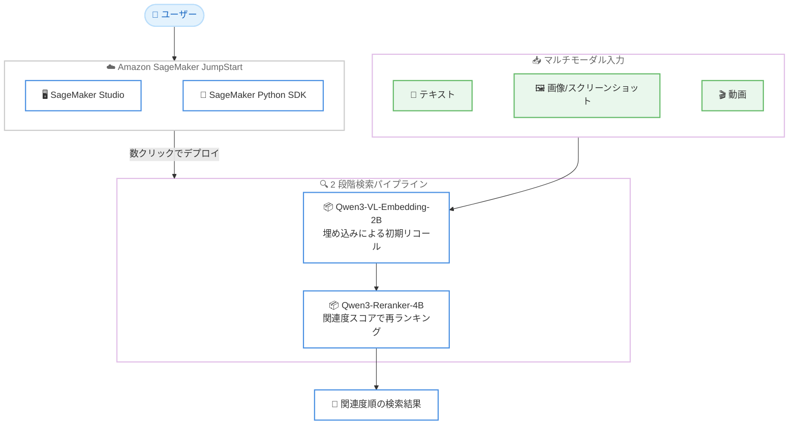

# Amazon SageMaker JumpStart - Qwen3 の埋め込み・リランキングモデルの提供開始

**リリース日**: 2026 年 7 月 13 日
**サービス**: Amazon SageMaker JumpStart
**機能**: Qwen3-VL-Embedding-2B および Qwen3-Reranker-4B の提供

📊 [このアップデートのインフォグラフィックを見る](https://takech9203.github.io/aws-news-summary/20260713-qwen3-search-retrieval-on-sagemaker-jumpstart.html)
<!-- INFOGRAPHIC_BASE_URL は環境変数から取得 -->

## 概要

AWS は、情報検索とクロスモーダル理解向けに設計された Qwen の 2 つのモデル、Qwen3-VL-Embedding-2B と Qwen3-Reranker-4B を Amazon SageMaker JumpStart で利用できるようにしたことを発表しました。これらのモデルを組み合わせることで、包括的な検索パイプラインを構築できます。

この 2 つのモデルは、通常は組み合わせて (in tandem) 使用します。まず埋め込みモデル (Qwen3-VL-Embedding-2B) が効率的な初期リコール (initial recall) を担い、続くリランキング段階でリランカー (Qwen3-Reranker-4B) が検索結果を絞り込みます。この 2 段階構成により、大量の候補から高速に候補を抽出し、その後に高精度な関連度評価で並べ替えるという、精度と効率を両立した検索処理が可能になります。

SageMaker JumpStart を通じて、SageMaker Studio または SageMaker Python SDK から数クリックでデプロイでき、独自の AWS 環境内でセキュアにモデルをホストできます。検索拡張生成 (RAG) やセマンティック検索、マルチモーダル検索を構築したいお客様に適しています。

**アップデート前の課題**

- 高精度な検索パイプラインを構築するには、埋め込みモデルとリランカーを個別に調達・統合する必要があった
- テキスト・画像・動画といった複数モダリティを共通のベクトル空間で扱える検索用モデルを SageMaker JumpStart から手軽にデプロイする選択肢が限られていた
- 多言語かつマルチモーダルな検索を単一のモデル群で実現することが難しかった

**アップデート後の改善**

- 今回のアップデートにより Qwen3-VL-Embedding-2B と Qwen3-Reranker-4B を SageMaker JumpStart から数クリックでデプロイできるようになった
- 埋め込みによる初期リコールとリランカーによる再ランキングを組み合わせた 2 段階検索パイプラインを構築しやすくなった
- テキスト・画像・スクリーンショット・動画を共通のベクトル空間で扱うマルチモーダル検索と、100 言語を超える多言語検索が利用できるようになった

## アーキテクチャ図



ユーザーが SageMaker Studio または Python SDK から 2 つのモデルをデプロイし、埋め込みモデルがマルチモーダル入力から候補を初期リコールし、リランカーが関連度スコアで再ランキングして最終的な検索結果を返す流れを示しています。

## サービスアップデートの詳細

### 主要機能

1. **Qwen3-VL-Embedding-2B によるマルチモーダル埋め込み**
   - テキスト、画像、スクリーンショット、動画、およびこれらを混在させた入力を受け付ける
   - 視覚情報とテキスト情報を共通のベクトル空間に配置する、意味的に豊かなベクトルを生成
   - 画像テキスト検索、動画テキストマッチング、視覚的質問応答 (VQA)、マルチモーダルコンテンツクラスタリングに対応
   - 30 を超える言語をサポート

2. **Qwen3-Reranker-4B による高精度な再ランキング**
   - クエリとドキュメントのペアを入力として受け取り、正確な関連度スコアを出力
   - テキスト検索、コード検索、テキスト分類、テキストクラスタリング、対訳マイニング (bitext mining) に対応
   - 100 を超える言語をサポート
   - ユーザー定義の指示 (instruction) により、特定のタスク・言語・シナリオ向けに性能を高められる

3. **2 段階検索パイプラインでの組み合わせ利用**
   - 埋め込みモデルが効率的な初期リコールを担当し、大量の候補を高速に抽出
   - リランカーが後続の再ランキング段階で結果を絞り込み、精度を向上
   - 精度と効率を両立した包括的な検索パイプラインを実現

4. **数クリックでのデプロイ**
   - SageMaker Studio の Models セクション、または SageMaker Python SDK からデプロイ可能
   - 独自の AWS 環境内でモデルをホストできる

## 技術仕様

### モデルの概要

| 項目 | Qwen3-VL-Embedding-2B | Qwen3-Reranker-4B |
|------|-----------------------|-------------------|
| 開発元 | Qwen | Qwen |
| モデル種別 | マルチモーダル埋め込みモデル | リランキングモデル |
| 入力 | テキスト、画像、スクリーンショット、動画、混在入力 | クエリとドキュメントのペア |
| 出力 | 共通ベクトル空間の埋め込みベクトル | 関連度スコア |
| 主な用途 | 画像テキスト検索、動画テキストマッチング、VQA、マルチモーダルコンテンツクラスタリング | テキスト検索、コード検索、テキスト分類、テキストクラスタリング、対訳マイニング |
| 言語対応 | 30 を超える言語 | 100 を超える言語 |
| 役割 | 初期リコール | 再ランキング |
| デプロイ方法 | SageMaker Studio、SageMaker Python SDK | SageMaker Studio、SageMaker Python SDK |

## 設定方法

### 前提条件

1. Amazon SageMaker を利用可能な AWS アカウント
2. SageMaker Studio へのアクセス、または SageMaker Python SDK を利用できる実行環境
3. モデルをホストするための SageMaker 推論エンドポイントに必要な権限とインスタンス枠

### 手順

#### ステップ 1: SageMaker Studio からのデプロイ

Amazon SageMaker Studio の JumpStart (Models セクション) から Qwen3-VL-Embedding-2B と Qwen3-Reranker-4B を選択し、数クリックでそれぞれ推論エンドポイントにデプロイします。GUI 上でインスタンスタイプなどの設定を指定してデプロイを実行できます。

#### ステップ 2: SageMaker Python SDK でのデプロイ

```bash
pip install sagemaker
```

SageMaker Python SDK をインストールし、プログラムから JumpStart モデルをデプロイします。SDK を使うことで、モデルの選択からエンドポイント作成までをコードで自動化できます。

```python
from sagemaker.jumpstart.model import JumpStartModel

# 埋め込みモデルのデプロイ
embedding_model = JumpStartModel(model_id="qwen3-vl-embedding-2b")
embedding_predictor = embedding_model.deploy()

# リランカーのデプロイ
reranker_model = JumpStartModel(model_id="qwen3-reranker-4b")
reranker_predictor = reranker_model.deploy()
```

上記は JumpStart のモデル ID を指定して 2 つのモデルをそれぞれインスタンス化し、推論エンドポイントとしてデプロイするコード例です。実際のモデル ID は SageMaker Studio の JumpStart 画面で確認してください。

#### ステップ 3: 2 段階検索の実行

埋め込みモデルのエンドポイントにドキュメントやクエリを送信してベクトルを取得し、ベクトル検索で候補を初期リコールします。続いてリランカーのエンドポイントにクエリとドキュメントのペアを送信し、関連度スコアで候補を再ランキングして最終的な検索結果を得ます。

## メリット

### ビジネス面

- **導入の迅速化**: 数クリックでデプロイできるため、検索パイプラインの検証や本番投入を素早く開始できる
- **検索品質の向上**: 埋め込みによる初期リコールとリランカーによる再ランキングを組み合わせ、精度の高い検索体験を提供できる
- **グローバル対応**: 埋め込みモデルは 30 を超える言語、リランカーは 100 を超える言語に対応し、多言語のユーザーにサービスを展開しやすい

### 技術面

- **マルチモーダル検索**: テキスト・画像・スクリーンショット・動画を共通のベクトル空間で扱え、多様なコンテンツを横断的に検索できる
- **精度と効率の両立**: 効率的な初期リコールと高精度な再ランキングの 2 段階構成により、大量の候補を扱いつつ精度を確保できる
- **データの管理**: 自社の AWS 環境内でモデルをホストし、データを外部に出さずに推論を実行できる
- **柔軟なカスタマイズ**: リランカーはユーザー定義の指示により、特定のタスクや言語に合わせて性能を調整できる

## デメリット・制約事項

### 制限事項

- 埋め込みモデルとリランカーをそれぞれ推論エンドポイントとしてホストするため、2 つのエンドポイントの稼働時間に応じたインフラ費用が発生する
- ベクトル検索を行うためのベクトルデータベースや検索基盤は別途用意する必要がある
- 利用にあたっては Qwen のモデルライセンスと利用規約への同意が必要

### 考慮すべき点

- 2 段階構成では初期リコールと再ランキングそれぞれのレイテンシを考慮した設計が必要
- モダリティやデータ量に応じて、適切なインスタンスタイプの選定が重要
- 本番運用ではエンドポイントのスケーリングやコスト管理を計画する必要がある

## ユースケース

### ユースケース 1: マルチモーダルなセマンティック検索

**シナリオ**: 画像やスクリーンショット、動画を含む社内コンテンツを、テキストクエリで横断的に検索したい。

**実装例**:
```
Qwen3-VL-Embedding-2B でコンテンツを共通ベクトル空間に埋め込み
テキストクエリで候補を初期リコール
```

**効果**: 複数モダリティを共通の空間で扱うことで、テキストと視覚情報をまたいだ検索を実現できる。

### ユースケース 2: 高精度な RAG パイプライン

**シナリオ**: 検索拡張生成 (RAG) において、取得したドキュメントの関連度を高めて回答品質を向上させたい。

**実装例**:
```
Qwen3-VL-Embedding-2B で候補を初期リコール
Qwen3-Reranker-4B でクエリとドキュメントのペアを再ランキング
上位のドキュメントのみを生成モデルに渡す
```

**効果**: リランカーによる関連度スコアで上位候補を絞り込み、生成モデルに渡すコンテキストの質を高められる。

### ユースケース 3: 多言語・コード検索

**シナリオ**: 100 を超える言語のテキストやコードを対象に、高精度な関連度評価を行いたい。

**実装例**:
```
Qwen3-Reranker-4B にクエリとドキュメントのペアを入力
ユーザー定義の指示でタスクや言語に合わせて調整
```

**効果**: テキスト検索・コード検索・対訳マイニングなどのタスクを、多言語かつ指示ベースで最適化できる。

## 料金

Qwen3-VL-Embedding-2B および Qwen3-Reranker-4B は Amazon SageMaker JumpStart を通じて提供されます。モデルの利用にあたっては、デプロイした推論エンドポイントで使用する SageMaker のインスタンス費用が発生します。料金はインスタンスタイプと稼働時間に応じて課金されます。具体的な料金は Amazon SageMaker の料金ページを参照してください。

## 利用可能リージョン

これらのモデルは Amazon SageMaker JumpStart を通じて提供されます。利用可能なリージョンは SageMaker JumpStart および対象モデルがサポートされるリージョンに準じます。最新の対応リージョンは SageMaker JumpStart のコンソールおよび公式ドキュメントで確認してください。

## 関連サービス・機能

- **Amazon SageMaker Studio**: JumpStart からモデルを数クリックでデプロイできる統合開発環境
- **SageMaker Python SDK**: プログラムから JumpStart モデルをデプロイ・管理するための SDK
- **Amazon SageMaker 推論エンドポイント**: デプロイしたモデルをホストし推論を提供する機能
- **Amazon OpenSearch Service / ベクトルデータベース**: 埋め込みベクトルを保存し、初期リコールのためのベクトル検索を行う基盤
- **Qwen モデルファミリー**: Qwen が開発するオープンモデルファミリー

## 参考リンク

- 📊 [インフォグラフィック](https://takech9203.github.io/aws-news-summary/20260713-qwen3-search-retrieval-on-sagemaker-jumpstart.html)
- [公式発表 (What's New)](https://aws.amazon.com/about-aws/whats-new/2026/07/qwen3-search-retrieval-on-sagemaker-jumpstart/)
- [Amazon SageMaker JumpStart ドキュメント](https://docs.aws.amazon.com/sagemaker/latest/dg/studio-jumpstart.html)
- [Amazon SageMaker 料金ページ](https://aws.amazon.com/sagemaker/pricing/)

## まとめ

今回のアップデートにより、Qwen の Qwen3-VL-Embedding-2B と Qwen3-Reranker-4B を Amazon SageMaker JumpStart から数クリックでデプロイできるようになりました。埋め込みモデルによる効率的な初期リコールとリランカーによる高精度な再ランキングを組み合わせることで、マルチモーダルかつ多言語に対応した包括的な検索パイプラインを構築できます。RAG やセマンティック検索を自社の AWS 環境内で高度化したいお客様は、SageMaker Studio または Python SDK からのデプロイを試すことを推奨します。
