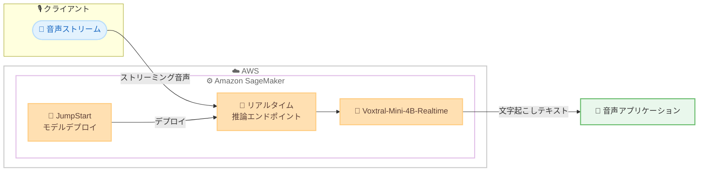

# Amazon SageMaker JumpStart - Voxtral-Mini-4B-Realtime

**リリース日**: 2026年7月13日
**サービス**: Amazon SageMaker JumpStart
**機能**: Voxtral-Mini-4B-Realtime-2602 によるリアルタイム音声文字起こし

📊 [このアップデートのインフォグラフィックを見る](https://takech9203.github.io/aws-news-summary/20260713-voxtral-mini-realtime-on-sagemaker-jumpstart.html)
<!-- INFOGRAPHIC_BASE_URL は環境変数から取得 -->

## 概要

AWS は、Mistral AI が開発したリアルタイム音声文字起こしモデル Voxtral-Mini-4B-Realtime-2602 が Amazon SageMaker JumpStart で利用可能になったことを発表しました。このモデルは多言語対応かつ低レイテンシーの音声アプリケーション構築を目的とした、リアルタイム音声文字起こしモデルです。

Voxtral-Mini-4B-Realtime は、音声からテキストへの高品質な文字起こしに優れており、ネイティブなストリーミングアーキテクチャによってリアルタイム文字起こしを実現します。13 の言語にわたる多言語文字起こしをサポートし、設定可能な文字起こし遅延 (transcription delay) を提供することで、ユーザーは自身のニーズに応じてレイテンシーと精度のバランスを調整できます。

このモデルは SageMaker Studio の Models セクションから数クリックでデプロイできるほか、SageMaker Python SDK を使用して AWS アカウント内にデプロイすることも可能です。これにより、音声認識機能を自社のインフラストラクチャ内で運用しながら、データのプライバシーとコントロールを維持できます。

**アップデート前の課題**

- 低レイテンシーのリアルタイム音声文字起こしを実現するには、専用のモデル選定やインフラ構築が必要だった
- 多言語対応のストリーミング文字起こしモデルを自社環境に容易にデプロイする手段が限られていた
- レイテンシーと精度のバランスを用途に応じて柔軟に調整することが難しかった

**アップデート後の改善**

- SageMaker JumpStart から数クリックで Voxtral-Mini-4B-Realtime をデプロイできるようになった
- ネイティブなストリーミングアーキテクチャにより、リアルタイムの音声文字起こしが可能になった
- 設定可能な文字起こし遅延によって、レイテンシーと精度のトレードオフを用途ごとに最適化できるようになった

## アーキテクチャ図



音声ストリームが SageMaker のリアルタイム推論エンドポイントに送信され、Voxtral-Mini-4B-Realtime モデルがストリーミングで文字起こしを行い、テキストを音声アプリケーションに返す流れを示しています。

## サービスアップデートの詳細

### 主要機能

1. **ネイティブストリーミングアーキテクチャによるリアルタイム文字起こし**
   - 音声を受信しながら逐次的にテキストを生成するストリーミング設計
   - 低レイテンシーの音声アプリケーションの構築に適している
   - 音声からテキストへの高品質な変換を実現

2. **多言語対応**
   - 13 の言語にわたる文字起こしをサポート
   - 多言語環境での音声認識ニーズに対応

3. **設定可能な文字起こし遅延 (transcription delay)**
   - レイテンシーと精度のバランスを用途に応じて調整可能
   - リアルタイム性を重視する用途と、精度を重視する用途の両方に対応

4. **SageMaker JumpStart からの容易なデプロイ**
   - SageMaker Studio の Models セクションから数クリックでデプロイ
   - SageMaker Python SDK を使用したプログラムによるデプロイにも対応

## 技術仕様

### モデル概要

| 項目 | 詳細 |
|------|------|
| モデル名 | Voxtral-Mini-4B-Realtime-2602 |
| 提供元 | Mistral AI |
| タイプ | 多言語リアルタイム音声文字起こしモデル |
| アーキテクチャ | ネイティブストリーミングアーキテクチャ |
| 対応言語数 | 13 言語 |
| 主な特徴 | 設定可能な文字起こし遅延によるレイテンシーと精度の調整 |
| デプロイ方法 | SageMaker Studio (Models セクション) または SageMaker Python SDK |

### API変更履歴

今回のアップデートに直接関連する AWS API の変更は確認されていません。SageMaker JumpStart のモデルデプロイは既存の SageMaker API を通じて行われます。

## 設定方法

### 前提条件

1. Amazon SageMaker が利用可能な AWS アカウント
2. SageMaker Studio へのアクセス、または SageMaker Python SDK を実行できる環境
3. モデルのデプロイに必要な IAM 権限とサービスクォータ (推論エンドポイント用インスタンス)

### 手順

#### ステップ1: SageMaker Studio からモデルを選択

SageMaker Studio を開き、Models (JumpStart) セクションから Voxtral-Mini-4B-Realtime-2602 を検索します。モデルの詳細ページで仕様やライセンス条件を確認します。

#### ステップ2: エンドポイントへのデプロイ

モデル詳細ページの Deploy ボタンからリアルタイム推論エンドポイントを作成します。数クリックでデプロイが開始され、エンドポイントが利用可能になります。

#### ステップ3: SageMaker Python SDK を使用したデプロイ (代替方法)

```python
from sagemaker.jumpstart.model import JumpStartModel

# Voxtral-Mini-4B-Realtime モデルを指定してデプロイ
model = JumpStartModel(model_id="<voxtral-mini-4b-realtime のモデルID>")
predictor = model.deploy()
```

上記のコードは、SageMaker Python SDK を使用して JumpStart から Voxtral-Mini-4B-Realtime モデルを取得し、リアルタイム推論エンドポイントにデプロイする例です。正確なモデル ID は SageMaker JumpStart のコンソールまたはドキュメントで確認してください。

## メリット

### ビジネス面

- **迅速な導入**: SageMaker JumpStart から数クリックでデプロイでき、音声認識機能を短期間で組み込める
- **多言語対応による市場拡大**: 13 言語をサポートし、グローバルな音声アプリケーションの構築を支援
- **データコントロール**: 自社の AWS アカウント内でモデルを運用でき、データのプライバシーとガバナンスを維持しやすい

### 技術面

- **低レイテンシー**: ネイティブストリーミングアーキテクチャによりリアルタイムの文字起こしを実現
- **柔軟なチューニング**: 設定可能な文字起こし遅延により、レイテンシーと精度のトレードオフを用途に応じて最適化
- **統合の容易さ**: SageMaker のエンドポイントとして提供されるため、既存の SageMaker ワークフローや MLOps と統合しやすい

## デメリット・制約事項

### 制限事項

- 推論エンドポイントを常時稼働させる場合、対応インスタンスの稼働時間に応じたコストが発生する
- 対応言語は 13 言語に限定される
- 具体的な対応インスタンスタイプや対応言語の一覧は公式発表では明示されておらず、SageMaker JumpStart のドキュメントでの確認が必要

### 考慮すべき点

- 文字起こし遅延の設定値は、リアルタイム性と精度の要件に応じて事前に検証することが望ましい
- ストリーミング推論のスループット要件に応じたインスタンスサイズとスケーリング設計が必要

## ユースケース

### ユースケース1: リアルタイム字幕生成

**シナリオ**: オンライン会議やライブ配信において、話者の音声を即座に文字起こしして字幕として表示したい。

**効果**: ネイティブストリーミングアーキテクチャにより低レイテンシーで字幕を生成でき、視聴者のアクセシビリティを向上させる。

### ユースケース2: 多言語コンタクトセンターの音声認識

**シナリオ**: 複数言語に対応するコンタクトセンターで、顧客との通話をリアルタイムに文字起こしし、応対支援や記録に活用したい。

**効果**: 13 言語の多言語文字起こしにより、グローバルな顧客対応をサポートし、通話内容の即時テキスト化を実現する。

### ユースケース3: 音声操作アプリケーション

**シナリオ**: 音声コマンドで操作するアプリケーションにおいて、ユーザーの発話を素早くテキスト化して後続処理につなげたい。

**効果**: 設定可能な文字起こし遅延によってレイテンシーを最適化し、応答性の高い音声インターフェースを構築できる。

## 料金

Voxtral-Mini-4B-Realtime 自体は SageMaker JumpStart を通じて提供されます。SageMaker のリアルタイム推論エンドポイントを使用する場合、デプロイ先のインスタンスタイプと稼働時間に基づいた Amazon SageMaker の料金が適用されます。具体的な料金は使用するインスタンスタイプによって異なるため、Amazon SageMaker の料金ページで確認してください。

## 利用可能リージョン

公式発表では具体的な対応リージョンは明示されていません。SageMaker JumpStart およびモデルの提供リージョンについては、Amazon SageMaker JumpStart のドキュメントおよびコンソールで最新情報を確認してください。

## 関連サービス・機能

- **Amazon SageMaker JumpStart**: 事前学習済みの基盤モデルを数クリックでデプロイ・ファインチューニングできる機能。本モデルの提供基盤
- **Amazon SageMaker Studio**: モデルの検索・デプロイ・管理を行う統合開発環境
- **Amazon Transcribe**: AWS のマネージド音声文字起こしサービス。フルマネージドで利用したい場合の代替選択肢

## 参考リンク

- 📊 [インフォグラフィック](https://takech9203.github.io/aws-news-summary/20260713-voxtral-mini-realtime-on-sagemaker-jumpstart.html)
- [公式発表 (What's New)](https://aws.amazon.com/about-aws/whats-new/2026/07/voxtral-mini-realtime-on-sagemaker-jumpstart/)
- [Amazon SageMaker JumpStart](https://aws.amazon.com/sagemaker/jumpstart/)
- [Amazon SageMaker 料金ページ](https://aws.amazon.com/sagemaker/pricing/)

## まとめ

Voxtral-Mini-4B-Realtime の SageMaker JumpStart への追加により、多言語かつ低レイテンシーのリアルタイム音声文字起こしを自社の AWS 環境内で容易に構築できるようになりました。字幕生成、コンタクトセンター、音声操作アプリケーションなど幅広い用途が想定されます。まずは SageMaker Studio からモデルをデプロイし、文字起こし遅延の設定を用途に合わせて検証することをおすすめします。
