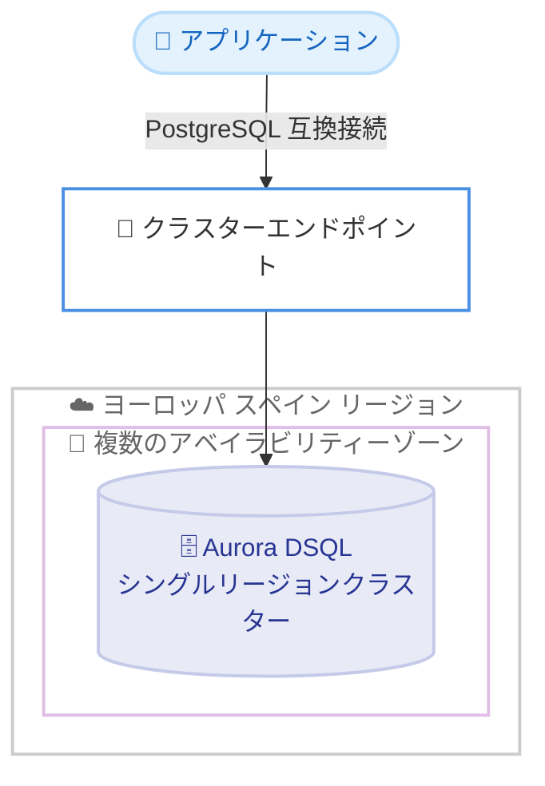

# Amazon Aurora DSQL - ヨーロッパ (スペイン) リージョンでの提供開始

**リリース日**: 2026 年 7 月 14 日
**サービス**: Amazon Aurora DSQL
**機能**: ヨーロッパ (スペイン) リージョンでのシングルリージョンクラスターの提供

📊 [このアップデートのインフォグラフィックを見る](https://takech9203.github.io/aws-news-summary/20260714-amazon-aurora-dsql-available-in-spain.html)
<!-- INFOGRAPHIC_BASE_URL は環境変数から取得 -->

## 概要

Amazon Aurora DSQL が、ヨーロッパ (スペイン) リージョンでシングルリージョンクラスターとして利用可能になりました。Aurora DSQL は、アクティブ - アクティブの高可用性とマルチリージョンでの強整合性を備えた、最速のサーバーレス分散型 SQL データベースです。

Aurora DSQL は、実質的に無制限のスケーラビリティ、最高水準の可用性、そしてインフラストラクチャ管理不要という特徴を備えており、常時稼働するアプリケーションの構築を可能にします。サーバーレスアーキテクチャにより、負荷に応じた自動的なスケーリングとレジリエンスの確保が容易になり、キャパシティのプロビジョニングやパッチ適用といった運用作業から解放されます。

今回のスペインリージョンへの拡大により、スペイン国内のデータレジデンシー要件を持つお客様や、イベリア半島およびその周辺地域でより低いレイテンシーを求めるお客様が、Aurora DSQL を活用できるようになりました。Aurora DSQL は AWS 無料利用枠 (AWS Free Tier) でも利用可能であり、コストをかけずに評価を開始できます。

**アップデート前の課題**

- スペインリージョンでは Aurora DSQL のシングルリージョンクラスターを利用できませんでした
- スペイン国内でのデータレジデンシー要件を持つお客様は、Aurora DSQL を要件に沿った形で利用することが困難でした
- イベリア半島周辺のユーザーに対して、より近いリージョンから低レイテンシーで分散型 SQL データベースを提供する選択肢が限られていました

**アップデート後の改善**

- ヨーロッパ (スペイン) リージョンで Aurora DSQL のシングルリージョンクラスターを作成できるようになりました
- スペイン国内のデータレジデンシー要件に対応した形で Aurora DSQL を利用できるようになりました
- 対象地域のユーザーに対して、より低いレイテンシーでサーバーレス分散型 SQL データベースを提供できるようになりました

## アーキテクチャ図

シングルリージョンクラスターは、単一リージョン内の複数のアベイラビリティーゾーンにまたがってデータを分散配置し、高い可用性を提供します。アプリケーションは PostgreSQL 互換のエンドポイント経由で接続します。

## サービスアップデートの詳細

### 主要機能

1. **サーバーレスアーキテクチャ**
   - キャパシティのプロビジョニングやインフラストラクチャ管理が不要です
   - ワークロードの需要に応じて自動的にスケールします
   - パッチ適用やメンテナンスは AWS が管理します

2. **高可用性と強整合性**
   - シングルリージョン構成では、複数のアベイラビリティーゾーンにまたがってデータを分散します
   - マルチリージョン構成では、アクティブ - アクティブの高可用性と強整合性を提供します
   - 読み取りと書き込みの両方で一貫したデータアクセスを実現します

3. **PostgreSQL 互換性**
   - PostgreSQL 互換のインターフェースを提供します
   - 既存の PostgreSQL エコシステムのツールやドライバーを活用できます

## 技術仕様

### 提供形態

| 項目 | 詳細 |
|------|------|
| クラスタータイプ | シングルリージョンクラスター (スペインリージョンで提供開始) |
| インターフェース | PostgreSQL 互換 |
| スケーリング | サーバーレス、自動スケーリング |
| 無料利用枠 | AWS 無料利用枠の対象 |

### API変更履歴

今回のアップデートはリージョン拡大が中心であり、公開された新規 API メソッドの追加は確認されていません。

## メリット

### ビジネス面

- **データレジデンシー対応**: スペイン国内のデータレジデンシー要件を持つ組織が、要件に沿った形で Aurora DSQL を利用できます
- **低レイテンシー**: 対象地域のエンドユーザーに対して、より近いリージョンから低レイテンシーでサービスを提供できます
- **コスト最適化**: AWS 無料利用枠を活用し、初期コストを抑えて評価と導入を進められます

### 技術面

- **運用負荷の軽減**: サーバーレスによりインフラ管理が不要で、運用チームの負担を軽減できます
- **高可用性**: 複数のアベイラビリティーゾーンにまたがるデータ分散により、高い可用性を実現できます
- **スケーラビリティ**: 実質的に無制限のスケーラビリティにより、需要の変動に柔軟に対応できます

## デメリット・制約事項

### 制限事項

- 今回スペインリージョンで提供されるのはシングルリージョンクラスターです
- Aurora DSQL は PostgreSQL 互換ですが、すべての PostgreSQL 機能が完全にサポートされるわけではないため、移行前に互換性の確認が必要です

### 考慮すべき点

- 既存の PostgreSQL アプリケーションを移行する場合は、対応している機能や構文を事前に検証してください
- マルチリージョン構成を利用する場合は、対象リージョンの組み合わせを確認してください

## ユースケース

### ユースケース1: スペイン国内のデータレジデンシー要件への対応

**シナリオ**: 金融や公共分野など、データをスペイン国内に保持する必要がある組織が、スケーラブルな SQL データベースを必要としています。

**効果**: スペインリージョンで Aurora DSQL を利用することで、データレジデンシー要件を満たしながら、サーバーレスのスケーラビリティと高可用性を活用できます。

### ユースケース2: 常時稼働型 Web アプリケーションのバックエンド

**シナリオ**: イベリア半島周辺のユーザーを対象とした Web アプリケーションで、高可用性と低レイテンシーが求められています。

**効果**: 対象地域に近いスペインリージョンで Aurora DSQL を稼働させることで、低レイテンシーとインフラ管理不要の運用を両立できます。

### ユースケース3: 変動するワークロードへの対応

**シナリオ**: トラフィックの増減が大きいアプリケーションで、キャパシティ管理の負担を減らしたいと考えています。

**効果**: サーバーレスの自動スケーリングにより、事前のキャパシティプロビジョニングなしで需要の変動に対応できます。

## 料金

Aurora DSQL は AWS 無料利用枠の対象であり、コストをかけずに利用を開始できます。無料利用枠の範囲を超えた場合の料金の詳細は、Aurora DSQL の料金ページを参照してください。

## 利用可能リージョン

今回の拡大により、Aurora DSQL は以下のリージョンで利用可能になりました。

- **米国**: 米国東部 (バージニア北部)、米国東部 (オハイオ)、米国西部 (オレゴン)
- **カナダ**: カナダ (中部)、カナダ西部 (カルガリー)
- **南米**: 南米 (サンパウロ)
- **ヨーロッパ**: ヨーロッパ (フランクフルト)、ヨーロッパ (アイルランド)、ヨーロッパ (ロンドン)、ヨーロッパ (パリ)、ヨーロッパ (スペイン)、ヨーロッパ (ストックホルム)
- **アジアパシフィック**: アジアパシフィック (香港)、アジアパシフィック (メルボルン)、アジアパシフィック (ムンバイ)、アジアパシフィック (大阪)、アジアパシフィック (ソウル)、アジアパシフィック (シンガポール)、アジアパシフィック (シドニー)、アジアパシフィック (東京)

## 関連サービス・機能

- **Amazon Aurora**: Aurora DSQL は Aurora ファミリーの分散型 SQL データベースオプションです
- **Amazon RDS for PostgreSQL**: PostgreSQL 互換のマネージドリレーショナルデータベースの選択肢です
- **AWS 無料利用枠 (AWS Free Tier)**: Aurora DSQL の評価に活用できます

## 参考リンク

- 📊 [インフォグラフィック](https://takech9203.github.io/aws-news-summary/20260714-amazon-aurora-dsql-available-in-spain.html)
- [公式発表 (What's New)](https://aws.amazon.com/about-aws/whats-new/2026/07/amazon-aurora-dsql-available-in-spain/)
- [Amazon Aurora DSQL 製品ページ](https://aws.amazon.com/rds/aurora/dsql/)
- [Amazon Aurora DSQL ドキュメント](https://docs.aws.amazon.com/aurora-dsql/)

## まとめ

Amazon Aurora DSQL のスペインリージョンへの拡大により、スペイン国内のデータレジデンシー要件を持つお客様や、対象地域で低レイテンシーを求めるお客様が、サーバーレス分散型 SQL データベースを活用できるようになりました。AWS 無料利用枠の対象でもあるため、まずは小規模なワークロードで評価を開始し、要件に合致する場合は本番ワークロードへの適用を検討することをおすすめします。
