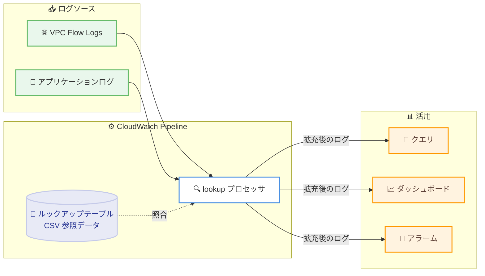

# Amazon CloudWatch - ログエンリッチメント向け lookup プロセッサ

**リリース日**: 2026年7月14日
**サービス**: Amazon CloudWatch
**機能**: lookup プロセッサ (Lookup Processor)

📊 [このアップデートのインフォグラフィックを見る](https://takech9203.github.io/aws-news-summary/20260714-amazon-cloudwatch-lookup-processor.html)
<!-- INFOGRAPHIC_BASE_URL は環境変数から取得 -->

## 概要

Amazon CloudWatch は、ログエンリッチメント向けの lookup プロセッサをサポートしました。この機能により、CloudWatch Pipeline 内でログイベントのフィールドをルックアップテーブルと照合し、追加のコンテキスト情報でログを拡充できます。ユーザーは参照データを含む CSV ファイルをアップロードし、受信するログのフィールドをそのデータと照合して、拡充されたメタデータを付与するようにパイプラインを構成します。

代表的な活用例として、IP アドレスをアプリケーションチームにマッピングし、VPC Flow Logs にチームの所有者情報をタグ付けするといったユースケースがあります。従来はこうしたエンリッチメント処理を CloudWatch の外部で独自に構築・維持する必要がありましたが、本機能によりその手間が不要になります。

エンリッチメントはログの取り込み時 (ingestion time) に実行されるため、クエリ、ダッシュボード、アラームがすぐに拡充後のコンテキストを利用できます。後処理を行うことなく、付与された情報を活用できる点が大きな価値です。

**アップデート前の課題**

- 以前はログにチーム名やアプリケーション情報などのコンテキストを付与するために、CloudWatch の外部で独自のエンリッチメントロジックを構築・維持する必要があった
- IP アドレスやユーザー ID などの識別子を、人間が理解しやすい情報に変換する処理をクエリ実行時やダッシュボード作成時に都度対応する必要があった
- 参照データとの照合を行うためのカスタムパイプラインやスクリプトの運用負荷が発生していた

**アップデート後の改善**

- CSV ファイルをアップロードするだけで、CloudWatch Pipeline 内でログフィールドと参照データの照合が可能になった
- 外部のエンリッチメントロジックの構築・維持が不要になった
- 取り込み時にエンリッチメントを実行するため、クエリ、ダッシュボード、アラームがすぐに拡充後のコンテキストを利用できるようになった

## アーキテクチャ図

取り込み時に lookup プロセッサが受信ログのフィールドを CSV のルックアップテーブルと照合し、拡充後のログをクエリやダッシュボード、アラームで即座に活用できることを示しています。

## サービスアップデートの詳細

### 主要機能

1. **CSV ベースのルックアップテーブル**
   - 参照データを含む CSV ファイルをアップロードして利用する
   - 例として、IP アドレスとアプリケーションチームの対応表などを登録できる
   - 一致した行から指定したフィールドが拡充メタデータとしてログに付与される

2. **CloudWatch Pipeline 内でのエンリッチメント**
   - 受信するログイベントのフィールドをルックアップテーブルと照合する
   - CloudWatch の外部で独自のエンリッチメントロジックを構築・維持する必要がない
   - パイプライン内で完結するため、運用の一元化が可能

3. **取り込み時のエンリッチメント**
   - ログの取り込み時にエンリッチメントを実行する
   - 後処理を行うことなく、クエリ、ダッシュボード、アラームがすぐに拡充後のコンテキストを利用できる

## 技術仕様

### 機能の概要

| 項目 | 詳細 |
|------|------|
| プロセッサ種別 | lookup プロセッサ (CloudWatch Pipeline のプロセッサ) |
| 参照データ形式 | CSV ファイル |
| 照合対象 | 受信ログのフィールドとルックアップテーブルの値 |
| エンリッチメント実行タイミング | ログの取り込み時 (ingestion time) |
| 設定方法 | AWS マネジメントコンソール、AWS CLI、AWS SDK |

### API変更履歴

本アップデートに関連する awsapichanges.com での API 変更情報は確認できませんでした。API 情報は今後反映される可能性があります。

## 設定方法

### 前提条件

1. Amazon CloudWatch pipelines をサポートするリージョンを利用していること
2. エンリッチメントに使用する参照データを CSV ファイルとして準備していること
3. CloudWatch Logs のパイプライン設定に必要な IAM 権限を保有していること

### 手順

#### ステップ1: 参照データの準備

エンリッチメントに使用する参照データを CSV 形式で用意します。例えば、IP アドレスとアプリケーションチームの対応表を作成し、各行に照合キーと付与したいフィールドを記述します。

#### ステップ2: CSV ファイルのアップロードとパイプラインの構成

AWS マネジメントコンソール、AWS CLI、または AWS SDK を使用して CSV ファイルをアップロードし、CloudWatch Pipeline に lookup プロセッサを追加します。受信ログのどのフィールドをルックアップテーブルと照合し、どのフィールドを拡充メタデータとして付与するかを設定します。

#### ステップ3: 拡充後ログの活用

パイプラインを有効化すると、取り込み時にログが拡充されます。拡充されたフィールドを使ってクエリ、ダッシュボード、アラームを作成し、付与されたコンテキストを活用します。

## メリット

### ビジネス面

- **運用負荷の削減**: 外部のエンリッチメントロジックを構築・維持する必要がなくなり、運用コストを削減できる
- **所有者の明確化**: IP アドレスとチームのマッピングにより、VPC Flow Logs にチームの所有者情報をタグ付けでき、責任の所在が明確になる
- **意思決定の迅速化**: 拡充後のコンテキストをすぐにダッシュボードやアラームで活用でき、状況把握が容易になる

### 技術面

- **一元化された処理**: CloudWatch Pipeline 内でエンリッチメントが完結し、アーキテクチャがシンプルになる
- **取り込み時の処理**: 後処理が不要で、クエリやアラームが即座に拡充後の情報を利用できる
- **柔軟な参照データ管理**: CSV ファイルの更新により、マッピングを柔軟に管理できる

## デメリット・制約事項

### 制限事項

- 参照データは CSV 形式で提供する必要がある
- CloudWatch pipelines をサポートするリージョンでのみ利用可能

### 考慮すべき点

- 参照データが変化する場合、CSV ファイルの更新運用を検討する必要がある
- CSV のサイズや行数などの制約については、公式ドキュメントで最新情報を確認することを推奨

## ユースケース

### ユースケース1: VPC Flow Logs へのチーム所有者情報のタグ付け

**シナリオ**: 大規模な組織で、複数のアプリケーションチームがそれぞれの IP アドレス範囲を利用している。VPC Flow Logs だけでは、どのトラフィックがどのチームに属するか判別が難しい。

**実装例**: IP アドレスとアプリケーションチームの対応表を CSV として用意し、lookup プロセッサで VPC Flow Logs の IP フィールドと照合してチーム名を付与する。

**効果**: トラフィックの所有者がログ上で明確になり、セキュリティ調査やコスト配賦が容易になる。

### ユースケース2: エラーコードの説明文への変換

**シナリオ**: アプリケーションログにエラーコードが記録されているが、コードのままではダッシュボードやアラームで意味を把握しづらい。

**実装例**: エラーコードと説明文の対応表を CSV として用意し、lookup プロセッサでログのエラーコードフィールドと照合して人間が理解しやすい説明文を付与する。

**効果**: ダッシュボードやアラームで直接エラー内容を把握でき、対応の迅速化につながる。

### ユースケース3: ユーザー ID からユーザー情報への拡充

**シナリオ**: ログにはユーザー ID のみが記録されており、分析時に追加のユーザー属性を確認するために別システムへの問い合わせが必要になっている。

**実装例**: ユーザー ID とユーザー属性 (部門、地域など) の対応表を CSV として用意し、lookup プロセッサでログのユーザー ID フィールドと照合して属性を付与する。

**効果**: ログ単体で分析が完結し、後処理や外部参照が不要になる。

## 料金

本アップデートの発表時点では、lookup プロセッサに関する個別の料金情報は公表されていません。CloudWatch pipelines やログ処理に関連する料金が適用される可能性があるため、最新の料金は公式の料金ページで確認することを推奨します。

## 利用可能リージョン

Amazon CloudWatch pipelines をサポートするすべての AWS 商用リージョンで利用可能です。

## 関連サービス・機能

- **Amazon CloudWatch Logs**: ログの収集・保存・分析基盤であり、パイプラインとプロセッサの実行基盤となる
- **CloudWatch Pipeline**: lookup プロセッサを含むログの変換・エンリッチメント処理を実行するパイプライン
- **Amazon VPC Flow Logs**: IP アドレスとチームのマッピングによるタグ付けの代表的な対象ログ

## 参考リンク

- 📊 [インフォグラフィック](https://takech9203.github.io/aws-news-summary/20260714-amazon-cloudwatch-lookup-processor.html)
- [公式発表 (What's New)](https://aws.amazon.com/about-aws/whats-new/2026/07/amazon-cloudwatch-lookup-processor/)
- [Amazon CloudWatch ドキュメント](https://docs.aws.amazon.com/cloudwatch/)
- [Amazon CloudWatch 料金ページ](https://aws.amazon.com/cloudwatch/pricing/)

## まとめ

Amazon CloudWatch の lookup プロセッサは、CSV ベースのルックアップテーブルを用いてログを取り込み時に拡充できる機能であり、外部のエンリッチメントロジックの構築・維持を不要にします。VPC Flow Logs へのチーム所有者情報のタグ付けやエラーコードの変換など、運用と分析の効率化に直結するため、CloudWatch でログ運用を行っているユーザーはパイプラインへの lookup プロセッサ導入を検討することを推奨します。
