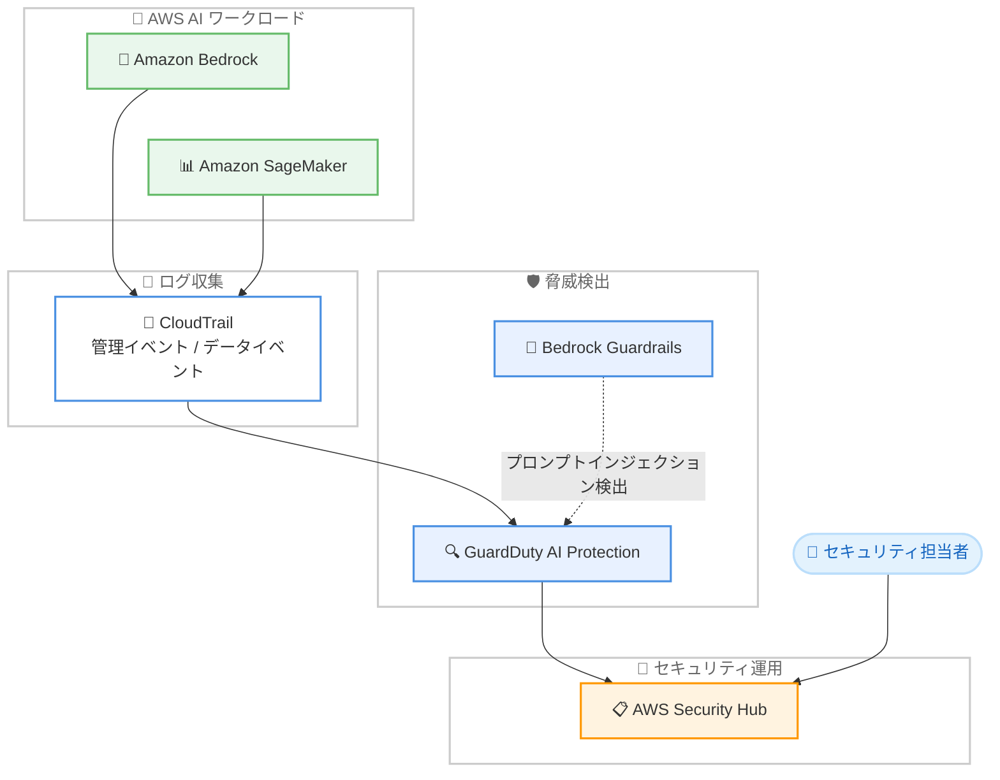

# Amazon GuardDuty - AI Protection

**リリース日**: 2026 年 7 月 14 日
**サービス**: Amazon GuardDuty
**機能**: Amazon GuardDuty AI Protection

📊 [このアップデートのインフォグラフィックを見る](https://takech9203.github.io/aws-news-summary/20260714-amazon-guardduty-ai-protection-aws.html)
<!-- INFOGRAPHIC_BASE_URL は環境変数から取得 -->

## 概要

Amazon GuardDuty は、脅威検出の対象を AWS の AI サービスにまで拡張する新機能 AI Protection を発表しました。この機能は、Amazon Bedrock や Amazon SageMaker を含む AWS AI ワークロードを対象に、脅威検出を提供します。生成 AI アプリケーションの本番利用が拡大するなか、AI ワークロード特有の攻撃を検出する仕組みを、既存の GuardDuty の運用モデルの中で提供する点が特徴です。

AI Protection は、異常なモデル呼び出しパターン、AI リソースに過剰な GPU 時間やトークンを消費させるコストハーベスティング攻撃 (cost harvesting attacks)、プロンプトインジェクションの試みを検出します。検出にあたっては AWS AI サービスの AWS CloudTrail 管理イベントおよびデータイベントを分析し、プロンプトインジェクションの検出には Amazon Bedrock Guardrails と連携します。検出結果 (findings) は AWS Security Hub に集約され、他のセキュリティ検出結果とあわせて優先順位付けと対応が可能になります。

この機能はエージェントの追加インストールやカスタムツールを必要とせず、GuardDuty または Security Hub のコンソールから数ステップで有効化できます。AWS Organizations を利用して組織全体のアカウントに対して一元的に有効化することも可能です。既存の GuardDuty をご利用中のお客様は、30 日間の無料トライアルで利用を開始できます。

**アップデート前の課題**

- 生成 AI ワークロード特有の脅威 (プロンプトインジェクション、コストハーベスティングなど) を GuardDuty で直接検出できませんでした
- AI サービスの CloudTrail ログを個別に分析し、異常なモデル呼び出しを検出する仕組みを独自に構築する必要がありました
- AI ワークロードのセキュリティ検出結果を他の脅威検出と統合的に管理する標準的な手段が限られていました

**アップデート後の改善**

- Amazon Bedrock と Amazon SageMaker を対象に、AI ワークロード特有の脅威を GuardDuty が自動的に検出できるようになりました
- エージェントのインストールやカスタムツールなしで、コンソールから数ステップで脅威検出を有効化できるようになりました
- 検出結果が AWS Security Hub に集約され、組織全体のセキュリティ検出結果と統合して管理できるようになりました

## アーキテクチャ図



AWS AI サービスの CloudTrail イベントを GuardDuty AI Protection が分析し、Bedrock Guardrails と連携してプロンプトインジェクションを検出します。検出結果は Security Hub に集約され、セキュリティ担当者が一元的に対応します。

## サービスアップデートの詳細

### 主要機能

1. **AI ワークロード特有の脅威検出**
   - 異常または通常とは異なるモデル呼び出しパターンを検出します
   - コストハーベスティング攻撃 (攻撃者が AI リソースに過剰な GPU 時間やトークンを消費させる攻撃) を検出します
   - プロンプトインジェクションの試みを検出します

2. **CloudTrail イベントの分析**
   - AWS AI サービスの CloudTrail 管理イベントとデータイベントの両方を分析します
   - 継続的にワークロードを監視し、手動設定やカスタムツールを必要としません
   - Amazon Bedrock と Amazon SageMaker を含む AWS AI ワークロードを対象とします

3. **Bedrock Guardrails および Security Hub との連携**
   - Amazon Bedrock Guardrails と連携してプロンプトインジェクションを検出します
   - 検出結果は AWS Security Hub に集約され、統合的な可視化と優先順位付けが可能です
   - GuardDuty または Security Hub のコンソールから有効化でき、AWS Organizations で組織全体に一元展開できます

## 技術仕様

### 検出対象と分析ソース

| 項目 | 詳細 |
|------|------|
| 対象サービス | Amazon Bedrock、Amazon SageMaker を含む AWS AI ワークロード |
| 検出する脅威 | 異常なモデル呼び出し、コストハーベスティング攻撃、プロンプトインジェクション |
| 分析ソース | AWS CloudTrail 管理イベントおよびデータイベント |
| 連携サービス | Amazon Bedrock Guardrails、AWS Security Hub、AWS Organizations |
| 有効化方法 | GuardDuty コンソール、Security Hub コンソール、AWS Organizations による一元管理 |
| 無料トライアル | 30 日間 |

### API 変更履歴

| 日付 | サービス | 変更内容 |
|------|----------|----------|
| 2026/07/13 | [guardduty](https://awsapichanges.com/archive/changes/d5dccf-guardduty.html) | 11 updated api methods - AI Protection が一般提供に。検出結果に Bedrock ガードレール情報、モデル情報、観測回数、継続スキャン情報が追加。`GuardrailArn` と `GuardrailVersion` は非推奨となり `guardrails` リストへ移行 |

AI Protection の有効化には、GuardDuty の Feature として `AI_PROTECTION` が追加されています。`CreateDetector` および `UpdateDetector` の `Features` パラメータで指定します。

### 機能の有効化 (API 例)

```json
{
  "Enable": true,
  "Features": [
    {
      "Name": "AI_PROTECTION",
      "Status": "ENABLED"
    }
  ]
}
```

## 設定方法

### 前提条件

1. Amazon GuardDuty が有効化されていること
2. 保護対象の AWS AI サービス (Amazon Bedrock、Amazon SageMaker) の CloudTrail イベントが記録されていること
3. プロンプトインジェクション検出を活用する場合は、Amazon Bedrock Guardrails を構成していること

### 手順

#### ステップ 1: GuardDuty コンソールで AI Protection を有効化

GuardDuty または Security Hub のコンソールを開き、AI Protection 機能を有効化します。エージェントのインストールやカスタムツールの構築は不要です。数ステップの操作で監視が開始されます。

#### ステップ 2: AWS Organizations による一元展開 (任意)

```bash
aws guardduty update-organization-configuration \
  --detector-id <detector-id> \
  --features '[{"Name":"AI_PROTECTION","AutoEnable":"ALL"}]'
```

このコマンドは、AWS Organizations 配下のすべてのアカウントで AI Protection を自動的に有効化する設定を適用します。組織全体で一貫した脅威検出を実現します。

#### ステップ 3: Security Hub で検出結果を確認

AI Protection の検出結果は AWS Security Hub に集約されます。Security Hub のコンソールで、他の脅威検出結果とあわせて優先順位付けと対応を行います。

## メリット

### ビジネス面

- **AI ワークロードのセキュリティ強化**: 生成 AI アプリケーションを本番利用する際のセキュリティリスクを、既存の運用モデルの中で管理できます
- **コスト保護**: コストハーベスティング攻撃を検出することで、AI リソースの不正な消費による予期しないコストを抑制できます
- **導入の容易さ**: 30 日間の無料トライアルで、追加コストなく効果を評価できます

### 技術面

- **エージェントレス**: エージェントのインストールやカスタムツールを必要とせず、運用負荷を抑えられます
- **統合的な可視化**: 検出結果が Security Hub に集約され、既存のセキュリティ運用に組み込めます
- **組織全体への展開**: AWS Organizations により、複数アカウントへ一元的に脅威検出を展開できます

## デメリット・制約事項

### 制限事項

- 対象サービスは Amazon Bedrock と Amazon SageMaker を含む AWS AI ワークロードです。詳細な対象範囲は最新の公式ドキュメントで確認してください
- 利用可能リージョンは AWS Regional Services List に記載された範囲に限定されます
- プロンプトインジェクションの検出には Amazon Bedrock Guardrails の構成が前提となります

### 考慮すべき点

- 無料トライアル終了後は GuardDuty AI Protection の料金が発生します。事前に料金体系を確認してください
- CloudTrail のデータイベント記録が有効になっている必要があるため、CloudTrail の設定とコストへの影響を確認してください
- `GuardrailArn` および `GuardrailVersion` は非推奨となり、`guardrails` リストへの移行が必要です

## ユースケース

### ユースケース1: 生成 AI アプリケーションのプロンプトインジェクション対策

**シナリオ**: Amazon Bedrock を利用したチャットボットを本番運用しており、悪意あるプロンプト注入による情報漏洩やモデルの不正操作を懸念している。

**実装例**:
```
1. Amazon Bedrock Guardrails を構成
2. GuardDuty AI Protection を有効化
3. Security Hub でプロンプトインジェクション検出結果を監視
```

**効果**: プロンプトインジェクションの試みを継続的に検出し、Security Hub 上で迅速に対応できます。

### ユースケース2: AI リソースのコストハーベスティング攻撃検出

**シナリオ**: SageMaker で推論エンドポイントを運用しており、認証情報の漏洩などにより攻撃者が GPU リソースを不正利用するリスクがある。

**実装例**:
```
1. GuardDuty AI Protection を有効化
2. 異常なモデル呼び出しパターンの検出結果を監視
3. コストハーベスティング攻撃の検出時にアラートを設定
```

**効果**: AI リソースの過剰な消費を早期に検知し、予期しないコスト発生を抑制できます。

### ユースケース3: マルチアカウント環境での一元的な AI セキュリティ管理

**シナリオ**: AWS Organizations で複数の開発チームが独自の AI ワークロードを運用しており、組織全体で一貫した脅威検出ポリシーを適用したい。

**実装例**:
```
1. 委任管理者アカウントで AI Protection を組織全体に自動有効化
2. 新規アカウントにも自動的に適用
3. Security Hub で組織全体の検出結果を集約管理
```

**効果**: 各アカウントで個別設定することなく、組織全体で統一された AI ワークロードの脅威検出を実現できます。

## 料金

Amazon GuardDuty AI Protection は、既存の GuardDuty をご利用中のお客様が利用でき、30 日間の無料トライアルが提供されます。トライアル期間中に利用量とコストを見積もることができます。詳細な料金は Amazon GuardDuty の料金ページを確認してください。

### 料金例

| 使用量 | 月額料金（概算） |
|--------|------------------|
| 30 日間の無料トライアル期間中 | 無料 |
| トライアル終了後 | 分析した CloudTrail イベント量に応じた従量課金 (料金ページ参照) |

## 利用可能リージョン

利用可能なリージョンの一覧は、AWS Regional Services List に記載されています。導入前に対象リージョンでのサポート状況を確認してください。

## 関連サービス・機能

- **Amazon Bedrock**: AI Protection の主要な保護対象サービス。Bedrock Guardrails との連携によりプロンプトインジェクションを検出します
- **Amazon SageMaker**: AI Protection の保護対象となる機械学習ワークロード
- **AWS Security Hub**: AI Protection の検出結果が集約され、統合的なセキュリティ運用を実現します
- **AWS Organizations**: 組織全体のアカウントへ AI Protection を一元的に展開します
- **AWS CloudTrail**: 管理イベントおよびデータイベントが AI Protection の分析ソースとなります

## 参考リンク

- 📊 [インフォグラフィック](https://takech9203.github.io/aws-news-summary/20260714-amazon-guardduty-ai-protection-aws.html)
- [公式発表 (What's New)](https://aws.amazon.com/about-aws/whats-new/2026/07/amazon-guardduty-ai-protection-aws/)
- [Amazon GuardDuty ドキュメント](https://docs.aws.amazon.com/guardduty/)
- [Amazon GuardDuty 料金ページ](https://aws.amazon.com/guardduty/pricing/)
- [API 変更履歴 (awsapichanges.com)](https://awsapichanges.com/archive/changes/d5dccf-guardduty.html)

## まとめ

Amazon GuardDuty AI Protection は、生成 AI ワークロードの本番利用が拡大するなかで高まる AI 特有の脅威 (プロンプトインジェクション、コストハーベスティング、異常なモデル呼び出し) を、エージェントレスで検出できる重要な機能です。既存の GuardDuty と Security Hub の運用に統合できるため、追加の運用負荷を抑えつつ AI セキュリティを強化できます。まずは 30 日間の無料トライアルで、自社の AI ワークロードに対する検出効果とコストを評価することを推奨します。
