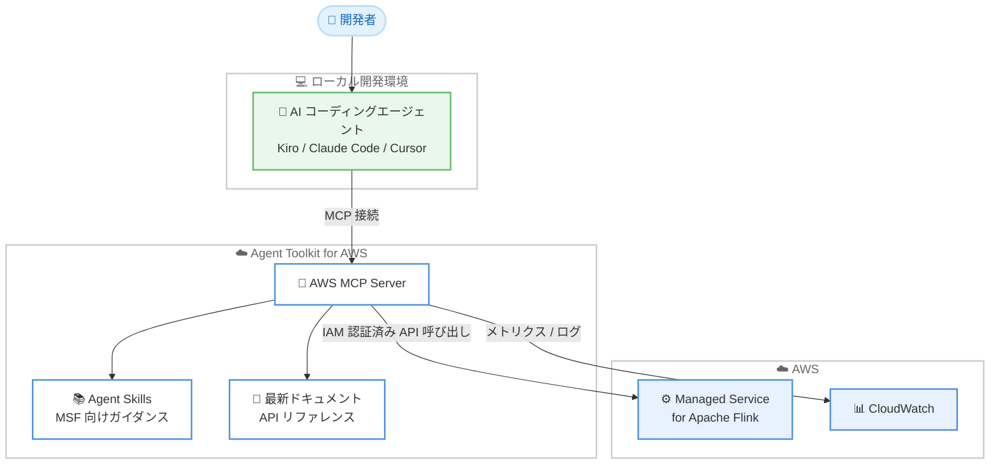

# Amazon Managed Service for Apache Flink - AI Agent Skills

**リリース日**: 2026年7月14日
**サービス**: Amazon Managed Service for Apache Flink
**機能**: AI Agent Skills (Agent Toolkit for AWS)

📊 [このアップデートのインフォグラフィックを見る](https://takech9203.github.io/aws-news-summary/20260714-amazon-managed-service-flink-agent-skills.html)
<!-- INFOGRAPHIC_BASE_URL は環境変数から取得 -->

## 概要

Amazon Managed Service for Apache Flink は、AI コーディングアシスタントに対して Flink アプリケーションの構築と運用に関する専門的で最新のガイダンスを提供する AI Agent Skills を新たに提供開始しました。この Skills は、アプリケーションの作成、トラブルシューティング、スケーリング、モニタリング、ネットワーク設定、コスト最適化といった一般的なタスクに対するガイダンスを提供します。

従来、Apache Flink を使ったストリーム処理アプリケーションの構築と運用には、Flink 固有の専門知識が必要でした。今回の AI Agent Skills により、これらのタスクがガイド付きのセルフサービス体験へと変わります。お客様は Flink アプリケーションを健全かつ高性能な状態に保ち、新しいストリーミングアプリケーションの開発を加速し、Flink 2.2 のような最新バージョンの Apache Flink へ容易にアップグレードできるようになります。

この機能は、Kiro、Claude Code、Cursor といった既存の AI コーディングエージェントで動作します。利用を開始するには、AWS CLI を使って Agent Toolkit for AWS を設定し、コーディングエージェントに質問するだけです。

**アップデート前の課題**

- Flink アプリケーションの作成やスケーリング、トラブルシューティングには Flink 固有の専門知識が必要だった
- AI コーディングエージェントは学習データが数か月から数年前のものであり、最新の Flink バージョンや Managed Service for Apache Flink の設定に関する正確なガイダンスを提供できないことがあった
- 複雑な多段階のワークフローでエージェントが誤った設定を行ったり、操作を繰り返し試行したりすることがあった

**アップデート後の改善**

- アプリケーション作成、トラブルシューティング、スケーリング、モニタリング、ネットワーク設定、コスト最適化に関する専門的なガイダンスをエージェント経由で得られるようになった
- Flink 2.2 など最新バージョンへのアップグレードが容易になった
- Kiro、Claude Code、Cursor など既存のコーディングエージェントをそのまま利用でき、新しいツールやワークフローを学ぶ必要がない

## アーキテクチャ図



開発者が AI コーディングエージェントに質問すると、エージェントは Agent Toolkit for AWS の AWS MCP Server を通じて MSF 向けの Agent Skills や最新ドキュメントを参照し、IAM 認証済みの API 呼び出しでアプリケーションの構築や運用を支援します。

## サービスアップデートの詳細

### 主要機能

1. **専門的なタスクガイダンス**
   - Flink アプリケーションの作成に関する手順を提供
   - トラブルシューティング、スケーリング、モニタリングのガイダンスを提供
   - ネットワーク設定とコスト最適化のベストプラクティスを提供

2. **最新バージョンへのアップグレード支援**
   - Flink 2.2 のような最新バージョンの Apache Flink へのアップグレードを容易化
   - アプリケーションを健全かつ高性能な状態に維持
   - 新しいストリーミングアプリケーションの開発を加速

3. **既存の AI コーディングエージェントとの連携**
   - Kiro、Claude Code、Cursor などの既存エージェントで動作
   - Agent Skills はオンデマンドで読み込まれ、タスクに関連するもののみを取得するため、不要なコンテキストを消費しない
   - AWS MCP Server を通じてドキュメント検索、API 呼び出し、スクリプト実行が可能

## 技術仕様

### Agent Toolkit for AWS の構成要素

| 項目 | 詳細 |
|------|------|
| AWS MCP Server | Model Context Protocol (MCP) を通じてエージェントに AWS へのアクセスを提供するマネージドサーバー。ドキュメント検索は認証不要、API 呼び出しは IAM 認証が必要 |
| Agent Skills | 特定の AWS タスクを完了するための手順、コードスクリプト、参照資料をまとめたキュレーション済みパッケージ。オンデマンドで読み込まれる |
| Plugins | Claude Code と Codex 向けの単一インストールパッケージ。Kiro は AWS MCP Server に直接接続するため不要 |
| Rules files | エージェントの動作に関するガードレールと設定を定義するプロジェクトレベルの設定ファイル |

### セキュリティと可視性

- AWS MCP Server はすべてのリクエストに 2 つのグローバル条件コンテキストキー (`aws:ViaAWSMCPService` と `aws:CalledViaAWSMCP`) を自動的に追加し、MCP 経由の操作を直接 API 呼び出しと区別できる
- 認証と認可には既存の AWS IAM ロールとポリシーを使用
- CloudTrail がすべての API 呼び出しをログに記録し、監査の可視性を確保
- エージェントには最小権限のみを付与する IAM ロールにスコープダウンすることが推奨される

## 設定方法

### 前提条件

1. Kiro、Claude Code、Cursor など MCP 対応の AI コーディングエージェントが利用可能であること
2. AWS CLI がインストールおよび設定されていること
3. Managed Service for Apache Flink を操作するための適切な IAM 権限を持つこと

### 手順

#### ステップ1: Agent Toolkit for AWS の設定

```bash
# AWS CLI を使用して Agent Toolkit for AWS を設定する
aws configure
```

AWS CLI で認証情報を設定し、Agent Toolkit for AWS がお客様の IAM 認証情報を使って AWS API を呼び出せるようにします。詳細な設定手順は Agent Toolkit for AWS のユーザーガイドを参照してください。

#### ステップ2: コーディングエージェントに質問する

```text
# エージェントへの質問例
How do I create a new Flink application on MSF?
My Flink application is unhealthy — what's wrong?
```

設定が完了したら、コーディングエージェントに Flink アプリケーションに関する質問を投げかけます。エージェントは Agent Skills を参照し、最新のガイダンスに基づいて回答や操作を支援します。

## メリット

### ビジネス面

- **開発の加速**: 新しいストリーミングアプリケーションの開発を専門知識に依存せずに進められる
- **運用負荷の軽減**: トラブルシューティングやコスト最適化のガイダンスにより、運用チームの負担を軽減
- **既存ツールの活用**: 開発者が使い慣れたコーディングエージェントをそのまま利用でき、学習コストを抑えられる

### 技術面

- **最新情報へのアクセス**: エージェントの学習データが古くても、最新の Flink バージョンや MSF の設定に関する正確なガイダンスを得られる
- **ベストプラクティスの適用**: スケーリング、モニタリング、ネットワーク設定のベストプラクティスに沿った構成が可能
- **セキュアな運用**: IAM ベースのアクセス制御と CloudTrail による監査ログで安全に運用できる

## デメリット・制約事項

### 制限事項

- 利用には Agent Toolkit for AWS の設定と、MCP 対応の AI コーディングエージェントが必要
- エージェントが API 呼び出しやスクリプト実行を行うには IAM 認証情報が必要

### 考慮すべき点

- エージェントに付与する IAM 権限は最小権限の原則に従って慎重にスコープダウンする必要がある
- AI エージェントが生成する提案や操作は、本番環境へ適用する前に内容を確認することが望ましい

## ユースケース

### ユースケース1: 新規 Flink アプリケーションの作成

**シナリオ**: Flink の専門知識が限られたチームが、新しいストリーム処理アプリケーションを構築したい

**実装例**:
```text
How do I create a new Flink application on MSF?
```

**効果**: エージェントが Agent Skills を参照し、アプリケーション作成の手順と適切な設定をガイドすることで、開発を迅速に開始できる

### ユースケース2: 不健全なアプリケーションのトラブルシューティング

**シナリオ**: 稼働中の Flink アプリケーションが不健全な状態になり、原因を特定したい

**実装例**:
```text
My Flink application is unhealthy — what's wrong?
```

**効果**: エージェントが CloudWatch のログとメトリクスを活用し、トラブルシューティング手順に沿って問題の原因究明を支援する

### ユースケース3: 最新バージョンへのアップグレード

**シナリオ**: 既存のアプリケーションを Flink 2.2 など最新バージョンへアップグレードしたい

**実装例**:
```text
How do I upgrade my Flink application to Flink 2.2?
```

**効果**: エージェントが最新のアップグレード手順に沿ってガイドし、アプリケーションを健全かつ高性能な状態に保ちながら移行できる

## 料金

Agent Toolkit for AWS は追加料金なしで利用できます。お客様はエージェントがプロビジョニングまたは操作した AWS リソースに対して、標準の AWS 料金のみを支払います。Managed Service for Apache Flink の利用料金は通常どおり発生します。

### 料金例

| 使用量 | 月額料金（概算） |
|--------|------------------|
| Agent Toolkit for AWS の利用 | 追加料金なし |
| Managed Service for Apache Flink | 標準の MSF 料金が適用 |

## 利用可能リージョン

公式発表ではリージョンに関する記載はありません。Managed Service for Apache Flink および Agent Toolkit for AWS の利用可能リージョンについては、公式ドキュメントを参照してください。

## 関連サービス・機能

- **Agent Toolkit for AWS**: AI コーディングエージェントに AWS 上でのアプリケーション構築、デプロイ、管理のためのツール、知識、ガードレールを提供する基盤
- **AWS MCP Server**: Model Context Protocol を通じてエージェントに AWS へのアクセスを提供するマネージドサーバー
- **Kiro**: AWS が提供する AI 搭載 IDE。AWS MCP Server に直接接続可能
- **Amazon CloudWatch**: エージェントの活動のモニタリングおよび Flink アプリケーションのログ / メトリクス分析に利用

## 参考リンク

- 📊 [インフォグラフィック](https://takech9203.github.io/aws-news-summary/20260714-amazon-managed-service-flink-agent-skills.html)
- [公式発表 (What's New)](https://aws.amazon.com/about-aws/whats-new/2026/07/amazon-managed-service-flink-agent-skills/)
- [Agent Toolkit for AWS とは](https://docs.aws.amazon.com/agent-toolkit/latest/userguide/what-is-agent-toolkit.html)
- [Agent Toolkit for AWS の AWS CLI 設定](https://docs.aws.amazon.com/agent-toolkit/latest/userguide/aws-cli.html)
- [Amazon Managed Service for Apache Flink](https://aws.amazon.com/managed-service-apache-flink/)

## まとめ

Amazon Managed Service for Apache Flink の AI Agent Skills は、Flink アプリケーションの構築と運用に必要だった専門知識をガイド付きのセルフサービス体験へと変える重要なアップデートです。Kiro、Claude Code、Cursor といった既存のコーディングエージェントをそのまま活用できるため、まずは Agent Toolkit for AWS を AWS CLI で設定し、実際に Flink アプリケーションに関する質問を試してみることを推奨します。
