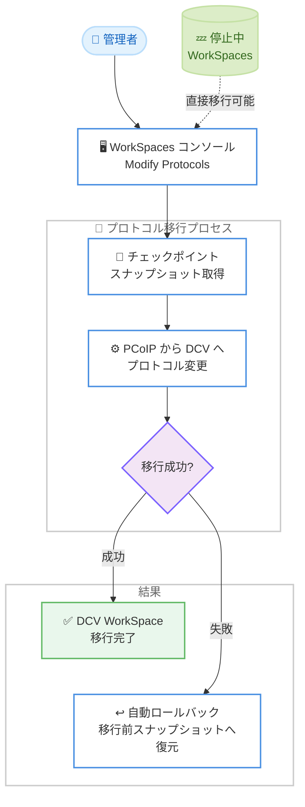

# Amazon WorkSpaces Personal - PCoIP から DCV への大規模プロトコル移行の簡素化

**リリース日**: 2026 年 7 月 14 日
**サービス**: Amazon WorkSpaces Personal
**機能**: PCoIP to DCV Protocol Migration (自動ロールバックと停止中 WorkSpaces のサポート)

📊 [このアップデートのインフォグラフィックを見る](https://takech9203.github.io/aws-news-summary/20260714-amazon-workspaces-personal-pcoip.html)

## 概要

Amazon WorkSpaces Personal は、PCoIP プロトコルから DCV プロトコルへの移行を大規模かつ効率的に実施するための新機能を追加した。今回のアップデートでは、プロトコル変更に失敗した際の自動ロールバックと、停止中 (Stopped) の WorkSpaces に対する移行開始のサポートが提供される。これらは、既存のコンソールベースの移行ワークフローとチェックポイントスナップショットのサポートを基盤としており、最小限の手作業で大規模な移行を実現する。

Amazon DCV は AWS が構築した高性能ストリーミングプロトコルであり、Amazon WorkSpaces サービスを支えている。DCV へ移行することで、より広範な OS サポート (Windows 11、Windows Server 2025)、証明書ベース認証、WebAuthN リダイレクション、そしてストリーミングパフォーマンスの向上といったメリットが得られる。

対象ユーザーは、既存の PCoIP ベースの WorkSpaces を運用しており、DCV への移行を計画している管理者である。特に、多数の WorkSpaces を抱える大規模環境において、移行作業の自動化と信頼性向上が大きな価値をもたらす。

**アップデート前の課題**

- プロトコル変更に失敗した場合、WorkSpace を手動で復旧させる必要があり、運用負荷とダウンタイムのリスクがあった
- 停止中の WorkSpaces を移行するには、事前に各 WorkSpace を起動する必要があり、大規模移行では時間とコストがかかった
- 大量の WorkSpaces を移行する際、失敗時のリカバリを個別に対応する必要があり、移行プロジェクトのスケールが困難だった

**アップデート後の改善**

- プロトコル変更に失敗した場合、移行前のスナップショットへ自動的にロールバックされ、手動介入なしで正常な状態に復帰する
- 停止中の WorkSpaces に対して直接移行を開始できるようになり、各 WorkSpace を起動する手間が不要になった
- 自動ロールバックと停止中 WorkSpaces のサポートにより、大規模移行を大幅に高速化できる

## アーキテクチャ図

管理者はコンソールから移行を開始し、チェックポイントスナップショットの取得後にプロトコル変更が実行される。失敗した場合は移行前のスナップショットへ自動的にロールバックされる。停止中の WorkSpaces も直接移行対象にできる。

## サービスアップデートの詳細

### 主要機能

1. **自動ロールバック (Automated Rollback)**
   - プロトコル変更に失敗した場合、WorkSpace は移行前のスナップショットへ自動的に復元される
   - 手動介入なしで既知の正常な状態 (known healthy state) に戻る
   - 移行失敗時のダウンタイムと復旧作業を最小化する

2. **停止中 WorkSpaces のサポート**
   - 管理者は停止中の WorkSpaces に対して直接移行を開始できる
   - 各 WorkSpace を事前に起動する必要がなくなる
   - 大規模移行の所要時間を大幅に短縮する

3. **既存機能を基盤とした大規模移行**
   - コンソールベースの移行ワークフローとチェックポイントスナップショットのサポートを基盤とする
   - 最小限の手作業で大規模な PCoIP から DCV への移行を実現する

## 技術仕様

### DCV プロトコル移行によるメリット

| 項目 | 詳細 |
|------|------|
| OS サポート拡大 | Windows 11、Windows Server 2025 に対応 |
| 認証 | 証明書ベース認証をサポート |
| デバイスリダイレクション | WebAuthN リダイレクションをサポート |
| ストリーミング | ストリーミングパフォーマンスの向上 |
| 失敗時の挙動 | 移行前スナップショットへの自動ロールバック |
| 移行対象の状態 | 稼働中および停止中の WorkSpaces |

### API変更履歴

今回のアップデートに直接対応する API 変更は確認されていない。移行操作は Amazon WorkSpaces コンソールおよび既存の `ModifyWorkspaceProperties` 関連 API を通じて実行される。

## 設定方法

### 前提条件

1. Amazon WorkSpaces Personal を利用していること
2. 移行対象が PCoIP プロトコルの WorkSpaces であること
3. WorkSpaces コンソールへのアクセス権限を持つ管理者であること

### 手順

#### ステップ1: WorkSpaces コンソールへのサインイン

Amazon WorkSpaces コンソールにサインインし、移行対象の WorkSpaces を選択する。停止中の WorkSpaces も選択可能である。

#### ステップ2: プロトコルの変更

コンソールの [Modify protocols] セクションから PCoIP から DCV へのプロトコル変更を開始する。移行開始時にチェックポイントスナップショットが自動的に取得される。

#### ステップ3: 移行結果の確認

移行が成功した場合、WorkSpace は DCV プロトコルで利用可能になる。失敗した場合は移行前スナップショットへ自動的にロールバックされるため、手動での復旧作業は不要である。詳細は Amazon WorkSpaces 管理ガイドの [Modify protocols] セクションを参照する。

## メリット

### ビジネス面

- **大規模移行の高速化**: 停止中 WorkSpaces の直接移行により、大量の WorkSpaces を効率的に移行できる
- **運用負荷の削減**: 移行失敗時の自動ロールバックにより、手動復旧作業とダウンタイムを削減する
- **移行プロジェクトの信頼性向上**: 既知の正常な状態への自動復帰により、移行リスクを低減する

### 技術面

- **最新 OS への対応**: DCV により Windows 11、Windows Server 2025 が利用可能になる
- **セキュリティ強化**: 証明書ベース認証と WebAuthN リダイレクションをサポートする
- **ユーザー体験の向上**: ストリーミングパフォーマンスが改善される

## デメリット・制約事項

### 制限事項

- 本機能は Amazon WorkSpaces Personal を対象とする
- 移行元は PCoIP プロトコルの WorkSpaces に限定される

### 考慮すべき点

- 移行前にチェックポイントスナップショットが取得されるため、ストレージの利用状況を確認する
- DCV クライアントの配布や、エンドユーザー環境の対応状況を事前に確認する
- 大規模移行を実施する前に、少数の WorkSpaces でテスト移行を行い、動作を検証することが推奨される

## ユースケース

### ユースケース1: 大規模環境での一括プロトコル移行

**シナリオ**: 数百台の PCoIP ベースの WorkSpaces を運用している企業が、DCV への一括移行を計画している。多くの WorkSpaces は業務時間外に停止されている。

**効果**: 停止中の WorkSpaces を直接移行できるため、各 WorkSpace を起動する必要がなく、移行作業を大幅に高速化できる。

### ユースケース2: 最新 Windows OS への対応

**シナリオ**: Windows 11 や Windows Server 2025 への対応が必要な組織が、PCoIP では利用できない最新 OS を導入したい。

**効果**: DCV への移行により、Windows 11 および Windows Server 2025 のサポートが得られ、最新 OS 環境へ移行できる。

### ユースケース3: 移行失敗リスクを抑えた段階的移行

**シナリオ**: 移行中の障害によるユーザー影響を最小化したい管理者が、慎重に移行を進めたい。

**効果**: 移行失敗時に自動ロールバックが働くため、手動介入なしで正常な状態へ復帰でき、移行リスクを抑えながら段階的に移行を進められる。

## 料金

本機能自体の追加料金に関する記載はない。Amazon WorkSpaces Personal の通常の料金体系が適用される。最新の料金情報は Amazon WorkSpaces の料金ページを参照する。

## 利用可能リージョン

Amazon WorkSpaces Personal がサポートされているすべての AWS 商用リージョンおよび AWS GovCloud (US) リージョンで利用可能である。

## 関連サービス・機能

- **Amazon DCV**: AWS が構築した高性能ストリーミングプロトコルで、Amazon WorkSpaces を支える基盤技術
- **Amazon WorkSpaces Personal**: 永続的な仮想デスクトップを提供するサービスで、今回のプロトコル移行機能の対象
- **チェックポイントスナップショット**: 移行前の状態を保存し、自動ロールバックを可能にする基盤機能

## 参考リンク

- 📊 [インフォグラフィック](https://takech9203.github.io/aws-news-summary/20260714-amazon-workspaces-personal-pcoip.html)
- [公式発表 (What's New)](https://aws.amazon.com/about-aws/whats-new/2026/07/amazon-workspaces-personal-pcoip/)
- [Amazon WorkSpaces 管理ガイド](https://docs.aws.amazon.com/workspaces/latest/adminguide/)
- [Amazon WorkSpaces 製品ページ](https://aws.amazon.com/workspaces/)

## まとめ

今回のアップデートは、PCoIP から DCV への移行における最大の課題であった大規模移行の効率と失敗時のリカバリを解決するものである。自動ロールバックと停止中 WorkSpaces のサポートにより、管理者は最小限の手作業で信頼性の高い移行を実施できる。PCoIP を利用している組織は、最新 OS サポートやセキュリティ強化のメリットを享受するため、DCV への移行計画を検討することが推奨される。
