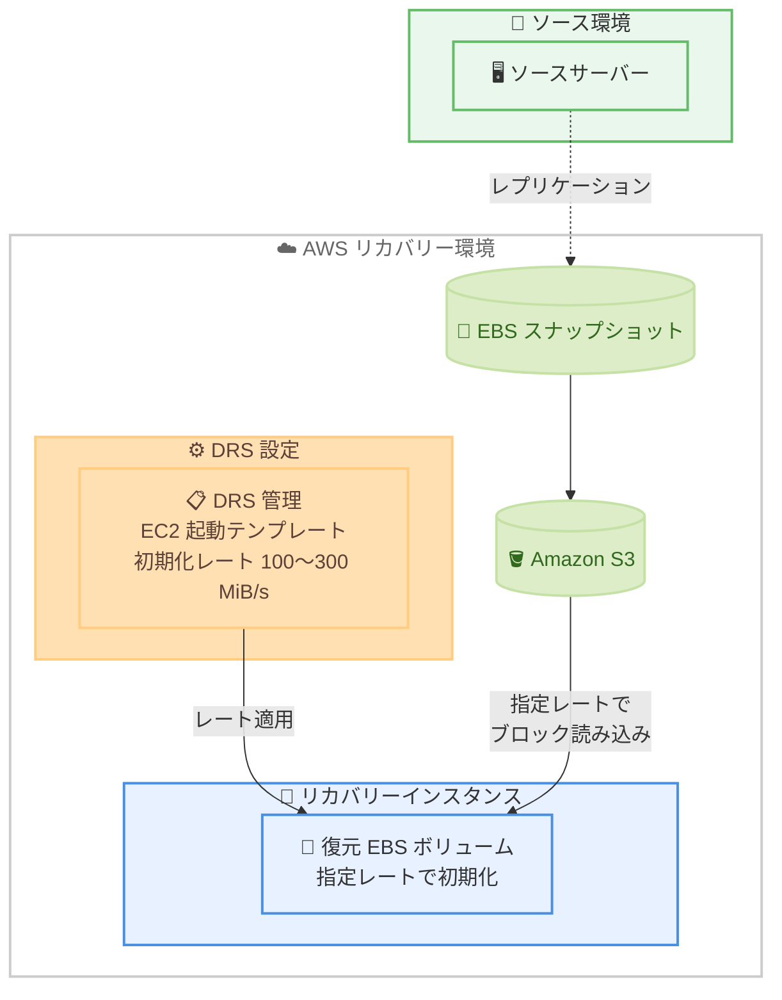

# AWS Elastic Disaster Recovery - Amazon EBS ボリューム初期化レートのサポート

**リリース日**: 2026 年 7 月 14 日
**サービス**: AWS Elastic Disaster Recovery (AWS DRS)
**機能**: Amazon EBS ボリューム初期化レート (Amazon EBS Provisioned Rate for Volume Initialization) のサポート

📊 [このアップデートのインフォグラフィックを見る](https://takech9203.github.io/aws-news-summary/20260714-aws-drs-fast-hydration.html)
<!-- INFOGRAPHIC_BASE_URL は環境変数から取得 -->

## 概要

AWS Elastic Disaster Recovery (AWS DRS) が、Amazon EBS ボリューム初期化レート (Amazon EBS Provisioned Rate for Volume Initialization) をサポートしました。この機能により、災害復旧のドリル (訓練) や実際のリカバリー時に、復元されたボリュームがより早くフルパフォーマンスに到達できるようになります。

DRS がスナップショットから EBS ボリュームを復元する際、データは Amazon S3 からバックグラウンドで読み込まれます。このため、まだ読み込まれていないブロックへの I/O は、初期化が完了するまで遅くなる可能性がありました。今回のアップデートでは、DRS が管理する EC2 起動テンプレートにボリューム初期化レートを設定でき、DRS がリカバリー時に自動的にそのレートを適用します。

この機能は、特にデータベースなどの I/O 負荷の高いワークロードにおいて価値があります。こうしたワークロードでは、目標復旧時間 (RTO) を達成するために、高速で一貫性のあるストレージパフォーマンスが不可欠です。料金は、フルスナップショットサイズと指定したレートに基づいて GB 単位で課金されます。

**アップデート前の課題**

- スナップショットから復元した EBS ボリュームは、初期化が完了するまで I/O レイテンシーが増加し、パフォーマンスが低下していた
- デフォルトの初期化レートは初期化プロセス中に変動するため、フルパフォーマンス到達までの時間が予測しにくかった
- I/O 負荷の高いデータベースなどのワークロードでは、リカバリー直後のパフォーマンス低下が RTO の達成を妨げる要因となっていた

**アップデート後の改善**

- DRS 管理の EC2 起動テンプレートにボリューム初期化レートを設定でき、リカバリー時に自動適用される
- スナップショットデータのサイズと指定レートに基づき、予測可能な時間でボリュームがフルパフォーマンスに到達する
- レートを一度設定すれば、DRS がライトサイジングやディスク変更などの更新を行っても設定が保持される

## アーキテクチャ図



DRS 管理の EC2 起動テンプレートに設定したボリューム初期化レートが、リカバリー時に S3 からのスナップショットブロック読み込みへ自動適用される流れを示しています。

## サービスアップデートの詳細

### 主要機能

1. **DRS 起動テンプレートへのレート設定**
   - DRS が管理する EC2 起動テンプレートにボリューム初期化レートを設定できる
   - リカバリー時に DRS がスナップショットからボリュームを作成する際、指定したレートを自動的に適用する
   - 設定は一度行えば、ライトサイジングやディスク変更などで DRS が起動テンプレートを更新しても保持される

2. **予測可能な初期化時間**
   - スナップショットデータのサイズと指定レートに基づき、フルパフォーマンス到達までの時間を予測できる
   - Amazon EBS は指定したレートの 10% 以内の平均レートを 99% の時間で提供する
   - 複数のボリュームを同時に復元する場合でも、予測可能な時間で初期化が完了する

3. **リカバリーをブロックしない設計**
   - 何らかの理由でレートを適用できない場合でも、レートなしでリカバリーが完了する
   - 初期化レートの適用失敗によってリカバリー自体が妨げられることはない

## 技術仕様

### ボリューム初期化レートの仕様

| 項目 | 詳細 |
|------|------|
| 指定可能なレート | 100〜300 MiB/s |
| 課金・時間の基準 | ボリュームサイズではなくスナップショットデータのサイズ |
| 精度 | 指定レートの 10% 以内の平均レートを 99% の時間で提供 |
| 累積レート上限 | 同時ボリューム作成リクエスト全体でリージョンあたり 5,000 MiB/s |
| 対応ボリュームタイプ | すべての EBS ボリュームタイプ |
| 非対応環境 | AWS Outposts、Local Zones、Wavelength Zones |

### 初期化時間の計算例

初期化時間は、スナップショットデータのサイズを指定レートで割ることで概算できます。

```text
例: 10 GiB のスナップショットデータを 300 MiB/s で初期化する場合
10 GiB (= 10,240 MiB) / 300 MiB/s ≒ 34.1 秒

同じスナップショットで 10 個のボリュームを同時に作成しても、
それぞれ約 34.1 秒でフル初期化が完了する。
```

## 設定方法

### 前提条件

1. AWS Elastic Disaster Recovery が設定され、ソースサーバーがレプリケーション済みであること
2. ボリューム初期化レートが提供されているリージョンおよび環境であること
3. DRS 管理の EC2 起動テンプレートを編集する権限を持っていること

### 手順

#### ステップ1: DRS 起動テンプレートを開く

AWS DRS コンソールでソースサーバーを選択し、そのサーバーに関連付けられた EC2 起動テンプレートの設定を開きます。この起動テンプレートは、リカバリー時に起動されるインスタンスとアタッチされる EBS ボリュームの構成を定義します。

#### ステップ2: ボリューム初期化レートを設定する

起動テンプレートの EBS ボリュームのブロックデバイスマッピングに対して、100〜300 MiB/s の範囲でボリューム初期化レートを指定します。この設定により、リカバリー時に作成されるボリュームへ指定レートが自動的に適用されます。

#### ステップ3: リカバリーまたはドリルを実行する

設定後、リカバリーまたはドリルを実行すると、DRS はスナップショットから EBS ボリュームを作成する際に指定したレートを適用します。これにより、S3 からのブロック読み込みが指定レートで行われ、予測可能な時間でボリュームがフルパフォーマンスに到達します。

## メリット

### ビジネス面

- **RTO の改善**: 復元されたボリュームが予測可能な時間でフルパフォーマンスに到達するため、目標復旧時間 (RTO) の達成が容易になる
- **ドリルの信頼性向上**: 災害復旧ドリルにおいて、リカバリー後のパフォーマンスを実運用に近い状態で検証できる
- **運用負荷の軽減**: 一度設定すればレートが保持されるため、テンプレート更新のたびに再設定する必要がない

### 技術面

- **I/O 集約型ワークロードへの最適化**: データベースなど、一貫したストレージパフォーマンスが必要なワークロードのリカバリー直後の性能低下を抑制できる
- **予測可能な初期化**: スナップショットデータサイズと指定レートから初期化完了時間を計算できる
- **同時復元時の一貫性**: 複数ボリュームを同時に復元しても、各ボリュームが予測可能な時間で初期化される

## デメリット・制約事項

### 制限事項

- 指定できるレートは 100〜300 MiB/s の範囲に限られる
- AWS Outposts、Local Zones、Wavelength Zones では初期化レートを指定できない
- 同時ボリューム作成リクエスト全体で、リージョンあたり 5,000 MiB/s の累積レート上限がある
- 高速スナップショット復元 (fast snapshot restore) が有効なスナップショットに初期化レートを指定した場合、fast snapshot restore ではなく指定レートが使用される

### 考慮すべき点

- 課金はフルスナップショットサイズと指定レートに基づくため、追加コストが発生する
- ボリューム初期化が完了する前にボリュームを削除しても、指定した初期化レート分の料金は課金される
- 容量制約やクォータ超過によりレートを適用できない場合、EBS 単体の作成リクエストは失敗するが、DRS 経由の場合はレートなしでリカバリーが継続される

## ユースケース

### ユースケース1: データベースワークロードの災害復旧

**シナリオ**: 大規模なリレーショナルデータベースを DRS で保護している。従来はリカバリー直後にボリューム初期化が完了するまでクエリレイテンシーが増大し、サービス再開後のパフォーマンスが不安定だった。

**実装例**:
```text
DRS 起動テンプレートのデータボリュームに 300 MiB/s の初期化レートを設定
→ リカバリー時にデータベースボリュームが最速レートで初期化される
```

**効果**: リカバリー直後から安定したストレージパフォーマンスを確保し、データベースの RTO を短縮できる。

### ユースケース2: 定期的な災害復旧ドリル

**シナリオ**: コンプライアンス要件で定期的な災害復旧ドリルを実施している。ドリルで測定したパフォーマンスが初期化の影響でばらつき、実際のリカバリー性能を正しく評価できなかった。

**実装例**:
```text
起動テンプレートに一定の初期化レートを設定
→ ドリルごとに予測可能で一貫したパフォーマンスを測定
```

**効果**: ドリル結果の再現性が向上し、実際のリカバリー性能をより正確に評価できる。

### ユースケース3: 複数サーバーの同時リカバリー

**シナリオ**: 障害発生時に多数のサーバーを同時にリカバリーする必要がある。各ボリュームの初期化完了時間が読めず、全体の復旧完了タイミングを見積もれなかった。

**実装例**:
```text
各サーバーの起動テンプレートに初期化レートを設定
（リージョンあたり累積 5,000 MiB/s の上限に注意）
→ スナップショットデータサイズとレートから完了時間を試算
```

**効果**: 全サーバーの初期化完了時間を予測でき、復旧計画の精度が向上する。

## 料金

ボリューム初期化レートを指定してボリュームを作成すると、スナップショットデータの GB 単位、かつ指定した初期化レートの MiB 単位あたりの料金が課金されます。料金はリージョンによって異なります。

課金の基準はボリュームサイズではなく、スナップショットデータのサイズです。たとえば 100 GiB のボリュームで実データが 50 GiB の場合、課金対象は 50 GiB のスナップショットデータとなります。

課金の計算式は以下のとおりです。

```text
リージョンごとのレート × スナップショットデータサイズ × ボリューム初期化レート
```

料金はボリュームが `active` 状態になった時点で全額が請求されます。失敗したリクエストは課金されません。また、初期化完了前にボリュームを削除した場合でも、指定した初期化レート分は課金されます。詳細は Amazon EBS の料金ページを参照してください。

## 利用可能リージョン

Amazon EBS ボリューム初期化レートが提供されているすべての AWS リージョンおよび環境で利用できます。

## 関連サービス・機能

- **Amazon EBS**: ボリューム初期化レートの基盤機能。DRS はこの EBS の Provisioned Rate for Volume Initialization を活用している
- **Amazon EC2**: DRS 管理の起動テンプレートでリカバリーインスタンスとボリューム構成を定義する
- **Amazon S3**: スナップショットデータが保存され、ボリューム初期化時にブロックが読み込まれる
- **EBS 高速スナップショット復元 (fast snapshot restore)**: 作成時に完全初期化する代替手段。初期化レートを指定した場合はこちらより優先される

## 参考リンク

- 📊 [インフォグラフィック](https://takech9203.github.io/aws-news-summary/20260714-aws-drs-fast-hydration.html)
- [公式発表 (What's New)](https://aws.amazon.com/about-aws/whats-new/2026/07/aws-drs-fast-hydration/)
- [Amazon EBS ボリュームの初期化 (ドキュメント)](https://docs.aws.amazon.com/ebs/latest/userguide/initalize-volume.html)
- [AWS Elastic Disaster Recovery ユーザーガイド](https://docs.aws.amazon.com/drs/latest/userguide/what-is-drs.html)
- [Amazon EBS 料金ページ](https://aws.amazon.com/ebs/pricing/)

## まとめ

このアップデートにより、AWS DRS でのリカバリーやドリルにおいて、復元された EBS ボリュームが予測可能な時間でフルパフォーマンスに到達できるようになりました。特にデータベースなど I/O 集約型ワークロードの RTO 改善に有効です。DRS を利用している場合は、重要なボリュームの起動テンプレートに初期化レートを設定し、追加コストとのバランスを考慮しながら災害復旧の信頼性向上を検討してください。
