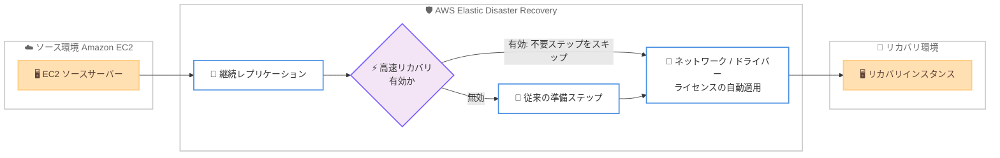

# AWS Elastic Disaster Recovery - AWS 間ワークロードのリカバリ時間短縮

**リリース日**: 2026 年 7 月 14 日
**サービス**: AWS Elastic Disaster Recovery (AWS DRS)
**機能**: AWS 間ワークロードの高速リカバリ

📊 [このアップデートのインフォグラフィックを見る](https://takech9203.github.io/aws-news-summary/20260714-aws-drs-fast-recovery.html)
<!-- INFOGRAPHIC_BASE_URL は環境変数から取得 -->

## 概要

AWS Elastic Disaster Recovery (AWS DRS) は、AWS 上で稼働するワークロードをより高速にリカバリできる機能の提供を開始しました。ソースサーバーが Amazon EC2 上で稼働している場合、DRS はこれらのワークロードにとって不要となった準備ステップをスキップできるようになり、リカバリ時間を Windows で最大 65%、Linux で最大 40% 短縮します。

AWS DRS は、オンプレミスやクラウド上のアプリケーションを AWS へレプリケーションし、災害発生時に AWS 上でリカバリインスタンスを起動する災害対策サービスです。リカバリ時、DRS はソースサーバーを AWS 上でネイティブに起動・実行できるように自動変換します。ソースサーバーがすでに AWS 上 (Amazon EC2) で稼働している場合、互換性のあるドライバーや構成をすでに備えているため、従来の変換準備ステップの一部が不要になります。

今回のアップデートでは、この不要な準備ステップをスキップすることで、AWS 間 (AWS-to-AWS) のリカバリを高速化します。ネットワーク、ドライバー、ライセンスの適用は引き続き自動で行われるため、リカバリインスタンスの正常な起動は担保されます。高速リカバリはアカウント全体、または個別のサーバー単位で有効化でき、設定はいつでも変更可能です。本機能は AWS DRS が提供されるすべての AWS リージョンで追加料金なしで利用できます。

**アップデート前の課題**

- 以前は、AWS 上 (Amazon EC2) で稼働しているソースサーバーであっても、オンプレミスからの移行を前提とした変換準備ステップがすべて実行されていた
- 以前は、AWS 間ワークロードにとって不要なステップが含まれることで、リカバリ完了までに余分な時間がかかっていた
- 以前は、リカバリ時間を短縮するための細かな制御手段が限られていた

**アップデート後の改善**

- 今回のアップデートにより、Amazon EC2 上で稼働するソースサーバーで不要な準備ステップをスキップできるようになった
- 今回のアップデートにより、リカバリ時間が Windows で最大 65%、Linux で最大 40% 短縮された
- 今回のアップデートにより、高速リカバリをアカウント全体または個別サーバー単位で柔軟に有効化できるようになった

## アーキテクチャ図

高速リカバリが有効な場合、AWS 間ワークロードに不要な準備ステップをスキップし、ネットワーク・ドライバー・ライセンスなどの必須処理のみを自動適用してリカバリインスタンスを起動する流れを示しています。

## サービスアップデートの詳細

### 主要機能

1. **不要な準備ステップのスキップ**
   - Amazon EC2 上で稼働するソースサーバーに対して、AWS 間ワークロードでは不要となる準備ステップをスキップする
   - AWS 上のワークロードはすでに互換性のあるドライバーや構成を備えているため、より少ないステップで起動できる
   - リカバリ時間を Windows で最大 65%、Linux で最大 40% 短縮する

2. **必須処理の自動適用の継続**
   - ネットワーク、ドライバー、ライセンスの適用は引き続き自動で行われる
   - 準備ステップの一部をスキップしても、リカバリインスタンスの正常な起動を担保する
   - リカバリ後の運用に必要な構成は維持される

3. **柔軟な有効化制御**
   - 高速リカバリをアカウント全体で一括有効化できる
   - 個別のサーバー単位でも有効化できる
   - 設定はいつでも変更可能で、リカバリ動作を柔軟に制御できる

## 技術仕様

### 機能概要

| 項目 | 詳細 |
|------|------|
| 対象サービス | AWS Elastic Disaster Recovery (AWS DRS) |
| 対象ワークロード | Amazon EC2 上で稼働するソースサーバー (AWS 間リカバリ) |
| リカバリ時間短縮 | Windows: 最大 65%、Linux: 最大 40% |
| スキップ対象 | AWS 間ワークロードに不要な準備ステップ |
| 自動適用が継続される処理 | ネットワーク、ドライバー、ライセンス |
| 有効化範囲 | アカウント全体 または 個別サーバー単位 |
| 設定変更 | いつでも変更可能 |
| 利用可能リージョン | AWS DRS が提供されるすべての AWS リージョン |
| 追加料金 | なし |

## 設定方法

### 前提条件

1. AWS Elastic Disaster Recovery が利用可能なリージョンでセットアップ済みであること
2. ソースサーバーが Amazon EC2 上で稼働していること (AWS 間リカバリのシナリオ)
3. AWS DRS の設定を変更する権限を持つ IAM 権限があること

### 手順

#### ステップ1: 高速リカバリの有効化範囲を決定

アカウント全体で一括して高速リカバリを有効化するか、個別のサーバー単位で有効化するかを決定します。この判断により、リカバリ動作を適用する範囲を定義します。

#### ステップ2: 高速リカバリの有効化

AWS DRS のコンソールまたは API を通じて、対象範囲に対して高速リカバリを有効化します。この操作により、Amazon EC2 上のソースサーバーで不要な準備ステップがスキップされるようになります。

#### ステップ3: リカバリドリルによる検証

有効化後、非破壊的なリカバリドリルを実施し、リカバリインスタンスが正常に起動することを確認します。ネットワーク、ドライバー、ライセンスが自動適用されていることを検証し、想定どおりの動作であることを確認します。

## メリット

### ビジネス面

- **ダウンタイムの短縮**: リカバリ時間を Windows で最大 65%、Linux で最大 40% 短縮でき、災害発生時の事業影響を抑えられる
- **RTO の改善**: 目標復旧時間 (RTO) を短縮でき、より厳しい可用性要件に対応しやすくなる
- **追加コストなし**: 追加料金なしで利用できるため、コストを増やさずにリカバリ性能を向上できる

### 技術面

- **効率的なリカバリ**: AWS 間ワークロードに不要なステップを省くことで、リカバリプロセスを効率化できる
- **信頼性の維持**: ネットワーク、ドライバー、ライセンスの自動適用が継続されるため、高速化してもリカバリの信頼性を維持できる
- **柔軟な制御**: アカウント全体または個別サーバー単位で有効化でき、環境に応じた制御が可能

## デメリット・制約事項

### 制限事項

- 高速リカバリの効果は、Amazon EC2 上で稼働するソースサーバー (AWS 間リカバリ) を対象とする
- リカバリ時間の短縮率 (Windows 最大 65%、Linux 最大 40%) は最大値であり、実際の短縮率は環境によって異なる
- オンプレミスからのリカバリなど、AWS 間以外のシナリオでは本機能の効果は限定的である

### 考慮すべき点

- 高速リカバリを有効化した後は、リカバリドリルで動作を検証することが推奨される
- 有効化範囲 (アカウント全体か個別サーバーか) は、環境の構成や運用方針に応じて選択する必要がある
- 設定はいつでも変更可能なため、要件に応じて有効・無効を切り替えられる

## ユースケース

### ユースケース1: AWS 内でのリージョン間災害対策

**シナリオ**: あるリージョンで稼働する Amazon EC2 ワークロードを、別のリージョンへ AWS DRS でレプリケーションし、災害発生時に迅速にリカバリする。

**効果**: 高速リカバリにより、リカバリインスタンスの起動時間を短縮し、RTO を改善できる。

### ユースケース2: Windows ワークロードの迅速な復旧

**シナリオ**: リカバリ時間が長くなりがちな Windows ベースのワークロードを AWS DRS で保護する。

**効果**: Windows で最大 65% のリカバリ時間短縮により、業務システムの停止時間を大幅に削減できる。

### ユースケース3: 大規模環境での一括最適化

**シナリオ**: 多数の EC2 ソースサーバーを保護している環境で、リカバリ性能を全体的に最適化したい。

**効果**: アカウント全体で高速リカバリを一括有効化することで、環境全体のリカバリ時間を効率的に短縮できる。

## 料金

本機能は追加料金なしで利用できます。AWS Elastic Disaster Recovery の利用には、レプリケーションに使用するステージングエリアのストレージやコンピューティングリソース、リカバリインスタンスの起動などに応じた通常の料金が適用されます。詳細は AWS Elastic Disaster Recovery の料金ページを参照してください。

## 利用可能リージョン

本機能は AWS Elastic Disaster Recovery が提供されるすべての AWS リージョンで利用できます。

## 関連サービス・機能

- **Amazon EC2**: 本機能の対象となる AWS 間ワークロードのソースサーバーおよびリカバリインスタンスの実行基盤となる
- **AWS Elastic Disaster Recovery (AWS DRS)**: 継続的なデータレプリケーションとリカバリインスタンスの起動を担う災害対策サービス
- **AWS Regions**: リージョン間でのレプリケーションとリカバリにより、地理的に離れた場所での災害対策を実現する

## 参考リンク

- 📊 [インフォグラフィック](https://takech9203.github.io/aws-news-summary/20260714-aws-drs-fast-recovery.html)
- [公式発表 (What's New)](https://aws.amazon.com/about-aws/whats-new/2026/07/aws-drs-fast-recovery/)
- [AWS Elastic Disaster Recovery ドキュメント](https://docs.aws.amazon.com/drs/)
- [AWS Elastic Disaster Recovery 料金ページ](https://aws.amazon.com/disaster-recovery/pricing/)

## まとめ

このアップデートにより、AWS Elastic Disaster Recovery は Amazon EC2 上で稼働する AWS 間ワークロードのリカバリ時間を Windows で最大 65%、Linux で最大 40% 短縮できるようになりました。ネットワーク、ドライバー、ライセンスの自動適用は継続されるため、信頼性を維持したままリカバリを高速化できます。AWS 内でリージョン間の災害対策を構築している場合は、追加料金なしで利用できる高速リカバリを有効化し、RTO の改善を検討することを推奨します。
