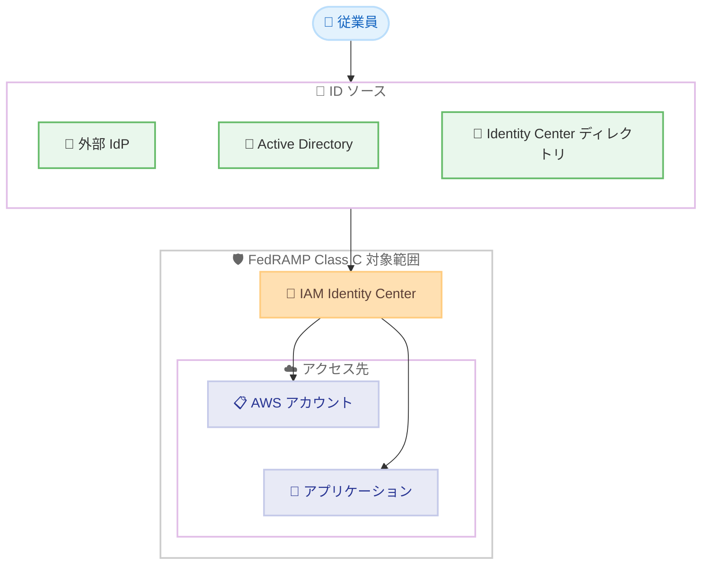

# AWS IAM Identity Center - FedRAMP Class C 認証取得

**リリース日**: 2026 年 7 月 14 日
**サービス**: AWS IAM Identity Center
**機能**: FedRAMP Class C コンプライアンス対応

📊 [このアップデートのインフォグラフィックを見る](https://takech9203.github.io/aws-news-summary/20260714-aws-identity-center-fedramp.html)
<!-- INFOGRAPHIC_BASE_URL は環境変数から取得 -->

## 概要

AWS IAM Identity Center が、米国の 4 つのリージョンにおいて FedRAMP (Federal Risk and Authorization Management Program) Class C の対象サービスになりました。対象リージョンは、米国東部 (オハイオ)、米国東部 (バージニア北部)、米国西部 (北カリフォルニア)、米国西部 (オレゴン) です。

FedRAMP は、クラウド製品およびサービスのセキュリティ評価、認証、継続的なモニタリングに標準的なアプローチを提供する、米国政府全体のプログラムです。今回の対応により、FedRAMP Class C のコンプライアンス要件が適用されるワークロードにおいて、AWS アカウントおよびアプリケーションへの従業員アクセスの管理に AWS IAM Identity Center を利用できるようになりました。

このアップデートは、米国連邦政府機関や、公共部門と取引を行う組織、規制対象のワークロードを運用する組織にとって重要です。AWS は、従業員が AWS リソースにアクセスする際の管理ツールとして IAM Identity Center を推奨しています。

**アップデート前の課題**

FedRAMP Class C のコンプライアンス境界内で作業する組織は、次のような課題に直面していました。

- FedRAMP Class C の対象範囲に含まれないサービスは、コンプライアンス要件が適用されるワークロードで利用できなかった
- 従業員のアクセス管理において、コンプライアンス認証済みのアクセス管理基盤を選択する必要があった
- 対象範囲外のサービスを使用する場合、追加のリスク評価や代替手段の検討が必要だった

**アップデート後の改善**

今回のアップデートにより、次のことが可能になりました。

- FedRAMP Class C のコンプライアンス要件が適用される AWS アカウントおよびアプリケーションへの従業員アクセスを IAM Identity Center で管理できるようになった
- 対象 4 リージョンにおいて、認証済みサービスとして IAM Identity Center を利用できるようになった
- コンプライアンス境界内で一元的な ID とアクセス管理を実現できるようになった

## アーキテクチャ図

従業員は各種 ID ソースを通じて IAM Identity Center で認証し、FedRAMP Class C の対象範囲内にある AWS アカウントおよびアプリケーションへアクセスします。

## サービスアップデートの詳細

### 主要機能

1. **FedRAMP Class C 対象範囲への追加**
   - AWS IAM Identity Center が FedRAMP Class C の対象サービスになった
   - コンプライアンス要件が適用されるワークロードでの利用が可能になった
   - 対象リージョンは米国の 4 リージョン

2. **従業員アクセスの一元管理**
   - AWS アカウントおよびアプリケーションへの従業員アクセスを一元的に管理
   - FedRAMP Class C のコンプライアンス境界内での ID とアクセス管理を実現
   - AWS が推奨する従業員アクセス管理ツールとして利用可能

3. **継続的なコンプライアンスモニタリング**
   - FedRAMP プログラムに基づくセキュリティ評価と継続的なモニタリングの対象
   - AWS Artifact を通じてコンプライアンスレポートを取得可能

## 技術仕様

### 対応リージョン一覧

| リージョン | リージョンコード |
|------|------|
| 米国東部 (オハイオ) | us-east-2 |
| 米国東部 (バージニア北部) | us-east-1 |
| 米国西部 (北カリフォルニア) | us-west-1 |
| 米国西部 (オレゴン) | us-west-2 |

### コンプライアンス情報

| 項目 | 詳細 |
|------|------|
| コンプライアンスプログラム | FedRAMP Class C |
| 対象サービス | AWS IAM Identity Center |
| 主管プログラム | 米国政府全体のクラウドセキュリティプログラム |
| 対象範囲の確認方法 | AWS Services in Scope ページで確認可能 |

### API 変更履歴

今回のアップデートはコンプライアンス認証の取得であり、API の変更はありません。

## 設定方法

### 前提条件

1. 対象 4 リージョンのいずれかで AWS Organizations が有効化されていること
2. IAM Identity Center を有効化する権限を持つ管理者アカウントがあること
3. FedRAMP Class C のコンプライアンス要件を理解していること

### 手順

#### ステップ 1: IAM Identity Center の有効化

対象リージョンで AWS IAM Identity Center を有効化します。マネジメントコンソールの IAM Identity Center から有効化するか、AWS Organizations の管理アカウントで有効化します。有効化により、組織全体の従業員アクセス管理基盤が構築されます。

#### ステップ 2: ID ソースの設定

外部 ID プロバイダー、Active Directory、または IAM Identity Center のディレクトリを ID ソースとして設定します。この設定により、従業員の認証情報を一元管理し、シングルサインオンを実現します。

#### ステップ 3: コンプライアンスレポートの取得

AWS Artifact から FedRAMP 関連のコンプライアンスレポートを取得し、対象範囲を確認します。これにより、組織のコンプライアンス要件に対する適合状況を確認できます。

## メリット

### ビジネス面

- **コンプライアンス要件への適合**: FedRAMP Class C の要件が適用されるワークロードで IAM Identity Center を利用でき、規制対応の選択肢が広がる
- **公共部門への対応**: 米国連邦政府機関や公共部門と取引を行う組織が、認証済みのアクセス管理基盤を利用できる
- **監査対応の簡素化**: FedRAMP プログラムに基づく継続的なモニタリングにより、監査対応の負担が軽減される

### 技術面

- **一元的なアクセス管理**: 複数の AWS アカウントとアプリケーションへの従業員アクセスを一元管理できる
- **既存 ID ソースとの統合**: 外部 IdP や Active Directory と統合し、既存の ID 基盤を活用できる
- **リージョン選択の柔軟性**: 米国の 4 リージョンで利用でき、可用性と冗長性の設計が可能

## デメリット・制約事項

### 制限事項

- 対象リージョンは米国の 4 リージョンに限定される
- FedRAMP Class C の対象範囲は特定のコンプライアンス要件に対応するものであり、他のコンプライアンスプログラムは別途確認が必要
- コンプライアンス境界内でのサービス利用には、対象範囲に含まれるサービスの組み合わせが必要

### 考慮すべき点

- 組織のワークロードが FedRAMP Class C のどの要件に該当するかを事前に確認する必要がある
- 対象範囲外のリージョンでは、このコンプライアンス認証は適用されない
- 最新の対象範囲は AWS Services in Scope ページで確認することが推奨される

## ユースケース

### ユースケース 1: 連邦政府機関のワークロード管理

**シナリオ**: 米国連邦政府機関が、FedRAMP Class C の要件が適用されるワークロードを AWS 上で運用しており、複数のアカウントへの職員アクセスを管理する必要がある。

**効果**: IAM Identity Center を利用することで、コンプライアンス要件を満たしながら、職員のアクセスを一元管理できる。

### ユースケース 2: 公共部門取引企業のアクセス統制

**シナリオ**: 公共部門と取引を行う民間企業が、規制対象のプロジェクトで AWS アカウントとアプリケーションへのアクセスを統制する必要がある。

**効果**: 認証済みのアクセス管理基盤を利用することで、コンプライアンス要件への適合を示しやすくなり、契約要件を満たせる。

### ユースケース 3: マルチアカウント環境の ID 統合

**シナリオ**: 規制対象のワークロードを複数の AWS アカウントで運用する組織が、外部 IdP と統合したシングルサインオンを実現したい。

**効果**: IAM Identity Center を通じて既存の ID ソースを統合し、コンプライアンス境界内で一貫したアクセス管理を実現できる。

## 料金

AWS IAM Identity Center は追加料金なしで利用できます。今回の FedRAMP Class C 対応による追加費用は発生しません。詳細は AWS IAM Identity Center の公式ページを参照してください。

## 利用可能リージョン

今回の FedRAMP Class C 対応は、以下の 4 リージョンで利用可能です。

- 米国東部 (オハイオ)
- 米国東部 (バージニア北部)
- 米国西部 (北カリフォルニア)
- 米国西部 (オレゴン)

## 関連サービス・機能

- **AWS Organizations**: IAM Identity Center は AWS Organizations と連携し、マルチアカウント環境で従業員アクセスを管理する
- **AWS Artifact**: FedRAMP を含むコンプライアンスレポートを取得し、対象範囲を確認できる
- **AWS IAM**: リソースへのアクセス許可を定義し、IAM Identity Center と組み合わせてアクセス管理を実現する

## 参考リンク

- 📊 [インフォグラフィック](https://takech9203.github.io/aws-news-summary/20260714-aws-identity-center-fedramp.html)
- [公式発表 (What's New)](https://aws.amazon.com/about-aws/whats-new/2026/07/aws-identity-center-fedramp/)
- [AWS IAM Identity Center](https://aws.amazon.com/iam/identity-center/)
- [FedRAMP コンプライアンス](https://aws.amazon.com/compliance/fedramp/)
- [AWS Services in Scope](https://aws.amazon.com/compliance/services-in-scope/)
- [ドキュメント (ユーザーガイド)](https://docs.aws.amazon.com/singlesignon/latest/userguide/what-is.html)

## まとめ

AWS IAM Identity Center が米国の 4 リージョンで FedRAMP Class C の対象サービスになったことで、規制対象のワークロードにおける従業員アクセス管理の選択肢が広がりました。米国連邦政府機関や公共部門と取引を行う組織は、AWS Artifact でコンプライアンスレポートを確認し、コンプライアンス境界内での IAM Identity Center の活用を検討することが推奨されます。
