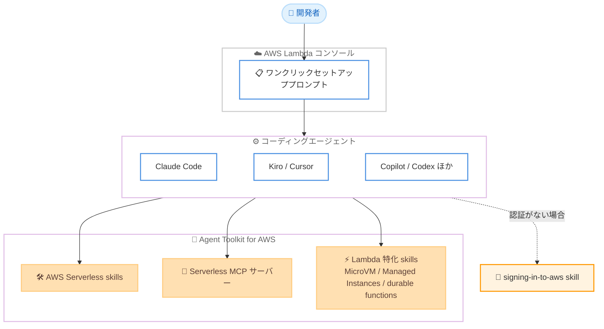

# AWS Lambda - コーディングエージェント向けワンクリックセットアッププロンプト

**リリース日**: 2026年7月14日
**サービス**: AWS Lambda
**機能**: コーディングエージェント向けワンクリックセットアッププロンプト

📊 [このアップデートのインフォグラフィックを見る](https://takech9203.github.io/aws-news-summary/20260714-aws-lambda-prompt-coding-agents.html)
<!-- INFOGRAPHIC_BASE_URL は環境変数から取得 -->

## 概要

AWS Lambda コンソールに、コーディングエージェントをワンクリックでセットアップするためのプロンプトが追加されました。このプロンプトは、開発者が利用しているコーディングエージェントに対して、AWS Serverless skills と Serverless Model Context Protocol (MCP) サーバーを構成し、開発の最初からサーバーレスのベストプラクティスを組み込みます。

この機能は、Lambda コンソールにおいて開発者が Lambda を使い始めるあらゆる場所で利用できます。プロンプトはコーディングエージェントに対して、Agent Toolkit for AWS でホストされている AWS Serverless skills と Serverless MCP サーバーのインストールを指示します。あわせて、Claude Code、Kiro、Cursor、GitHub Copilot、Codex、Devin Desktop、OpenCode 向けのインストールコマンドを含む Lambda エージェントセットアップガイドを参照します。

このプロンプトには、MicroVM、Managed Instances、durable functions という 3 つの特化した Lambda skills も含まれます。開発者がローカルで AWS 認証を行っていない場合、プロンプトは signing-in-to-aws skill を使用して接続を案内します。開発者が個別にドキュメントを探し回ることなく、サーバーレス開発に最適化されたエージェント環境を短時間で整えられる点が主要な価値です。

**アップデート前の課題**

このアップデート以前、コーディングエージェントをサーバーレス開発向けに構成するには手間がかかりました。

- 以前はサーバーレス向けにエージェントを構成する際、複数のドキュメントページを探し回る必要があった
- 以前はエージェントに AWS Serverless skills や MCP サーバーを手動で導入する必要があった
- 以前はサーバーレスのベストプラクティスを開発の初期段階から一貫して適用することが難しかった

**アップデート後の改善**

今回のアップデートにより、セットアップの手間が大幅に軽減されました。

- 今回のアップデートにより、Lambda コンソールからワンクリックでエージェントのセットアッププロンプトを取得できるようになった
- 今回のアップデートにより、AWS Serverless skills と Serverless MCP サーバーの導入手順を個別に調べる必要がなくなった
- 今回のアップデートにより、サーバーレスのベストプラクティスを開発の最初から組み込めるようになった

## アーキテクチャ図

Lambda コンソールのプロンプトがコーディングエージェントを構成し、Agent Toolkit for AWS 上の skills と Serverless MCP サーバーを導入する流れを示しています。

## サービスアップデートの詳細

### 主要機能

1. **ワンクリックセットアッププロンプト**
   - Lambda コンソール上で、開発者が Lambda を使い始めるあらゆる場所に表示される
   - コーディングエージェントに対して AWS Serverless skills と Serverless MCP サーバーの導入を指示する
   - サーバーレスのベストプラクティスを開発の最初から組み込む

2. **幅広いコーディングエージェントへの対応**
   - Claude Code、Kiro、Cursor、GitHub Copilot、Codex、Devin Desktop、OpenCode 向けのインストールコマンドを含む Lambda エージェントセットアップガイドを参照する
   - 各エージェントに適したセットアップ手順を提供する

3. **Lambda 特化の skills と認証支援**
   - MicroVM、Managed Instances、durable functions という 3 つの特化した Lambda skills を含む
   - 開発者がローカルで AWS 認証を行っていない場合、signing-in-to-aws skill を使用して接続を案内する

## 技術仕様

### 導入されるコンポーネント

| 項目 | 詳細 |
|------|------|
| AWS Serverless skills | Agent Toolkit for AWS でホストされるサーバーレス開発向けの skills |
| Serverless MCP サーバー | Model Context Protocol に準拠したサーバーレス開発支援サーバー |
| Lambda 特化 skills | MicroVM、Managed Instances、durable functions の 3 種類 |
| 認証支援 skill | signing-in-to-aws skill (ローカル認証がない場合に利用) |

### 対応コーディングエージェント

| エージェント | 提供内容 |
|------|------|
| Claude Code | インストールコマンドをセットアップガイドで提供 |
| Kiro | インストールコマンドをセットアップガイドで提供 |
| Cursor | インストールコマンドをセットアップガイドで提供 |
| GitHub Copilot | インストールコマンドをセットアップガイドで提供 |
| Codex | インストールコマンドをセットアップガイドで提供 |
| Devin Desktop | インストールコマンドをセットアップガイドで提供 |
| OpenCode | インストールコマンドをセットアップガイドで提供 |

## 設定方法

### 前提条件

1. AWS Lambda を利用可能なリージョンで AWS アカウントを保有していること
2. サポート対象のコーディングエージェント (Claude Code、Kiro、Cursor、GitHub Copilot、Codex、Devin Desktop、OpenCode のいずれか) を利用していること
3. ローカル環境で AWS 認証が構成されていること (未構成の場合はプロンプトが案内)

### 手順

#### ステップ1: Lambda コンソールでプロンプトを取得

AWS Lambda コンソールにアクセスし、表示されるワンクリックセットアッププロンプトを取得します。このプロンプトは、Lambda を使い始めるあらゆる場所に表示されます。

#### ステップ2: コーディングエージェントにプロンプトを渡す

取得したプロンプトを利用中のコーディングエージェントに渡します。プロンプトはエージェントに対して、Agent Toolkit for AWS 上の AWS Serverless skills と Serverless MCP サーバーのインストールを指示します。

#### ステップ3: 認証と skills の導入

ローカルで AWS 認証が行われていない場合、プロンプトは signing-in-to-aws skill を用いて接続を案内します。あわせて MicroVM、Managed Instances、durable functions の 3 つの Lambda 特化 skills が導入され、サーバーレス開発の準備が整います。

## メリット

### ビジネス面

- **オンボーディングの短縮**: 開発者がサーバーレス開発を始めるまでの準備時間を削減できる
- **ベストプラクティスの標準化**: 開発の最初からサーバーレスのベストプラクティスをエージェントに組み込める
- **幅広い選択肢**: 主要な 7 つのコーディングエージェントに対応し、既存のツール環境を活かせる

### 技術面

- **手動セットアップの排除**: skills と MCP サーバーの導入手順を個別に調べる必要がない
- **一貫した構成**: Agent Toolkit for AWS を基盤とした統一的なセットアップが可能
- **認証支援の統合**: ローカル認証がない場合でも signing-in-to-aws skill が接続を案内する

## デメリット・制約事項

### 制限事項

- 中東 (バーレーン) および中東 (アラブ首長国連邦) リージョンでは利用できない
- Lambda が提供されていないリージョンでは利用できない
- 対応コーディングエージェントは記載の 7 種類に限られる

### 考慮すべき点

- コーディングエージェントの導入・利用にあたっては各エージェント側の要件を満たす必要がある
- ローカル環境の AWS 認証設定が別途必要となる場合がある

## ユースケース

### ユースケース1: サーバーレス開発の新規オンボーディング

**シナリオ**: サーバーレス開発を始めるチームが、コーディングエージェントを短時間で構成したい。

**効果**: Lambda コンソールのプロンプトをエージェントに渡すだけで、Serverless skills と MCP サーバーが導入され、準備時間を短縮できる。

### ユースケース2: 既存エージェントへのベストプラクティス組み込み

**シナリオ**: すでに Cursor や GitHub Copilot などを利用している開発者が、サーバーレスのベストプラクティスを取り込みたい。

**効果**: プロンプトを通じて AWS Serverless skills が導入され、開発の初期段階からベストプラクティスが適用される。

### ユースケース3: 特化した Lambda 機能の活用

**シナリオ**: MicroVM や durable functions などの Lambda 特化機能を活用した開発を行いたい。

**効果**: 3 つの Lambda 特化 skills が導入され、エージェントがこれらの機能に関する支援を提供できるようになる。

## 料金

公式発表では、本機能に関する追加料金についての記載はありません。Lambda 本体の利用料金や、各コーディングエージェントの利用にかかる費用については、それぞれのサービスの料金体系に従います。

## 利用可能リージョン

中東 (バーレーン) および中東 (アラブ首長国連邦) を除くすべての商用 AWS リージョン、および Lambda が利用可能な AWS GovCloud (US) リージョンで利用できます。

## 関連サービス・機能

- **Agent Toolkit for AWS**: AWS Serverless skills をホストする基盤
- **Model Context Protocol (MCP)**: Serverless MCP サーバーが準拠するプロトコル
- **AWS Lambda**: 本プロンプトが対象とするサーバーレスコンピューティングサービス

## 参考リンク

- 📊 [インフォグラフィック](https://takech9203.github.io/aws-news-summary/20260714-aws-lambda-prompt-coding-agents.html)
- [公式発表 (What's New)](https://aws.amazon.com/about-aws/whats-new/2026/07/aws-lambda-prompt-coding-agents/)
- [AWS Lambda 公式ページ](https://aws.amazon.com/lambda/)

## まとめ

このアップデートは、コーディングエージェントを利用したサーバーレス開発のオンボーディングを大幅に簡素化するものです。Lambda コンソールからのワンクリックプロンプトにより、主要な 7 つのコーディングエージェントに対して Serverless skills と MCP サーバーを簡単に導入できます。サーバーレス開発でコーディングエージェントを活用しているチームは、対応エージェントを確認したうえで、このセットアッププロンプトの活用を検討することをおすすめします。
