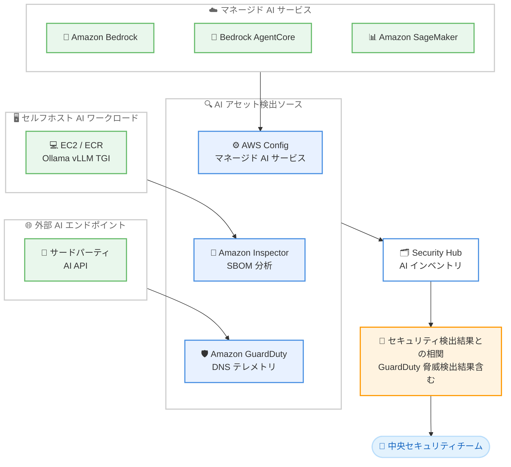

# AWS Security Hub - AI インベントリ

**リリース日**: 2026年7月14日
**サービス**: AWS Security Hub
**機能**: AI インベントリ (AI Inventory)

📊 [このアップデートのインフォグラフィックを見る](https://takech9203.github.io/aws-news-summary/20260714-aws-security-hub-ai.html)
<!-- INFOGRAPHIC_BASE_URL は環境変数から取得 -->

## 概要

AWS Security Hub に AI インベントリ機能が追加されました。この機能により、中央のセキュリティチームは組織全体の AI アセットとそのセキュリティ体制を継続的に更新される単一のビューで把握できるようになります。

生成 AI の普及に伴い、AI エージェント、モデル、パイプラインが組織内で急速にデプロイされる一方で、セキュリティチームはどこにどのような AI アセットが存在するのかを把握しきれないという課題を抱えていました。AWS が指摘するとおり、「組織は存在を認識していないものを保護することはできない」という状況です。AI インベントリは、3 つの検出方法を通じて AI ワークロードを自動的に検出しカタログ化することで、この可視性のギャップを解消します。

検出された各 AI アセットは基盤となるインフラストラクチャにマッピングされ、GuardDuty の脅威検出結果を含む AWS のセキュリティスタック全体のセキュリティ検出結果と相関付けられます。これにより、セキュリティチームはアカウント、リソースタイプ、検出方法、特定のモデル ID による絞り込み、グループ化、クエリが可能になり、実際に脅威にさらされ組織リスクの高いワークロードを優先して対応できます。この機能は Security Hub Essentials に追加費用なしで含まれ、新たな有効化は不要です。

**アップデート前の課題**

- 組織内にどのような AI アセット (モデル、エージェント、推論エンドポイント) が存在するのか、セキュリティチームが一元的に把握する手段がなかった
- セルフホスト型の AI ワークロードや外部の AI API 呼び出しなど、AWS マネージドサービス以外の AI 利用状況を検出することが困難だった
- AI アセットとセキュリティ検出結果を関連付けて、どのワークロードが実際にリスクにさらされているかを判断できなかった

**アップデート後の改善**

- 3 つの検出方法により、マネージドサービス、セルフホスト、外部 API の AI アセットを組織全体で自動的に検出できるようになった
- 検出された AI アセットが基盤インフラストラクチャにマッピングされ、GuardDuty を含むセキュリティ検出結果と相関付けられるようになった
- Security Hub Essentials に追加費用なしで含まれ、新たな有効化なしで利用できるようになった

## アーキテクチャ図

3 つの検出ソースが各種の AI アセットを検出し、Security Hub の AI インベントリに集約された後、セキュリティ検出結果と相関付けられて中央セキュリティチームに提供される流れを示しています。

## サービスアップデートの詳細

### 主要機能

1. **マネージド AI サービスの検出**
   - AWS Config のリソース情報を利用して、Amazon Bedrock、Bedrock AgentCore、Amazon SageMaker のマネージド AI サービスをインベントリ化する
   - 追加設定なしで検出が可能
   - AWS が管理する AI サービスの利用状況を組織全体で把握できる

2. **セルフホスト AI ワークロードの検出**
   - Amazon Inspector の拡張された SBOM (ソフトウェア部品表) 分析を利用する
   - EC2 インスタンスおよび ECR コンテナイメージ上の推論エンドポイント、モデル、AI エージェントを識別する
   - Ollama、vLLM、Hugging Face TGI などのフレームワークに対応する

3. **外部 AI エンドポイントの検出**
   - Amazon GuardDuty の DNS テレメトリを活用する
   - EC2 インスタンスからアクセスされる外部の AI API エンドポイント (サードパーティのモデルプロバイダー呼び出しなど) を検出する
   - これまで把握できていなかったサードパーティの AI 依存関係を可視化する

4. **セキュリティ検出結果との相関とクエリ**
   - 検出された各 AI アセットを基盤インフラストラクチャにマッピングする
   - GuardDuty の脅威検出結果を含む AWS セキュリティスタック全体の検出結果と相関付ける
   - アカウント、リソースタイプ、検出方法、特定のモデル ID による絞り込み、グループ化、クエリが可能

## 技術仕様

### 検出方法の比較

| 検出方法 | 利用サービス | 検出対象 |
|------|------|------|
| マネージド AI サービス | AWS Config | Amazon Bedrock、Bedrock AgentCore、Amazon SageMaker |
| セルフホストワークロード | Amazon Inspector (SBOM 分析) | EC2 / ECR 上の推論エンドポイント、モデル、AI エージェント (Ollama、vLLM、Hugging Face TGI など) |
| 外部 AI エンドポイント | Amazon GuardDuty (DNS テレメトリ) | 外部のサードパーティ AI API エンドポイント |

### クエリ・フィルタリング項目

| 項目 | 説明 |
|------|------|
| アカウント | AWS アカウント単位で AI アセットを絞り込む |
| リソースタイプ | AI アセットの種類 (モデル、エージェント、推論エンドポイントなど) で絞り込む |
| 検出方法 | 3 つの検出方法のいずれかで絞り込む |
| モデル ID | 特定のモデル ID で絞り込む |

## メリット

### ビジネス面

- **AI ガバナンスの強化**: 組織全体の AI 利用状況を一元的に把握でき、シャドー AI の検出やコンプライアンス対応を強化できる
- **追加コストなし**: Security Hub Essentials に含まれ、追加費用なしで利用できる
- **迅速な導入**: 新たな有効化が不要で、既存の Security Hub 環境ですぐに利用できる

### 技術面

- **包括的な検出**: マネージドサービス、セルフホスト、外部 API の 3 つの経路をカバーし、AI アセットの検出漏れを削減する
- **リスクベースの優先順位付け**: セキュリティ検出結果との相関により、実際に脅威にさらされているワークロードを優先して対応できる
- **既存サービスの活用**: AWS Config、Amazon Inspector、Amazon GuardDuty の既存テレメトリを活用し、追加のエージェント導入を必要としない

## デメリット・制約事項

### 制限事項

- セルフホストワークロードの検出には Amazon Inspector、外部エンドポイントの検出には Amazon GuardDuty のテレメトリが必要となるため、これらのサービスが有効化されていることが前提となる
- 検出対象のフレームワークは Ollama、vLLM、Hugging Face TGI などが挙げられているが、すべての AI フレームワークを網羅するとは限らない
- 外部 AI エンドポイントの検出は EC2 インスタンスからの DNS テレメトリに基づくため、他の経路からのアクセスは検出範囲外となる可能性がある

### 考慮すべき点

- 完全な可視性を得るには、AWS Config、Amazon Inspector、Amazon GuardDuty を組織全体で適切に構成することが望ましい
- 検出された AI アセットの対応優先順位付けには、セキュリティ検出結果との相関を活用する運用プロセスの整備が求められる

## ユースケース

### ユースケース1: シャドー AI の検出

**シナリオ**: 開発チームが独自に EC2 上で vLLM や Ollama を用いた推論エンドポイントを立ち上げているが、セキュリティチームがその存在を把握していない。

**効果**: Amazon Inspector の SBOM 分析による検出で、セルフホスト型 AI ワークロードを自動的に検出し、セキュリティチームが管理下に置ける。

### ユースケース2: サードパーティ AI 依存関係の可視化

**シナリオ**: アプリケーションが外部のモデルプロバイダー API を呼び出しているが、どのワークロードがどの外部 AI サービスに依存しているか不明確。

**効果**: Amazon GuardDuty の DNS テレメトリにより外部 AI API エンドポイントへの通信を検出し、サードパーティ依存関係とデータ流出リスクを評価できる。

### ユースケース3: リスクベースの AI セキュリティ対応

**シナリオ**: 多数の AI ワークロードが存在する中で、限られたリソースでどのワークロードから対応すべきか判断が難しい。

**効果**: AI アセットを GuardDuty の脅威検出結果を含むセキュリティ検出結果と相関付けることで、実際に脅威にさらされているワークロードを優先して対応できる。

## 料金

AI インベントリ機能は AWS Security Hub Essentials に追加費用なしで含まれています。この機能の利用にあたって新たな有効化は不要です。

なお、セルフホストワークロードの検出に利用する Amazon Inspector、外部エンドポイントの検出に利用する Amazon GuardDuty については、それぞれのサービスの料金が別途適用される点に留意してください。詳細は各サービスの料金ページを参照してください。

## 利用可能リージョン

AWS Security Hub が提供されているすべての AWS 商用リージョンで利用可能です。

## 関連サービス・機能

- **AWS Config**: マネージド AI サービス (Amazon Bedrock、Bedrock AgentCore、Amazon SageMaker) のリソース検出に利用される
- **Amazon Inspector**: SBOM 分析によりセルフホスト型 AI ワークロードを検出する
- **Amazon GuardDuty**: DNS テレメトリにより外部 AI エンドポイントを検出し、脅威検出結果を AI インベントリと相関付ける
- **Amazon Bedrock / Bedrock AgentCore / Amazon SageMaker**: 検出対象となるマネージド AI サービス

## 参考リンク

- 📊 [インフォグラフィック](https://takech9203.github.io/aws-news-summary/20260714-aws-security-hub-ai.html)
- [公式発表 (What's New)](https://aws.amazon.com/about-aws/whats-new/2026/07/aws-security-hub-ai/)
- [AWS Security Hub 製品ページ](https://aws.amazon.com/security-hub/)
- [AWS Security Hub ユーザーガイド](https://docs.aws.amazon.com/securityhub/)

## まとめ

AWS Security Hub の AI インベントリは、マネージド AI サービス、セルフホストワークロード、外部 AI エンドポイントという 3 つの経路から組織全体の AI アセットを自動的に検出し、セキュリティ検出結果と相関付ける機能です。追加費用なし、新たな有効化不要で利用できるため、生成 AI を活用する組織はまず Security Hub 上で AI インベントリを確認し、把握できていなかった AI アセットの可視化とリスクベースのセキュリティ対応を開始することを推奨します。
