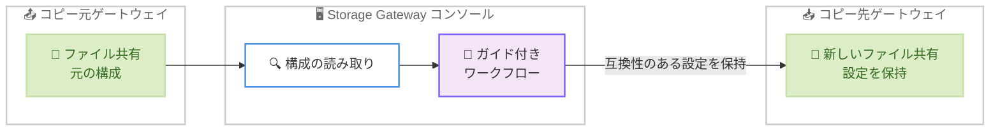

# AWS Storage Gateway - ゲートウェイ間でのファイル共有コピー機能

**リリース日**: 2026 年 7 月 14 日
**サービス**: AWS Storage Gateway
**機能**: コンソールからのゲートウェイ間ファイル共有コピー

📊 [このアップデートのインフォグラフィックを見る](https://takech9203.github.io/aws-news-summary/20260714-aws-storage-gateway-console-copy-file-shares.html)
<!-- INFOGRAPHIC_BASE_URL は環境変数から取得 -->

## 概要

AWS Storage Gateway は、Storage Gateway コンソールから直接、ゲートウェイ間でファイル共有をコピーできる機能の提供を開始しました。コピーを開始すると、コンソールがコピー元のファイル共有の構成を読み取り、互換性のある設定を保持したまま、コピー先ゲートウェイに新しいファイル共有を作成します。

これまでは、ゲートウェイ間でファイル共有を移行する際、対象のファイル共有を手動で再作成し、各種設定を 1 つずつ入力し直す必要がありました。今回のアップデートにより、この作業の大部分が自動化され、移行にかかる時間と手間が大幅に削減されます。特に Amazon Linux 2023 (AL2023) へのアップグレードのように、新しいゲートウェイへ移行するシナリオで効果を発揮します。

新しい機能はガイド付きのワークフローを提供し、ユーザーの確認や入力が必要な設定を明示的に提示します。これにより、重要な設定を見落とすことなく、スムーズな移行を実現できます。本機能は商用 AWS リージョンで利用可能です。

**アップデート前の課題**

- 以前はゲートウェイ間でファイル共有を移行する際、コピー先ゲートウェイでファイル共有を手動で再作成する必要があった
- 以前はコピー元ファイル共有の各種設定を 1 つずつ手動で入力し直す必要があった
- 以前は手動での設定入力により、重要な設定を見落としたり、設定ミスが発生したりするリスクがあった

**アップデート後の改善**

- 今回のアップデートにより、コンソールから直接ゲートウェイ間でファイル共有をコピーできるようになった
- 今回のアップデートにより、コピー元の構成が自動的に読み取られ、互換性のある設定を保持したままコピー先に新しいファイル共有が作成されるようになった
- 今回のアップデートにより、ガイド付きワークフローが確認の必要な設定を提示し、設定の見落としを防止できるようになった

## アーキテクチャ図

コピー元ファイル共有の構成をコンソールが読み取り、ガイド付きワークフローを通じてコピー先ゲートウェイに互換性のある設定を保持した新しいファイル共有を作成する流れを示しています。

## サービスアップデートの詳細

### 主要機能

1. **コンソールからのファイル共有コピー**
   - Storage Gateway コンソールでファイル共有を選択し、[Copy to gateway] を選択するだけでコピーを開始できる
   - コピー先ゲートウェイに新しいファイル共有が作成される
   - 手動での再作成や設定の再入力が不要になる

2. **構成の自動読み取りと保持**
   - コンソールがコピー元ファイル共有の構成を自動的に読み取る
   - 互換性のある設定が保持された状態でコピー先に新しいファイル共有が作成される
   - 手動入力による設定ミスのリスクを軽減する

3. **ガイド付きワークフロー**
   - ユーザーの確認や入力が必要な設定を明示的に提示する
   - 重要な設定を見落とすことなく、スムーズな移行を実現する
   - 移行作業の信頼性を高める

## 技術仕様

### 機能概要

| 項目 | 詳細 |
|------|------|
| 対象サービス | AWS Storage Gateway (Amazon S3 File Gateway) |
| 操作方法 | Storage Gateway コンソールの [Copy to gateway] |
| 構成の扱い | コピー元の構成を読み取り、互換性のある設定を保持 |
| ガイド機能 | 確認が必要な設定を提示するガイド付きワークフロー |
| 主な用途 | ゲートウェイ間の移行 (AL2023 へのアップグレードなど) |
| 利用可能リージョン | 商用 AWS リージョン |

## 設定方法

### 前提条件

1. AWS Storage Gateway でコピー元となるファイル共有が設定済みであること
2. コピー先となるゲートウェイが作成済みであること
3. Storage Gateway コンソールへのアクセス権限を持つ IAM 権限があること

### 手順

#### ステップ1: ファイル共有の選択

Storage Gateway コンソールでファイル共有の一覧を開き、コピーしたいファイル共有を選択します。この操作でコピー対象のファイル共有を指定します。

#### ステップ2: コピーの開始

選択したファイル共有に対して [Copy to gateway] を選択します。この操作によりコンソールがコピー元の構成を読み取り、コピーワークフローが開始されます。

#### ステップ3: コピー先ゲートウェイの指定と設定の確認

コピー先ゲートウェイを指定し、ガイド付きワークフローに従って確認が必要な設定を確認します。互換性のある設定は自動的に保持され、確認完了後にコピー先ゲートウェイへ新しいファイル共有が作成されます。

## メリット

### ビジネス面

- **移行時間の短縮**: ファイル共有を手動で再作成する必要がなくなり、移行にかかる時間を大幅に削減できる
- **運用負荷の軽減**: 設定を 1 つずつ入力し直す手作業が不要となり、運用チームの負荷を軽減できる
- **アップグレードの円滑化**: AL2023 へのアップグレードなど、新しいゲートウェイへの移行プロジェクトをスムーズに進められる

### 技術面

- **設定ミスの防止**: 構成が自動的に読み取られ保持されるため、手動入力による設定ミスを削減できる
- **見落としの防止**: ガイド付きワークフローが確認の必要な設定を提示するため、重要な設定の見落としを防止できる
- **一貫性の維持**: コピー元の構成をベースに新しいファイル共有を作成するため、設定の一貫性を維持できる

## デメリット・制約事項

### 制限事項

- 互換性のある設定のみが保持され、互換性のない設定は確認や再設定が必要になる
- 本機能は商用 AWS リージョンで利用可能であり、リージョンによっては利用できない場合がある
- ファイル共有の構成のコピーであり、共有内のデータそのものの移行を行う機能ではない

### 考慮すべき点

- コピー先ゲートウェイが事前に作成されている必要がある
- ガイド付きワークフローで提示される設定は、移行前に内容を確認することが推奨される
- 利用可能リージョンは AWS Capabilities で事前に確認することが推奨される

## ユースケース

### ユースケース1: AL2023 へのアップグレードに伴う移行

**シナリオ**: 既存のゲートウェイを Amazon Linux 2023 (AL2023) ベースの新しいゲートウェイへアップグレードする際に、既存のファイル共有を新しいゲートウェイへ移行する。

**効果**: 手動での再作成が不要となり、既存の構成を保持したまま短時間でファイル共有を移行できる。

### ユースケース2: 複数ファイル共有の統合・再編成

**シナリオ**: 複数のゲートウェイに分散したファイル共有を、特定のゲートウェイへ集約して管理を効率化する。

**効果**: 各ファイル共有の設定を手動で入力し直すことなく、コンソール操作でコピーでき、再編成作業の工数を削減できる。

### ユースケース3: 環境間でのファイル共有構成の複製

**シナリオ**: 検証環境や別拠点のゲートウェイに、既存のファイル共有と同じ構成のファイル共有を作成する。

**効果**: 既存の構成をベースに一貫した設定でファイル共有を作成でき、設定ミスを防止しながら効率的に環境を構築できる。

## 料金

本機能はゲートウェイ間でファイル共有をコピーするためのコンソール機能であり、機能自体に追加料金が発生するかどうかは公式の料金ページで確認することを推奨します。AWS Storage Gateway の利用には、通常のストレージ使用量やデータ転送に応じた料金が適用されます。詳細は AWS Storage Gateway の料金ページを参照してください。

## 利用可能リージョン

本機能は商用 AWS リージョンで利用可能です。リージョンごとの提供状況は AWS Capabilities で確認できます。

## 関連サービス・機能

- **Amazon S3**: File Gateway はファイル共有のデータを Amazon S3 バケットに保存するため、ファイル共有の移行と密接に関連する
- **Amazon Linux 2023 (AL2023)**: 新しいゲートウェイのベースとなる OS で、本機能はゲートウェイのアップグレード移行を円滑にする
- **AWS Storage Gateway (File Gateway)**: 本機能の対象となるファイル共有を提供するゲートウェイタイプ

## 参考リンク

- 📊 [インフォグラフィック](https://takech9203.github.io/aws-news-summary/20260714-aws-storage-gateway-console-copy-file-shares.html)
- [公式発表 (What's New)](https://aws.amazon.com/about-aws/whats-new/2026/07/aws-storage-gateway-console-copy-file-shares/)
- [AWS Storage Gateway ドキュメント](https://docs.aws.amazon.com/storagegateway/)
- [AWS Storage Gateway 料金ページ](https://aws.amazon.com/storagegateway/pricing/)

## まとめ

このアップデートにより、AWS Storage Gateway のゲートウェイ間でのファイル共有移行がコンソール操作だけで完結し、手動での再作成や設定の再入力が不要になりました。特に AL2023 へのアップグレードなどの移行シナリオにおいて時間と手間を削減できます。ゲートウェイの移行や再編成を予定している場合は、Storage Gateway コンソールから本機能を活用することを推奨します。
