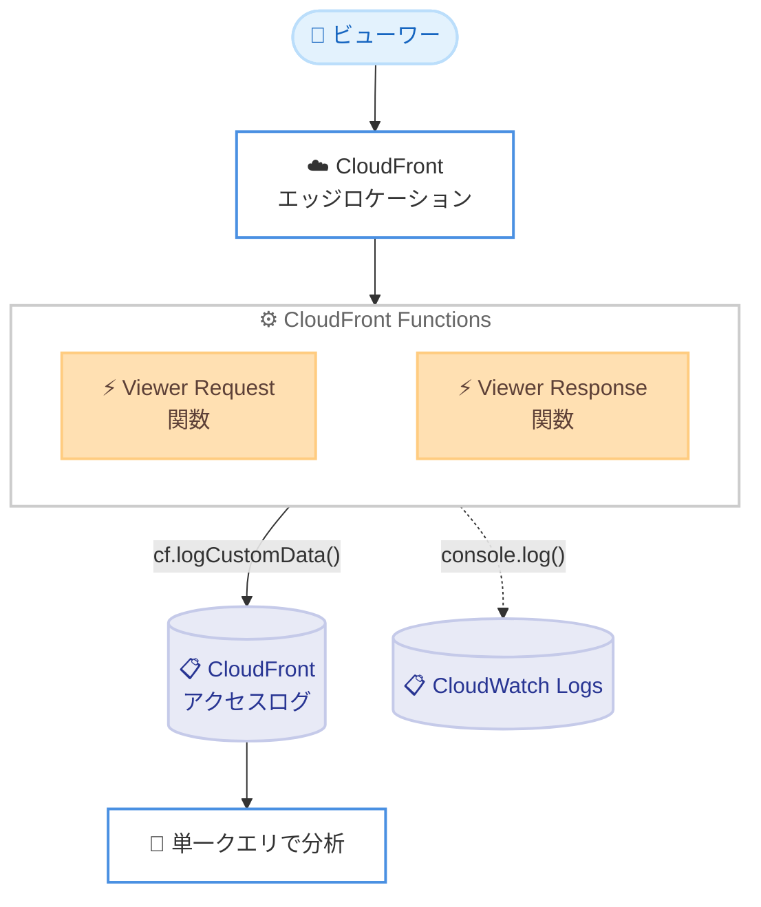

# Amazon CloudFront Functions - CloudFront アクセスログへのカスタムデータ出力

**リリース日**: 2026 年 7 月 14 日
**サービス**: Amazon CloudFront
**機能**: CloudFront Functions からの CloudFront アクセスログへのロギング (cf.logCustomData())

📊 [このアップデートのインフォグラフィックを見る](https://takech9203.github.io/aws-news-summary/20260714-cloudfront-functions-access-logs.html)
<!-- INFOGRAPHIC_BASE_URL は環境変数から取得 -->

## 概要

Amazon CloudFront Functions から、新しいヘルパーメソッドを使用してカスタムデータを CloudFront アクセスログに直接書き込めるようになりました。CloudFront Functions は、URL の書き換え、ヘッダー操作、リクエストルーティングといった処理を、エッジロケーションで軽量な JavaScript として実行する機能です。

これまでは、CloudFront Functions からログデータを出力する場合、CloudFront アクセスログとは別の Amazon CloudWatch Logs のログファイルとしてしか出力できませんでした。そのため、関数が行った判断 (A/B テストの振り分け結果や認証結果など) と、CloudFront アクセスログのリクエストデータを、別々のロギングシステムをまたいで突き合わせる必要がありました。

今回のアップデートにより、`cf.logCustomData()` を viewer request または viewer response 関数から呼び出すことで、A/B テストのバリアント割り当て、認証結果、ルーティング判断などの値を、そのリクエストに対応する CloudFront アクセスログのレコードに直接記録できます。これにより、関数の挙動とリクエストの結果を単一のクエリで分析できるようになります。

**アップデート前の課題**

- 関数のログデータは、CloudFront アクセスログとは別の CloudWatch Logs ログファイルにしか出力できなかった
- 関数の判断結果とアクセスログのリクエストデータを、別々のロギングシステムをまたいで相関させる必要があった
- 分析のために複数のログソースを結合するクエリや処理が必要で、運用が複雑だった

**アップデート後の改善**

- `cf.logCustomData()` により、カスタムデータを CloudFront アクセスログのレコードに直接書き込めるようになった
- 関数の挙動とリクエストの結果を単一のクエリで分析できるようになった
- ロギングシステムをまたいだデータの相関付けが不要になり、運用が簡素化された

## アーキテクチャ図



viewer request または viewer response 関数から `cf.logCustomData()` を呼び出すと、カスタムデータがそのリクエストの CloudFront アクセスログレコードに直接記録されます。従来の `console.log()` による CloudWatch Logs への出力も引き続き利用できます。

## サービスアップデートの詳細

### 主要機能

1. **cf.logCustomData() ヘルパーメソッド**
   - CloudFront Functions からカスタムデータを CloudFront アクセスログに直接書き込む新しいヘルパーメソッド
   - viewer request 関数と viewer response 関数から呼び出し可能
   - A/B テストのバリアント割り当て、認証結果、ルーティング判断などの値を記録できる
   - カスタムデータは、そのリクエストに対応するアクセスログレコードに紐付けられる

2. **標準ロギング (v2) とリアルタイムログの両方に対応**
   - CloudFront のリアルタイムログ設定と標準ロギング (v2) の両方で動作する
   - 関数の挙動とリクエストの結果を単一のクエリで分析できる

3. **console.log() との併用**
   - 従来の `console.log()` 機能は引き続き利用可能
   - `cf.logCustomData()` と `console.log()` は同じ関数内で併用できる
   - CloudWatch Logs への詳細なデバッグログと、アクセスログへの構造化データ出力を使い分けられる

## 技術仕様

### 対応するロギング方式

| 項目 | 詳細 |
|------|------|
| 呼び出し可能な関数タイプ | viewer request、viewer response |
| 対応ロギング方式 | CloudFront リアルタイムログ設定、標準ロギング (v2) |
| 記録先 | CloudFront アクセスログレコード |
| 従来メソッドとの関係 | `console.log()` は引き続き利用可能で併用可能 |
| 利用可能ロケーション | すべての CloudFront エッジロケーション |

### 設定例

```javascript
// viewer request 関数の例
function handler(event) {
    var request = event.request;

    // A/B テストのバリアント割り当てを決定
    var variant = Math.random() < 0.5 ? "A" : "B";

    // カスタムデータをアクセスログに記録
    cf.logCustomData({ "abTestVariant": variant });

    // 従来のデバッグログは CloudWatch Logs へ (併用可能)
    console.log("Assigned variant: " + variant);

    request.headers["x-ab-variant"] = { value: variant };
    return request;
}
```

## メリット

### ビジネス面

- **運用の簡素化**: ロギングシステムをまたいだデータの相関付けが不要になり、ログ分析の運用負荷を軽減できる
- **迅速な分析**: 関数の判断結果とリクエストの結果を単一のクエリで分析でき、意思決定を迅速化できる
- **追加料金なし**: `cf.logCustomData()` の利用に追加料金は発生しない

### 技術面

- **単一ソースでの分析**: A/B テスト結果、認証結果、ルーティング判断などをアクセスログ内で一元的に分析できる
- **柔軟なロギング**: `console.log()` と併用でき、デバッグログと構造化データ出力を使い分けられる
- **グローバル対応**: すべての CloudFront エッジロケーションで即座に利用可能

## デメリット・制約事項

### 制限事項

- `cf.logCustomData()` は viewer request 関数と viewer response 関数からのみ呼び出し可能
- 標準的な CloudFront Functions の呼び出し料金と、アクセスログの配信料金は引き続き発生する
- CloudFront Functions は軽量な処理向けであり、複雑な処理には CloudFront との連携で Lambda@Edge の利用を検討する必要がある

### 考慮すべき点

- アクセスログに機密情報 (認証情報など) を記録しないよう、記録するカスタムデータの内容を慎重に設計する
- アクセスログのボリューム増加に伴うストレージや分析コストへの影響を考慮する

## ユースケース

### ユースケース1: A/B テストの分析

**シナリオ**: エッジで A/B テストのバリアントを割り当て、どのバリアントがどのリクエストに適用されたかをアクセスログで追跡したい。

**実装例**:
```javascript
var variant = Math.random() < 0.5 ? "A" : "B";
cf.logCustomData({ "abTestVariant": variant });
```

**効果**: バリアント割り当てとリクエストの結果 (ステータスコード、レイテンシなど) を単一のクエリで相関分析でき、テスト結果の評価が容易になる。

### ユースケース2: 認証結果の記録

**シナリオ**: エッジで実施したトークン検証などの認証判断結果を、リクエストごとにアクセスログに記録したい。

**実装例**:
```javascript
var authResult = validateToken(request);
cf.logCustomData({ "authOutcome": authResult ? "allow" : "deny" });
```

**効果**: 認証の許可・拒否の状況をアクセスログ上で直接把握でき、セキュリティ監査やトラブルシューティングを効率化できる。

### ユースケース3: ルーティング判断の可視化

**シナリオ**: リクエストの内容に応じたルーティング判断 (どのオリジンやパスに振り分けたか) をログに残したい。

**実装例**:
```javascript
var route = decideRoute(request);
cf.logCustomData({ "routingDecision": route });
```

**効果**: ルーティングの判断結果とリクエストの結果を突き合わせて分析でき、トラフィックの流れの把握と最適化に役立つ。

## 料金

`cf.logCustomData()` の利用に追加料金は発生しません。ただし、標準的な CloudFront Functions の呼び出し料金と、CloudFront アクセスログの配信料金は引き続き適用されます。

- **CloudFront Functions**: 標準の呼び出し料金が適用される
- **アクセスログ配信**: 標準ロギング (v2) およびリアルタイムログの配信料金が適用される
- **cf.logCustomData() の追加料金**: なし

## 利用可能リージョン

すべての CloudFront エッジロケーションで本日より利用可能です。CloudFront はグローバルなコンテンツ配信サービスであるため、特定のリージョンに限定されず、世界中のエッジロケーションで利用できます。

## 関連サービス・機能

- **CloudFront Functions**: エッジで軽量な JavaScript を実行する機能。本アップデートの対象
- **CloudFront アクセスログ (標準ロギング v2)**: カスタムデータの記録先。S3 などへのログ配信に対応
- **CloudFront リアルタイムログ**: カスタムデータの記録先。ほぼリアルタイムでのログ配信に対応
- **Amazon CloudWatch Logs**: `console.log()` によるログ出力先。引き続き併用可能
- **Lambda@Edge**: より複雑なエッジ処理が必要な場合の選択肢

## 参考リンク

- 📊 [インフォグラフィック](https://takech9203.github.io/aws-news-summary/20260714-cloudfront-functions-access-logs.html)
- [公式発表 (What's New)](https://aws.amazon.com/about-aws/whats-new/2026/07/cloudfront-functions-access-logs/)
- [CloudFront Functions ヘルパーメソッド (ドキュメント)](https://docs.aws.amazon.com/AmazonCloudFront/latest/DeveloperGuide/functions-helper-functions.html)
- [CloudFront Functions (ドキュメント)](https://docs.aws.amazon.com/AmazonCloudFront/latest/DeveloperGuide/cloudfront-functions.html)
- [CloudFront 料金ページ](https://aws.amazon.com/cloudfront/pricing/)

## まとめ

このアップデートにより、CloudFront Functions が行うエッジでの判断を CloudFront アクセスログに直接記録できるようになり、関数の挙動とリクエストの結果を単一のクエリで分析できるようになりました。A/B テスト、認証、ルーティングなどのエッジ処理を運用している場合は、`cf.logCustomData()` を活用してログ分析の簡素化を検討することをお勧めします。追加料金なしで利用できるため、既存の CloudFront Functions への導入障壁も低いアップデートです。
</content>
</invoke>
