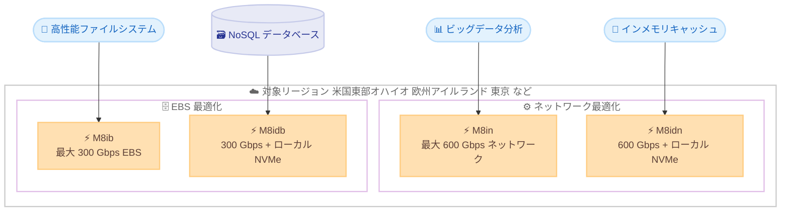

# Amazon EC2 - M8in、M8idn、M8ib、M8idb インスタンスの追加リージョン提供開始

**リリース日**: 2026 年 7 月 14 日
**サービス**: Amazon EC2
**機能**: M8in、M8idn (ネットワーク最適化)、M8ib、M8idb (EBS 最適化) インスタンスの追加リージョン展開

📊 [このアップデートのインフォグラフィックを見る](https://takech9203.github.io/aws-news-summary/20260714-m8in-m8idn-m8ib-m8idb-new-regions.html)

## 概要

Amazon EC2 M8in、M8idn ネットワーク最適化インスタンス、および M8ib、M8idb EBS 最適化インスタンスが、AWS 米国東部 (オハイオ)、欧州 (アイルランド)、アジアパシフィック (東京) の各リージョンで新たに利用可能になりました。これにより、東京リージョンを含むより多くのロケーションで、第 6 世代の汎用ネットワーク/ストレージ最適化インスタンスを利用できるようになりました。

これらのインスタンスは、AWS 専用にカスタマイズされた第 6 世代 Intel Xeon Scalable プロセッサを搭載し、前世代インスタンスと比較して最大 43% 高いパフォーマンスを提供します。また、最新の第 6 世代 AWS Nitro カードを採用しています。M8in、M8idn は最大 600 Gbps のネットワーク帯域幅を提供し、拡張ネットワーキング対応の EC2 インスタンスの中で最も高い帯域幅を実現します。一方、M8ib、M8idb は最大 300 Gbps の EBS 帯域幅を提供し、アクセラレーテッドコンピューティング以外の EC2 インスタンスの中で最も高い EBS 帯域幅を実現します。

対象となるユーザーは、リアルタイムのビッグデータ分析、大規模な分散型インメモリキャッシュ、AI/ML クラスター向けキャッシュフリート、Telco 5G ユーザープレーン機能 (UPF)、高性能ファイルシステム、NoSQL データベースなど、ネットワークまたはストレージの高スループットを必要とするワークロードを運用する組織です。

**アップデート前の課題**

これまで、M8in、M8idn、M8ib、M8idb インスタンスは限られたリージョンでのみ利用可能でした。

- 東京リージョンでは、第 6 世代 Intel ベースのネットワーク/EBS 最適化インスタンスを利用できなかった
- 日本国内でこれらのワークロードを運用する場合、データレジデンシーや低レイテンシーの要件を満たしにくかった
- 前世代インスタンスでは、600 Gbps のネットワーク帯域幅や 300 Gbps の EBS 帯域幅を得られなかった

**アップデート後の改善**

今回のアップデートにより、対象リージョンの拡大が実現しました。

- 米国東部 (オハイオ)、欧州 (アイルランド)、アジアパシフィック (東京) で新たに利用可能になった
- 東京リージョンで、最大 600 Gbps のネットワーク帯域幅や最大 300 Gbps の EBS 帯域幅を持つインスタンスを利用できるようになった
- 日本国内のワークロードで、低レイテンシーとデータレジデンシー要件を満たしながら高スループットを実現できるようになった

## アーキテクチャ図

用途に応じて、ネットワーク最適化 (M8in、M8idn) または EBS 最適化 (M8ib、M8idb) のインスタンスを選択できます。末尾に d が付くタイプ (M8idn、M8idb) はローカル NVMe ストレージを搭載します。

## サービスアップデートの詳細

### 主要機能

1. **カスタム第 6 世代 Intel Xeon Scalable プロセッサ**
   - AWS 専用にカスタマイズされたプロセッサを搭載
   - 前世代インスタンスと比較して最大 43% 高いパフォーマンスを提供
   - 最新の第 6 世代 AWS Nitro カードを採用

2. **M8in、M8idn (ネットワーク最適化)**
   - 最大 600 Gbps のネットワーク帯域幅を提供
   - 拡張ネットワーキング対応の EC2 インスタンスの中で最も高い帯域幅
   - リアルタイムビッグデータ分析、大規模分散インメモリキャッシュ、AI/ML クラスター向けキャッシュフリート、Telco 5G UPF に最適
   - M8idn はローカル NVMe ストレージを搭載し、低レイテンシーのローカルストレージを必要とするワークロードに対応

3. **M8ib、M8idb (EBS 最適化)**
   - 最大 300 Gbps の EBS 帯域幅を提供
   - アクセラレーテッドコンピューティング以外の EC2 インスタンスの中で最も高い EBS 帯域幅
   - 高性能ファイルシステムや NoSQL データベースに最適
   - M8idb はローカル NVMe ストレージを搭載し、大規模商用データベースやデータレイクなどのストレージ集約型ワークロードに対応

## 技術仕様

### インスタンスファミリーの比較

| インスタンス | 最適化 | 主な帯域幅 | ローカル NVMe |
|------|------|------|------|
| M8in | ネットワーク最適化 | 最大 600 Gbps ネットワーク | なし |
| M8idn | ネットワーク最適化 | 最大 600 Gbps ネットワーク | あり |
| M8ib | EBS 最適化 | 最大 300 Gbps EBS | なし |
| M8idb | EBS 最適化 | 最大 300 Gbps EBS | あり |

### 共通仕様

| 項目 | 詳細 |
|------|------|
| プロセッサ | AWS 専用カスタム第 6 世代 Intel Xeon Scalable |
| パフォーマンス | 前世代比で最大 43% 向上 |
| Nitro カード | 第 6 世代 AWS Nitro カード |
| 購入オプション | Savings Plans、オンデマンド、スポットインスタンス |

## メリット

### ビジネス面

- **東京リージョンでの利用**: 日本国内のデータレジデンシー要件を満たしながら、高スループットワークロードを運用できる
- **コスト最適化**: Savings Plans、オンデマンド、スポットインスタンスから最適な購入オプションを選択できる
- **パフォーマンス向上**: 前世代比で最大 43% のパフォーマンス向上により、同一ワークロードをより少ないインスタンス数で処理できる可能性がある

### 技術面

- **高いネットワーク帯域幅**: M8in、M8idn は最大 600 Gbps を提供し、ネットワーク集約型ワークロードのボトルネックを緩和する
- **高い EBS 帯域幅**: M8ib、M8idb は最大 300 Gbps を提供し、ストレージ I/O 集約型ワークロードを高速化する
- **ローカル NVMe オプション**: d タイプ (M8idn、M8idb) は低レイテンシーのローカルストレージを提供する

## デメリット・制約事項

### 制限事項

- 利用可能なリージョンは限定されており、すべてのリージョンで利用できるわけではない
- 特定のインスタンスサイズやメモリ構成は公式ドキュメントで確認が必要
- Intel ベースのため、AWS Graviton ベースインスタンスとは価格性能特性が異なる

### 考慮すべき点

- ワークロードの特性 (ネットワーク集約型か EBS 集約型か) に応じて適切なファミリーを選択する必要がある
- ローカル NVMe ストレージ (d タイプ) は一時的なストレージであり、インスタンス停止時にデータが失われる点に注意する
- 最新世代インスタンスへの移行時は、アプリケーションの互換性やドライバーの検証を推奨する

## ユースケース

### ユースケース1: リアルタイムビッグデータ分析

**シナリオ**: 大量のストリーミングデータをリアルタイムに処理し、分析結果を即座に得たいケース。M8in の最大 600 Gbps のネットワーク帯域幅により、ノード間の大量データ転送を高速化します。

**効果**: 高いネットワークスループットにより、分散処理のボトルネックを緩和し、分析レイテンシーを短縮できます。

### ユースケース2: AI/ML クラスター向けキャッシュフリート

**シナリオ**: AI/ML の学習・推論クラスターに対して、大規模な分散インメモリキャッシュを提供するケース。M8idn のネットワーク帯域幅とローカル NVMe ストレージにより、キャッシュヒット時の応答を高速化します。

**効果**: 高スループットな分散キャッシュにより、AI/ML ワークロード全体のスループットが向上します。

### ユースケース3: 高性能ファイルシステムと NoSQL データベース

**シナリオ**: 高い EBS スループットを必要とする高性能ファイルシステムや NoSQL データベースを運用するケース。M8ib、M8idb の最大 300 Gbps の EBS 帯域幅により、ストレージ I/O を高速化します。

**効果**: ストレージ I/O のボトルネックを緩和し、データベースやファイルシステムのスループットを最大化できます。

## 料金

M8in、M8idn、M8ib、M8idb インスタンスは、Savings Plans、オンデマンド、スポットインスタンスの各購入オプションで利用できます。料金はリージョンやインスタンスサイズによって異なります。最新の料金については、Amazon EC2 の料金ページを参照してください。

## 利用可能リージョン

今回新たに以下のリージョンで利用可能になりました。

- 米国東部 (オハイオ)
- 欧州 (アイルランド)
- アジアパシフィック (東京)

これにより、全体の提供リージョンは以下のとおりです。

- 米国東部 (バージニア北部、オハイオ)
- 米国西部 (オレゴン)
- 欧州 (アイルランド、スペイン)
- アジアパシフィック (東京)

## 関連サービス・機能

- **Amazon EBS**: M8ib、M8idb の EBS 最適化は EBS ボリュームとの高スループット接続を実現する
- **AWS Nitro System**: 第 6 世代 Nitro カードがネットワーク/ストレージ処理をオフロードし、パフォーマンスとセキュリティを向上させる
- **AWS Savings Plans**: これらのインスタンスに対して柔軟な料金コミットメントを提供する

## 参考リンク

- 📊 [インフォグラフィック](https://takech9203.github.io/aws-news-summary/20260714-m8in-m8idn-m8ib-m8idb-new-regions.html)
- [公式発表 (What's New)](https://aws.amazon.com/about-aws/whats-new/2026/07/m8in-m8idn-m8ib-m8idb-new-regions)
- [Amazon EC2 M8i インスタンスファミリー](https://aws.amazon.com/ec2/instance-types/m8i/)
- [Amazon EC2 料金](https://aws.amazon.com/ec2/pricing/)

## まとめ

今回のアップデートにより、Amazon EC2 M8in、M8idn、M8ib、M8idb インスタンスが東京リージョンを含む追加リージョンで利用可能になりました。前世代比で最大 43% のパフォーマンス向上、最大 600 Gbps のネットワーク帯域幅または最大 300 Gbps の EBS 帯域幅を活用できるため、ネットワークまたはストレージの高スループットを必要とするワークロードを運用している場合は、これらのインスタンスへの移行を検討することを推奨します。
